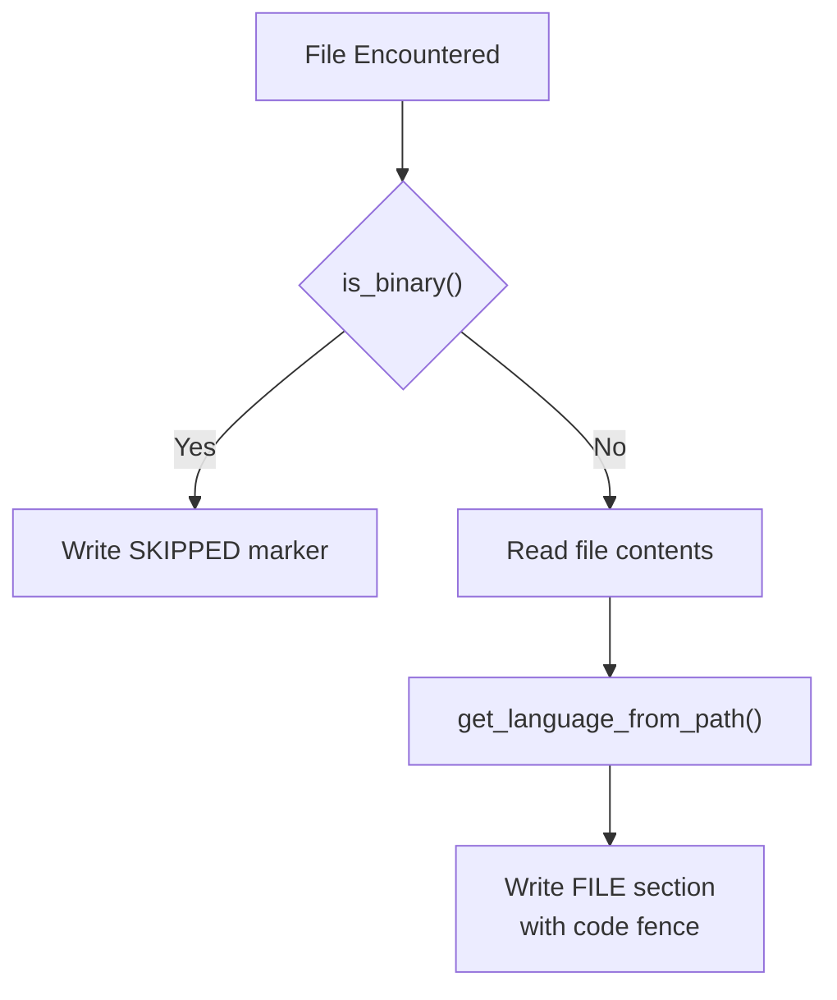
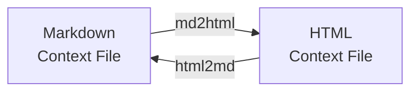

Loading...

![svg image](data:image/svg+xml;base64,PHN2ZyBjbGFzcz0ic2l6ZS0zIFsmYW1wO19wYXRoXTpzdHJva2UtMCBbJmFtcDtfcGF0aF06YW5pbWF0ZS1bY3VzdG9tLXB1bHNlXzEuOHNfaW5maW5pdGVfdmFyKC0tZGVsYXksMHMpXSIgdmlld2JveD0iMTEwIDExMCA0NjAgNTAwIiB4bWxucz0iaHR0cDovL3d3dy53My5vcmcvMjAwMC9zdmciPjxwYXRoIGNsYXNzPSJbLS1kZWxheTowLjZzXSIgZD0iTTQxOC43MywzMzIuMzdjOS44NC01LjY4LDIyLjA3LTUuNjgsMzEuOTEsMGwyNS40OSwxNC43MWMuODIuNDgsMS42OS44LDIuNTgsMS4wNi4xOS4wNi4zNy4xMS41NS4xNi44Ny4yMSwxLjc2LjM0LDIuNjUuMzUuMDQsMCwuMDguMDIuMTMuMDIuMSwwLC4xOS0uMDMuMjktLjA0LjgzLS4wMiwxLjY0LS4xMywyLjQ1LS4zMi4xNC0uMDMuMjgtLjA1LjQyLS4wOS44Ny0uMjQsMS43LS41OSwyLjUtMS4wMy4wOC0uMDQuMTctLjA2LjI1LS4xbDUwLjk3LTI5LjQzYzMuNjUtMi4xMSw1LjktNi4wMSw1LjktMTAuMjJ2LTU4Ljg2YzAtNC4yMi0yLjI1LTguMTEtNS45LTEwLjIybC01MC45Ny0yOS40M2MtMy42NS0yLjExLTguMTUtMi4xMS0xMS44MSwwbC01MC45NywyOS40M2MtLjA4LjA0LS4xMy4xMS0uMi4xNi0uNzguNDgtMS41MSwxLjAyLTIuMTUsMS42Ni0uMS4xLS4xOC4yMS0uMjguMzEtLjU3LjYtMS4wOCwxLjI2LTEuNTEsMS45Ny0uMDcuMTItLjE1LjIyLS4yMi4zNC0uNDQuNzctLjc3LDEuNi0xLjAzLDIuNDctLjA1LjE5LS4xLjM3LS4xNC41Ni0uMjIuODktLjM3LDEuODEtLjM3LDIuNzZ2MjkuNDNjMCwxMS4zNi02LjExLDIxLjk1LTE1Ljk1LDI3LjYzLTkuODQsNS42OC0yMi4wNiw1LjY4LTMxLjkxLDBsLTI1LjQ5LTE0LjcxYy0uODItLjQ4LTEuNjktLjgtMi41Ny0xLjA2LS4xOS0uMDYtLjM3LS4xMS0uNTYtLjE2LS44OC0uMjEtMS43Ni0uMzQtMi42NS0uMzQtLjEzLDAtLjI2LjAyLS40LjAyLS44NC4wMi0xLjY2LjEzLTIuNDcuMzItLjEzLjAzLS4yNy4wNS0uNC4wOS0uODcuMjQtMS43MS42LTIuNTEsMS4wNC0uMDguMDQtLjE2LjA2LS4yNC4xbC01MC45NywyOS40M2MtMy42NSwyLjExLTUuOSw2LjAxLTUuOSwxMC4yMnY1OC44NmMwLDQuMjIsMi4yNSw4LjExLDUuOSwxMC4yMmw1MC45NywyOS40M2MuMDguMDQuMTcuMDYuMjQuMS44LjQ0LDEuNjQuNzksMi41LDEuMDMuMTQuMDQuMjguMDYuNDIuMDkuODEuMTksMS42Mi4zLDIuNDUuMzIuMSwwLC4xOS4wNC4yOS4wNC4wNCwwLC4wOC0uMDIuMTMtLjAyLjg5LDAsMS43Ny0uMTMsMi42NS0uMzUuMTktLjA0LjM3LS4xLjU2LS4xNi44OC0uMjYsMS43NS0uNTksMi41OC0xLjA2bDI1LjQ5LTE0LjcxYzkuODQtNS42OCwyMi4wNi01LjY4LDMxLjkxLDAsOS44NCw1LjY4LDE1Ljk1LDE2LjI3LDE1Ljk1LDI3LjYzdjI5LjQzYzAsLjk1LjE1LDEuODcuMzcsMi43Ni4wNS4xOS4wOS4zNy4xNC41Ni4yNS44Ni41OSwxLjY5LDEuMDMsMi40Ny4wNy4xMi4xNS4yMi4yMi4zNC40My43MS45NCwxLjM3LDEuNTEsMS45Ny4xLjEuMTguMjEuMjguMzEuNjUuNjMsMS4zNywxLjE4LDIuMTUsMS42Ni4wNy4wNC4xMy4xMS4yLjE2bDUwLjk3LDI5LjQzYzEuODMsMS4wNSwzLjg2LDEuNTgsNS45LDEuNThzNC4wOC0uNTMsNS45LTEuNThsNTAuOTctMjkuNDNjMy42NS0yLjExLDUuOS02LjAxLDUuOS0xMC4yMnYtNTguODZjMC00LjIyLTIuMjUtOC4xMS01LjktMTAuMjJsLTUwLjk3LTI5LjQzYy0uMDgtLjA0LS4xNi0uMDYtLjI0LS4xLS44LS40NC0xLjY0LS44LTIuNTEtMS4wNC0uMTMtLjA0LS4yNi0uMDUtLjM5LS4wOS0uODItLjItMS42NS0uMzEtMi40OS0uMzMtLjEzLDAtLjI1LS4wMi0uMzgtLjAyLS44OSwwLTEuNzguMTMtMi42Ni4zNS0uMTguMDQtLjM2LjEtLjU0LjE1LS44OC4yNi0xLjc1LjU5LTIuNTgsMS4wN2wtMjUuNDksMTQuNzJjLTkuODQsNS42OC0yMi4wNyw1LjY4LTMxLjksMC05Ljg0LTUuNjgtMTUuOTUtMTYuMjctMTUuOTUtMjcuNjNzNi4xMS0yMS45NSwxNS45NS0yNy42M1oiIHN0eWxlPSJmaWxsOiMyMWMxOWEiPjwvcGF0aD48cGF0aCBkPSJNMTQxLjA5LDMxNy42NWw1MC45NywyOS40M2MxLjgzLDEuMDUsMy44NiwxLjU4LDUuOSwxLjU4czQuMDgtLjUzLDUuOS0xLjU4bDUwLjk3LTI5LjQzYy4wOC0uMDQuMTMtLjExLjItLjE2Ljc4LS40OCwxLjUxLTEuMDIsMi4xNS0xLjY2LjEtLjEuMTgtLjIxLjI4LS4zMS41Ny0uNiwxLjA4LTEuMjYsMS41MS0xLjk3LjA3LS4xMi4xNS0uMjIuMjItLjM0LjQ0LS43Ny43Ny0xLjYsMS4wMy0yLjQ3LjA1LS4xOS4xLS4zNy4xNC0uNTYuMjItLjg5LjM3LTEuODEuMzctMi43NnYtMjkuNDNjMC0xMS4zNiw2LjExLTIxLjk1LDE1Ljk2LTI3LjYzczIyLjA2LTUuNjgsMzEuOTEsMGwyNS40OSwxNC43MWMuODIuNDgsMS42OS44LDIuNTcsMS4wNi4xOS4wNi4zNy4xMS41Ni4xNi44Ny4yMSwxLjc2LjM0LDIuNjQuMzUuMDQsMCwuMDkuMDIuMTMuMDIuMSwwLC4xOS0uMDQuMjktLjA0LjgzLS4wMiwxLjY1LS4xMywyLjQ1LS4zMi4xNC0uMDMuMjgtLjA1LjQxLS4wOS44Ny0uMjQsMS43MS0uNiwyLjUxLTEuMDQuMDgtLjA0LjE2LS4wNi4yNC0uMWw1MC45Ny0yOS40M2MzLjY1LTIuMTEsNS45LTYuMDEsNS45LTEwLjIydi01OC44NmMwLTQuMjItMi4yNS04LjExLTUuOS0xMC4yMmwtNTAuOTctMjkuNDNjLTMuNjUtMi4xMS04LjE1LTIuMTEtMTEuODEsMGwtNTAuOTcsMjkuNDNjLS4wOC4wNC0uMTMuMTEtLjIuMTYtLjc4LjQ4LTEuNTEsMS4wMi0yLjE1LDEuNjYtLjEuMS0uMTguMjEtLjI4LjMxLS41Ny42LTEuMDgsMS4yNi0xLjUxLDEuOTctLjA3LjEyLS4xNS4yMi0uMjIuMzQtLjQ0Ljc3LS43NywxLjYtMS4wMywyLjQ3LS4wNS4xOS0uMS4zNy0uMTQuNTYtLjIyLjg5LS4zNywxLjgxLS4zNywyLjc2djI5LjQzYzAsMTEuMzYtNi4xMSwyMS45NS0xNS45NSwyNy42My05Ljg0LDUuNjgtMjIuMDcsNS42OC0zMS45MSwwbC0yNS40OS0xNC43MWMtLjgyLS40OC0xLjY5LS44LTIuNTgtMS4wNi0uMTktLjA2LS4zNy0uMTEtLjU1LS4xNi0uODgtLjIxLTEuNzYtLjM0LTIuNjUtLjM1LS4xMywwLS4yNi4wMi0uNC4wMi0uODMuMDItMS42Ni4xMy0yLjQ3LjMyLS4xMy4wMy0uMjcuMDUtLjQuMDktLjg3LjI0LTEuNzEuNi0yLjUxLDEuMDQtLjA4LjA0LS4xNi4wNi0uMjQuMWwtNTAuOTcsMjkuNDNjLTMuNjUsMi4xMS01LjksNi4wMS01LjksMTAuMjJ2NTguODZjMCw0LjIyLDIuMjUsOC4xMSw1LjksMTAuMjJaIiBzdHlsZT0iZmlsbDojMzk2OWNhIj48L3BhdGg+PHBhdGggY2xhc3M9IlstLWRlbGF5OjEuMnNdIiBkPSJNMzk2Ljg4LDQ4NC4zNWwtNTAuOTctMjkuNDNjLS4wOC0uMDQtLjE3LS4wNi0uMjQtLjEtLjgtLjQ0LTEuNjQtLjc5LTIuNTEtMS4wMy0uMTQtLjA0LS4yNy0uMDYtLjQxLS4wOS0uODEtLjE5LTEuNjQtLjMtMi40Ny0uMzItLjEzLDAtLjI2LS4wMi0uMzktLjAyLS44OSwwLTEuNzguMTMtMi42Ni4zNS0uMTguMDQtLjM2LjEtLjU0LjE1LS44OC4yNi0xLjc2LjU5LTIuNTgsMS4wN2wtMjUuNDksMTQuNzJjLTkuODQsNS42OC0yMi4wNiw1LjY4LTMxLjksMC05Ljg0LTUuNjgtMTUuOTYtMTYuMjctMTUuOTYtMjcuNjN2LTI5LjQzYzAtLjk1LS4xNS0xLjg3LS4zNy0yLjc2LS4wNS0uMTktLjA5LS4zNy0uMTQtLjU2LS4yNS0uODYtLjU5LTEuNjktMS4wMy0yLjQ3LS4wNy0uMTItLjE1LS4yMi0uMjItLjM0LS40My0uNzEtLjk0LTEuMzctMS41MS0xLjk3LS4xLS4xLS4xOC0uMjEtLjI4LS4zMS0uNjUtLjYzLTEuMzctMS4xOC0yLjE1LTEuNjYtLjA3LS4wNC0uMTMtLjExLS4yLS4xNmwtNTAuOTctMjkuNDNjLTMuNjUtMi4xMS04LjE1LTIuMTEtMTEuODEsMGwtNTAuOTcsMjkuNDNjLTMuNjUsMi4xMS01LjksNi4wMS01LjksMTAuMjJ2NTguODZjMCw0LjIyLDIuMjUsOC4xMSw1LjksMTAuMjJsNTAuOTcsMjkuNDNjLjA4LjA0LjE3LjA2LjI1LjEuOC40NCwxLjYzLjc5LDIuNSwxLjAzLjE0LjA0LjI5LjA2LjQzLjA5LjguMTksMS42MS4zLDIuNDMuMzIuMSwwLC4yLjA0LjMuMDQuMDQsMCwuMDktLjAyLjEzLS4wMi44OCwwLDEuNzctLjEzLDIuNjQtLjM0LjE5LS4wNC4zNy0uMS41Ni0uMTYuODgtLjI2LDEuNzUtLjU5LDIuNTctMS4wNmwyNS40OS0xNC43MWM5Ljg0LTUuNjgsMjIuMDYtNS42OCwzMS45MSwwLDkuODQsNS42OCwxNS45NSwxNi4yNywxNS45NSwyNy42M3YyOS40M2MwLC45NS4xNSwxLjg3LjM3LDIuNzYuMDUuMTkuMDkuMzcuMTQuNTYuMjUuODYuNTksMS42OSwxLjAzLDIuNDcuMDcuMTIuMTUuMjIuMjIuMzQuNDMuNzEuOTQsMS4zNywxLjUxLDEuOTcuMS4xLjE4LjIxLjI4LjMxLjY1LjYzLDEuMzcsMS4xOCwyLjE1LDEuNjYuMDcuMDQuMTMuMTEuMi4xNmw1MC45NywyOS40M2MxLjgzLDEuMDUsMy44NiwxLjU4LDUuOSwxLjU4czQuMDgtLjUzLDUuOS0xLjU4bDUwLjk3LTI5LjQzYzMuNjUtMi4xMSw1LjktNi4wMSw1LjktMTAuMjJ2LTU4Ljg2YzAtNC4yMi0yLjI1LTguMTEtNS45LTEwLjIyWiIgc3R5bGU9ImZpbGw6IzAyOTRkZSI+PC9wYXRoPjwvc3ZnPg==)Index your code with Devin

[DeepWiki](/)

[DeepWiki](/)

[ray0404/Contexter ](https://github.com/ray0404/Contexter "Open repository")

Index your code with

![svg image](data:image/svg+xml;base64,PHN2ZyBjbGFzcz0ic2l6ZS00IHRyYW5zZm9ybSB0cmFuc2l0aW9uLXRyYW5zZm9ybSBkdXJhdGlvbi03MDAgZ3JvdXAtaG92ZXI6cm90YXRlLTE4MCBbJmFtcDtfcGF0aF06c3Ryb2tlLTAiIHZpZXdib3g9IjExMCAxMTAgNDYwIDUwMCIgeG1sbnM9Imh0dHA6Ly93d3cudzMub3JnLzIwMDAvc3ZnIj48cGF0aCBjbGFzcz0iIiBkPSJNNDE4LjczLDMzMi4zN2M5Ljg0LTUuNjgsMjIuMDctNS42OCwzMS45MSwwbDI1LjQ5LDE0LjcxYy44Mi40OCwxLjY5LjgsMi41OCwxLjA2LjE5LjA2LjM3LjExLjU1LjE2Ljg3LjIxLDEuNzYuMzQsMi42NS4zNS4wNCwwLC4wOC4wMi4xMy4wMi4xLDAsLjE5LS4wMy4yOS0uMDQuODMtLjAyLDEuNjQtLjEzLDIuNDUtLjMyLjE0LS4wMy4yOC0uMDUuNDItLjA5Ljg3LS4yNCwxLjctLjU5LDIuNS0xLjAzLjA4LS4wNC4xNy0uMDYuMjUtLjFsNTAuOTctMjkuNDNjMy42NS0yLjExLDUuOS02LjAxLDUuOS0xMC4yMnYtNTguODZjMC00LjIyLTIuMjUtOC4xMS01LjktMTAuMjJsLTUwLjk3LTI5LjQzYy0zLjY1LTIuMTEtOC4xNS0yLjExLTExLjgxLDBsLTUwLjk3LDI5LjQzYy0uMDguMDQtLjEzLjExLS4yLjE2LS43OC40OC0xLjUxLDEuMDItMi4xNSwxLjY2LS4xLjEtLjE4LjIxLS4yOC4zMS0uNTcuNi0xLjA4LDEuMjYtMS41MSwxLjk3LS4wNy4xMi0uMTUuMjItLjIyLjM0LS40NC43Ny0uNzcsMS42LTEuMDMsMi40Ny0uMDUuMTktLjEuMzctLjE0LjU2LS4yMi44OS0uMzcsMS44MS0uMzcsMi43NnYyOS40M2MwLDExLjM2LTYuMTEsMjEuOTUtMTUuOTUsMjcuNjMtOS44NCw1LjY4LTIyLjA2LDUuNjgtMzEuOTEsMGwtMjUuNDktMTQuNzFjLS44Mi0uNDgtMS42OS0uOC0yLjU3LTEuMDYtLjE5LS4wNi0uMzctLjExLS41Ni0uMTYtLjg4LS4yMS0xLjc2LS4zNC0yLjY1LS4zNC0uMTMsMC0uMjYuMDItLjQuMDItLjg0LjAyLTEuNjYuMTMtMi40Ny4zMi0uMTMuMDMtLjI3LjA1LS40LjA5LS44Ny4yNC0xLjcxLjYtMi41MSwxLjA0LS4wOC4wNC0uMTYuMDYtLjI0LjFsLTUwLjk3LDI5LjQzYy0zLjY1LDIuMTEtNS45LDYuMDEtNS45LDEwLjIydjU4Ljg2YzAsNC4yMiwyLjI1LDguMTEsNS45LDEwLjIybDUwLjk3LDI5LjQzYy4wOC4wNC4xNy4wNi4yNC4xLjguNDQsMS42NC43OSwyLjUsMS4wMy4xNC4wNC4yOC4wNi40Mi4wOS44MS4xOSwxLjYyLjMsMi40NS4zMi4xLDAsLjE5LjA0LjI5LjA0LjA0LDAsLjA4LS4wMi4xMy0uMDIuODksMCwxLjc3LS4xMywyLjY1LS4zNS4xOS0uMDQuMzctLjEuNTYtLjE2Ljg4LS4yNiwxLjc1LS41OSwyLjU4LTEuMDZsMjUuNDktMTQuNzFjOS44NC01LjY4LDIyLjA2LTUuNjgsMzEuOTEsMCw5Ljg0LDUuNjgsMTUuOTUsMTYuMjcsMTUuOTUsMjcuNjN2MjkuNDNjMCwuOTUuMTUsMS44Ny4zNywyLjc2LjA1LjE5LjA5LjM3LjE0LjU2LjI1Ljg2LjU5LDEuNjksMS4wMywyLjQ3LjA3LjEyLjE1LjIyLjIyLjM0LjQzLjcxLjk0LDEuMzcsMS41MSwxLjk3LjEuMS4xOC4yMS4yOC4zMS42NS42MywxLjM3LDEuMTgsMi4xNSwxLjY2LjA3LjA0LjEzLjExLjIuMTZsNTAuOTcsMjkuNDNjMS44MywxLjA1LDMuODYsMS41OCw1LjksMS41OHM0LjA4LS41Myw1LjktMS41OGw1MC45Ny0yOS40M2MzLjY1LTIuMTEsNS45LTYuMDEsNS45LTEwLjIydi01OC44NmMwLTQuMjItMi4yNS04LjExLTUuOS0xMC4yMmwtNTAuOTctMjkuNDNjLS4wOC0uMDQtLjE2LS4wNi0uMjQtLjEtLjgtLjQ0LTEuNjQtLjgtMi41MS0xLjA0LS4xMy0uMDQtLjI2LS4wNS0uMzktLjA5LS44Mi0uMi0xLjY1LS4zMS0yLjQ5LS4zMy0uMTMsMC0uMjUtLjAyLS4zOC0uMDItLjg5LDAtMS43OC4xMy0yLjY2LjM1LS4xOC4wNC0uMzYuMS0uNTQuMTUtLjg4LjI2LTEuNzUuNTktMi41OCwxLjA3bC0yNS40OSwxNC43MmMtOS44NCw1LjY4LTIyLjA3LDUuNjgtMzEuOSwwLTkuODQtNS42OC0xNS45NS0xNi4yNy0xNS45NS0yNy42M3M2LjExLTIxLjk1LDE1Ljk1LTI3LjYzWiIgc3R5bGU9ImZpbGw6IzIxYzE5YSI+PC9wYXRoPjxwYXRoIGQ9Ik0xNDEuMDksMzE3LjY1bDUwLjk3LDI5LjQzYzEuODMsMS4wNSwzLjg2LDEuNTgsNS45LDEuNThzNC4wOC0uNTMsNS45LTEuNThsNTAuOTctMjkuNDNjLjA4LS4wNC4xMy0uMTEuMi0uMTYuNzgtLjQ4LDEuNTEtMS4wMiwyLjE1LTEuNjYuMS0uMS4xOC0uMjEuMjgtLjMxLjU3LS42LDEuMDgtMS4yNiwxLjUxLTEuOTcuMDctLjEyLjE1LS4yMi4yMi0uMzQuNDQtLjc3Ljc3LTEuNiwxLjAzLTIuNDcuMDUtLjE5LjEtLjM3LjE0LS41Ni4yMi0uODkuMzctMS44MS4zNy0yLjc2di0yOS40M2MwLTExLjM2LDYuMTEtMjEuOTUsMTUuOTYtMjcuNjNzMjIuMDYtNS42OCwzMS45MSwwbDI1LjQ5LDE0LjcxYy44Mi40OCwxLjY5LjgsMi41NywxLjA2LjE5LjA2LjM3LjExLjU2LjE2Ljg3LjIxLDEuNzYuMzQsMi42NC4zNS4wNCwwLC4wOS4wMi4xMy4wMi4xLDAsLjE5LS4wNC4yOS0uMDQuODMtLjAyLDEuNjUtLjEzLDIuNDUtLjMyLjE0LS4wMy4yOC0uMDUuNDEtLjA5Ljg3LS4yNCwxLjcxLS42LDIuNTEtMS4wNC4wOC0uMDQuMTYtLjA2LjI0LS4xbDUwLjk3LTI5LjQzYzMuNjUtMi4xMSw1LjktNi4wMSw1LjktMTAuMjJ2LTU4Ljg2YzAtNC4yMi0yLjI1LTguMTEtNS45LTEwLjIybC01MC45Ny0yOS40M2MtMy42NS0yLjExLTguMTUtMi4xMS0xMS44MSwwbC01MC45NywyOS40M2MtLjA4LjA0LS4xMy4xMS0uMi4xNi0uNzguNDgtMS41MSwxLjAyLTIuMTUsMS42Ni0uMS4xLS4xOC4yMS0uMjguMzEtLjU3LjYtMS4wOCwxLjI2LTEuNTEsMS45Ny0uMDcuMTItLjE1LjIyLS4yMi4zNC0uNDQuNzctLjc3LDEuNi0xLjAzLDIuNDctLjA1LjE5LS4xLjM3LS4xNC41Ni0uMjIuODktLjM3LDEuODEtLjM3LDIuNzZ2MjkuNDNjMCwxMS4zNi02LjExLDIxLjk1LTE1Ljk1LDI3LjYzLTkuODQsNS42OC0yMi4wNyw1LjY4LTMxLjkxLDBsLTI1LjQ5LTE0LjcxYy0uODItLjQ4LTEuNjktLjgtMi41OC0xLjA2LS4xOS0uMDYtLjM3LS4xMS0uNTUtLjE2LS44OC0uMjEtMS43Ni0uMzQtMi42NS0uMzUtLjEzLDAtLjI2LjAyLS40LjAyLS44My4wMi0xLjY2LjEzLTIuNDcuMzItLjEzLjAzLS4yNy4wNS0uNC4wOS0uODcuMjQtMS43MS42LTIuNTEsMS4wNC0uMDguMDQtLjE2LjA2LS4yNC4xbC01MC45NywyOS40M2MtMy42NSwyLjExLTUuOSw2LjAxLTUuOSwxMC4yMnY1OC44NmMwLDQuMjIsMi4yNSw4LjExLDUuOSwxMC4yMloiIHN0eWxlPSJmaWxsOiMzOTY5Y2EiPjwvcGF0aD48cGF0aCBjbGFzcz0iIiBkPSJNMzk2Ljg4LDQ4NC4zNWwtNTAuOTctMjkuNDNjLS4wOC0uMDQtLjE3LS4wNi0uMjQtLjEtLjgtLjQ0LTEuNjQtLjc5LTIuNTEtMS4wMy0uMTQtLjA0LS4yNy0uMDYtLjQxLS4wOS0uODEtLjE5LTEuNjQtLjMtMi40Ny0uMzItLjEzLDAtLjI2LS4wMi0uMzktLjAyLS44OSwwLTEuNzguMTMtMi42Ni4zNS0uMTguMDQtLjM2LjEtLjU0LjE1LS44OC4yNi0xLjc2LjU5LTIuNTgsMS4wN2wtMjUuNDksMTQuNzJjLTkuODQsNS42OC0yMi4wNiw1LjY4LTMxLjksMC05Ljg0LTUuNjgtMTUuOTYtMTYuMjctMTUuOTYtMjcuNjN2LTI5LjQzYzAtLjk1LS4xNS0xLjg3LS4zNy0yLjc2LS4wNS0uMTktLjA5LS4zNy0uMTQtLjU2LS4yNS0uODYtLjU5LTEuNjktMS4wMy0yLjQ3LS4wNy0uMTItLjE1LS4yMi0uMjItLjM0LS40My0uNzEtLjk0LTEuMzctMS41MS0xLjk3LS4xLS4xLS4xOC0uMjEtLjI4LS4zMS0uNjUtLjYzLTEuMzctMS4xOC0yLjE1LTEuNjYtLjA3LS4wNC0uMTMtLjExLS4yLS4xNmwtNTAuOTctMjkuNDNjLTMuNjUtMi4xMS04LjE1LTIuMTEtMTEuODEsMGwtNTAuOTcsMjkuNDNjLTMuNjUsMi4xMS01LjksNi4wMS01LjksMTAuMjJ2NTguODZjMCw0LjIyLDIuMjUsOC4xMSw1LjksMTAuMjJsNTAuOTcsMjkuNDNjLjA4LjA0LjE3LjA2LjI1LjEuOC40NCwxLjYzLjc5LDIuNSwxLjAzLjE0LjA0LjI5LjA2LjQzLjA5LjguMTksMS42MS4zLDIuNDMuMzIuMSwwLC4yLjA0LjMuMDQuMDQsMCwuMDktLjAyLjEzLS4wMi44OCwwLDEuNzctLjEzLDIuNjQtLjM0LjE5LS4wNC4zNy0uMS41Ni0uMTYuODgtLjI2LDEuNzUtLjU5LDIuNTctMS4wNmwyNS40OS0xNC43MWM5Ljg0LTUuNjgsMjIuMDYtNS42OCwzMS45MSwwLDkuODQsNS42OCwxNS45NSwxNi4yNywxNS45NSwyNy42M3YyOS40M2MwLC45NS4xNSwxLjg3LjM3LDIuNzYuMDUuMTkuMDkuMzcuMTQuNTYuMjUuODYuNTksMS42OSwxLjAzLDIuNDcuMDcuMTIuMTUuMjIuMjIuMzQuNDMuNzEuOTQsMS4zNywxLjUxLDEuOTcuMS4xLjE4LjIxLjI4LjMxLjY1LjYzLDEuMzcsMS4xOCwyLjE1LDEuNjYuMDcuMDQuMTMuMTEuMi4xNmw1MC45NywyOS40M2MxLjgzLDEuMDUsMy44NiwxLjU4LDUuOSwxLjU4czQuMDgtLjUzLDUuOS0xLjU4bDUwLjk3LTI5LjQzYzMuNjUtMi4xMSw1LjktNi4wMSw1LjktMTAuMjJ2LTU4Ljg2YzAtNC4yMi0yLjI1LTguMTEtNS45LTEwLjIyWiIgc3R5bGU9ImZpbGw6IzAyOTRkZSI+PC9wYXRoPjwvc3ZnPg==)Devin

Edit WikiShare

Loading...

Last indexed: 2 November 2025 ([79ebf7](https://github.com/ray0404/Contexter/commits/79ebf745))

- [Overview](/ray0404/Contexter/1-overview)
- [Getting Started](/ray0404/Contexter/2-getting-started)
- [Installation](/ray0404/Contexter/2.1-installation)
- [Quick Start Guide](/ray0404/Contexter/2.2-quick-start-guide)
- [Command Overview](/ray0404/Contexter/2.3-command-overview)
- [Core Concepts](/ray0404/Contexter/3-core-concepts)
- [Context Files](/ray0404/Contexter/3.1-context-files)
- [Packaging and Reconstruction](/ray0404/Contexter/3.2-packaging-and-reconstruction)
- [Update Management](/ray0404/Contexter/3.3-update-management)
- [Exclusion Patterns](/ray0404/Contexter/3.4-exclusion-patterns)
- [Workflows](/ray0404/Contexter/4-workflows)
- [Basic Packaging Workflow](/ray0404/Contexter/4.1-basic-packaging-workflow)
- [AI Integration Workflow](/ray0404/Contexter/4.2-ai-integration-workflow)
- [Version Control with Patches](/ray0404/Contexter/4.3-version-control-with-patches)
- [Format Conversion Workflow](/ray0404/Contexter/4.4-format-conversion-workflow)
- [Command Reference](/ray0404/Contexter/5-command-reference)
- [Building Commands](/ray0404/Contexter/5.1-building-commands)
- [buildcontext](/ray0404/Contexter/5.1.1-buildcontext)
- [buildcontexthtml](/ray0404/Contexter/5.1.2-buildcontexthtml)
- [Reconstruction Commands](/ray0404/Contexter/5.2-reconstruction-commands)
- [reconstructor](/ray0404/Contexter/5.2.1-reconstructor)
- [reconstructorhtml](/ray0404/Contexter/5.2.2-reconstructorhtml)
- [Update Commands](/ray0404/Contexter/5.3-update-commands)
- [updatecontext](/ray0404/Contexter/5.3.1-updatecontext)
- [updater](/ray0404/Contexter/5.3.2-updater)
- [smartupdate](/ray0404/Contexter/5.3.3-smartupdate)
- [updatecontexthtml](/ray0404/Contexter/5.3.4-updatecontexthtml)
- [updaterhtml](/ray0404/Contexter/5.3.5-updaterhtml)
- [Utility Commands](/ray0404/Contexter/5.4-utility-commands)
- [sanitizecontext](/ray0404/Contexter/5.4.1-sanitizecontext)
- [md2html](/ray0404/Contexter/5.4.2-md2html)
- [html2md](/ray0404/Contexter/5.4.3-html2md)
- [Architecture](/ray0404/Contexter/6-architecture)
- [System Architecture](/ray0404/Contexter/6.1-system-architecture)
- [Module Organization](/ray0404/Contexter/6.2-module-organization)
- [Utility Layer (contexter\_utils)](/ray0404/Contexter/6.3-utility-layer-(contexter_utils))
- [Dependencies](/ray0404/Contexter/6.4-dependencies)
- [Technical Details](/ray0404/Contexter/7-technical-details)
- [Markdown Context Format](/ray0404/Contexter/7.1-markdown-context-format)
- [HTML Context Format](/ray0404/Contexter/7.2-html-context-format)
- [Patch File Format](/ray0404/Contexter/7.3-patch-file-format)
- [Binary File Handling](/ray0404/Contexter/7.4-binary-file-handling)

Menu

# Context Filessvg image

Relevant source files

- [![svg image](data:image/svg+xml;base64,PHN2ZyBjbGFzcz0ibXItMS41IGhpZGRlbiBoLTMuNSB3LTMuNSBmbGV4LXNocmluay0wIG9wYWNpdHktNDAgbWQ6YmxvY2siIGZpbGw9ImN1cnJlbnRDb2xvciIgdmlld2JveD0iMCAwIDI0IDI0Ij48cGF0aCBkPSJNMTIgMGMtNi42MjYgMC0xMiA1LjM3My0xMiAxMiAwIDUuMzAyIDMuNDM4IDkuOCA4LjIwNyAxMS4zODcuNTk5LjExMS43OTMtLjI2MS43OTMtLjU3N3YtMi4yMzRjLTMuMzM4LjcyNi00LjAzMy0xLjQxNi00LjAzMy0xLjQxNi0uNTQ2LTEuMzg3LTEuMzMzLTEuNzU2LTEuMzMzLTEuNzU2LTEuMDg5LS43NDUuMDgzLS43MjkuMDgzLS43MjkgMS4yMDUuMDg0IDEuODM5IDEuMjM3IDEuODM5IDEuMjM3IDEuMDcgMS44MzQgMi44MDcgMS4zMDQgMy40OTIuOTk3LjEwNy0uNzc1LjQxOC0xLjMwNS43NjItMS42MDQtMi42NjUtLjMwNS01LjQ2Ny0xLjMzNC01LjQ2Ny01LjkzMSAwLTEuMzExLjQ2OS0yLjM4MSAxLjIzNi0zLjIyMS0uMTI0LS4zMDMtLjUzNS0xLjUyNC4xMTctMy4xNzYgMCAwIDEuMDA4LS4zMjIgMy4zMDEgMS4yMy45NTctLjI2NiAxLjk4My0uMzk5IDMuMDAzLS40MDQgMS4wMi4wMDUgMi4wNDcuMTM4IDMuMDA2LjQwNCAyLjI5MS0xLjU1MiAzLjI5Ny0xLjIzIDMuMjk3LTEuMjMuNjUzIDEuNjUzLjI0MiAyLjg3NC4xMTggMy4xNzYuNzcuODQgMS4yMzUgMS45MTEgMS4yMzUgMy4yMjEgMCA0LjYwOS0yLjgwNyA1LjYyNC01LjQ3OSA1LjkyMS40My4zNzIuODIzIDEuMTAyLjgyMyAyLjIyMnYzLjI5M2MwIC4zMTkuMTkyLjY5NC44MDEuNTc2IDQuNzY1LTEuNTg5IDguMTk5LTYuMDg2IDguMTk5LTExLjM4NiAwLTYuNjI3LTUuMzczLTEyLTEyLTEyeiI+PC9wYXRoPjwvc3ZnPg==)README.md](https://github.com/ray0404/Contexter/blob/79ebf745/README.md)
- [![svg image](data:image/svg+xml;base64,PHN2ZyBjbGFzcz0ibXItMS41IGhpZGRlbiBoLTMuNSB3LTMuNSBmbGV4LXNocmluay0wIG9wYWNpdHktNDAgbWQ6YmxvY2siIGZpbGw9ImN1cnJlbnRDb2xvciIgdmlld2JveD0iMCAwIDI0IDI0Ij48cGF0aCBkPSJNMTIgMGMtNi42MjYgMC0xMiA1LjM3My0xMiAxMiAwIDUuMzAyIDMuNDM4IDkuOCA4LjIwNyAxMS4zODcuNTk5LjExMS43OTMtLjI2MS43OTMtLjU3N3YtMi4yMzRjLTMuMzM4LjcyNi00LjAzMy0xLjQxNi00LjAzMy0xLjQxNi0uNTQ2LTEuMzg3LTEuMzMzLTEuNzU2LTEuMzMzLTEuNzU2LTEuMDg5LS43NDUuMDgzLS43MjkuMDgzLS43MjkgMS4yMDUuMDg0IDEuODM5IDEuMjM3IDEuODM5IDEuMjM3IDEuMDcgMS44MzQgMi44MDcgMS4zMDQgMy40OTIuOTk3LjEwNy0uNzc1LjQxOC0xLjMwNS43NjItMS42MDQtMi42NjUtLjMwNS01LjQ2Ny0xLjMzNC01LjQ2Ny01LjkzMSAwLTEuMzExLjQ2OS0yLjM4MSAxLjIzNi0zLjIyMS0uMTI0LS4zMDMtLjUzNS0xLjUyNC4xMTctMy4xNzYgMCAwIDEuMDA4LS4zMjIgMy4zMDEgMS4yMy45NTctLjI2NiAxLjk4My0uMzk5IDMuMDAzLS40MDQgMS4wMi4wMDUgMi4wNDcuMTM4IDMuMDA2LjQwNCAyLjI5MS0xLjU1MiAzLjI5Ny0xLjIzIDMuMjk3LTEuMjMuNjUzIDEuNjUzLjI0MiAyLjg3NC4xMTggMy4xNzYuNzcuODQgMS4yMzUgMS45MTEgMS4yMzUgMy4yMjEgMCA0LjYwOS0yLjgwNyA1LjYyNC01LjQ3OSA1LjkyMS40My4zNzIuODIzIDEuMTAyLjgyMyAyLjIyMnYzLjI5M2MwIC4zMTkuMTkyLjY5NC44MDEuNTc2IDQuNzY1LTEuNTg5IDguMTk5LTYuMDg2IDguMTk5LTExLjM4NiAwLTYuNjI3LTUuMzczLTEyLTEyLTEyeiI+PC9wYXRoPjwvc3ZnPg==)context\_builder.py](https://github.com/ray0404/Contexter/blob/79ebf745/context_builder.py)
- [![svg image](data:image/svg+xml;base64,PHN2ZyBjbGFzcz0ibXItMS41IGhpZGRlbiBoLTMuNSB3LTMuNSBmbGV4LXNocmluay0wIG9wYWNpdHktNDAgbWQ6YmxvY2siIGZpbGw9ImN1cnJlbnRDb2xvciIgdmlld2JveD0iMCAwIDI0IDI0Ij48cGF0aCBkPSJNMTIgMGMtNi42MjYgMC0xMiA1LjM3My0xMiAxMiAwIDUuMzAyIDMuNDM4IDkuOCA4LjIwNyAxMS4zODcuNTk5LjExMS43OTMtLjI2MS43OTMtLjU3N3YtMi4yMzRjLTMuMzM4LjcyNi00LjAzMy0xLjQxNi00LjAzMy0xLjQxNi0uNTQ2LTEuMzg3LTEuMzMzLTEuNzU2LTEuMzMzLTEuNzU2LTEuMDg5LS43NDUuMDgzLS43MjkuMDgzLS43MjkgMS4yMDUuMDg0IDEuODM5IDEuMjM3IDEuODM5IDEuMjM3IDEuMDcgMS44MzQgMi44MDcgMS4zMDQgMy40OTIuOTk3LjEwNy0uNzc1LjQxOC0xLjMwNS43NjItMS42MDQtMi42NjUtLjMwNS01LjQ2Ny0xLjMzNC01LjQ2Ny01LjkzMSAwLTEuMzExLjQ2OS0yLjM4MSAxLjIzNi0zLjIyMS0uMTI0LS4zMDMtLjUzNS0xLjUyNC4xMTctMy4xNzYgMCAwIDEuMDA4LS4zMjIgMy4zMDEgMS4yMy45NTctLjI2NiAxLjk4My0uMzk5IDMuMDAzLS40MDQgMS4wMi4wMDUgMi4wNDcuMTM4IDMuMDA2LjQwNCAyLjI5MS0xLjU1MiAzLjI5Ny0xLjIzIDMuMjk3LTEuMjMuNjUzIDEuNjUzLjI0MiAyLjg3NC4xMTggMy4xNzYuNzcuODQgMS4yMzUgMS45MTEgMS4yMzUgMy4yMjEgMCA0LjYwOS0yLjgwNyA1LjYyNC01LjQ3OSA1LjkyMS40My4zNzIuODIzIDEuMTAyLjgyMyAyLjIyMnYzLjI5M2MwIC4zMTkuMTkyLjY5NC44MDEuNTc2IDQuNzY1LTEuNTg5IDguMTk5LTYuMDg2IDguMTk5LTExLjM4NiAwLTYuNjI3LTUuMzczLTEyLTEyLTEyeiI+PC9wYXRoPjwvc3ZnPg==)pyproject.toml](https://github.com/ray0404/Contexter/blob/79ebf745/pyproject.toml)

## Purpose and Scopesvg image

This page defines **context files**, the central data format in the Contexter system. A context file is a single text-based file that contains an entire software project, including its directory structure, file contents, and metadata. This document explains what context files are, their structure, supported formats, and key properties.

For information about creating context files from directories, see [Packaging and Reconstruction](/ray0404/Contexter/3.2-packaging-and-reconstruction). For detailed format specifications, see [Markdown Context Format](/ray0404/Contexter/7.1-markdown-context-format) and [HTML Context Format](/ray0404/Contexter/7.2-html-context-format).

---

## What is a Context File?svg image

A **context file** is a single, portable text file that packages an entire software project into a structured document. Context files serve as the primary data artifact in all Contexter workflows, enabling projects to be:

- Shared via text-based channels (email, chat, clipboard)
- Processed by AI models with full project context
- Versioned and compared using text-based diff tools
- Backed up as simple text documents
- Transferred between machines without compression utilities

Context files act as a serialization format for project structures, converting complex directory hierarchies into linear text representations while preserving all necessary information for perfect reconstruction.

**Diagram: Context File as Central Data Format**

Sources: [![svg image](data:image/svg+xml;base64,PHN2ZyBjbGFzcz0ibXItMS41IGhpZGRlbiBoLTMuNSB3LTMuNSBmbGV4LXNocmluay0wIG9wYWNpdHktNDAgbWQ6YmxvY2siIGZpbGw9ImN1cnJlbnRDb2xvciIgdmlld2JveD0iMCAwIDI0IDI0Ij48cGF0aCBkPSJNMTIgMGMtNi42MjYgMC0xMiA1LjM3My0xMiAxMiAwIDUuMzAyIDMuNDM4IDkuOCA4LjIwNyAxMS4zODcuNTk5LjExMS43OTMtLjI2MS43OTMtLjU3N3YtMi4yMzRjLTMuMzM4LjcyNi00LjAzMy0xLjQxNi00LjAzMy0xLjQxNi0uNTQ2LTEuMzg3LTEuMzMzLTEuNzU2LTEuMzMzLTEuNzU2LTEuMDg5LS43NDUuMDgzLS43MjkuMDgzLS43MjkgMS4yMDUuMDg0IDEuODM5IDEuMjM3IDEuODM5IDEuMjM3IDEuMDcgMS44MzQgMi44MDcgMS4zMDQgMy40OTIuOTk3LjEwNy0uNzc1LjQxOC0xLjMwNS43NjItMS42MDQtMi42NjUtLjMwNS01LjQ2Ny0xLjMzNC01LjQ2Ny01LjkzMSAwLTEuMzExLjQ2OS0yLjM4MSAxLjIzNi0zLjIyMS0uMTI0LS4zMDMtLjUzNS0xLjUyNC4xMTctMy4xNzYgMCAwIDEuMDA4LS4zMjIgMy4zMDEgMS4yMy45NTctLjI2NiAxLjk4My0uMzk5IDMuMDAzLS40MDQgMS4wMi4wMDUgMi4wNDcuMTM4IDMuMDA2LjQwNCAyLjI5MS0xLjU1MiAzLjI5Ny0xLjIzIDMuMjk3LTEuMjMuNjUzIDEuNjUzLjI0MiAyLjg3NC4xMTggMy4xNzYuNzcuODQgMS4yMzUgMS45MTEgMS4yMzUgMy4yMjEgMCA0LjYwOS0yLjgwNyA1LjYyNC01LjQ3OSA1LjkyMS40My4zNzIuODIzIDEuMTAyLjgyMyAyLjIyMnYzLjI5M2MwIC4zMTkuMTkyLjY5NC44MDEuNTc2IDQuNzY1LTEuNTg5IDguMTk5LTYuMDg2IDguMTk5LTExLjM4NiAwLTYuNjI3LTUuMzczLTEyLTEyLTEyeiI+PC9wYXRoPjwvc3ZnPg==)README.md3-7](https://github.com/ray0404/Contexter/blob/79ebf745/README.md#L3-L7) [![svg image](data:image/svg+xml;base64,PHN2ZyBjbGFzcz0ibXItMS41IGhpZGRlbiBoLTMuNSB3LTMuNSBmbGV4LXNocmluay0wIG9wYWNpdHktNDAgbWQ6YmxvY2siIGZpbGw9ImN1cnJlbnRDb2xvciIgdmlld2JveD0iMCAwIDI0IDI0Ij48cGF0aCBkPSJNMTIgMGMtNi42MjYgMC0xMiA1LjM3My0xMiAxMiAwIDUuMzAyIDMuNDM4IDkuOCA4LjIwNyAxMS4zODcuNTk5LjExMS43OTMtLjI2MS43OTMtLjU3N3YtMi4yMzRjLTMuMzM4LjcyNi00LjAzMy0xLjQxNi00LjAzMy0xLjQxNi0uNTQ2LTEuMzg3LTEuMzMzLTEuNzU2LTEuMzMzLTEuNzU2LTEuMDg5LS43NDUuMDgzLS43MjkuMDgzLS43MjkgMS4yMDUuMDg0IDEuODM5IDEuMjM3IDEuODM5IDEuMjM3IDEuMDcgMS44MzQgMi44MDcgMS4zMDQgMy40OTIuOTk3LjEwNy0uNzc1LjQxOC0xLjMwNS43NjItMS42MDQtMi42NjUtLjMwNS01LjQ2Ny0xLjMzNC01LjQ2Ny01LjkzMSAwLTEuMzExLjQ2OS0yLjM4MSAxLjIzNi0zLjIyMS0uMTI0LS4zMDMtLjUzNS0xLjUyNC4xMTctMy4xNzYgMCAwIDEuMDA4LS4zMjIgMy4zMDEgMS4yMy45NTctLjI2NiAxLjk4My0uMzk5IDMuMDAzLS40MDQgMS4wMi4wMDUgMi4wNDcuMTM4IDMuMDA2LjQwNCAyLjI5MS0xLjU1MiAzLjI5Ny0xLjIzIDMuMjk3LTEuMjMuNjUzIDEuNjUzLjI0MiAyLjg3NC4xMTggMy4xNzYuNzcuODQgMS4yMzUgMS45MTEgMS4yMzUgMy4yMjEgMCA0LjYwOS0yLjgwNyA1LjYyNC01LjQ3OSA1LjkyMS40My4zNzIuODIzIDEuMTAyLjgyMyAyLjIyMnYzLjI5M2MwIC4zMTkuMTkyLjY5NC44MDEuNTc2IDQuNzY1LTEuNTg5IDguMTk5LTYuMDg2IDguMTk5LTExLjM4NiAwLTYuNjI3LTUuMzczLTEyLTEyLTEyeiI+PC9wYXRoPjwvc3ZnPg==)pyproject.toml13](https://github.com/ray0404/Contexter/blob/79ebf745/pyproject.toml#L13-L13) Diagram 1 and Diagram 2 from provided architecture

---

## Format Typessvg image

Contexter supports two context file formats: **Markdown** and **HTML**. Both formats encode identical information but serve different use cases and workflows.

### Markdown Context Filessvg image

Markdown context files use the `.md` extension and represent projects using standard Markdown syntax with code fence blocks. This is the **primary working format** in Contexter.

**Key Characteristics:**

- Human-readable plain text
- Uses triple-backtick code fences (```` ``` ````) to delimit file contents
- Language tags for syntax highlighting (```` ```python ````, ```` ```javascript ````)
- Section headers using Markdown conventions
- Compatible with standard Markdown viewers and editors

**Generated by:** `buildcontext` command  
**Reconstructed by:** `reconstructor` command  
**Special support:** AI workflow via `sanitizecontext` command

Sources: [![svg image](data:image/svg+xml;base64,PHN2ZyBjbGFzcz0ibXItMS41IGhpZGRlbiBoLTMuNSB3LTMuNSBmbGV4LXNocmluay0wIG9wYWNpdHktNDAgbWQ6YmxvY2siIGZpbGw9ImN1cnJlbnRDb2xvciIgdmlld2JveD0iMCAwIDI0IDI0Ij48cGF0aCBkPSJNMTIgMGMtNi42MjYgMC0xMiA1LjM3My0xMiAxMiAwIDUuMzAyIDMuNDM4IDkuOCA4LjIwNyAxMS4zODcuNTk5LjExMS43OTMtLjI2MS43OTMtLjU3N3YtMi4yMzRjLTMuMzM4LjcyNi00LjAzMy0xLjQxNi00LjAzMy0xLjQxNi0uNTQ2LTEuMzg3LTEuMzMzLTEuNzU2LTEuMzMzLTEuNzU2LTEuMDg5LS43NDUuMDgzLS43MjkuMDgzLS43MjkgMS4yMDUuMDg0IDEuODM5IDEuMjM3IDEuODM5IDEuMjM3IDEuMDcgMS44MzQgMi44MDcgMS4zMDQgMy40OTIuOTk3LjEwNy0uNzc1LjQxOC0xLjMwNS43NjItMS42MDQtMi42NjUtLjMwNS01LjQ2Ny0xLjMzNC01LjQ2Ny01LjkzMSAwLTEuMzExLjQ2OS0yLjM4MSAxLjIzNi0zLjIyMS0uMTI0LS4zMDMtLjUzNS0xLjUyNC4xMTctMy4xNzYgMCAwIDEuMDA4LS4zMjIgMy4zMDEgMS4yMy45NTctLjI2NiAxLjk4My0uMzk5IDMuMDAzLS40MDQgMS4wMi4wMDUgMi4wNDcuMTM4IDMuMDA2LjQwNCAyLjI5MS0xLjU1MiAzLjI5Ny0xLjIzIDMuMjk3LTEuMjMuNjUzIDEuNjUzLjI0MiAyLjg3NC4xMTggMy4xNzYuNzcuODQgMS4yMzUgMS45MTEgMS4yMzUgMy4yMjEgMCA0LjYwOS0yLjgwNyA1LjYyNC01LjQ3OSA1LjkyMS40My4zNzIuODIzIDEuMTAyLjgyMyAyLjIyMnYzLjI5M2MwIC4zMTkuMTkyLjY5NC44MDEuNTc2IDQuNzY1LTEuNTg5IDguMTk5LTYuMDg2IDguMTk5LTExLjM4NiAwLTYuNjI3LTUuMzczLTEyLTEyLTEyeiI+PC9wYXRoPjwvc3ZnPg==)README.md24](https://github.com/ray0404/Contexter/blob/79ebf745/README.md#L24-L24) [![svg image](data:image/svg+xml;base64,PHN2ZyBjbGFzcz0ibXItMS41IGhpZGRlbiBoLTMuNSB3LTMuNSBmbGV4LXNocmluay0wIG9wYWNpdHktNDAgbWQ6YmxvY2siIGZpbGw9ImN1cnJlbnRDb2xvciIgdmlld2JveD0iMCAwIDI0IDI0Ij48cGF0aCBkPSJNMTIgMGMtNi42MjYgMC0xMiA1LjM3My0xMiAxMiAwIDUuMzAyIDMuNDM4IDkuOCA4LjIwNyAxMS4zODcuNTk5LjExMS43OTMtLjI2MS43OTMtLjU3N3YtMi4yMzRjLTMuMzM4LjcyNi00LjAzMy0xLjQxNi00LjAzMy0xLjQxNi0uNTQ2LTEuMzg3LTEuMzMzLTEuNzU2LTEuMzMzLTEuNzU2LTEuMDg5LS43NDUuMDgzLS43MjkuMDgzLS43MjkgMS4yMDUuMDg0IDEuODM5IDEuMjM3IDEuODM5IDEuMjM3IDEuMDcgMS44MzQgMi44MDcgMS4zMDQgMy40OTIuOTk3LjEwNy0uNzc1LjQxOC0xLjMwNS43NjItMS42MDQtMi42NjUtLjMwNS01LjQ2Ny0xLjMzNC01LjQ2Ny01LjkzMSAwLTEuMzExLjQ2OS0yLjM4MSAxLjIzNi0zLjIyMS0uMTI0LS4zMDMtLjUzNS0xLjUyNC4xMTctMy4xNzYgMCAwIDEuMDA4LS4zMjIgMy4zMDEgMS4yMy45NTctLjI2NiAxLjk4My0uMzk5IDMuMDAzLS40MDQgMS4wMi4wMDUgMi4wNDcuMTM4IDMuMDA2LjQwNCAyLjI5MS0xLjU1MiAzLjI5Ny0xLjIzIDMuMjk3LTEuMjMuNjUzIDEuNjUzLjI0MiAyLjg3NC4xMTggMy4xNzYuNzcuODQgMS4yMzUgMS45MTEgMS4yMzUgMy4yMjEgMCA0LjYwOS0yLjgwNyA1LjYyNC01LjQ3OSA1LjkyMS40My4zNzIuODIzIDEuMTAyLjgyMyAyLjIyMnYzLjI5M2MwIC4zMTkuMTkyLjY5NC44MDEuNTc2IDQuNzY1LTEuNTg5IDguMTk5LTYuMDg2IDguMTk5LTExLjM4NiAwLTYuNjI3LTUuMzczLTEyLTEyLTEyeiI+PC9wYXRoPjwvc3ZnPg==)context\_builder.py44-45](https://github.com/ray0404/Contexter/blob/79ebf745/context_builder.py#L44-L45)

### HTML Context Filessvg image

HTML context files use the `.html` extension and represent projects using HTML markup with styled code blocks. This format is optimized for **distribution and presentation**.

**Key Characteristics:**

- Structured HTML document with styling
- Uses `<pre><code>` blocks for file contents
- Syntax highlighting through embedded styles
- Viewable in web browsers without additional tools
- Can include CSS styling for improved readability

**Generated by:** `buildcontexthtml` command  
**Reconstructed by:** `reconstructorhtml` command

Sources: [![svg image](data:image/svg+xml;base64,PHN2ZyBjbGFzcz0ibXItMS41IGhpZGRlbiBoLTMuNSB3LTMuNSBmbGV4LXNocmluay0wIG9wYWNpdHktNDAgbWQ6YmxvY2siIGZpbGw9ImN1cnJlbnRDb2xvciIgdmlld2JveD0iMCAwIDI0IDI0Ij48cGF0aCBkPSJNMTIgMGMtNi42MjYgMC0xMiA1LjM3My0xMiAxMiAwIDUuMzAyIDMuNDM4IDkuOCA4LjIwNyAxMS4zODcuNTk5LjExMS43OTMtLjI2MS43OTMtLjU3N3YtMi4yMzRjLTMuMzM4LjcyNi00LjAzMy0xLjQxNi00LjAzMy0xLjQxNi0uNTQ2LTEuMzg3LTEuMzMzLTEuNzU2LTEuMzMzLTEuNzU2LTEuMDg5LS43NDUuMDgzLS43MjkuMDgzLS43MjkgMS4yMDUuMDg0IDEuODM5IDEuMjM3IDEuODM5IDEuMjM3IDEuMDcgMS44MzQgMi44MDcgMS4zMDQgMy40OTIuOTk3LjEwNy0uNzc1LjQxOC0xLjMwNS43NjItMS42MDQtMi42NjUtLjMwNS01LjQ2Ny0xLjMzNC01LjQ2Ny01LjkzMSAwLTEuMzExLjQ2OS0yLjM4MSAxLjIzNi0zLjIyMS0uMTI0LS4zMDMtLjUzNS0xLjUyNC4xMTctMy4xNzYgMCAwIDEuMDA4LS4zMjIgMy4zMDEgMS4yMy45NTctLjI2NiAxLjk4My0uMzk5IDMuMDAzLS40MDQgMS4wMi4wMDUgMi4wNDcuMTM4IDMuMDA2LjQwNCAyLjI5MS0xLjU1MiAzLjI5Ny0xLjIzIDMuMjk3LTEuMjMuNjUzIDEuNjUzLjI0MiAyLjg3NC4xMTggMy4xNzYuNzcuODQgMS4yMzUgMS45MTEgMS4yMzUgMy4yMjEgMCA0LjYwOS0yLjgwNyA1LjYyNC01LjQ3OSA1LjkyMS40My4zNzIuODIzIDEuMTAyLjgyMyAyLjIyMnYzLjI5M2MwIC4zMTkuMTkyLjY5NC44MDEuNTc2IDQuNzY1LTEuNTg5IDguMTk5LTYuMDg2IDguMTk5LTExLjM4NiAwLTYuNjI3LTUuMzczLTEyLTEyLTEyeiI+PC9wYXRoPjwvc3ZnPg==)README.md30-31](https://github.com/ray0404/Contexter/blob/79ebf745/README.md#L30-L31) Diagram 4 from provided architecture

### Format Comparisonsvg image

| Aspect | Markdown (.md) | HTML (.html) |
| --- | --- | --- |
| **Primary Use Case** | Working format, development | Distribution, viewing |
| **Readability** | Plain text, editor-friendly | Browser-rendered, styled |
| **AI Integration** | Full support (sanitizecontext) | No sanitization support |
| **Update Strategies** | 3 commands (updatecontext, updater, smartupdate) | 2 commands (updatecontexthtml, updaterhtml) |
| **Editing** | Any text editor | Requires HTML knowledge |
| **Size** | Smaller (plain text) | Larger (includes markup/CSS) |
| **Interoperability** | Convert to HTML via md2html | Convert to Markdown via html2md |

Sources: [![svg image](data:image/svg+xml;base64,PHN2ZyBjbGFzcz0ibXItMS41IGhpZGRlbiBoLTMuNSB3LTMuNSBmbGV4LXNocmluay0wIG9wYWNpdHktNDAgbWQ6YmxvY2siIGZpbGw9ImN1cnJlbnRDb2xvciIgdmlld2JveD0iMCAwIDI0IDI0Ij48cGF0aCBkPSJNMTIgMGMtNi42MjYgMC0xMiA1LjM3My0xMiAxMiAwIDUuMzAyIDMuNDM4IDkuOCA4LjIwNyAxMS4zODcuNTk5LjExMS43OTMtLjI2MS43OTMtLjU3N3YtMi4yMzRjLTMuMzM4LjcyNi00LjAzMy0xLjQxNi00LjAzMy0xLjQxNi0uNTQ2LTEuMzg3LTEuMzMzLTEuNzU2LTEuMzMzLTEuNzU2LTEuMDg5LS43NDUuMDgzLS43MjkuMDgzLS43MjkgMS4yMDUuMDg0IDEuODM5IDEuMjM3IDEuODM5IDEuMjM3IDEuMDcgMS44MzQgMi44MDcgMS4zMDQgMy40OTIuOTk3LjEwNy0uNzc1LjQxOC0xLjMwNS43NjItMS42MDQtMi42NjUtLjMwNS01LjQ2Ny0xLjMzNC01LjQ2Ny01LjkzMSAwLTEuMzExLjQ2OS0yLjM4MSAxLjIzNi0zLjIyMS0uMTI0LS4zMDMtLjUzNS0xLjUyNC4xMTctMy4xNzYgMCAwIDEuMDA4LS4zMjIgMy4zMDEgMS4yMy45NTctLjI2NiAxLjk4My0uMzk5IDMuMDAzLS40MDQgMS4wMi4wMDUgMi4wNDcuMTM4IDMuMDA2LjQwNCAyLjI5MS0xLjU1MiAzLjI5Ny0xLjIzIDMuMjk3LTEuMjMuNjUzIDEuNjUzLjI0MiAyLjg3NC4xMTggMy4xNzYuNzcuODQgMS4yMzUgMS45MTEgMS4yMzUgMy4yMjEgMCA0LjYwOS0yLjgwNyA1LjYyNC01LjQ3OSA1LjkyMS40My4zNzIuODIzIDEuMTAyLjgyMyAyLjIyMnYzLjI5M2MwIC4zMTkuMTkyLjY5NC44MDEuNTc2IDQuNzY1LTEuNTg5IDguMTk5LTYuMDg2IDguMTk5LTExLjM4NiAwLTYuNjI3LTUuMzczLTEyLTEyLTEyeiI+PC9wYXRoPjwvc3ZnPg==)README.md22-35](https://github.com/ray0404/Contexter/blob/79ebf745/README.md#L22-L35) Diagram 4 from provided architecture

---

## Structure and Componentssvg image

Both context file formats share a common logical structure consisting of three main components: **section markers**, **file content blocks**, and **directory structure representations**.

**Diagram: Context File Structure Components**

Sources: [![svg image](data:image/svg+xml;base64,PHN2ZyBjbGFzcz0ibXItMS41IGhpZGRlbiBoLTMuNSB3LTMuNSBmbGV4LXNocmluay0wIG9wYWNpdHktNDAgbWQ6YmxvY2siIGZpbGw9ImN1cnJlbnRDb2xvciIgdmlld2JveD0iMCAwIDI0IDI0Ij48cGF0aCBkPSJNMTIgMGMtNi42MjYgMC0xMiA1LjM3My0xMiAxMiAwIDUuMzAyIDMuNDM4IDkuOCA4LjIwNyAxMS4zODcuNTk5LjExMS43OTMtLjI2MS43OTMtLjU3N3YtMi4yMzRjLTMuMzM4LjcyNi00LjAzMy0xLjQxNi00LjAzMy0xLjQxNi0uNTQ2LTEuMzg3LTEuMzMzLTEuNzU2LTEuMzMzLTEuNzU2LTEuMDg5LS43NDUuMDgzLS43MjkuMDgzLS43MjkgMS4yMDUuMDg0IDEuODM5IDEuMjM3IDEuODM5IDEuMjM3IDEuMDcgMS44MzQgMi44MDcgMS4zMDQgMy40OTIuOTk3LjEwNy0uNzc1LjQxOC0xLjMwNS43NjItMS42MDQtMi42NjUtLjMwNS01LjQ2Ny0xLjMzNC01LjQ2Ny01LjkzMSAwLTEuMzExLjQ2OS0yLjM4MSAxLjIzNi0zLjIyMS0uMTI0LS4zMDMtLjUzNS0xLjUyNC4xMTctMy4xNzYgMCAwIDEuMDA4LS4zMjIgMy4zMDEgMS4yMy45NTctLjI2NiAxLjk4My0uMzk5IDMuMDAzLS40MDQgMS4wMi4wMDUgMi4wNDcuMTM4IDMuMDA2LjQwNCAyLjI5MS0xLjU1MiAzLjI5Ny0xLjIzIDMuMjk3LTEuMjMuNjUzIDEuNjUzLjI0MiAyLjg3NC4xMTggMy4xNzYuNzcuODQgMS4yMzUgMS45MTEgMS4yMzUgMy4yMjEgMCA0LjYwOS0yLjgwNyA1LjYyNC01LjQ3OSA1LjkyMS40My4zNzIuODIzIDEuMTAyLjgyMyAyLjIyMnYzLjI5M2MwIC4zMTkuMTkyLjY5NC44MDEuNTc2IDQuNzY1LTEuNTg5IDguMTk5LTYuMDg2IDguMTk5LTExLjM4NiAwLTYuNjI3LTUuMzczLTEyLTEyLTEyeiI+PC9wYXRoPjwvc3ZnPg==)context\_builder.py25-45](https://github.com/ray0404/Contexter/blob/79ebf745/context_builder.py#L25-L45)

### Section Markerssvg image

Context files use **section markers** to delimit different parts of the document. These markers follow a consistent pattern:

**Markdown Format:**

```px-2
--- MARKER TYPE: details ---
```

**Common Marker Types:**

| Marker | Purpose | Example |
| --- | --- | --- |
| `DIRECTORY STRUCTURE` | Introduces tree visualization | `--- DIRECTORY STRUCTURE: myproject ---` |
| `FILE` | Introduces individual file content | `--- FILE: src/main.py ---` |
| `SKIPPED (BINARY)` | Indicates excluded binary file | `--- SKIPPED (BINARY): image.png ---` |

Sources: [![svg image](data:image/svg+xml;base64,PHN2ZyBjbGFzcz0ibXItMS41IGhpZGRlbiBoLTMuNSB3LTMuNSBmbGV4LXNocmluay0wIG9wYWNpdHktNDAgbWQ6YmxvY2siIGZpbGw9ImN1cnJlbnRDb2xvciIgdmlld2JveD0iMCAwIDI0IDI0Ij48cGF0aCBkPSJNMTIgMGMtNi42MjYgMC0xMiA1LjM3My0xMiAxMiAwIDUuMzAyIDMuNDM4IDkuOCA4LjIwNyAxMS4zODcuNTk5LjExMS43OTMtLjI2MS43OTMtLjU3N3YtMi4yMzRjLTMuMzM4LjcyNi00LjAzMy0xLjQxNi00LjAzMy0xLjQxNi0uNTQ2LTEuMzg3LTEuMzMzLTEuNzU2LTEuMzMzLTEuNzU2LTEuMDg5LS43NDUuMDgzLS43MjkuMDgzLS43MjkgMS4yMDUuMDg0IDEuODM5IDEuMjM3IDEuODM5IDEuMjM3IDEuMDcgMS44MzQgMi44MDcgMS4zMDQgMy40OTIuOTk3LjEwNy0uNzc1LjQxOC0xLjMwNS43NjItMS42MDQtMi42NjUtLjMwNS01LjQ2Ny0xLjMzNC01LjQ2Ny01LjkzMSAwLTEuMzExLjQ2OS0yLjM4MSAxLjIzNi0zLjIyMS0uMTI0LS4zMDMtLjUzNS0xLjUyNC4xMTctMy4xNzYgMCAwIDEuMDA4LS4zMjIgMy4zMDEgMS4yMy45NTctLjI2NiAxLjk4My0uMzk5IDMuMDAzLS40MDQgMS4wMi4wMDUgMi4wNDcuMTM4IDMuMDA2LjQwNCAyLjI5MS0xLjU1MiAzLjI5Ny0xLjIzIDMuMjk3LTEuMjMuNjUzIDEuNjUzLjI0MiAyLjg3NC4xMTggMy4xNzYuNzcuODQgMS4yMzUgMS45MTEgMS4yMzUgMy4yMjEgMCA0LjYwOS0yLjgwNyA1LjYyNC01LjQ3OSA1LjkyMS40My4zNzIuODIzIDEuMTAyLjgyMyAyLjIyMnYzLjI5M2MwIC4zMTkuMTkyLjY5NC44MDEuNTc2IDQuNzY1LTEuNTg5IDguMTk5LTYuMDg2IDguMTk5LTExLjM4NiAwLTYuNjI3LTUuMzczLTEyLTEyLTEyeiI+PC9wYXRoPjwvc3ZnPg==)context\_builder.py25-44](https://github.com/ray0404/Contexter/blob/79ebf745/context_builder.py#L25-L44)

### Content Encodingsvg image

File contents are encoded within **code fence blocks** that preserve exact text while providing language context.

**Markdown Encoding:**

```px-2
**Code Fence Structure:**
- Opening fence: ` ``` ` followed by language identifier (` ```python `)
- Content: Exact file contents with all whitespace preserved
- Closing fence: ` ``` `
- Language determined by `get_language_from_path()` utility

**HTML Encoding:**
```html
<h3>FILE: src/example.py</h3>
<pre><code class="language-python">
def hello():
    print("Hello, world!")
</code></pre>
```

Sources: [![svg image](data:image/svg+xml;base64,PHN2ZyBjbGFzcz0ibXItMS41IGhpZGRlbiBoLTMuNSB3LTMuNSBmbGV4LXNocmluay0wIG9wYWNpdHktNDAgbWQ6YmxvY2siIGZpbGw9ImN1cnJlbnRDb2xvciIgdmlld2JveD0iMCAwIDI0IDI0Ij48cGF0aCBkPSJNMTIgMGMtNi42MjYgMC0xMiA1LjM3My0xMiAxMiAwIDUuMzAyIDMuNDM4IDkuOCA4LjIwNyAxMS4zODcuNTk5LjExMS43OTMtLjI2MS43OTMtLjU3N3YtMi4yMzRjLTMuMzM4LjcyNi00LjAzMy0xLjQxNi00LjAzMy0xLjQxNi0uNTQ2LTEuMzg3LTEuMzMzLTEuNzU2LTEuMzMzLTEuNzU2LTEuMDg5LS43NDUuMDgzLS43MjkuMDgzLS43MjkgMS4yMDUuMDg0IDEuODM5IDEuMjM3IDEuODM5IDEuMjM3IDEuMDcgMS44MzQgMi44MDcgMS4zMDQgMy40OTIuOTk3LjEwNy0uNzc1LjQxOC0xLjMwNS43NjItMS42MDQtMi42NjUtLjMwNS01LjQ2Ny0xLjMzNC01LjQ2Ny01LjkzMSAwLTEuMzExLjQ2OS0yLjM4MSAxLjIzNi0zLjIyMS0uMTI0LS4zMDMtLjUzNS0xLjUyNC4xMTctMy4xNzYgMCAwIDEuMDA4LS4zMjIgMy4zMDEgMS4yMy45NTctLjI2NiAxLjk4My0uMzk5IDMuMDAzLS40MDQgMS4wMi4wMDUgMi4wNDcuMTM4IDMuMDA2LjQwNCAyLjI5MS0xLjU1MiAzLjI5Ny0xLjIzIDMuMjk3LTEuMjMuNjUzIDEuNjUzLjI0MiAyLjg3NC4xMTggMy4xNzYuNzcuODQgMS4yMzUgMS45MTEgMS4yMzUgMy4yMjEgMCA0LjYwOS0yLjgwNyA1LjYyNC01LjQ3OSA1LjkyMS40My4zNzIuODIzIDEuMTAyLjgyMyAyLjIyMnYzLjI5M2MwIC4zMTkuMTkyLjY5NC44MDEuNTc2IDQuNzY1LTEuNTg5IDguMTk5LTYuMDg2IDguMTk5LTExLjM4NiAwLTYuNjI3LTUuMzczLTEyLTEyLTEyeiI+PC9wYXRoPjwvc3ZnPg==)context\_builder.py43-45](https://github.com/ray0404/Contexter/blob/79ebf745/context_builder.py#L43-L45) [![svg image](data:image/svg+xml;base64,PHN2ZyBjbGFzcz0ibXItMS41IGhpZGRlbiBoLTMuNSB3LTMuNSBmbGV4LXNocmluay0wIG9wYWNpdHktNDAgbWQ6YmxvY2siIGZpbGw9ImN1cnJlbnRDb2xvciIgdmlld2JveD0iMCAwIDI0IDI0Ij48cGF0aCBkPSJNMTIgMGMtNi42MjYgMC0xMiA1LjM3My0xMiAxMiAwIDUuMzAyIDMuNDM4IDkuOCA4LjIwNyAxMS4zODcuNTk5LjExMS43OTMtLjI2MS43OTMtLjU3N3YtMi4yMzRjLTMuMzM4LjcyNi00LjAzMy0xLjQxNi00LjAzMy0xLjQxNi0uNTQ2LTEuMzg3LTEuMzMzLTEuNzU2LTEuMzMzLTEuNzU2LTEuMDg5LS43NDUuMDgzLS43MjkuMDgzLS43MjkgMS4yMDUuMDg0IDEuODM5IDEuMjM3IDEuODM5IDEuMjM3IDEuMDcgMS44MzQgMi44MDcgMS4zMDQgMy40OTIuOTk3LjEwNy0uNzc1LjQxOC0xLjMwNS43NjItMS42MDQtMi42NjUtLjMwNS01LjQ2Ny0xLjMzNC01LjQ2Ny01LjkzMSAwLTEuMzExLjQ2OS0yLjM4MSAxLjIzNi0zLjIyMS0uMTI0LS4zMDMtLjUzNS0xLjUyNC4xMTctMy4xNzYgMCAwIDEuMDA4LS4zMjIgMy4zMDEgMS4yMy45NTctLjI2NiAxLjk4My0uMzk5IDMuMDAzLS40MDQgMS4wMi4wMDUgMi4wNDcuMTM4IDMuMDA2LjQwNCAyLjI5MS0xLjU1MiAzLjI5Ny0xLjIzIDMuMjk3LTEuMjMuNjUzIDEuNjUzLjI0MiAyLjg3NC4xMTggMy4xNzYuNzcuODQgMS4yMzUgMS45MTEgMS4yMzUgMy4yMjEgMCA0LjYwOS0yLjgwNyA1LjYyNC01LjQ3OSA1LjkyMS40My4zNzIuODIzIDEuMTAyLjgyMyAyLjIyMnYzLjI5M2MwIC4zMTkuMTkyLjY5NC44MDEuNTc2IDQuNzY1LTEuNTg5IDguMTk5LTYuMDg2IDguMTk5LTExLjM4NiAwLTYuNjI3LTUuMzczLTEyLTEyLTEyeiI+PC9wYXRoPjwvc3ZnPg==)contexter\_utils.py reference from imports](https://github.com/ray0404/Contexter/blob/79ebf745/contexter_utils.py reference from imports)

### Directory Structure Representationsvg image

The first section of a context file contains a **visual tree representation** of the entire project structure, generated before individual file contents.

**Example Tree Section:**

myproject/
├── src/
│ ├── main.py
│ └── utils.py
├── tests/
│ └── test\_main.py
└── README.md

```px-2
```

**Generation:**
- Created by `generate_file_tree()` function
- Only appears for top-level directories (line 22-25 check)
- Respects exclusion patterns
- Provides quick project overview

Sources: <FileRef file-url="https://github.com/ray0404/Contexter/blob/79ebf745/context_builder.py#L21-L25" min=21 max=25 file-path="context_builder.py">Hii</FileRef> <FileRef file-url="https://github.com/ray0404/Contexter/blob/79ebf745/contexter_utils.py#LNaN-LNaN" NaN  file-path="contexter_utils.py">Hii</FileRef>

### Binary File Handling

Binary files cannot be represented as text, so context files include **placeholder markers** instead of actual content.

**Binary File Marker:**
```markdown
--- SKIPPED (BINARY): assets/logo.png ---
```

**Detection:**
- Binary files identified by `is_binary()` function
- Common binary extensions checked first
- Content sampling for uncertain cases
- Skipped during packaging with notification

**During Reconstruction:**
- Binary markers are preserved but files are not created
- User must manually add binary assets after reconstruction
- Prevents corruption from text encoding

Sources: <FileRef file-url="https://github.com/ray0404/Contexter/blob/79ebf745/context_builder.py#L36-L39" min=36 max=39 file-path="context_builder.py">Hii</FileRef> <FileRef file-url="https://github.com/ray0404/Contexter/blob/79ebf745/contexter_utils.py#LNaN-LNaN" NaN  file-path="contexter_utils.py">Hii</FileRef>

**Diagram: File Processing Flow with Binary Detection**



Sources: <FileRef file-url="https://github.com/ray0404/Contexter/blob/79ebf745/context_builder.py#L36-L46" min=36 max=46 file-path="context_builder.py">Hii</FileRef>

---

## Properties

### Single-File Portability

Context files consolidate entire projects into **a single text file**, eliminating dependencies on:
- Archive formats (`.zip`, `.tar.gz`)
- Directory structures during transfer
- Compression utilities
- File system metadata

**Benefits:**
- Transfer via any text channel (paste into chat, email, etc.)
- Version control as single commits
- Atomic distribution (one file = complete project)
- Platform-agnostic (plain text works everywhere)

Sources: <FileRef file-url="https://github.com/ray0404/Contexter/blob/79ebf745/README.md#L3-L7" min=3 max=7 file-path="README.md">Hii</FileRef>

### Text-Based Format

All context files are **pure text**, enabling:
- **Diffing:** Line-by-line comparison with standard diff tools
- **Editing:** Manual modifications in any text editor
- **Searching:** Grep/find operations across entire project
- **Version Control:** Git-friendly with meaningful diffs
- **AI Processing:** Direct consumption by language models without parsing

Sources: <FileRef file-url="https://github.com/ray0404/Contexter/blob/79ebf745/pyproject.toml#L13-L13" min=13  file-path="pyproject.toml">Hii</FileRef> <FileRef file-url="https://github.com/ray0404/Contexter/blob/79ebf745/README.md#L5-L7" min=5 max=7 file-path="README.md">Hii</FileRef>

### Format Interoperability

The two formats are **bidirectionally convertible** without information loss:



**Conversion Use Cases:**
- Build in Markdown, convert to HTML for documentation website
- Receive HTML context, convert to Markdown for editing
- Normalize mixed-format workflows to single format
- Cross-format patch application (MD patch to HTML context)

Sources: <FileRef file-url="https://github.com/ray0404/Contexter/blob/79ebf745/README.md#L34-L35" min=34 max=35 file-path="README.md">Hii</FileRef> Diagram 4 from provided architecture

---

## Use Cases

Context files enable several key workflows:

| Use Case | Description | Primary Format |
|----------|-------------|----------------|
| **AI Interaction** | Provide full project context to language models | Markdown |
| **Project Sharing** | Send entire projects via chat/email | Either |
| **Backups** | Simple text-based project snapshots | Either |
| **Code Review** | Share complete implementation for review | HTML (styled) |
| **Version Control** | Track project states as text diffs | Markdown |
| **Cross-Machine Transfer** | Move projects without compression | Either |
| **Documentation** | Embed entire project in documentation | HTML (viewable) |
| **Patch Distribution** | Base for generating update patches | Either |

**AI Workflow Example (v2.0.0):**
1. User asks AI: "Create a Python web app"
2. AI generates project code in chat
3. User copies output to `ai_output.md`
4. `sanitizecontext ai_output.md clean.md` fixes formatting
5. `reconstructor clean.md ./webapp` creates working project

Sources: <FileRef file-url="https://github.com/ray0404/Contexter/blob/79ebf745/README.md#L9-L18" min=9 max=18 file-path="README.md">Hii</FileRef> Diagram 6 from provided architecture

---

## Summary

Context files are the foundational data format in Contexter, providing:
- **Single-file representation** of entire software projects
- **Dual format support** (Markdown for working, HTML for distribution)
- **Structured encoding** using section markers and code fences
- **Text-based portability** for universal compatibility
- **Bidirectional conversion** between formats
- **AI workflow integration** via sanitization capabilities

All Contexter operations (building, reconstructing, updating, converting) operate on context files, making them the central artifact in the entire system.

Sources: <FileRef file-url="https://github.com/ray0404/Contexter/blob/79ebf745/README.md#L1-L7" min=1 max=7 file-path="README.md">Hii</FileRef> <FileRef file-url="https://github.com/ray0404/Contexter/blob/79ebf745/pyproject.toml#L13-L13" min=13  file-path="pyproject.toml">Hii</FileRef> <FileRef file-url="https://github.com/ray0404/Contexter/blob/79ebf745/context_builder.py#L1-L74" min=1 max=74 file-path="context_builder.py">Hii</FileRef> All diagrams from provided architecture
```

Dismiss

Refresh this wiki

Enter email to refresh

### On this page

- [Context Files](#context-files)
- [Purpose and Scope](#purpose-and-scope)
- [What is a Context File?](#what-is-a-context-file)
- [Format Types](#format-types)
- [Markdown Context Files](#markdown-context-files)
- [HTML Context Files](#html-context-files)
- [Format Comparison](#format-comparison)
- [Structure and Components](#structure-and-components)
- [Section Markers](#section-markers)
- [Content Encoding](#content-encoding)
- [Directory Structure Representation](#directory-structure-representation)
