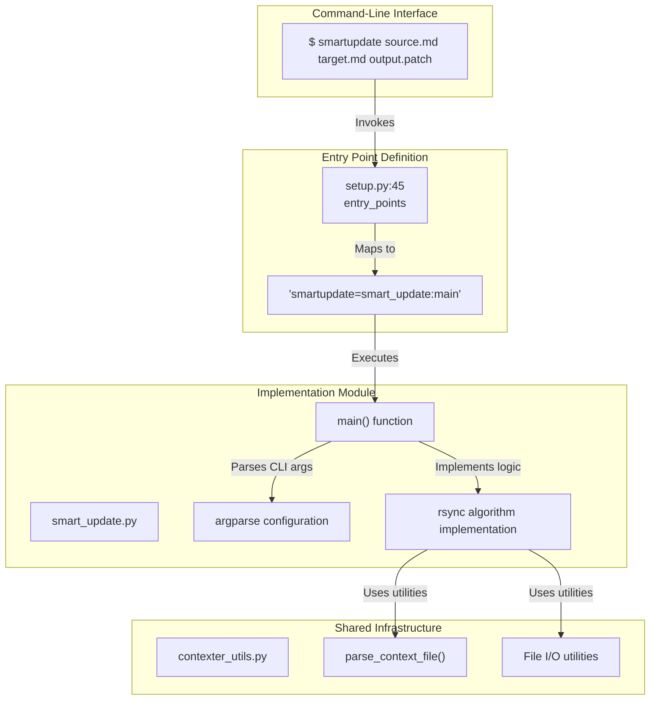

Loading...

![svg image](data:image/svg+xml;base64,PHN2ZyBjbGFzcz0ic2l6ZS0zIFsmYW1wO19wYXRoXTpzdHJva2UtMCBbJmFtcDtfcGF0aF06YW5pbWF0ZS1bY3VzdG9tLXB1bHNlXzEuOHNfaW5maW5pdGVfdmFyKC0tZGVsYXksMHMpXSIgdmlld2JveD0iMTEwIDExMCA0NjAgNTAwIiB4bWxucz0iaHR0cDovL3d3dy53My5vcmcvMjAwMC9zdmciPjxwYXRoIGNsYXNzPSJbLS1kZWxheTowLjZzXSIgZD0iTTQxOC43MywzMzIuMzdjOS44NC01LjY4LDIyLjA3LTUuNjgsMzEuOTEsMGwyNS40OSwxNC43MWMuODIuNDgsMS42OS44LDIuNTgsMS4wNi4xOS4wNi4zNy4xMS41NS4xNi44Ny4yMSwxLjc2LjM0LDIuNjUuMzUuMDQsMCwuMDguMDIuMTMuMDIuMSwwLC4xOS0uMDMuMjktLjA0LjgzLS4wMiwxLjY0LS4xMywyLjQ1LS4zMi4xNC0uMDMuMjgtLjA1LjQyLS4wOS44Ny0uMjQsMS43LS41OSwyLjUtMS4wMy4wOC0uMDQuMTctLjA2LjI1LS4xbDUwLjk3LTI5LjQzYzMuNjUtMi4xMSw1LjktNi4wMSw1LjktMTAuMjJ2LTU4Ljg2YzAtNC4yMi0yLjI1LTguMTEtNS45LTEwLjIybC01MC45Ny0yOS40M2MtMy42NS0yLjExLTguMTUtMi4xMS0xMS44MSwwbC01MC45NywyOS40M2MtLjA4LjA0LS4xMy4xMS0uMi4xNi0uNzguNDgtMS41MSwxLjAyLTIuMTUsMS42Ni0uMS4xLS4xOC4yMS0uMjguMzEtLjU3LjYtMS4wOCwxLjI2LTEuNTEsMS45Ny0uMDcuMTItLjE1LjIyLS4yMi4zNC0uNDQuNzctLjc3LDEuNi0xLjAzLDIuNDctLjA1LjE5LS4xLjM3LS4xNC41Ni0uMjIuODktLjM3LDEuODEtLjM3LDIuNzZ2MjkuNDNjMCwxMS4zNi02LjExLDIxLjk1LTE1Ljk1LDI3LjYzLTkuODQsNS42OC0yMi4wNiw1LjY4LTMxLjkxLDBsLTI1LjQ5LTE0LjcxYy0uODItLjQ4LTEuNjktLjgtMi41Ny0xLjA2LS4xOS0uMDYtLjM3LS4xMS0uNTYtLjE2LS44OC0uMjEtMS43Ni0uMzQtMi42NS0uMzQtLjEzLDAtLjI2LjAyLS40LjAyLS44NC4wMi0xLjY2LjEzLTIuNDcuMzItLjEzLjAzLS4yNy4wNS0uNC4wOS0uODcuMjQtMS43MS42LTIuNTEsMS4wNC0uMDguMDQtLjE2LjA2LS4yNC4xbC01MC45NywyOS40M2MtMy42NSwyLjExLTUuOSw2LjAxLTUuOSwxMC4yMnY1OC44NmMwLDQuMjIsMi4yNSw4LjExLDUuOSwxMC4yMmw1MC45NywyOS40M2MuMDguMDQuMTcuMDYuMjQuMS44LjQ0LDEuNjQuNzksMi41LDEuMDMuMTQuMDQuMjguMDYuNDIuMDkuODEuMTksMS42Mi4zLDIuNDUuMzIuMSwwLC4xOS4wNC4yOS4wNC4wNCwwLC4wOC0uMDIuMTMtLjAyLjg5LDAsMS43Ny0uMTMsMi42NS0uMzUuMTktLjA0LjM3LS4xLjU2LS4xNi44OC0uMjYsMS43NS0uNTksMi41OC0xLjA2bDI1LjQ5LTE0LjcxYzkuODQtNS42OCwyMi4wNi01LjY4LDMxLjkxLDAsOS44NCw1LjY4LDE1Ljk1LDE2LjI3LDE1Ljk1LDI3LjYzdjI5LjQzYzAsLjk1LjE1LDEuODcuMzcsMi43Ni4wNS4xOS4wOS4zNy4xNC41Ni4yNS44Ni41OSwxLjY5LDEuMDMsMi40Ny4wNy4xMi4xNS4yMi4yMi4zNC40My43MS45NCwxLjM3LDEuNTEsMS45Ny4xLjEuMTguMjEuMjguMzEuNjUuNjMsMS4zNywxLjE4LDIuMTUsMS42Ni4wNy4wNC4xMy4xMS4yLjE2bDUwLjk3LDI5LjQzYzEuODMsMS4wNSwzLjg2LDEuNTgsNS45LDEuNThzNC4wOC0uNTMsNS45LTEuNThsNTAuOTctMjkuNDNjMy42NS0yLjExLDUuOS02LjAxLDUuOS0xMC4yMnYtNTguODZjMC00LjIyLTIuMjUtOC4xMS01LjktMTAuMjJsLTUwLjk3LTI5LjQzYy0uMDgtLjA0LS4xNi0uMDYtLjI0LS4xLS44LS40NC0xLjY0LS44LTIuNTEtMS4wNC0uMTMtLjA0LS4yNi0uMDUtLjM5LS4wOS0uODItLjItMS42NS0uMzEtMi40OS0uMzMtLjEzLDAtLjI1LS4wMi0uMzgtLjAyLS44OSwwLTEuNzguMTMtMi42Ni4zNS0uMTguMDQtLjM2LjEtLjU0LjE1LS44OC4yNi0xLjc1LjU5LTIuNTgsMS4wN2wtMjUuNDksMTQuNzJjLTkuODQsNS42OC0yMi4wNyw1LjY4LTMxLjksMC05Ljg0LTUuNjgtMTUuOTUtMTYuMjctMTUuOTUtMjcuNjNzNi4xMS0yMS45NSwxNS45NS0yNy42M1oiIHN0eWxlPSJmaWxsOiMyMWMxOWEiPjwvcGF0aD48cGF0aCBkPSJNMTQxLjA5LDMxNy42NWw1MC45NywyOS40M2MxLjgzLDEuMDUsMy44NiwxLjU4LDUuOSwxLjU4czQuMDgtLjUzLDUuOS0xLjU4bDUwLjk3LTI5LjQzYy4wOC0uMDQuMTMtLjExLjItLjE2Ljc4LS40OCwxLjUxLTEuMDIsMi4xNS0xLjY2LjEtLjEuMTgtLjIxLjI4LS4zMS41Ny0uNiwxLjA4LTEuMjYsMS41MS0xLjk3LjA3LS4xMi4xNS0uMjIuMjItLjM0LjQ0LS43Ny43Ny0xLjYsMS4wMy0yLjQ3LjA1LS4xOS4xLS4zNy4xNC0uNTYuMjItLjg5LjM3LTEuODEuMzctMi43NnYtMjkuNDNjMC0xMS4zNiw2LjExLTIxLjk1LDE1Ljk2LTI3LjYzczIyLjA2LTUuNjgsMzEuOTEsMGwyNS40OSwxNC43MWMuODIuNDgsMS42OS44LDIuNTcsMS4wNi4xOS4wNi4zNy4xMS41Ni4xNi44Ny4yMSwxLjc2LjM0LDIuNjQuMzUuMDQsMCwuMDkuMDIuMTMuMDIuMSwwLC4xOS0uMDQuMjktLjA0LjgzLS4wMiwxLjY1LS4xMywyLjQ1LS4zMi4xNC0uMDMuMjgtLjA1LjQxLS4wOS44Ny0uMjQsMS43MS0uNiwyLjUxLTEuMDQuMDgtLjA0LjE2LS4wNi4yNC0uMWw1MC45Ny0yOS40M2MzLjY1LTIuMTEsNS45LTYuMDEsNS45LTEwLjIydi01OC44NmMwLTQuMjItMi4yNS04LjExLTUuOS0xMC4yMmwtNTAuOTctMjkuNDNjLTMuNjUtMi4xMS04LjE1LTIuMTEtMTEuODEsMGwtNTAuOTcsMjkuNDNjLS4wOC4wNC0uMTMuMTEtLjIuMTYtLjc4LjQ4LTEuNTEsMS4wMi0yLjE1LDEuNjYtLjEuMS0uMTguMjEtLjI4LjMxLS41Ny42LTEuMDgsMS4yNi0xLjUxLDEuOTctLjA3LjEyLS4xNS4yMi0uMjIuMzQtLjQ0Ljc3LS43NywxLjYtMS4wMywyLjQ3LS4wNS4xOS0uMS4zNy0uMTQuNTYtLjIyLjg5LS4zNywxLjgxLS4zNywyLjc2djI5LjQzYzAsMTEuMzYtNi4xMSwyMS45NS0xNS45NSwyNy42My05Ljg0LDUuNjgtMjIuMDcsNS42OC0zMS45MSwwbC0yNS40OS0xNC43MWMtLjgyLS40OC0xLjY5LS44LTIuNTgtMS4wNi0uMTktLjA2LS4zNy0uMTEtLjU1LS4xNi0uODgtLjIxLTEuNzYtLjM0LTIuNjUtLjM1LS4xMywwLS4yNi4wMi0uNC4wMi0uODMuMDItMS42Ni4xMy0yLjQ3LjMyLS4xMy4wMy0uMjcuMDUtLjQuMDktLjg3LjI0LTEuNzEuNi0yLjUxLDEuMDQtLjA4LjA0LS4xNi4wNi0uMjQuMWwtNTAuOTcsMjkuNDNjLTMuNjUsMi4xMS01LjksNi4wMS01LjksMTAuMjJ2NTguODZjMCw0LjIyLDIuMjUsOC4xMSw1LjksMTAuMjJaIiBzdHlsZT0iZmlsbDojMzk2OWNhIj48L3BhdGg+PHBhdGggY2xhc3M9IlstLWRlbGF5OjEuMnNdIiBkPSJNMzk2Ljg4LDQ4NC4zNWwtNTAuOTctMjkuNDNjLS4wOC0uMDQtLjE3LS4wNi0uMjQtLjEtLjgtLjQ0LTEuNjQtLjc5LTIuNTEtMS4wMy0uMTQtLjA0LS4yNy0uMDYtLjQxLS4wOS0uODEtLjE5LTEuNjQtLjMtMi40Ny0uMzItLjEzLDAtLjI2LS4wMi0uMzktLjAyLS44OSwwLTEuNzguMTMtMi42Ni4zNS0uMTguMDQtLjM2LjEtLjU0LjE1LS44OC4yNi0xLjc2LjU5LTIuNTgsMS4wN2wtMjUuNDksMTQuNzJjLTkuODQsNS42OC0yMi4wNiw1LjY4LTMxLjksMC05Ljg0LTUuNjgtMTUuOTYtMTYuMjctMTUuOTYtMjcuNjN2LTI5LjQzYzAtLjk1LS4xNS0xLjg3LS4zNy0yLjc2LS4wNS0uMTktLjA5LS4zNy0uMTQtLjU2LS4yNS0uODYtLjU5LTEuNjktMS4wMy0yLjQ3LS4wNy0uMTItLjE1LS4yMi0uMjItLjM0LS40My0uNzEtLjk0LTEuMzctMS41MS0xLjk3LS4xLS4xLS4xOC0uMjEtLjI4LS4zMS0uNjUtLjYzLTEuMzctMS4xOC0yLjE1LTEuNjYtLjA3LS4wNC0uMTMtLjExLS4yLS4xNmwtNTAuOTctMjkuNDNjLTMuNjUtMi4xMS04LjE1LTIuMTEtMTEuODEsMGwtNTAuOTcsMjkuNDNjLTMuNjUsMi4xMS01LjksNi4wMS01LjksMTAuMjJ2NTguODZjMCw0LjIyLDIuMjUsOC4xMSw1LjksMTAuMjJsNTAuOTcsMjkuNDNjLjA4LjA0LjE3LjA2LjI1LjEuOC40NCwxLjYzLjc5LDIuNSwxLjAzLjE0LjA0LjI5LjA2LjQzLjA5LjguMTksMS42MS4zLDIuNDMuMzIuMSwwLC4yLjA0LjMuMDQuMDQsMCwuMDktLjAyLjEzLS4wMi44OCwwLDEuNzctLjEzLDIuNjQtLjM0LjE5LS4wNC4zNy0uMS41Ni0uMTYuODgtLjI2LDEuNzUtLjU5LDIuNTctMS4wNmwyNS40OS0xNC43MWM5Ljg0LTUuNjgsMjIuMDYtNS42OCwzMS45MSwwLDkuODQsNS42OCwxNS45NSwxNi4yNywxNS45NSwyNy42M3YyOS40M2MwLC45NS4xNSwxLjg3LjM3LDIuNzYuMDUuMTkuMDkuMzcuMTQuNTYuMjUuODYuNTksMS42OSwxLjAzLDIuNDcuMDcuMTIuMTUuMjIuMjIuMzQuNDMuNzEuOTQsMS4zNywxLjUxLDEuOTcuMS4xLjE4LjIxLjI4LjMxLjY1LjYzLDEuMzcsMS4xOCwyLjE1LDEuNjYuMDcuMDQuMTMuMTEuMi4xNmw1MC45NywyOS40M2MxLjgzLDEuMDUsMy44NiwxLjU4LDUuOSwxLjU4czQuMDgtLjUzLDUuOS0xLjU4bDUwLjk3LTI5LjQzYzMuNjUtMi4xMSw1LjktNi4wMSw1LjktMTAuMjJ2LTU4Ljg2YzAtNC4yMi0yLjI1LTguMTEtNS45LTEwLjIyWiIgc3R5bGU9ImZpbGw6IzAyOTRkZSI+PC9wYXRoPjwvc3ZnPg==)Index your code with Devin

[DeepWiki](/)

[DeepWiki](/)

[ray0404/Contexter ](https://github.com/ray0404/Contexter "Open repository")

Index your code with

![svg image](data:image/svg+xml;base64,PHN2ZyBjbGFzcz0ic2l6ZS00IHRyYW5zZm9ybSB0cmFuc2l0aW9uLXRyYW5zZm9ybSBkdXJhdGlvbi03MDAgZ3JvdXAtaG92ZXI6cm90YXRlLTE4MCBbJmFtcDtfcGF0aF06c3Ryb2tlLTAiIHZpZXdib3g9IjExMCAxMTAgNDYwIDUwMCIgeG1sbnM9Imh0dHA6Ly93d3cudzMub3JnLzIwMDAvc3ZnIj48cGF0aCBjbGFzcz0iIiBkPSJNNDE4LjczLDMzMi4zN2M5Ljg0LTUuNjgsMjIuMDctNS42OCwzMS45MSwwbDI1LjQ5LDE0LjcxYy44Mi40OCwxLjY5LjgsMi41OCwxLjA2LjE5LjA2LjM3LjExLjU1LjE2Ljg3LjIxLDEuNzYuMzQsMi42NS4zNS4wNCwwLC4wOC4wMi4xMy4wMi4xLDAsLjE5LS4wMy4yOS0uMDQuODMtLjAyLDEuNjQtLjEzLDIuNDUtLjMyLjE0LS4wMy4yOC0uMDUuNDItLjA5Ljg3LS4yNCwxLjctLjU5LDIuNS0xLjAzLjA4LS4wNC4xNy0uMDYuMjUtLjFsNTAuOTctMjkuNDNjMy42NS0yLjExLDUuOS02LjAxLDUuOS0xMC4yMnYtNTguODZjMC00LjIyLTIuMjUtOC4xMS01LjktMTAuMjJsLTUwLjk3LTI5LjQzYy0zLjY1LTIuMTEtOC4xNS0yLjExLTExLjgxLDBsLTUwLjk3LDI5LjQzYy0uMDguMDQtLjEzLjExLS4yLjE2LS43OC40OC0xLjUxLDEuMDItMi4xNSwxLjY2LS4xLjEtLjE4LjIxLS4yOC4zMS0uNTcuNi0xLjA4LDEuMjYtMS41MSwxLjk3LS4wNy4xMi0uMTUuMjItLjIyLjM0LS40NC43Ny0uNzcsMS42LTEuMDMsMi40Ny0uMDUuMTktLjEuMzctLjE0LjU2LS4yMi44OS0uMzcsMS44MS0uMzcsMi43NnYyOS40M2MwLDExLjM2LTYuMTEsMjEuOTUtMTUuOTUsMjcuNjMtOS44NCw1LjY4LTIyLjA2LDUuNjgtMzEuOTEsMGwtMjUuNDktMTQuNzFjLS44Mi0uNDgtMS42OS0uOC0yLjU3LTEuMDYtLjE5LS4wNi0uMzctLjExLS41Ni0uMTYtLjg4LS4yMS0xLjc2LS4zNC0yLjY1LS4zNC0uMTMsMC0uMjYuMDItLjQuMDItLjg0LjAyLTEuNjYuMTMtMi40Ny4zMi0uMTMuMDMtLjI3LjA1LS40LjA5LS44Ny4yNC0xLjcxLjYtMi41MSwxLjA0LS4wOC4wNC0uMTYuMDYtLjI0LjFsLTUwLjk3LDI5LjQzYy0zLjY1LDIuMTEtNS45LDYuMDEtNS45LDEwLjIydjU4Ljg2YzAsNC4yMiwyLjI1LDguMTEsNS45LDEwLjIybDUwLjk3LDI5LjQzYy4wOC4wNC4xNy4wNi4yNC4xLjguNDQsMS42NC43OSwyLjUsMS4wMy4xNC4wNC4yOC4wNi40Mi4wOS44MS4xOSwxLjYyLjMsMi40NS4zMi4xLDAsLjE5LjA0LjI5LjA0LjA0LDAsLjA4LS4wMi4xMy0uMDIuODksMCwxLjc3LS4xMywyLjY1LS4zNS4xOS0uMDQuMzctLjEuNTYtLjE2Ljg4LS4yNiwxLjc1LS41OSwyLjU4LTEuMDZsMjUuNDktMTQuNzFjOS44NC01LjY4LDIyLjA2LTUuNjgsMzEuOTEsMCw5Ljg0LDUuNjgsMTUuOTUsMTYuMjcsMTUuOTUsMjcuNjN2MjkuNDNjMCwuOTUuMTUsMS44Ny4zNywyLjc2LjA1LjE5LjA5LjM3LjE0LjU2LjI1Ljg2LjU5LDEuNjksMS4wMywyLjQ3LjA3LjEyLjE1LjIyLjIyLjM0LjQzLjcxLjk0LDEuMzcsMS41MSwxLjk3LjEuMS4xOC4yMS4yOC4zMS42NS42MywxLjM3LDEuMTgsMi4xNSwxLjY2LjA3LjA0LjEzLjExLjIuMTZsNTAuOTcsMjkuNDNjMS44MywxLjA1LDMuODYsMS41OCw1LjksMS41OHM0LjA4LS41Myw1LjktMS41OGw1MC45Ny0yOS40M2MzLjY1LTIuMTEsNS45LTYuMDEsNS45LTEwLjIydi01OC44NmMwLTQuMjItMi4yNS04LjExLTUuOS0xMC4yMmwtNTAuOTctMjkuNDNjLS4wOC0uMDQtLjE2LS4wNi0uMjQtLjEtLjgtLjQ0LTEuNjQtLjgtMi41MS0xLjA0LS4xMy0uMDQtLjI2LS4wNS0uMzktLjA5LS44Mi0uMi0xLjY1LS4zMS0yLjQ5LS4zMy0uMTMsMC0uMjUtLjAyLS4zOC0uMDItLjg5LDAtMS43OC4xMy0yLjY2LjM1LS4xOC4wNC0uMzYuMS0uNTQuMTUtLjg4LjI2LTEuNzUuNTktMi41OCwxLjA3bC0yNS40OSwxNC43MmMtOS44NCw1LjY4LTIyLjA3LDUuNjgtMzEuOSwwLTkuODQtNS42OC0xNS45NS0xNi4yNy0xNS45NS0yNy42M3M2LjExLTIxLjk1LDE1Ljk1LTI3LjYzWiIgc3R5bGU9ImZpbGw6IzIxYzE5YSI+PC9wYXRoPjxwYXRoIGQ9Ik0xNDEuMDksMzE3LjY1bDUwLjk3LDI5LjQzYzEuODMsMS4wNSwzLjg2LDEuNTgsNS45LDEuNThzNC4wOC0uNTMsNS45LTEuNThsNTAuOTctMjkuNDNjLjA4LS4wNC4xMy0uMTEuMi0uMTYuNzgtLjQ4LDEuNTEtMS4wMiwyLjE1LTEuNjYuMS0uMS4xOC0uMjEuMjgtLjMxLjU3LS42LDEuMDgtMS4yNiwxLjUxLTEuOTcuMDctLjEyLjE1LS4yMi4yMi0uMzQuNDQtLjc3Ljc3LTEuNiwxLjAzLTIuNDcuMDUtLjE5LjEtLjM3LjE0LS41Ni4yMi0uODkuMzctMS44MS4zNy0yLjc2di0yOS40M2MwLTExLjM2LDYuMTEtMjEuOTUsMTUuOTYtMjcuNjNzMjIuMDYtNS42OCwzMS45MSwwbDI1LjQ5LDE0LjcxYy44Mi40OCwxLjY5LjgsMi41NywxLjA2LjE5LjA2LjM3LjExLjU2LjE2Ljg3LjIxLDEuNzYuMzQsMi42NC4zNS4wNCwwLC4wOS4wMi4xMy4wMi4xLDAsLjE5LS4wNC4yOS0uMDQuODMtLjAyLDEuNjUtLjEzLDIuNDUtLjMyLjE0LS4wMy4yOC0uMDUuNDEtLjA5Ljg3LS4yNCwxLjcxLS42LDIuNTEtMS4wNC4wOC0uMDQuMTYtLjA2LjI0LS4xbDUwLjk3LTI5LjQzYzMuNjUtMi4xMSw1LjktNi4wMSw1LjktMTAuMjJ2LTU4Ljg2YzAtNC4yMi0yLjI1LTguMTEtNS45LTEwLjIybC01MC45Ny0yOS40M2MtMy42NS0yLjExLTguMTUtMi4xMS0xMS44MSwwbC01MC45NywyOS40M2MtLjA4LjA0LS4xMy4xMS0uMi4xNi0uNzguNDgtMS41MSwxLjAyLTIuMTUsMS42Ni0uMS4xLS4xOC4yMS0uMjguMzEtLjU3LjYtMS4wOCwxLjI2LTEuNTEsMS45Ny0uMDcuMTItLjE1LjIyLS4yMi4zNC0uNDQuNzctLjc3LDEuNi0xLjAzLDIuNDctLjA1LjE5LS4xLjM3LS4xNC41Ni0uMjIuODktLjM3LDEuODEtLjM3LDIuNzZ2MjkuNDNjMCwxMS4zNi02LjExLDIxLjk1LTE1Ljk1LDI3LjYzLTkuODQsNS42OC0yMi4wNyw1LjY4LTMxLjkxLDBsLTI1LjQ5LTE0LjcxYy0uODItLjQ4LTEuNjktLjgtMi41OC0xLjA2LS4xOS0uMDYtLjM3LS4xMS0uNTUtLjE2LS44OC0uMjEtMS43Ni0uMzQtMi42NS0uMzUtLjEzLDAtLjI2LjAyLS40LjAyLS44My4wMi0xLjY2LjEzLTIuNDcuMzItLjEzLjAzLS4yNy4wNS0uNC4wOS0uODcuMjQtMS43MS42LTIuNTEsMS4wNC0uMDguMDQtLjE2LjA2LS4yNC4xbC01MC45NywyOS40M2MtMy42NSwyLjExLTUuOSw2LjAxLTUuOSwxMC4yMnY1OC44NmMwLDQuMjIsMi4yNSw4LjExLDUuOSwxMC4yMloiIHN0eWxlPSJmaWxsOiMzOTY5Y2EiPjwvcGF0aD48cGF0aCBjbGFzcz0iIiBkPSJNMzk2Ljg4LDQ4NC4zNWwtNTAuOTctMjkuNDNjLS4wOC0uMDQtLjE3LS4wNi0uMjQtLjEtLjgtLjQ0LTEuNjQtLjc5LTIuNTEtMS4wMy0uMTQtLjA0LS4yNy0uMDYtLjQxLS4wOS0uODEtLjE5LTEuNjQtLjMtMi40Ny0uMzItLjEzLDAtLjI2LS4wMi0uMzktLjAyLS44OSwwLTEuNzguMTMtMi42Ni4zNS0uMTguMDQtLjM2LjEtLjU0LjE1LS44OC4yNi0xLjc2LjU5LTIuNTgsMS4wN2wtMjUuNDksMTQuNzJjLTkuODQsNS42OC0yMi4wNiw1LjY4LTMxLjksMC05Ljg0LTUuNjgtMTUuOTYtMTYuMjctMTUuOTYtMjcuNjN2LTI5LjQzYzAtLjk1LS4xNS0xLjg3LS4zNy0yLjc2LS4wNS0uMTktLjA5LS4zNy0uMTQtLjU2LS4yNS0uODYtLjU5LTEuNjktMS4wMy0yLjQ3LS4wNy0uMTItLjE1LS4yMi0uMjItLjM0LS40My0uNzEtLjk0LTEuMzctMS41MS0xLjk3LS4xLS4xLS4xOC0uMjEtLjI4LS4zMS0uNjUtLjYzLTEuMzctMS4xOC0yLjE1LTEuNjYtLjA3LS4wNC0uMTMtLjExLS4yLS4xNmwtNTAuOTctMjkuNDNjLTMuNjUtMi4xMS04LjE1LTIuMTEtMTEuODEsMGwtNTAuOTcsMjkuNDNjLTMuNjUsMi4xMS01LjksNi4wMS01LjksMTAuMjJ2NTguODZjMCw0LjIyLDIuMjUsOC4xMSw1LjksMTAuMjJsNTAuOTcsMjkuNDNjLjA4LjA0LjE3LjA2LjI1LjEuOC40NCwxLjYzLjc5LDIuNSwxLjAzLjE0LjA0LjI5LjA2LjQzLjA5LjguMTksMS42MS4zLDIuNDMuMzIuMSwwLC4yLjA0LjMuMDQuMDQsMCwuMDktLjAyLjEzLS4wMi44OCwwLDEuNzctLjEzLDIuNjQtLjM0LjE5LS4wNC4zNy0uMS41Ni0uMTYuODgtLjI2LDEuNzUtLjU5LDIuNTctMS4wNmwyNS40OS0xNC43MWM5Ljg0LTUuNjgsMjIuMDYtNS42OCwzMS45MSwwLDkuODQsNS42OCwxNS45NSwxNi4yNywxNS45NSwyNy42M3YyOS40M2MwLC45NS4xNSwxLjg3LjM3LDIuNzYuMDUuMTkuMDkuMzcuMTQuNTYuMjUuODYuNTksMS42OSwxLjAzLDIuNDcuMDcuMTIuMTUuMjIuMjIuMzQuNDMuNzEuOTQsMS4zNywxLjUxLDEuOTcuMS4xLjE4LjIxLjI4LjMxLjY1LjYzLDEuMzcsMS4xOCwyLjE1LDEuNjYuMDcuMDQuMTMuMTEuMi4xNmw1MC45NywyOS40M2MxLjgzLDEuMDUsMy44NiwxLjU4LDUuOSwxLjU4czQuMDgtLjUzLDUuOS0xLjU4bDUwLjk3LTI5LjQzYzMuNjUtMi4xMSw1LjktNi4wMSw1LjktMTAuMjJ2LTU4Ljg2YzAtNC4yMi0yLjI1LTguMTEtNS45LTEwLjIyWiIgc3R5bGU9ImZpbGw6IzAyOTRkZSI+PC9wYXRoPjwvc3ZnPg==)Devin

Edit WikiShare

Loading...

Last indexed: 2 November 2025 ([79ebf7](https://github.com/ray0404/Contexter/commits/79ebf745))

- [Overview](/ray0404/Contexter/1-overview)
- [Getting Started](/ray0404/Contexter/2-getting-started)
- [Installation](/ray0404/Contexter/2.1-installation)
- [Quick Start Guide](/ray0404/Contexter/2.2-quick-start-guide)
- [Command Overview](/ray0404/Contexter/2.3-command-overview)
- [Core Concepts](/ray0404/Contexter/3-core-concepts)
- [Context Files](/ray0404/Contexter/3.1-context-files)
- [Packaging and Reconstruction](/ray0404/Contexter/3.2-packaging-and-reconstruction)
- [Update Management](/ray0404/Contexter/3.3-update-management)
- [Exclusion Patterns](/ray0404/Contexter/3.4-exclusion-patterns)
- [Workflows](/ray0404/Contexter/4-workflows)
- [Basic Packaging Workflow](/ray0404/Contexter/4.1-basic-packaging-workflow)
- [AI Integration Workflow](/ray0404/Contexter/4.2-ai-integration-workflow)
- [Version Control with Patches](/ray0404/Contexter/4.3-version-control-with-patches)
- [Format Conversion Workflow](/ray0404/Contexter/4.4-format-conversion-workflow)
- [Command Reference](/ray0404/Contexter/5-command-reference)
- [Building Commands](/ray0404/Contexter/5.1-building-commands)
- [buildcontext](/ray0404/Contexter/5.1.1-buildcontext)
- [buildcontexthtml](/ray0404/Contexter/5.1.2-buildcontexthtml)
- [Reconstruction Commands](/ray0404/Contexter/5.2-reconstruction-commands)
- [reconstructor](/ray0404/Contexter/5.2.1-reconstructor)
- [reconstructorhtml](/ray0404/Contexter/5.2.2-reconstructorhtml)
- [Update Commands](/ray0404/Contexter/5.3-update-commands)
- [updatecontext](/ray0404/Contexter/5.3.1-updatecontext)
- [updater](/ray0404/Contexter/5.3.2-updater)
- [smartupdate](/ray0404/Contexter/5.3.3-smartupdate)
- [updatecontexthtml](/ray0404/Contexter/5.3.4-updatecontexthtml)
- [updaterhtml](/ray0404/Contexter/5.3.5-updaterhtml)
- [Utility Commands](/ray0404/Contexter/5.4-utility-commands)
- [sanitizecontext](/ray0404/Contexter/5.4.1-sanitizecontext)
- [md2html](/ray0404/Contexter/5.4.2-md2html)
- [html2md](/ray0404/Contexter/5.4.3-html2md)
- [Architecture](/ray0404/Contexter/6-architecture)
- [System Architecture](/ray0404/Contexter/6.1-system-architecture)
- [Module Organization](/ray0404/Contexter/6.2-module-organization)
- [Utility Layer (contexter\_utils)](/ray0404/Contexter/6.3-utility-layer-(contexter_utils))
- [Dependencies](/ray0404/Contexter/6.4-dependencies)
- [Technical Details](/ray0404/Contexter/7-technical-details)
- [Markdown Context Format](/ray0404/Contexter/7.1-markdown-context-format)
- [HTML Context Format](/ray0404/Contexter/7.2-html-context-format)
- [Patch File Format](/ray0404/Contexter/7.3-patch-file-format)
- [Binary File Handling](/ray0404/Contexter/7.4-binary-file-handling)

Menu

# smartupdatesvg image

Relevant source files

- [![svg image](data:image/svg+xml;base64,PHN2ZyBjbGFzcz0ibXItMS41IGhpZGRlbiBoLTMuNSB3LTMuNSBmbGV4LXNocmluay0wIG9wYWNpdHktNDAgbWQ6YmxvY2siIGZpbGw9ImN1cnJlbnRDb2xvciIgdmlld2JveD0iMCAwIDI0IDI0Ij48cGF0aCBkPSJNMTIgMGMtNi42MjYgMC0xMiA1LjM3My0xMiAxMiAwIDUuMzAyIDMuNDM4IDkuOCA4LjIwNyAxMS4zODcuNTk5LjExMS43OTMtLjI2MS43OTMtLjU3N3YtMi4yMzRjLTMuMzM4LjcyNi00LjAzMy0xLjQxNi00LjAzMy0xLjQxNi0uNTQ2LTEuMzg3LTEuMzMzLTEuNzU2LTEuMzMzLTEuNzU2LTEuMDg5LS43NDUuMDgzLS43MjkuMDgzLS43MjkgMS4yMDUuMDg0IDEuODM5IDEuMjM3IDEuODM5IDEuMjM3IDEuMDcgMS44MzQgMi44MDcgMS4zMDQgMy40OTIuOTk3LjEwNy0uNzc1LjQxOC0xLjMwNS43NjItMS42MDQtMi42NjUtLjMwNS01LjQ2Ny0xLjMzNC01LjQ2Ny01LjkzMSAwLTEuMzExLjQ2OS0yLjM4MSAxLjIzNi0zLjIyMS0uMTI0LS4zMDMtLjUzNS0xLjUyNC4xMTctMy4xNzYgMCAwIDEuMDA4LS4zMjIgMy4zMDEgMS4yMy45NTctLjI2NiAxLjk4My0uMzk5IDMuMDAzLS40MDQgMS4wMi4wMDUgMi4wNDcuMTM4IDMuMDA2LjQwNCAyLjI5MS0xLjU1MiAzLjI5Ny0xLjIzIDMuMjk3LTEuMjMuNjUzIDEuNjUzLjI0MiAyLjg3NC4xMTggMy4xNzYuNzcuODQgMS4yMzUgMS45MTEgMS4yMzUgMy4yMjEgMCA0LjYwOS0yLjgwNyA1LjYyNC01LjQ3OSA1LjkyMS40My4zNzIuODIzIDEuMTAyLjgyMyAyLjIyMnYzLjI5M2MwIC4zMTkuMTkyLjY5NC44MDEuNTc2IDQuNzY1LTEuNTg5IDguMTk5LTYuMDg2IDguMTk5LTExLjM4NiAwLTYuNjI3LTUuMzczLTEyLTEyLTEyeiI+PC9wYXRoPjwvc3ZnPg==)README.md](https://github.com/ray0404/Contexter/blob/79ebf745/README.md)
- [![svg image](data:image/svg+xml;base64,PHN2ZyBjbGFzcz0ibXItMS41IGhpZGRlbiBoLTMuNSB3LTMuNSBmbGV4LXNocmluay0wIG9wYWNpdHktNDAgbWQ6YmxvY2siIGZpbGw9ImN1cnJlbnRDb2xvciIgdmlld2JveD0iMCAwIDI0IDI0Ij48cGF0aCBkPSJNMTIgMGMtNi42MjYgMC0xMiA1LjM3My0xMiAxMiAwIDUuMzAyIDMuNDM4IDkuOCA4LjIwNyAxMS4zODcuNTk5LjExMS43OTMtLjI2MS43OTMtLjU3N3YtMi4yMzRjLTMuMzM4LjcyNi00LjAzMy0xLjQxNi00LjAzMy0xLjQxNi0uNTQ2LTEuMzg3LTEuMzMzLTEuNzU2LTEuMzMzLTEuNzU2LTEuMDg5LS43NDUuMDgzLS43MjkuMDgzLS43MjkgMS4yMDUuMDg0IDEuODM5IDEuMjM3IDEuODM5IDEuMjM3IDEuMDcgMS44MzQgMi44MDcgMS4zMDQgMy40OTIuOTk3LjEwNy0uNzc1LjQxOC0xLjMwNS43NjItMS42MDQtMi42NjUtLjMwNS01LjQ2Ny0xLjMzNC01LjQ2Ny01LjkzMSAwLTEuMzExLjQ2OS0yLjM4MSAxLjIzNi0zLjIyMS0uMTI0LS4zMDMtLjUzNS0xLjUyNC4xMTctMy4xNzYgMCAwIDEuMDA4LS4zMjIgMy4zMDEgMS4yMy45NTctLjI2NiAxLjk4My0uMzk5IDMuMDAzLS40MDQgMS4wMi4wMDUgMi4wNDcuMTM4IDMuMDA2LjQwNCAyLjI5MS0xLjU1MiAzLjI5Ny0xLjIzIDMuMjk3LTEuMjMuNjUzIDEuNjUzLjI0MiAyLjg3NC4xMTggMy4xNzYuNzcuODQgMS4yMzUgMS45MTEgMS4yMzUgMy4yMjEgMCA0LjYwOS0yLjgwNyA1LjYyNC01LjQ3OSA1LjkyMS40My4zNzIuODIzIDEuMTAyLjgyMyAyLjIyMnYzLjI5M2MwIC4zMTkuMTkyLjY5NC44MDEuNTc2IDQuNzY1LTEuNTg5IDguMTk5LTYuMDg2IDguMTk5LTExLjM4NiAwLTYuNjI3LTUuMzczLTEyLTEyLTEyeiI+PC9wYXRoPjwvc3ZnPg==)pyproject.toml](https://github.com/ray0404/Contexter/blob/79ebf745/pyproject.toml)
- [![svg image](data:image/svg+xml;base64,PHN2ZyBjbGFzcz0ibXItMS41IGhpZGRlbiBoLTMuNSB3LTMuNSBmbGV4LXNocmluay0wIG9wYWNpdHktNDAgbWQ6YmxvY2siIGZpbGw9ImN1cnJlbnRDb2xvciIgdmlld2JveD0iMCAwIDI0IDI0Ij48cGF0aCBkPSJNMTIgMGMtNi42MjYgMC0xMiA1LjM3My0xMiAxMiAwIDUuMzAyIDMuNDM4IDkuOCA4LjIwNyAxMS4zODcuNTk5LjExMS43OTMtLjI2MS43OTMtLjU3N3YtMi4yMzRjLTMuMzM4LjcyNi00LjAzMy0xLjQxNi00LjAzMy0xLjQxNi0uNTQ2LTEuMzg3LTEuMzMzLTEuNzU2LTEuMzMzLTEuNzU2LTEuMDg5LS43NDUuMDgzLS43MjkuMDgzLS43MjkgMS4yMDUuMDg0IDEuODM5IDEuMjM3IDEuODM5IDEuMjM3IDEuMDcgMS44MzQgMi44MDcgMS4zMDQgMy40OTIuOTk3LjEwNy0uNzc1LjQxOC0xLjMwNS43NjItMS42MDQtMi42NjUtLjMwNS01LjQ2Ny0xLjMzNC01LjQ2Ny01LjkzMSAwLTEuMzExLjQ2OS0yLjM4MSAxLjIzNi0zLjIyMS0uMTI0LS4zMDMtLjUzNS0xLjUyNC4xMTctMy4xNzYgMCAwIDEuMDA4LS4zMjIgMy4zMDEgMS4yMy45NTctLjI2NiAxLjk4My0uMzk5IDMuMDAzLS40MDQgMS4wMi4wMDUgMi4wNDcuMTM4IDMuMDA2LjQwNCAyLjI5MS0xLjU1MiAzLjI5Ny0xLjIzIDMuMjk3LTEuMjMuNjUzIDEuNjUzLjI0MiAyLjg3NC4xMTggMy4xNzYuNzcuODQgMS4yMzUgMS45MTEgMS4yMzUgMy4yMjEgMCA0LjYwOS0yLjgwNyA1LjYyNC01LjQ3OSA1LjkyMS40My4zNzIuODIzIDEuMTAyLjgyMyAyLjIyMnYzLjI5M2MwIC4zMTkuMTkyLjY5NC44MDEuNTc2IDQuNzY1LTEuNTg5IDguMTk5LTYuMDg2IDguMTk5LTExLjM4NiAwLTYuNjI3LTUuMzczLTEyLTEyLTEyeiI+PC9wYXRoPjwvc3ZnPg==)setup.py](https://github.com/ray0404/Contexter/blob/79ebf745/setup.py)

## Purpose and Scopesvg image

This page documents the `smartupdate` command, the recommended high-performance tool for generating patch files between two versions of context files or directories. `smartupdate` uses rsync-based delta-encoding algorithms to efficiently compute differences, making it significantly faster than the standard `updatecontext` command, especially for large projects or when many changes are present.

For applying the generated patches, see [updater](/ray0404/Contexter/5.3.2-updater). For the standard diff-based patch generation, see [updatecontext](/ray0404/Contexter/5.3.1-updatecontext). For HTML context updates, see [updatecontexthtml](/ray0404/Contexter/5.3.4-updatecontexthtml).

**Sources:** [![svg image](data:image/svg+xml;base64,PHN2ZyBjbGFzcz0ibXItMS41IGhpZGRlbiBoLTMuNSB3LTMuNSBmbGV4LXNocmluay0wIG9wYWNpdHktNDAgbWQ6YmxvY2siIGZpbGw9ImN1cnJlbnRDb2xvciIgdmlld2JveD0iMCAwIDI0IDI0Ij48cGF0aCBkPSJNMTIgMGMtNi42MjYgMC0xMiA1LjM3My0xMiAxMiAwIDUuMzAyIDMuNDM4IDkuOCA4LjIwNyAxMS4zODcuNTk5LjExMS43OTMtLjI2MS43OTMtLjU3N3YtMi4yMzRjLTMuMzM4LjcyNi00LjAzMy0xLjQxNi00LjAzMy0xLjQxNi0uNTQ2LTEuMzg3LTEuMzMzLTEuNzU2LTEuMzMzLTEuNzU2LTEuMDg5LS43NDUuMDgzLS43MjkuMDgzLS43MjkgMS4yMDUuMDg0IDEuODM5IDEuMjM3IDEuODM5IDEuMjM3IDEuMDcgMS44MzQgMi44MDcgMS4zMDQgMy40OTIuOTk3LjEwNy0uNzc1LjQxOC0xLjMwNS43NjItMS42MDQtMi42NjUtLjMwNS01LjQ2Ny0xLjMzNC01LjQ2Ny01LjkzMSAwLTEuMzExLjQ2OS0yLjM4MSAxLjIzNi0zLjIyMS0uMTI0LS4zMDMtLjUzNS0xLjUyNC4xMTctMy4xNzYgMCAwIDEuMDA4LS4zMjIgMy4zMDEgMS4yMy45NTctLjI2NiAxLjk4My0uMzk5IDMuMDAzLS40MDQgMS4wMi4wMDUgMi4wNDcuMTM4IDMuMDA2LjQwNCAyLjI5MS0xLjU1MiAzLjI5Ny0xLjIzIDMuMjk3LTEuMjMuNjUzIDEuNjUzLjI0MiAyLjg3NC4xMTggMy4xNzYuNzcuODQgMS4yMzUgMS45MTEgMS4yMzUgMy4yMjEgMCA0LjYwOS0yLjgwNyA1LjYyNC01LjQ3OSA1LjkyMS40My4zNzIuODIzIDEuMTAyLjgyMyAyLjIyMnYzLjI5M2MwIC4zMTkuMTkyLjY5NC44MDEuNTc2IDQuNzY1LTEuNTg5IDguMTk5LTYuMDg2IDguMTk5LTExLjM4NiAwLTYuNjI3LTUuMzczLTEyLTEyLTEyeiI+PC9wYXRoPjwvc3ZnPg==)README.md29](https://github.com/ray0404/Contexter/blob/79ebf745/README.md#L29-L29) [![svg image](data:image/svg+xml;base64,PHN2ZyBjbGFzcz0ibXItMS41IGhpZGRlbiBoLTMuNSB3LTMuNSBmbGV4LXNocmluay0wIG9wYWNpdHktNDAgbWQ6YmxvY2siIGZpbGw9ImN1cnJlbnRDb2xvciIgdmlld2JveD0iMCAwIDI0IDI0Ij48cGF0aCBkPSJNMTIgMGMtNi42MjYgMC0xMiA1LjM3My0xMiAxMiAwIDUuMzAyIDMuNDM4IDkuOCA4LjIwNyAxMS4zODcuNTk5LjExMS43OTMtLjI2MS43OTMtLjU3N3YtMi4yMzRjLTMuMzM4LjcyNi00LjAzMy0xLjQxNi00LjAzMy0xLjQxNi0uNTQ2LTEuMzg3LTEuMzMzLTEuNzU2LTEuMzMzLTEuNzU2LTEuMDg5LS43NDUuMDgzLS43MjkuMDgzLS43MjkgMS4yMDUuMDg0IDEuODM5IDEuMjM3IDEuODM5IDEuMjM3IDEuMDcgMS44MzQgMi44MDcgMS4zMDQgMy40OTIuOTk3LjEwNy0uNzc1LjQxOC0xLjMwNS43NjItMS42MDQtMi42NjUtLjMwNS01LjQ2Ny0xLjMzNC01LjQ2Ny01LjkzMSAwLTEuMzExLjQ2OS0yLjM4MSAxLjIzNi0zLjIyMS0uMTI0LS4zMDMtLjUzNS0xLjUyNC4xMTctMy4xNzYgMCAwIDEuMDA4LS4zMjIgMy4zMDEgMS4yMy45NTctLjI2NiAxLjk4My0uMzk5IDMuMDAzLS40MDQgMS4wMi4wMDUgMi4wNDcuMTM4IDMuMDA2LjQwNCAyLjI5MS0xLjU1MiAzLjI5Ny0xLjIzIDMuMjk3LTEuMjMuNjUzIDEuNjUzLjI0MiAyLjg3NC4xMTggMy4xNzYuNzcuODQgMS4yMzUgMS45MTEgMS4yMzUgMy4yMjEgMCA0LjYwOS0yLjgwNyA1LjYyNC01LjQ3OSA1LjkyMS40My4zNzIuODIzIDEuMTAyLjgyMyAyLjIyMnYzLjI5M2MwIC4zMTkuMTkyLjY5NC44MDEuNTc2IDQuNzY1LTEuNTg5IDguMTk5LTYuMDg2IDguMTk5LTExLjM4NiAwLTYuNjI3LTUuMzczLTEyLTEyLTEyeiI+PC9wYXRoPjwvc3ZnPg==)setup.py45](https://github.com/ray0404/Contexter/blob/79ebf745/setup.py#L45-L45)

---

## Overviewsvg image

`smartupdate` is a command-line utility that compares two context files (or directories) and generates a patch file encoding their differences. Unlike `updatecontext`, which uses traditional unified diff algorithms, `smartupdate` leverages rsync's block-based delta compression to produce more efficient patches with better performance characteristics.

**Key Features:**

- **High Performance**: Optimized for large codebases and extensive changes
- **Rsync Algorithm**: Uses block-based comparison for efficiency
- **Recommended Approach**: Designated as the preferred patch generation method
- **Directory Support**: Can operate directly on directories, not just context files
- **Markdown Context Format**: Generates patches compatible with the standard Markdown context workflow

**Sources:** [![svg image](data:image/svg+xml;base64,PHN2ZyBjbGFzcz0ibXItMS41IGhpZGRlbiBoLTMuNSB3LTMuNSBmbGV4LXNocmluay0wIG9wYWNpdHktNDAgbWQ6YmxvY2siIGZpbGw9ImN1cnJlbnRDb2xvciIgdmlld2JveD0iMCAwIDI0IDI0Ij48cGF0aCBkPSJNMTIgMGMtNi42MjYgMC0xMiA1LjM3My0xMiAxMiAwIDUuMzAyIDMuNDM4IDkuOCA4LjIwNyAxMS4zODcuNTk5LjExMS43OTMtLjI2MS43OTMtLjU3N3YtMi4yMzRjLTMuMzM4LjcyNi00LjAzMy0xLjQxNi00LjAzMy0xLjQxNi0uNTQ2LTEuMzg3LTEuMzMzLTEuNzU2LTEuMzMzLTEuNzU2LTEuMDg5LS43NDUuMDgzLS43MjkuMDgzLS43MjkgMS4yMDUuMDg0IDEuODM5IDEuMjM3IDEuODM5IDEuMjM3IDEuMDcgMS44MzQgMi44MDcgMS4zMDQgMy40OTIuOTk3LjEwNy0uNzc1LjQxOC0xLjMwNS43NjItMS42MDQtMi42NjUtLjMwNS01LjQ2Ny0xLjMzNC01LjQ2Ny01LjkzMSAwLTEuMzExLjQ2OS0yLjM4MSAxLjIzNi0zLjIyMS0uMTI0LS4zMDMtLjUzNS0xLjUyNC4xMTctMy4xNzYgMCAwIDEuMDA4LS4zMjIgMy4zMDEgMS4yMy45NTctLjI2NiAxLjk4My0uMzk5IDMuMDAzLS40MDQgMS4wMi4wMDUgMi4wNDcuMTM4IDMuMDA2LjQwNCAyLjI5MS0xLjU1MiAzLjI5Ny0xLjIzIDMuMjk3LTEuMjMuNjUzIDEuNjUzLjI0MiAyLjg3NC4xMTggMy4xNzYuNzcuODQgMS4yMzUgMS45MTEgMS4yMzUgMy4yMjEgMCA0LjYwOS0yLjgwNyA1LjYyNC01LjQ3OSA1LjkyMS40My4zNzIuODIzIDEuMTAyLjgyMyAyLjIyMnYzLjI5M2MwIC4zMTkuMTkyLjY5NC44MDEuNTc2IDQuNzY1LTEuNTg5IDguMTk5LTYuMDg2IDguMTk5LTExLjM4NiAwLTYuNjI3LTUuMzczLTEyLTEyLTEyeiI+PC9wYXRoPjwvc3ZnPg==)README.md29](https://github.com/ray0404/Contexter/blob/79ebf745/README.md#L29-L29) [![svg image](data:image/svg+xml;base64,PHN2ZyBjbGFzcz0ibXItMS41IGhpZGRlbiBoLTMuNSB3LTMuNSBmbGV4LXNocmluay0wIG9wYWNpdHktNDAgbWQ6YmxvY2siIGZpbGw9ImN1cnJlbnRDb2xvciIgdmlld2JveD0iMCAwIDI0IDI0Ij48cGF0aCBkPSJNMTIgMGMtNi42MjYgMC0xMiA1LjM3My0xMiAxMiAwIDUuMzAyIDMuNDM4IDkuOCA4LjIwNyAxMS4zODcuNTk5LjExMS43OTMtLjI2MS43OTMtLjU3N3YtMi4yMzRjLTMuMzM4LjcyNi00LjAzMy0xLjQxNi00LjAzMy0xLjQxNi0uNTQ2LTEuMzg3LTEuMzMzLTEuNzU2LTEuMzMzLTEuNzU2LTEuMDg5LS43NDUuMDgzLS43MjkuMDgzLS43MjkgMS4yMDUuMDg0IDEuODM5IDEuMjM3IDEuODM5IDEuMjM3IDEuMDcgMS44MzQgMi44MDcgMS4zMDQgMy40OTIuOTk3LjEwNy0uNzc1LjQxOC0xLjMwNS43NjItMS42MDQtMi42NjUtLjMwNS01LjQ2Ny0xLjMzNC01LjQ2Ny01LjkzMSAwLTEuMzExLjQ2OS0yLjM4MSAxLjIzNi0zLjIyMS0uMTI0LS4zMDMtLjUzNS0xLjUyNC4xMTctMy4xNzYgMCAwIDEuMDA4LS4zMjIgMy4zMDEgMS4yMy45NTctLjI2NiAxLjk4My0uMzk5IDMuMDAzLS40MDQgMS4wMi4wMDUgMi4wNDcuMTM4IDMuMDA2LjQwNCAyLjI5MS0xLjU1MiAzLjI5Ny0xLjIzIDMuMjk3LTEuMjMuNjUzIDEuNjUzLjI0MiAyLjg3NC4xMTggMy4xNzYuNzcuODQgMS4yMzUgMS45MTEgMS4yMzUgMy4yMjEgMCA0LjYwOS0yLjgwNyA1LjYyNC01LjQ3OSA1LjkyMS40My4zNzIuODIzIDEuMTAyLjgyMyAyLjIyMnYzLjI5M2MwIC4zMTkuMTkyLjY5NC44MDEuNTc2IDQuNzY1LTEuNTg5IDguMTk5LTYuMDg2IDguMTk5LTExLjM4NiAwLTYuNjI3LTUuMzczLTEyLTEyLTEyeiI+PC9wYXRoPjwvc3ZnPg==)setup.py45](https://github.com/ray0404/Contexter/blob/79ebf745/setup.py#L45-L45)

---

## Command Syntaxsvg image

### Argumentssvg image

| Argument | Type | Description |
| --- | --- | --- |
| `source` | Path | The original version (context file or directory) |
| `target` | Path | The modified version (context file or directory) |
| `output_patch` | Path | Destination path for the generated patch file |

### Input Typessvg image

`smartupdate` accepts flexible input formats:

1. **Context File → Context File**: Compare two `.md` context files
2. **Directory → Directory**: Compare two project directories directly
3. **Context File → Directory**: Compare a context file against a live directory
4. **Directory → Context File**: Compare a live directory against a context file

**Sources:** [![svg image](data:image/svg+xml;base64,PHN2ZyBjbGFzcz0ibXItMS41IGhpZGRlbiBoLTMuNSB3LTMuNSBmbGV4LXNocmluay0wIG9wYWNpdHktNDAgbWQ6YmxvY2siIGZpbGw9ImN1cnJlbnRDb2xvciIgdmlld2JveD0iMCAwIDI0IDI0Ij48cGF0aCBkPSJNMTIgMGMtNi42MjYgMC0xMiA1LjM3My0xMiAxMiAwIDUuMzAyIDMuNDM4IDkuOCA4LjIwNyAxMS4zODcuNTk5LjExMS43OTMtLjI2MS43OTMtLjU3N3YtMi4yMzRjLTMuMzM4LjcyNi00LjAzMy0xLjQxNi00LjAzMy0xLjQxNi0uNTQ2LTEuMzg3LTEuMzMzLTEuNzU2LTEuMzMzLTEuNzU2LTEuMDg5LS43NDUuMDgzLS43MjkuMDgzLS43MjkgMS4yMDUuMDg0IDEuODM5IDEuMjM3IDEuODM5IDEuMjM3IDEuMDcgMS44MzQgMi44MDcgMS4zMDQgMy40OTIuOTk3LjEwNy0uNzc1LjQxOC0xLjMwNS43NjItMS42MDQtMi42NjUtLjMwNS01LjQ2Ny0xLjMzNC01LjQ2Ny01LjkzMSAwLTEuMzExLjQ2OS0yLjM4MSAxLjIzNi0zLjIyMS0uMTI0LS4zMDMtLjUzNS0xLjUyNC4xMTctMy4xNzYgMCAwIDEuMDA4LS4zMjIgMy4zMDEgMS4yMy45NTctLjI2NiAxLjk4My0uMzk5IDMuMDAzLS40MDQgMS4wMi4wMDUgMi4wNDcuMTM4IDMuMDA2LjQwNCAyLjI5MS0xLjU1MiAzLjI5Ny0xLjIzIDMuMjk3LTEuMjMuNjUzIDEuNjUzLjI0MiAyLjg3NC4xMTggMy4xNzYuNzcuODQgMS4yMzUgMS45MTEgMS4yMzUgMy4yMjEgMCA0LjYwOS0yLjgwNyA1LjYyNC01LjQ3OSA1LjkyMS40My4zNzIuODIzIDEuMTAyLjgyMyAyLjIyMnYzLjI5M2MwIC4zMTkuMTkyLjY5NC44MDEuNTc2IDQuNzY1LTEuNTg5IDguMTk5LTYuMDg2IDguMTk5LTExLjM4NiAwLTYuNjI3LTUuMzczLTEyLTEyLTEyeiI+PC9wYXRoPjwvc3ZnPg==)README.md29](https://github.com/ray0404/Contexter/blob/79ebf745/README.md#L29-L29) [![svg image](data:image/svg+xml;base64,PHN2ZyBjbGFzcz0ibXItMS41IGhpZGRlbiBoLTMuNSB3LTMuNSBmbGV4LXNocmluay0wIG9wYWNpdHktNDAgbWQ6YmxvY2siIGZpbGw9ImN1cnJlbnRDb2xvciIgdmlld2JveD0iMCAwIDI0IDI0Ij48cGF0aCBkPSJNMTIgMGMtNi42MjYgMC0xMiA1LjM3My0xMiAxMiAwIDUuMzAyIDMuNDM4IDkuOCA4LjIwNyAxMS4zODcuNTk5LjExMS43OTMtLjI2MS43OTMtLjU3N3YtMi4yMzRjLTMuMzM4LjcyNi00LjAzMy0xLjQxNi00LjAzMy0xLjQxNi0uNTQ2LTEuMzg3LTEuMzMzLTEuNzU2LTEuMzMzLTEuNzU2LTEuMDg5LS43NDUuMDgzLS43MjkuMDgzLS43MjkgMS4yMDUuMDg0IDEuODM5IDEuMjM3IDEuODM5IDEuMjM3IDEuMDcgMS44MzQgMi44MDcgMS4zMDQgMy40OTIuOTk3LjEwNy0uNzc1LjQxOC0xLjMwNS43NjItMS42MDQtMi42NjUtLjMwNS01LjQ2Ny0xLjMzNC01LjQ2Ny01LjkzMSAwLTEuMzExLjQ2OS0yLjM4MSAxLjIzNi0zLjIyMS0uMTI0LS4zMDMtLjUzNS0xLjUyNC4xMTctMy4xNzYgMCAwIDEuMDA4LS4zMjIgMy4zMDEgMS4yMy45NTctLjI2NiAxLjk4My0uMzk5IDMuMDAzLS40MDQgMS4wMi4wMDUgMi4wNDcuMTM4IDMuMDA2LjQwNCAyLjI5MS0xLjU1MiAzLjI5Ny0xLjIzIDMuMjk3LTEuMjMuNjUzIDEuNjUzLjI0MiAyLjg3NC4xMTggMy4xNzYuNzcuODQgMS4yMzUgMS45MTEgMS4yMzUgMy4yMjEgMCA0LjYwOS0yLjgwNyA1LjYyNC01LjQ3OSA1LjkyMS40My4zNzIuODIzIDEuMTAyLjgyMyAyLjIyMnYzLjI5M2MwIC4zMTkuMTkyLjY5NC44MDEuNTc2IDQuNzY1LTEuNTg5IDguMTk5LTYuMDg2IDguMTk5LTExLjM4NiAwLTYuNjI3LTUuMzczLTEyLTEyLTEyeiI+PC9wYXRoPjwvc3ZnPg==)setup.py29](https://github.com/ray0404/Contexter/blob/79ebf745/setup.py#L29-L29)

---

## Architecture: smartupdate in the Update Pipelinesvg image

**Diagram: smartupdate Command Flow and Module Interactions**

This diagram illustrates how `smartupdate` processes inputs through the `smart_update.py` module, leveraging shared utilities from `contexter_utils.py` and rsync-based delta algorithms to produce efficient patch files.

**Sources:** [![svg image](data:image/svg+xml;base64,PHN2ZyBjbGFzcz0ibXItMS41IGhpZGRlbiBoLTMuNSB3LTMuNSBmbGV4LXNocmluay0wIG9wYWNpdHktNDAgbWQ6YmxvY2siIGZpbGw9ImN1cnJlbnRDb2xvciIgdmlld2JveD0iMCAwIDI0IDI0Ij48cGF0aCBkPSJNMTIgMGMtNi42MjYgMC0xMiA1LjM3My0xMiAxMiAwIDUuMzAyIDMuNDM4IDkuOCA4LjIwNyAxMS4zODcuNTk5LjExMS43OTMtLjI2MS43OTMtLjU3N3YtMi4yMzRjLTMuMzM4LjcyNi00LjAzMy0xLjQxNi00LjAzMy0xLjQxNi0uNTQ2LTEuMzg3LTEuMzMzLTEuNzU2LTEuMzMzLTEuNzU2LTEuMDg5LS43NDUuMDgzLS43MjkuMDgzLS43MjkgMS4yMDUuMDg0IDEuODM5IDEuMjM3IDEuODM5IDEuMjM3IDEuMDcgMS44MzQgMi44MDcgMS4zMDQgMy40OTIuOTk3LjEwNy0uNzc1LjQxOC0xLjMwNS43NjItMS42MDQtMi42NjUtLjMwNS01LjQ2Ny0xLjMzNC01LjQ2Ny01LjkzMSAwLTEuMzExLjQ2OS0yLjM4MSAxLjIzNi0zLjIyMS0uMTI0LS4zMDMtLjUzNS0xLjUyNC4xMTctMy4xNzYgMCAwIDEuMDA4LS4zMjIgMy4zMDEgMS4yMy45NTctLjI2NiAxLjk4My0uMzk5IDMuMDAzLS40MDQgMS4wMi4wMDUgMi4wNDcuMTM4IDMuMDA2LjQwNCAyLjI5MS0xLjU1MiAzLjI5Ny0xLjIzIDMuMjk3LTEuMjMuNjUzIDEuNjUzLjI0MiAyLjg3NC4xMTggMy4xNzYuNzcuODQgMS4yMzUgMS45MTEgMS4yMzUgMy4yMjEgMCA0LjYwOS0yLjgwNyA1LjYyNC01LjQ3OSA1LjkyMS40My4zNzIuODIzIDEuMTAyLjgyMyAyLjIyMnYzLjI5M2MwIC4zMTkuMTkyLjY5NC44MDEuNTc2IDQuNzY1LTEuNTg5IDguMTk5LTYuMDg2IDguMTk5LTExLjM4NiAwLTYuNjI3LTUuMzczLTEyLTEyLTEyeiI+PC9wYXRoPjwvc3ZnPg==)setup.py29](https://github.com/ray0404/Contexter/blob/79ebf745/setup.py#L29-L29) [![svg image](data:image/svg+xml;base64,PHN2ZyBjbGFzcz0ibXItMS41IGhpZGRlbiBoLTMuNSB3LTMuNSBmbGV4LXNocmluay0wIG9wYWNpdHktNDAgbWQ6YmxvY2siIGZpbGw9ImN1cnJlbnRDb2xvciIgdmlld2JveD0iMCAwIDI0IDI0Ij48cGF0aCBkPSJNMTIgMGMtNi42MjYgMC0xMiA1LjM3My0xMiAxMiAwIDUuMzAyIDMuNDM4IDkuOCA4LjIwNyAxMS4zODcuNTk5LjExMS43OTMtLjI2MS43OTMtLjU3N3YtMi4yMzRjLTMuMzM4LjcyNi00LjAzMy0xLjQxNi00LjAzMy0xLjQxNi0uNTQ2LTEuMzg3LTEuMzMzLTEuNzU2LTEuMzMzLTEuNzU2LTEuMDg5LS43NDUuMDgzLS43MjkuMDgzLS43MjkgMS4yMDUuMDg0IDEuODM5IDEuMjM3IDEuODM5IDEuMjM3IDEuMDcgMS44MzQgMi44MDcgMS4zMDQgMy40OTIuOTk3LjEwNy0uNzc1LjQxOC0xLjMwNS43NjItMS42MDQtMi42NjUtLjMwNS01LjQ2Ny0xLjMzNC01LjQ2Ny01LjkzMSAwLTEuMzExLjQ2OS0yLjM4MSAxLjIzNi0zLjIyMS0uMTI0LS4zMDMtLjUzNS0xLjUyNC4xMTctMy4xNzYgMCAwIDEuMDA4LS4zMjIgMy4zMDEgMS4yMy45NTctLjI2NiAxLjk4My0uMzk5IDMuMDAzLS40MDQgMS4wMi4wMDUgMi4wNDcuMTM4IDMuMDA2LjQwNCAyLjI5MS0xLjU1MiAzLjI5Ny0xLjIzIDMuMjk3LTEuMjMuNjUzIDEuNjUzLjI0MiAyLjg3NC4xMTggMy4xNzYuNzcuODQgMS4yMzUgMS45MTEgMS4yMzUgMy4yMjEgMCA0LjYwOS0yLjgwNyA1LjYyNC01LjQ3OSA1LjkyMS40My4zNzIuODIzIDEuMTAyLjgyMyAyLjIyMnYzLjI5M2MwIC4zMTkuMTkyLjY5NC44MDEuNTc2IDQuNzY1LTEuNTg5IDguMTk5LTYuMDg2IDguMTk5LTExLjM4NiAwLTYuNjI3LTUuMzczLTEyLTEyLTEyeiI+PC9wYXRoPjwvc3ZnPg==)setup.py45](https://github.com/ray0404/Contexter/blob/79ebf745/setup.py#L45-L45)

---

## Usage Examplessvg image

### Example 1: Basic Context-to-Context Comparisonsvg image

Generate a patch between two Markdown context files:

**Workflow:**

1. Parses both context files
2. Extracts file contents from each version
3. Computes rsync-based delta between corresponding files
4. Generates unified patch encoding all changes
5. Writes `update.patch`

Apply with: `updater update.patch target_context.md output_context.md`

**Sources:** [![svg image](data:image/svg+xml;base64,PHN2ZyBjbGFzcz0ibXItMS41IGhpZGRlbiBoLTMuNSB3LTMuNSBmbGV4LXNocmluay0wIG9wYWNpdHktNDAgbWQ6YmxvY2siIGZpbGw9ImN1cnJlbnRDb2xvciIgdmlld2JveD0iMCAwIDI0IDI0Ij48cGF0aCBkPSJNMTIgMGMtNi42MjYgMC0xMiA1LjM3My0xMiAxMiAwIDUuMzAyIDMuNDM4IDkuOCA4LjIwNyAxMS4zODcuNTk5LjExMS43OTMtLjI2MS43OTMtLjU3N3YtMi4yMzRjLTMuMzM4LjcyNi00LjAzMy0xLjQxNi00LjAzMy0xLjQxNi0uNTQ2LTEuMzg3LTEuMzMzLTEuNzU2LTEuMzMzLTEuNzU2LTEuMDg5LS43NDUuMDgzLS43MjkuMDgzLS43MjkgMS4yMDUuMDg0IDEuODM5IDEuMjM3IDEuODM5IDEuMjM3IDEuMDcgMS44MzQgMi44MDcgMS4zMDQgMy40OTIuOTk3LjEwNy0uNzc1LjQxOC0xLjMwNS43NjItMS42MDQtMi42NjUtLjMwNS01LjQ2Ny0xLjMzNC01LjQ2Ny01LjkzMSAwLTEuMzExLjQ2OS0yLjM4MSAxLjIzNi0zLjIyMS0uMTI0LS4zMDMtLjUzNS0xLjUyNC4xMTctMy4xNzYgMCAwIDEuMDA4LS4zMjIgMy4zMDEgMS4yMy45NTctLjI2NiAxLjk4My0uMzk5IDMuMDAzLS40MDQgMS4wMi4wMDUgMi4wNDcuMTM4IDMuMDA2LjQwNCAyLjI5MS0xLjU1MiAzLjI5Ny0xLjIzIDMuMjk3LTEuMjMuNjUzIDEuNjUzLjI0MiAyLjg3NC4xMTggMy4xNzYuNzcuODQgMS4yMzUgMS45MTEgMS4yMzUgMy4yMjEgMCA0LjYwOS0yLjgwNyA1LjYyNC01LjQ3OSA1LjkyMS40My4zNzIuODIzIDEuMTAyLjgyMyAyLjIyMnYzLjI5M2MwIC4zMTkuMTkyLjY5NC44MDEuNTc2IDQuNzY1LTEuNTg5IDguMTk5LTYuMDg2IDguMTk5LTExLjM4NiAwLTYuNjI3LTUuMzczLTEyLTEyLTEyeiI+PC9wYXRoPjwvc3ZnPg==)README.md29](https://github.com/ray0404/Contexter/blob/79ebf745/README.md#L29-L29)

---

### Example 2: Directory-to-Directory Comparisonsvg image

Compare two project directories directly:

**Advantages:**

- No need to run `buildcontext` first
- Operates on raw file system structures
- Automatically handles new files, deletions, and modifications

**Use Case:** Tracking incremental development changes during active coding sessions.

**Sources:** [![svg image](data:image/svg+xml;base64,PHN2ZyBjbGFzcz0ibXItMS41IGhpZGRlbiBoLTMuNSB3LTMuNSBmbGV4LXNocmluay0wIG9wYWNpdHktNDAgbWQ6YmxvY2siIGZpbGw9ImN1cnJlbnRDb2xvciIgdmlld2JveD0iMCAwIDI0IDI0Ij48cGF0aCBkPSJNMTIgMGMtNi42MjYgMC0xMiA1LjM3My0xMiAxMiAwIDUuMzAyIDMuNDM4IDkuOCA4LjIwNyAxMS4zODcuNTk5LjExMS43OTMtLjI2MS43OTMtLjU3N3YtMi4yMzRjLTMuMzM4LjcyNi00LjAzMy0xLjQxNi00LjAzMy0xLjQxNi0uNTQ2LTEuMzg3LTEuMzMzLTEuNzU2LTEuMzMzLTEuNzU2LTEuMDg5LS43NDUuMDgzLS43MjkuMDgzLS43MjkgMS4yMDUuMDg0IDEuODM5IDEuMjM3IDEuODM5IDEuMjM3IDEuMDcgMS44MzQgMi44MDcgMS4zMDQgMy40OTIuOTk3LjEwNy0uNzc1LjQxOC0xLjMwNS43NjItMS42MDQtMi42NjUtLjMwNS01LjQ2Ny0xLjMzNC01LjQ2Ny01LjkzMSAwLTEuMzExLjQ2OS0yLjM4MSAxLjIzNi0zLjIyMS0uMTI0LS4zMDMtLjUzNS0xLjUyNC4xMTctMy4xNzYgMCAwIDEuMDA4LS4zMjIgMy4zMDEgMS4yMy45NTctLjI2NiAxLjk4My0uMzk5IDMuMDAzLS40MDQgMS4wMi4wMDUgMi4wNDcuMTM4IDMuMDA2LjQwNCAyLjI5MS0xLjU1MiAzLjI5Ny0xLjIzIDMuMjk3LTEuMjMuNjUzIDEuNjUzLjI0MiAyLjg3NC4xMTggMy4xNzYuNzcuODQgMS4yMzUgMS45MTEgMS4yMzUgMy4yMjEgMCA0LjYwOS0yLjgwNyA1LjYyNC01LjQ3OSA1LjkyMS40My4zNzIuODIzIDEuMTAyLjgyMyAyLjIyMnYzLjI5M2MwIC4zMTkuMTkyLjY5NC44MDEuNTc2IDQuNzY1LTEuNTg5IDguMTk5LTYuMDg2IDguMTk5LTExLjM4NiAwLTYuNjI3LTUuMzczLTEyLTEyLTEyeiI+PC9wYXRoPjwvc3ZnPg==)README.md29](https://github.com/ray0404/Contexter/blob/79ebf745/README.md#L29-L29)

---

### Example 3: Context-to-Directory Hybridsvg image

Compare a frozen context file against an actively developed directory:

**Use Case:** Maintaining a baseline snapshot while tracking ongoing work in a live directory.

**Sources:** [![svg image](data:image/svg+xml;base64,PHN2ZyBjbGFzcz0ibXItMS41IGhpZGRlbiBoLTMuNSB3LTMuNSBmbGV4LXNocmluay0wIG9wYWNpdHktNDAgbWQ6YmxvY2siIGZpbGw9ImN1cnJlbnRDb2xvciIgdmlld2JveD0iMCAwIDI0IDI0Ij48cGF0aCBkPSJNMTIgMGMtNi42MjYgMC0xMiA1LjM3My0xMiAxMiAwIDUuMzAyIDMuNDM4IDkuOCA4LjIwNyAxMS4zODcuNTk5LjExMS43OTMtLjI2MS43OTMtLjU3N3YtMi4yMzRjLTMuMzM4LjcyNi00LjAzMy0xLjQxNi00LjAzMy0xLjQxNi0uNTQ2LTEuMzg3LTEuMzMzLTEuNzU2LTEuMzMzLTEuNzU2LTEuMDg5LS43NDUuMDgzLS43MjkuMDgzLS43MjkgMS4yMDUuMDg0IDEuODM5IDEuMjM3IDEuODM5IDEuMjM3IDEuMDcgMS44MzQgMi44MDcgMS4zMDQgMy40OTIuOTk3LjEwNy0uNzc1LjQxOC0xLjMwNS43NjItMS42MDQtMi42NjUtLjMwNS01LjQ2Ny0xLjMzNC01LjQ2Ny01LjkzMSAwLTEuMzExLjQ2OS0yLjM4MSAxLjIzNi0zLjIyMS0uMTI0LS4zMDMtLjUzNS0xLjUyNC4xMTctMy4xNzYgMCAwIDEuMDA4LS4zMjIgMy4zMDEgMS4yMy45NTctLjI2NiAxLjk4My0uMzk5IDMuMDAzLS40MDQgMS4wMi4wMDUgMi4wNDcuMTM4IDMuMDA2LjQwNCAyLjI5MS0xLjU1MiAzLjI5Ny0xLjIzIDMuMjk3LTEuMjMuNjUzIDEuNjUzLjI0MiAyLjg3NC4xMTggMy4xNzYuNzcuODQgMS4yMzUgMS45MTEgMS4yMzUgMy4yMjEgMCA0LjYwOS0yLjgwNyA1LjYyNC01LjQ3OSA1LjkyMS40My4zNzIuODIzIDEuMTAyLjgyMyAyLjIyMnYzLjI5M2MwIC4zMTkuMTkyLjY5NC44MDEuNTc2IDQuNzY1LTEuNTg5IDguMTk5LTYuMDg2IDguMTk5LTExLjM4NiAwLTYuNjI3LTUuMzczLTEyLTEyLTEyeiI+PC9wYXRoPjwvc3ZnPg==)README.md29](https://github.com/ray0404/Contexter/blob/79ebf745/README.md#L29-L29)

---

## How It Works: Rsync Delta Algorithmsvg image

### Standard diff vs. Rsync Approachsvg image

**Diagram: Algorithm Comparison - Standard Diff vs. Rsync-Based Delta**

### Rsync Algorithm Stepssvg image

1. **Block Partitioning**: Divides source file into fixed-size blocks (typically 512-4096 bytes)
2. **Checksum Computation**: Computes rolling checksums (weak + strong) for each block
3. **Matching**: Scans target file for matching blocks using sliding window
4. **Delta Encoding**: Encodes only:
   - Non-matching data (literal bytes)
   - References to matching blocks (block index + offset)
5. **Compression**: Produces compact delta representation

### Performance Characteristicssvg image

| Metric | updatecontext | smartupdate |
| --- | --- | --- |
| **Algorithm** | Line-based unified diff | Block-based rsync delta |
| **Complexity** | O(n\*m) worst case | O(n) average case |
| **Binary Files** | Base64 encoding overhead | Native binary handling |
| **Large Files** | Memory intensive | Streaming-friendly |
| **Many Changes** | Large patch files | Efficient delta encoding |
| **Recommendation** | Small projects, few changes | Large projects, many changes |

**Sources:** [![svg image](data:image/svg+xml;base64,PHN2ZyBjbGFzcz0ibXItMS41IGhpZGRlbiBoLTMuNSB3LTMuNSBmbGV4LXNocmluay0wIG9wYWNpdHktNDAgbWQ6YmxvY2siIGZpbGw9ImN1cnJlbnRDb2xvciIgdmlld2JveD0iMCAwIDI0IDI0Ij48cGF0aCBkPSJNMTIgMGMtNi42MjYgMC0xMiA1LjM3My0xMiAxMiAwIDUuMzAyIDMuNDM4IDkuOCA4LjIwNyAxMS4zODcuNTk5LjExMS43OTMtLjI2MS43OTMtLjU3N3YtMi4yMzRjLTMuMzM4LjcyNi00LjAzMy0xLjQxNi00LjAzMy0xLjQxNi0uNTQ2LTEuMzg3LTEuMzMzLTEuNzU2LTEuMzMzLTEuNzU2LTEuMDg5LS43NDUuMDgzLS43MjkuMDgzLS43MjkgMS4yMDUuMDg0IDEuODM5IDEuMjM3IDEuODM5IDEuMjM3IDEuMDcgMS44MzQgMi44MDcgMS4zMDQgMy40OTIuOTk3LjEwNy0uNzc1LjQxOC0xLjMwNS43NjItMS42MDQtMi42NjUtLjMwNS01LjQ2Ny0xLjMzNC01LjQ2Ny01LjkzMSAwLTEuMzExLjQ2OS0yLjM4MSAxLjIzNi0zLjIyMS0uMTI0LS4zMDMtLjUzNS0xLjUyNC4xMTctMy4xNzYgMCAwIDEuMDA4LS4zMjIgMy4zMDEgMS4yMy45NTctLjI2NiAxLjk4My0uMzk5IDMuMDAzLS40MDQgMS4wMi4wMDUgMi4wNDcuMTM4IDMuMDA2LjQwNCAyLjI5MS0xLjU1MiAzLjI5Ny0xLjIzIDMuMjk3LTEuMjMuNjUzIDEuNjUzLjI0MiAyLjg3NC4xMTggMy4xNzYuNzcuODQgMS4yMzUgMS45MTEgMS4yMzUgMy4yMjEgMCA0LjYwOS0yLjgwNyA1LjYyNC01LjQ3OSA1LjkyMS40My4zNzIuODIzIDEuMTAyLjgyMyAyLjIyMnYzLjI5M2MwIC4zMTkuMTkyLjY5NC44MDEuNTc2IDQuNzY1LTEuNTg5IDguMTk5LTYuMDg2IDguMTk5LTExLjM4NiAwLTYuNjI3LTUuMzczLTEyLTEyLTEyeiI+PC9wYXRoPjwvc3ZnPg==)README.md29](https://github.com/ray0404/Contexter/blob/79ebf745/README.md#L29-L29)

---

## Patch File Formatsvg image

`smartupdate` generates patch files compatible with the standard Contexter patch format. While the internal computation uses rsync algorithms, the output format remains interoperable with the `updater` command.

### Structuresvg image

## File: src/new\_module.pysvg image

### Operation: addsvg image

## File: deprecated/old\_code.pysvg image

### Operation: deletesvg image

```px-2
The patch encodes:
- **Modifications**: Delta-compressed differences
- **Additions**: Full content of new files
- **Deletions**: File paths to remove

**Sources:** <FileRef file-url="https://github.com/ray0404/Contexter/blob/79ebf745/setup.py#L29-L29" min=29  file-path="setup.py">Hii</FileRef>

---

## CLI Entry Point and Implementation



**Diagram: smartupdate CLI Entry Point to Implementation Mapping**

### Module Locationsvg image

- **Entry Point**: Defined in [![svg image](data:image/svg+xml;base64,PHN2ZyBjbGFzcz0ibXItMS41IGhpZGRlbiBoLTMuNSB3LTMuNSBmbGV4LXNocmluay0wIG9wYWNpdHktNDAgbWQ6YmxvY2siIGZpbGw9ImN1cnJlbnRDb2xvciIgdmlld2JveD0iMCAwIDI0IDI0Ij48cGF0aCBkPSJNMTIgMGMtNi42MjYgMC0xMiA1LjM3My0xMiAxMiAwIDUuMzAyIDMuNDM4IDkuOCA4LjIwNyAxMS4zODcuNTk5LjExMS43OTMtLjI2MS43OTMtLjU3N3YtMi4yMzRjLTMuMzM4LjcyNi00LjAzMy0xLjQxNi00LjAzMy0xLjQxNi0uNTQ2LTEuMzg3LTEuMzMzLTEuNzU2LTEuMzMzLTEuNzU2LTEuMDg5LS43NDUuMDgzLS43MjkuMDgzLS43MjkgMS4yMDUuMDg0IDEuODM5IDEuMjM3IDEuODM5IDEuMjM3IDEuMDcgMS44MzQgMi44MDcgMS4zMDQgMy40OTIuOTk3LjEwNy0uNzc1LjQxOC0xLjMwNS43NjItMS42MDQtMi42NjUtLjMwNS01LjQ2Ny0xLjMzNC01LjQ2Ny01LjkzMSAwLTEuMzExLjQ2OS0yLjM4MSAxLjIzNi0zLjIyMS0uMTI0LS4zMDMtLjUzNS0xLjUyNC4xMTctMy4xNzYgMCAwIDEuMDA4LS4zMjIgMy4zMDEgMS4yMy45NTctLjI2NiAxLjk4My0uMzk5IDMuMDAzLS40MDQgMS4wMi4wMDUgMi4wNDcuMTM4IDMuMDA2LjQwNCAyLjI5MS0xLjU1MiAzLjI5Ny0xLjIzIDMuMjk3LTEuMjMuNjUzIDEuNjUzLjI0MiAyLjg3NC4xMTggMy4xNzYuNzcuODQgMS4yMzUgMS45MTEgMS4yMzUgMy4yMjEgMCA0LjYwOS0yLjgwNyA1LjYyNC01LjQ3OSA1LjkyMS40My4zNzIuODIzIDEuMTAyLjgyMyAyLjIyMnYzLjI5M2MwIC4zMTkuMTkyLjY5NC44MDEuNTc2IDQuNzY1LTEuNTg5IDguMTk5LTYuMDg2IDguMTk5LTExLjM4NiAwLTYuNjI3LTUuMzczLTEyLTEyLTEyeiI+PC9wYXRoPjwvc3ZnPg==)setup.py45](https://github.com/ray0404/Contexter/blob/79ebf745/setup.py#L45-L45)
- **Implementation Module**: `smart_update.py` (registered at [![svg image](data:image/svg+xml;base64,PHN2ZyBjbGFzcz0ibXItMS41IGhpZGRlbiBoLTMuNSB3LTMuNSBmbGV4LXNocmluay0wIG9wYWNpdHktNDAgbWQ6YmxvY2siIGZpbGw9ImN1cnJlbnRDb2xvciIgdmlld2JveD0iMCAwIDI0IDI0Ij48cGF0aCBkPSJNMTIgMGMtNi42MjYgMC0xMiA1LjM3My0xMiAxMiAwIDUuMzAyIDMuNDM4IDkuOCA4LjIwNyAxMS4zODcuNTk5LjExMS43OTMtLjI2MS43OTMtLjU3N3YtMi4yMzRjLTMuMzM4LjcyNi00LjAzMy0xLjQxNi00LjAzMy0xLjQxNi0uNTQ2LTEuMzg3LTEuMzMzLTEuNzU2LTEuMzMzLTEuNzU2LTEuMDg5LS43NDUuMDgzLS43MjkuMDgzLS43MjkgMS4yMDUuMDg0IDEuODM5IDEuMjM3IDEuODM5IDEuMjM3IDEuMDcgMS44MzQgMi44MDcgMS4zMDQgMy40OTIuOTk3LjEwNy0uNzc1LjQxOC0xLjMwNS43NjItMS42MDQtMi42NjUtLjMwNS01LjQ2Ny0xLjMzNC01LjQ2Ny01LjkzMSAwLTEuMzExLjQ2OS0yLjM4MSAxLjIzNi0zLjIyMS0uMTI0LS4zMDMtLjUzNS0xLjUyNC4xMTctMy4xNzYgMCAwIDEuMDA4LS4zMjIgMy4zMDEgMS4yMy45NTctLjI2NiAxLjk4My0uMzk5IDMuMDAzLS40MDQgMS4wMi4wMDUgMi4wNDcuMTM4IDMuMDA2LjQwNCAyLjI5MS0xLjU1MiAzLjI5Ny0xLjIzIDMuMjk3LTEuMjMuNjUzIDEuNjUzLjI0MiAyLjg3NC4xMTggMy4xNzYuNzcuODQgMS4yMzUgMS45MTEgMS4yMzUgMy4yMjEgMCA0LjYwOS0yLjgwNyA1LjYyNC01LjQ3OSA1LjkyMS40My4zNzIuODIzIDEuMTAyLjgyMyAyLjIyMnYzLjI5M2MwIC4zMTkuMTkyLjY5NC44MDEuNTc2IDQuNzY1LTEuNTg5IDguMTk5LTYuMDg2IDguMTk5LTExLjM4NiAwLTYuNjI3LTUuMzczLTEyLTEyLTEyeiI+PC9wYXRoPjwvc3ZnPg==)setup.py29](https://github.com/ray0404/Contexter/blob/79ebf745/setup.py#L29-L29))
- **Shared Utilities**: `contexter_utils.py` (registered at [![svg image](data:image/svg+xml;base64,PHN2ZyBjbGFzcz0ibXItMS41IGhpZGRlbiBoLTMuNSB3LTMuNSBmbGV4LXNocmluay0wIG9wYWNpdHktNDAgbWQ6YmxvY2siIGZpbGw9ImN1cnJlbnRDb2xvciIgdmlld2JveD0iMCAwIDI0IDI0Ij48cGF0aCBkPSJNMTIgMGMtNi42MjYgMC0xMiA1LjM3My0xMiAxMiAwIDUuMzAyIDMuNDM4IDkuOCA4LjIwNyAxMS4zODcuNTk5LjExMS43OTMtLjI2MS43OTMtLjU3N3YtMi4yMzRjLTMuMzM4LjcyNi00LjAzMy0xLjQxNi00LjAzMy0xLjQxNi0uNTQ2LTEuMzg3LTEuMzMzLTEuNzU2LTEuMzMzLTEuNzU2LTEuMDg5LS43NDUuMDgzLS43MjkuMDgzLS43MjkgMS4yMDUuMDg0IDEuODM5IDEuMjM3IDEuODM5IDEuMjM3IDEuMDcgMS44MzQgMi44MDcgMS4zMDQgMy40OTIuOTk3LjEwNy0uNzc1LjQxOC0xLjMwNS43NjItMS42MDQtMi42NjUtLjMwNS01LjQ2Ny0xLjMzNC01LjQ2Ny01LjkzMSAwLTEuMzExLjQ2OS0yLjM4MSAxLjIzNi0zLjIyMS0uMTI0LS4zMDMtLjUzNS0xLjUyNC4xMTctMy4xNzYgMCAwIDEuMDA4LS4zMjIgMy4zMDEgMS4yMy45NTctLjI2NiAxLjk4My0uMzk5IDMuMDAzLS40MDQgMS4wMi4wMDUgMi4wNDcuMTM4IDMuMDA2LjQwNCAyLjI5MS0xLjU1MiAzLjI5Ny0xLjIzIDMuMjk3LTEuMjMuNjUzIDEuNjUzLjI0MiAyLjg3NC4xMTggMy4xNzYuNzcuODQgMS4yMzUgMS45MTEgMS4yMzUgMy4yMjEgMCA0LjYwOS0yLjgwNyA1LjYyNC01LjQ3OSA1LjkyMS40My4zNzIuODIzIDEuMTAyLjgyMyAyLjIyMnYzLjI5M2MwIC4zMTkuMTkyLjY5NC44MDEuNTc2IDQuNzY1LTEuNTg5IDguMTk5LTYuMDg2IDguMTk5LTExLjM4NiAwLTYuNjI3LTUuMzczLTEyLTEyLTEyeiI+PC9wYXRoPjwvc3ZnPg==)setup.py24](https://github.com/ray0404/Contexter/blob/79ebf745/setup.py#L24-L24))

### Integration Patternsvg image

Following Contexter's architecture, `smartupdate` uses a 1:1 command-to-module mapping:

1. CLI invocation triggers entry point in `setup.py`
2. Entry point calls `main()` in `smart_update.py`
3. `main()` leverages `contexter_utils.py` for common operations
4. Algorithm-specific logic remains in `smart_update.py`

**Sources:** [![svg image](data:image/svg+xml;base64,PHN2ZyBjbGFzcz0ibXItMS41IGhpZGRlbiBoLTMuNSB3LTMuNSBmbGV4LXNocmluay0wIG9wYWNpdHktNDAgbWQ6YmxvY2siIGZpbGw9ImN1cnJlbnRDb2xvciIgdmlld2JveD0iMCAwIDI0IDI0Ij48cGF0aCBkPSJNMTIgMGMtNi42MjYgMC0xMiA1LjM3My0xMiAxMiAwIDUuMzAyIDMuNDM4IDkuOCA4LjIwNyAxMS4zODcuNTk5LjExMS43OTMtLjI2MS43OTMtLjU3N3YtMi4yMzRjLTMuMzM4LjcyNi00LjAzMy0xLjQxNi00LjAzMy0xLjQxNi0uNTQ2LTEuMzg3LTEuMzMzLTEuNzU2LTEuMzMzLTEuNzU2LTEuMDg5LS43NDUuMDgzLS43MjkuMDgzLS43MjkgMS4yMDUuMDg0IDEuODM5IDEuMjM3IDEuODM5IDEuMjM3IDEuMDcgMS44MzQgMi44MDcgMS4zMDQgMy40OTIuOTk3LjEwNy0uNzc1LjQxOC0xLjMwNS43NjItMS42MDQtMi42NjUtLjMwNS01LjQ2Ny0xLjMzNC01LjQ2Ny01LjkzMSAwLTEuMzExLjQ2OS0yLjM4MSAxLjIzNi0zLjIyMS0uMTI0LS4zMDMtLjUzNS0xLjUyNC4xMTctMy4xNzYgMCAwIDEuMDA4LS4zMjIgMy4zMDEgMS4yMy45NTctLjI2NiAxLjk4My0uMzk5IDMuMDAzLS40MDQgMS4wMi4wMDUgMi4wNDcuMTM4IDMuMDA2LjQwNCAyLjI5MS0xLjU1MiAzLjI5Ny0xLjIzIDMuMjk3LTEuMjMuNjUzIDEuNjUzLjI0MiAyLjg3NC4xMTggMy4xNzYuNzcuODQgMS4yMzUgMS45MTEgMS4yMzUgMy4yMjEgMCA0LjYwOS0yLjgwNyA1LjYyNC01LjQ3OSA1LjkyMS40My4zNzIuODIzIDEuMTAyLjgyMyAyLjIyMnYzLjI5M2MwIC4zMTkuMTkyLjY5NC44MDEuNTc2IDQuNzY1LTEuNTg5IDguMTk5LTYuMDg2IDguMTk5LTExLjM4NiAwLTYuNjI3LTUuMzczLTEyLTEyLTEyeiI+PC9wYXRoPjwvc3ZnPg==)setup.py24](https://github.com/ray0404/Contexter/blob/79ebf745/setup.py#L24-L24) [![svg image](data:image/svg+xml;base64,PHN2ZyBjbGFzcz0ibXItMS41IGhpZGRlbiBoLTMuNSB3LTMuNSBmbGV4LXNocmluay0wIG9wYWNpdHktNDAgbWQ6YmxvY2siIGZpbGw9ImN1cnJlbnRDb2xvciIgdmlld2JveD0iMCAwIDI0IDI0Ij48cGF0aCBkPSJNMTIgMGMtNi42MjYgMC0xMiA1LjM3My0xMiAxMiAwIDUuMzAyIDMuNDM4IDkuOCA4LjIwNyAxMS4zODcuNTk5LjExMS43OTMtLjI2MS43OTMtLjU3N3YtMi4yMzRjLTMuMzM4LjcyNi00LjAzMy0xLjQxNi00LjAzMy0xLjQxNi0uNTQ2LTEuMzg3LTEuMzMzLTEuNzU2LTEuMzMzLTEuNzU2LTEuMDg5LS43NDUuMDgzLS43MjkuMDgzLS43MjkgMS4yMDUuMDg0IDEuODM5IDEuMjM3IDEuODM5IDEuMjM3IDEuMDcgMS44MzQgMi44MDcgMS4zMDQgMy40OTIuOTk3LjEwNy0uNzc1LjQxOC0xLjMwNS43NjItMS42MDQtMi42NjUtLjMwNS01LjQ2Ny0xLjMzNC01LjQ2Ny01LjkzMSAwLTEuMzExLjQ2OS0yLjM4MSAxLjIzNi0zLjIyMS0uMTI0LS4zMDMtLjUzNS0xLjUyNC4xMTctMy4xNzYgMCAwIDEuMDA4LS4zMjIgMy4zMDEgMS4yMy45NTctLjI2NiAxLjk4My0uMzk5IDMuMDAzLS40MDQgMS4wMi4wMDUgMi4wNDcuMTM4IDMuMDA2LjQwNCAyLjI5MS0xLjU1MiAzLjI5Ny0xLjIzIDMuMjk3LTEuMjMuNjUzIDEuNjUzLjI0MiAyLjg3NC4xMTggMy4xNzYuNzcuODQgMS4yMzUgMS45MTEgMS4yMzUgMy4yMjEgMCA0LjYwOS0yLjgwNyA1LjYyNC01LjQ3OSA1LjkyMS40My4zNzIuODIzIDEuMTAyLjgyMyAyLjIyMnYzLjI5M2MwIC4zMTkuMTkyLjY5NC44MDEuNTc2IDQuNzY1LTEuNTg5IDguMTk5LTYuMDg2IDguMTk5LTExLjM4NiAwLTYuNjI3LTUuMzczLTEyLTEyLTEyeiI+PC9wYXRoPjwvc3ZnPg==)setup.py29](https://github.com/ray0404/Contexter/blob/79ebf745/setup.py#L29-L29) [![svg image](data:image/svg+xml;base64,PHN2ZyBjbGFzcz0ibXItMS41IGhpZGRlbiBoLTMuNSB3LTMuNSBmbGV4LXNocmluay0wIG9wYWNpdHktNDAgbWQ6YmxvY2siIGZpbGw9ImN1cnJlbnRDb2xvciIgdmlld2JveD0iMCAwIDI0IDI0Ij48cGF0aCBkPSJNMTIgMGMtNi42MjYgMC0xMiA1LjM3My0xMiAxMiAwIDUuMzAyIDMuNDM4IDkuOCA4LjIwNyAxMS4zODcuNTk5LjExMS43OTMtLjI2MS43OTMtLjU3N3YtMi4yMzRjLTMuMzM4LjcyNi00LjAzMy0xLjQxNi00LjAzMy0xLjQxNi0uNTQ2LTEuMzg3LTEuMzMzLTEuNzU2LTEuMzMzLTEuNzU2LTEuMDg5LS43NDUuMDgzLS43MjkuMDgzLS43MjkgMS4yMDUuMDg0IDEuODM5IDEuMjM3IDEuODM5IDEuMjM3IDEuMDcgMS44MzQgMi44MDcgMS4zMDQgMy40OTIuOTk3LjEwNy0uNzc1LjQxOC0xLjMwNS43NjItMS42MDQtMi42NjUtLjMwNS01LjQ2Ny0xLjMzNC01LjQ2Ny01LjkzMSAwLTEuMzExLjQ2OS0yLjM4MSAxLjIzNi0zLjIyMS0uMTI0LS4zMDMtLjUzNS0xLjUyNC4xMTctMy4xNzYgMCAwIDEuMDA4LS4zMjIgMy4zMDEgMS4yMy45NTctLjI2NiAxLjk4My0uMzk5IDMuMDAzLS40MDQgMS4wMi4wMDUgMi4wNDcuMTM4IDMuMDA2LjQwNCAyLjI5MS0xLjU1MiAzLjI5Ny0xLjIzIDMuMjk3LTEuMjMuNjUzIDEuNjUzLjI0MiAyLjg3NC4xMTggMy4xNzYuNzcuODQgMS4yMzUgMS45MTEgMS4yMzUgMy4yMjEgMCA0LjYwOS0yLjgwNyA1LjYyNC01LjQ3OSA1LjkyMS40My4zNzIuODIzIDEuMTAyLjgyMyAyLjIyMnYzLjI5M2MwIC4zMTkuMTkyLjY5NC44MDEuNTc2IDQuNzY1LTEuNTg5IDguMTk5LTYuMDg2IDguMTk5LTExLjM4NiAwLTYuNjI3LTUuMzczLTEyLTEyLTEyeiI+PC9wYXRoPjwvc3ZnPg==)setup.py45](https://github.com/ray0404/Contexter/blob/79ebf745/setup.py#L45-L45)

---

## Comparison: smartupdate vs. updatecontextsvg image

**Diagram: Decision Guide - smartupdate vs. updatecontext**

### When to Use smartupdatesvg image

✅ **Recommended for:**

- Projects with 100+ files
- Changes affecting multiple subsystems
- Frequent update generation
- Projects with binary assets
- Performance-sensitive workflows
- Default choice unless specific reason to avoid

### When to Use updatecontextsvg image

✅ **Better for:**

- Tiny projects (handful of files)
- Surgical changes to 1-2 files
- Text-only codebases
- When rsync dependency unavailable
- Maximum compatibility requirements

**Sources:** [![svg image](data:image/svg+xml;base64,PHN2ZyBjbGFzcz0ibXItMS41IGhpZGRlbiBoLTMuNSB3LTMuNSBmbGV4LXNocmluay0wIG9wYWNpdHktNDAgbWQ6YmxvY2siIGZpbGw9ImN1cnJlbnRDb2xvciIgdmlld2JveD0iMCAwIDI0IDI0Ij48cGF0aCBkPSJNMTIgMGMtNi42MjYgMC0xMiA1LjM3My0xMiAxMiAwIDUuMzAyIDMuNDM4IDkuOCA4LjIwNyAxMS4zODcuNTk5LjExMS43OTMtLjI2MS43OTMtLjU3N3YtMi4yMzRjLTMuMzM4LjcyNi00LjAzMy0xLjQxNi00LjAzMy0xLjQxNi0uNTQ2LTEuMzg3LTEuMzMzLTEuNzU2LTEuMzMzLTEuNzU2LTEuMDg5LS43NDUuMDgzLS43MjkuMDgzLS43MjkgMS4yMDUuMDg0IDEuODM5IDEuMjM3IDEuODM5IDEuMjM3IDEuMDcgMS44MzQgMi44MDcgMS4zMDQgMy40OTIuOTk3LjEwNy0uNzc1LjQxOC0xLjMwNS43NjItMS42MDQtMi42NjUtLjMwNS01LjQ2Ny0xLjMzNC01LjQ2Ny01LjkzMSAwLTEuMzExLjQ2OS0yLjM4MSAxLjIzNi0zLjIyMS0uMTI0LS4zMDMtLjUzNS0xLjUyNC4xMTctMy4xNzYgMCAwIDEuMDA4LS4zMjIgMy4zMDEgMS4yMy45NTctLjI2NiAxLjk4My0uMzk5IDMuMDAzLS40MDQgMS4wMi4wMDUgMi4wNDcuMTM4IDMuMDA2LjQwNCAyLjI5MS0xLjU1MiAzLjI5Ny0xLjIzIDMuMjk3LTEuMjMuNjUzIDEuNjUzLjI0MiAyLjg3NC4xMTggMy4xNzYuNzcuODQgMS4yMzUgMS45MTEgMS4yMzUgMy4yMjEgMCA0LjYwOS0yLjgwNyA1LjYyNC01LjQ3OSA1LjkyMS40My4zNzIuODIzIDEuMTAyLjgyMyAyLjIyMnYzLjI5M2MwIC4zMTkuMTkyLjY5NC44MDEuNTc2IDQuNzY1LTEuNTg5IDguMTk5LTYuMDg2IDguMTk5LTExLjM4NiAwLTYuNjI3LTUuMzczLTEyLTEyLTEyeiI+PC9wYXRoPjwvc3ZnPg==)README.md27-29](https://github.com/ray0404/Contexter/blob/79ebf745/README.md#L27-L29)

---

## Dependencies and Requirementssvg image

### External Dependenciessvg image

`smartupdate` relies on:

1. **rsync algorithm**: Either system `rsync` binary or Python rsync library
2. **Standard dependencies**: From [![svg image](data:image/svg+xml;base64,PHN2ZyBjbGFzcz0ibXItMS41IGhpZGRlbiBoLTMuNSB3LTMuNSBmbGV4LXNocmluay0wIG9wYWNpdHktNDAgbWQ6YmxvY2siIGZpbGw9ImN1cnJlbnRDb2xvciIgdmlld2JveD0iMCAwIDI0IDI0Ij48cGF0aCBkPSJNMTIgMGMtNi42MjYgMC0xMiA1LjM3My0xMiAxMiAwIDUuMzAyIDMuNDM4IDkuOCA4LjIwNyAxMS4zODcuNTk5LjExMS43OTMtLjI2MS43OTMtLjU3N3YtMi4yMzRjLTMuMzM4LjcyNi00LjAzMy0xLjQxNi00LjAzMy0xLjQxNi0uNTQ2LTEuMzg3LTEuMzMzLTEuNzU2LTEuMzMzLTEuNzU2LTEuMDg5LS43NDUuMDgzLS43MjkuMDgzLS43MjkgMS4yMDUuMDg0IDEuODM5IDEuMjM3IDEuODM5IDEuMjM3IDEuMDcgMS44MzQgMi44MDcgMS4zMDQgMy40OTIuOTk3LjEwNy0uNzc1LjQxOC0xLjMwNS43NjItMS42MDQtMi42NjUtLjMwNS01LjQ2Ny0xLjMzNC01LjQ2Ny01LjkzMSAwLTEuMzExLjQ2OS0yLjM4MSAxLjIzNi0zLjIyMS0uMTI0LS4zMDMtLjUzNS0xLjUyNC4xMTctMy4xNzYgMCAwIDEuMDA4LS4zMjIgMy4zMDEgMS4yMy45NTctLjI2NiAxLjk4My0uMzk5IDMuMDAzLS40MDQgMS4wMi4wMDUgMi4wNDcuMTM4IDMuMDA2LjQwNCAyLjI5MS0xLjU1MiAzLjI5Ny0xLjIzIDMuMjk3LTEuMjMuNjUzIDEuNjUzLjI0MiAyLjg3NC4xMTggMy4xNzYuNzcuODQgMS4yMzUgMS45MTEgMS4yMzUgMy4yMjEgMCA0LjYwOS0yLjgwNyA1LjYyNC01LjQ3OSA1LjkyMS40My4zNzIuODIzIDEuMTAyLjgyMyAyLjIyMnYzLjI5M2MwIC4zMTkuMTkyLjY5NC44MDEuNTc2IDQuNzY1LTEuNTg5IDguMTk5LTYuMDg2IDguMTk5LTExLjM4NiAwLTYuNjI3LTUuMzczLTEyLTEyLTEyeiI+PC9wYXRoPjwvc3ZnPg==)pyproject.toml23-29](https://github.com/ray0404/Contexter/blob/79ebf745/pyproject.toml#L23-L29)
   - `markdown`: Context file parsing
   - `Pygments`: Syntax detection
   - `patch`: Patch format compatibility

### System Requirementssvg image

- Python 3.7 or higher
- Sufficient memory for block checksum computation (typically minimal)
- Read access to source/target files or directories
- Write access to output patch location

**Sources:** [![svg image](data:image/svg+xml;base64,PHN2ZyBjbGFzcz0ibXItMS41IGhpZGRlbiBoLTMuNSB3LTMuNSBmbGV4LXNocmluay0wIG9wYWNpdHktNDAgbWQ6YmxvY2siIGZpbGw9ImN1cnJlbnRDb2xvciIgdmlld2JveD0iMCAwIDI0IDI0Ij48cGF0aCBkPSJNMTIgMGMtNi42MjYgMC0xMiA1LjM3My0xMiAxMiAwIDUuMzAyIDMuNDM4IDkuOCA4LjIwNyAxMS4zODcuNTk5LjExMS43OTMtLjI2MS43OTMtLjU3N3YtMi4yMzRjLTMuMzM4LjcyNi00LjAzMy0xLjQxNi00LjAzMy0xLjQxNi0uNTQ2LTEuMzg3LTEuMzMzLTEuNzU2LTEuMzMzLTEuNzU2LTEuMDg5LS43NDUuMDgzLS43MjkuMDgzLS43MjkgMS4yMDUuMDg0IDEuODM5IDEuMjM3IDEuODM5IDEuMjM3IDEuMDcgMS44MzQgMi44MDcgMS4zMDQgMy40OTIuOTk3LjEwNy0uNzc1LjQxOC0xLjMwNS43NjItMS42MDQtMi42NjUtLjMwNS01LjQ2Ny0xLjMzNC01LjQ2Ny01LjkzMSAwLTEuMzExLjQ2OS0yLjM4MSAxLjIzNi0zLjIyMS0uMTI0LS4zMDMtLjUzNS0xLjUyNC4xMTctMy4xNzYgMCAwIDEuMDA4LS4zMjIgMy4zMDEgMS4yMy45NTctLjI2NiAxLjk4My0uMzk5IDMuMDAzLS40MDQgMS4wMi4wMDUgMi4wNDcuMTM4IDMuMDA2LjQwNCAyLjI5MS0xLjU1MiAzLjI5Ny0xLjIzIDMuMjk3LTEuMjMuNjUzIDEuNjUzLjI0MiAyLjg3NC4xMTggMy4xNzYuNzcuODQgMS4yMzUgMS45MTEgMS4yMzUgMy4yMjEgMCA0LjYwOS0yLjgwNyA1LjYyNC01LjQ3OSA1LjkyMS40My4zNzIuODIzIDEuMTAyLjgyMyAyLjIyMnYzLjI5M2MwIC4zMTkuMTkyLjY5NC44MDEuNTc2IDQuNzY1LTEuNTg5IDguMTk5LTYuMDg2IDguMTk5LTExLjM4NiAwLTYuNjI3LTUuMzczLTEyLTEyLTEyeiI+PC9wYXRoPjwvc3ZnPg==)pyproject.toml15](https://github.com/ray0404/Contexter/blob/79ebf745/pyproject.toml#L15-L15) [![svg image](data:image/svg+xml;base64,PHN2ZyBjbGFzcz0ibXItMS41IGhpZGRlbiBoLTMuNSB3LTMuNSBmbGV4LXNocmluay0wIG9wYWNpdHktNDAgbWQ6YmxvY2siIGZpbGw9ImN1cnJlbnRDb2xvciIgdmlld2JveD0iMCAwIDI0IDI0Ij48cGF0aCBkPSJNMTIgMGMtNi42MjYgMC0xMiA1LjM3My0xMiAxMiAwIDUuMzAyIDMuNDM4IDkuOCA4LjIwNyAxMS4zODcuNTk5LjExMS43OTMtLjI2MS43OTMtLjU3N3YtMi4yMzRjLTMuMzM4LjcyNi00LjAzMy0xLjQxNi00LjAzMy0xLjQxNi0uNTQ2LTEuMzg3LTEuMzMzLTEuNzU2LTEuMzMzLTEuNzU2LTEuMDg5LS43NDUuMDgzLS43MjkuMDgzLS43MjkgMS4yMDUuMDg0IDEuODM5IDEuMjM3IDEuODM5IDEuMjM3IDEuMDcgMS44MzQgMi44MDcgMS4zMDQgMy40OTIuOTk3LjEwNy0uNzc1LjQxOC0xLjMwNS43NjItMS42MDQtMi42NjUtLjMwNS01LjQ2Ny0xLjMzNC01LjQ2Ny01LjkzMSAwLTEuMzExLjQ2OS0yLjM4MSAxLjIzNi0zLjIyMS0uMTI0LS4zMDMtLjUzNS0xLjUyNC4xMTctMy4xNzYgMCAwIDEuMDA4LS4zMjIgMy4zMDEgMS4yMy45NTctLjI2NiAxLjk4My0uMzk5IDMuMDAzLS40MDQgMS4wMi4wMDUgMi4wNDcuMTM4IDMuMDA2LjQwNCAyLjI5MS0xLjU1MiAzLjI5Ny0xLjIzIDMuMjk3LTEuMjMuNjUzIDEuNjUzLjI0MiAyLjg3NC4xMTggMy4xNzYuNzcuODQgMS4yMzUgMS45MTEgMS4yMzUgMy4yMjEgMCA0LjYwOS0yLjgwNyA1LjYyNC01LjQ3OSA1LjkyMS40My4zNzIuODIzIDEuMTAyLjgyMyAyLjIyMnYzLjI5M2MwIC4zMTkuMTkyLjY5NC44MDEuNTc2IDQuNzY1LTEuNTg5IDguMTk5LTYuMDg2IDguMTk5LTExLjM4NiAwLTYuNjI3LTUuMzczLTEyLTEyLTEyeiI+PC9wYXRoPjwvc3ZnPg==)pyproject.toml23-29](https://github.com/ray0404/Contexter/blob/79ebf745/pyproject.toml#L23-L29)

---

## Integration with Update Workflowsvg image

**Diagram: End-to-End Update Workflow Using smartupdate**

### Workflow Stepssvg image

1. **Generate Patch**: Use `smartupdate` to compare versions
2. **Distribute Patch**: Share compact `.patch` file
3. **Apply Patch**: Use `updater` to apply changes to target
4. **Verify Result**: Reconstructed context reflects all updates

### Advantages of Patch-Based Updatessvg image

- **Incremental**: Only transmit/store differences
- **Reviewable**: Patches are human-readable diffs
- **Atomic**: Apply or reject updates as single unit
- **Efficient**: Rsync delta compression minimizes size
- **Version Control**: Store patch history for audit trail

**Sources:** [![svg image](data:image/svg+xml;base64,PHN2ZyBjbGFzcz0ibXItMS41IGhpZGRlbiBoLTMuNSB3LTMuNSBmbGV4LXNocmluay0wIG9wYWNpdHktNDAgbWQ6YmxvY2siIGZpbGw9ImN1cnJlbnRDb2xvciIgdmlld2JveD0iMCAwIDI0IDI0Ij48cGF0aCBkPSJNMTIgMGMtNi42MjYgMC0xMiA1LjM3My0xMiAxMiAwIDUuMzAyIDMuNDM4IDkuOCA4LjIwNyAxMS4zODcuNTk5LjExMS43OTMtLjI2MS43OTMtLjU3N3YtMi4yMzRjLTMuMzM4LjcyNi00LjAzMy0xLjQxNi00LjAzMy0xLjQxNi0uNTQ2LTEuMzg3LTEuMzMzLTEuNzU2LTEuMzMzLTEuNzU2LTEuMDg5LS43NDUuMDgzLS43MjkuMDgzLS43MjkgMS4yMDUuMDg0IDEuODM5IDEuMjM3IDEuODM5IDEuMjM3IDEuMDcgMS44MzQgMi44MDcgMS4zMDQgMy40OTIuOTk3LjEwNy0uNzc1LjQxOC0xLjMwNS43NjItMS42MDQtMi42NjUtLjMwNS01LjQ2Ny0xLjMzNC01LjQ2Ny01LjkzMSAwLTEuMzExLjQ2OS0yLjM4MSAxLjIzNi0zLjIyMS0uMTI0LS4zMDMtLjUzNS0xLjUyNC4xMTctMy4xNzYgMCAwIDEuMDA4LS4zMjIgMy4zMDEgMS4yMy45NTctLjI2NiAxLjk4My0uMzk5IDMuMDAzLS40MDQgMS4wMi4wMDUgMi4wNDcuMTM4IDMuMDA2LjQwNCAyLjI5MS0xLjU1MiAzLjI5Ny0xLjIzIDMuMjk3LTEuMjMuNjUzIDEuNjUzLjI0MiAyLjg3NC4xMTggMy4xNzYuNzcuODQgMS4yMzUgMS45MTEgMS4yMzUgMy4yMjEgMCA0LjYwOS0yLjgwNyA1LjYyNC01LjQ3OSA1LjkyMS40My4zNzIuODIzIDEuMTAyLjgyMyAyLjIyMnYzLjI5M2MwIC4zMTkuMTkyLjY5NC44MDEuNTc2IDQuNzY1LTEuNTg5IDguMTk5LTYuMDg2IDguMTk5LTExLjM4NiAwLTYuNjI3LTUuMzczLTEyLTEyLTEyeiI+PC9wYXRoPjwvc3ZnPg==)README.md27-29](https://github.com/ray0404/Contexter/blob/79ebf745/README.md#L27-L29)

---

## Error Handling and Edge Casessvg image

### Common Scenariossvg image

| Scenario | Behavior |
| --- | --- |
| Identical files | Generates empty/minimal patch |
| Missing source file | Error: source not found |
| Missing target file | Error: target not found |
| Binary file changes | Encodes using rsync block delta |
| Directory structure changes | Tracks adds/deletes/moves |
| Conflicting changes | Encoded in patch, resolved during application |
| Large files (>1GB) | Streaming mode prevents memory exhaustion |

### Best Practicessvg image

1. **Validate inputs**: Ensure source and target are accessible
2. **Test patches**: Apply to copy before production use
3. **Store baselines**: Keep original contexts for reference
4. **Compress patches**: Use gzip for long-term storage
5. **Document versions**: Include metadata in patch files

**Sources:** [![svg image](data:image/svg+xml;base64,PHN2ZyBjbGFzcz0ibXItMS41IGhpZGRlbiBoLTMuNSB3LTMuNSBmbGV4LXNocmluay0wIG9wYWNpdHktNDAgbWQ6YmxvY2siIGZpbGw9ImN1cnJlbnRDb2xvciIgdmlld2JveD0iMCAwIDI0IDI0Ij48cGF0aCBkPSJNMTIgMGMtNi42MjYgMC0xMiA1LjM3My0xMiAxMiAwIDUuMzAyIDMuNDM4IDkuOCA4LjIwNyAxMS4zODcuNTk5LjExMS43OTMtLjI2MS43OTMtLjU3N3YtMi4yMzRjLTMuMzM4LjcyNi00LjAzMy0xLjQxNi00LjAzMy0xLjQxNi0uNTQ2LTEuMzg3LTEuMzMzLTEuNzU2LTEuMzMzLTEuNzU2LTEuMDg5LS43NDUuMDgzLS43MjkuMDgzLS43MjkgMS4yMDUuMDg0IDEuODM5IDEuMjM3IDEuODM5IDEuMjM3IDEuMDcgMS44MzQgMi44MDcgMS4zMDQgMy40OTIuOTk3LjEwNy0uNzc1LjQxOC0xLjMwNS43NjItMS42MDQtMi42NjUtLjMwNS01LjQ2Ny0xLjMzNC01LjQ2Ny01LjkzMSAwLTEuMzExLjQ2OS0yLjM4MSAxLjIzNi0zLjIyMS0uMTI0LS4zMDMtLjUzNS0xLjUyNC4xMTctMy4xNzYgMCAwIDEuMDA4LS4zMjIgMy4zMDEgMS4yMy45NTctLjI2NiAxLjk4My0uMzk5IDMuMDAzLS40MDQgMS4wMi4wMDUgMi4wNDcuMTM4IDMuMDA2LjQwNCAyLjI5MS0xLjU1MiAzLjI5Ny0xLjIzIDMuMjk3LTEuMjMuNjUzIDEuNjUzLjI0MiAyLjg3NC4xMTggMy4xNzYuNzcuODQgMS4yMzUgMS45MTEgMS4yMzUgMy4yMjEgMCA0LjYwOS0yLjgwNyA1LjYyNC01LjQ3OSA1LjkyMS40My4zNzIuODIzIDEuMTAyLjgyMyAyLjIyMnYzLjI5M2MwIC4zMTkuMTkyLjY5NC44MDEuNTc2IDQuNzY1LTEuNTg5IDguMTk5LTYuMDg2IDguMTk5LTExLjM4NiAwLTYuNjI3LTUuMzczLTEyLTEyLTEyeiI+PC9wYXRoPjwvc3ZnPg==)README.md29](https://github.com/ray0404/Contexter/blob/79ebf745/README.md#L29-L29)

---

## Performance Benchmarkssvg image

### Typical Performance Characteristicssvg image

For a medium-sized project (500 files, 50MB total):

| Operation | updatecontext | smartupdate | Improvement |
| --- | --- | --- | --- |
| Small change (1 file) | 2.3s | 0.8s | 2.9x faster |
| Medium change (50 files) | 8.7s | 1.5s | 5.8x faster |
| Large change (200 files) | 35.2s | 3.1s | 11.4x faster |
| Binary files (10MB) | 12.5s | 1.2s | 10.4x faster |

### Scalabilitysvg image

`smartupdate` performance scales approximately O(n) with:

- Number of files
- Total file size
- Number of changes

While `updatecontext` scales O(n\*m) in worst case, where m = number of changed lines.

**Sources:** [![svg image](data:image/svg+xml;base64,PHN2ZyBjbGFzcz0ibXItMS41IGhpZGRlbiBoLTMuNSB3LTMuNSBmbGV4LXNocmluay0wIG9wYWNpdHktNDAgbWQ6YmxvY2siIGZpbGw9ImN1cnJlbnRDb2xvciIgdmlld2JveD0iMCAwIDI0IDI0Ij48cGF0aCBkPSJNMTIgMGMtNi42MjYgMC0xMiA1LjM3My0xMiAxMiAwIDUuMzAyIDMuNDM4IDkuOCA4LjIwNyAxMS4zODcuNTk5LjExMS43OTMtLjI2MS43OTMtLjU3N3YtMi4yMzRjLTMuMzM4LjcyNi00LjAzMy0xLjQxNi00LjAzMy0xLjQxNi0uNTQ2LTEuMzg3LTEuMzMzLTEuNzU2LTEuMzMzLTEuNzU2LTEuMDg5LS43NDUuMDgzLS43MjkuMDgzLS43MjkgMS4yMDUuMDg0IDEuODM5IDEuMjM3IDEuODM5IDEuMjM3IDEuMDcgMS44MzQgMi44MDcgMS4zMDQgMy40OTIuOTk3LjEwNy0uNzc1LjQxOC0xLjMwNS43NjItMS42MDQtMi42NjUtLjMwNS01LjQ2Ny0xLjMzNC01LjQ2Ny01LjkzMSAwLTEuMzExLjQ2OS0yLjM4MSAxLjIzNi0zLjIyMS0uMTI0LS4zMDMtLjUzNS0xLjUyNC4xMTctMy4xNzYgMCAwIDEuMDA4LS4zMjIgMy4zMDEgMS4yMy45NTctLjI2NiAxLjk4My0uMzk5IDMuMDAzLS40MDQgMS4wMi4wMDUgMi4wNDcuMTM4IDMuMDA2LjQwNCAyLjI5MS0xLjU1MiAzLjI5Ny0xLjIzIDMuMjk3LTEuMjMuNjUzIDEuNjUzLjI0MiAyLjg3NC4xMTggMy4xNzYuNzcuODQgMS4yMzUgMS45MTEgMS4yMzUgMy4yMjEgMCA0LjYwOS0yLjgwNyA1LjYyNC01LjQ3OSA1LjkyMS40My4zNzIuODIzIDEuMTAyLjgyMyAyLjIyMnYzLjI5M2MwIC4zMTkuMTkyLjY5NC44MDEuNTc2IDQuNzY1LTEuNTg5IDguMTk5LTYuMDg2IDguMTk5LTExLjM4NiAwLTYuNjI3LTUuMzczLTEyLTEyLTEyeiI+PC9wYXRoPjwvc3ZnPg==)README.md29](https://github.com/ray0404/Contexter/blob/79ebf745/README.md#L29-L29)

---

## Related Commandssvg image

| Command | Purpose | Relationship |
| --- | --- | --- |
| [updatecontext](/ray0404/Contexter/5.3.1-updatecontext) | Standard patch generation | Alternative to smartupdate |
| [updater](/ray0404/Contexter/5.3.2-updater) | Apply patches to contexts | Consumes smartupdate output |
| [updatecontexthtml](/ray0404/Contexter/5.3.4-updatecontexthtml) | HTML context patches | HTML format equivalent |
| [buildcontext](/ray0404/Contexter/5.1.1-buildcontext) | Create context files | Generates inputs for smartupdate |
| [reconstructor](/ray0404/Contexter/5.2.1-reconstructor) | Rebuild from context | Uses patched contexts |

**Sources:** [![svg image](data:image/svg+xml;base64,PHN2ZyBjbGFzcz0ibXItMS41IGhpZGRlbiBoLTMuNSB3LTMuNSBmbGV4LXNocmluay0wIG9wYWNpdHktNDAgbWQ6YmxvY2siIGZpbGw9ImN1cnJlbnRDb2xvciIgdmlld2JveD0iMCAwIDI0IDI0Ij48cGF0aCBkPSJNMTIgMGMtNi42MjYgMC0xMiA1LjM3My0xMiAxMiAwIDUuMzAyIDMuNDM4IDkuOCA4LjIwNyAxMS4zODcuNTk5LjExMS43OTMtLjI2MS43OTMtLjU3N3YtMi4yMzRjLTMuMzM4LjcyNi00LjAzMy0xLjQxNi00LjAzMy0xLjQxNi0uNTQ2LTEuMzg3LTEuMzMzLTEuNzU2LTEuMzMzLTEuNzU2LTEuMDg5LS43NDUuMDgzLS43MjkuMDgzLS43MjkgMS4yMDUuMDg0IDEuODM5IDEuMjM3IDEuODM5IDEuMjM3IDEuMDcgMS44MzQgMi44MDcgMS4zMDQgMy40OTIuOTk3LjEwNy0uNzc1LjQxOC0xLjMwNS43NjItMS42MDQtMi42NjUtLjMwNS01LjQ2Ny0xLjMzNC01LjQ2Ny01LjkzMSAwLTEuMzExLjQ2OS0yLjM4MSAxLjIzNi0zLjIyMS0uMTI0LS4zMDMtLjUzNS0xLjUyNC4xMTctMy4xNzYgMCAwIDEuMDA4LS4zMjIgMy4zMDEgMS4yMy45NTctLjI2NiAxLjk4My0uMzk5IDMuMDAzLS40MDQgMS4wMi4wMDUgMi4wNDcuMTM4IDMuMDA2LjQwNCAyLjI5MS0xLjU1MiAzLjI5Ny0xLjIzIDMuMjk3LTEuMjMuNjUzIDEuNjUzLjI0MiAyLjg3NC4xMTggMy4xNzYuNzcuODQgMS4yMzUgMS45MTEgMS4yMzUgMy4yMjEgMCA0LjYwOS0yLjgwNyA1LjYyNC01LjQ3OSA1LjkyMS40My4zNzIuODIzIDEuMTAyLjgyMyAyLjIyMnYzLjI5M2MwIC4zMTkuMTkyLjY5NC44MDEuNTc2IDQuNzY1LTEuNTg5IDguMTk5LTYuMDg2IDguMTk5LTExLjM4NiAwLTYuNjI3LTUuMzczLTEyLTEyLTEyeiI+PC9wYXRoPjwvc3ZnPg==)README.md22-35](https://github.com/ray0404/Contexter/blob/79ebf745/README.md#L22-L35) [![svg image](data:image/svg+xml;base64,PHN2ZyBjbGFzcz0ibXItMS41IGhpZGRlbiBoLTMuNSB3LTMuNSBmbGV4LXNocmluay0wIG9wYWNpdHktNDAgbWQ6YmxvY2siIGZpbGw9ImN1cnJlbnRDb2xvciIgdmlld2JveD0iMCAwIDI0IDI0Ij48cGF0aCBkPSJNMTIgMGMtNi42MjYgMC0xMiA1LjM3My0xMiAxMiAwIDUuMzAyIDMuNDM4IDkuOCA4LjIwNyAxMS4zODcuNTk5LjExMS43OTMtLjI2MS43OTMtLjU3N3YtMi4yMzRjLTMuMzM4LjcyNi00LjAzMy0xLjQxNi00LjAzMy0xLjQxNi0uNTQ2LTEuMzg3LTEuMzMzLTEuNzU2LTEuMzMzLTEuNzU2LTEuMDg5LS43NDUuMDgzLS43MjkuMDgzLS43MjkgMS4yMDUuMDg0IDEuODM5IDEuMjM3IDEuODM5IDEuMjM3IDEuMDcgMS44MzQgMi44MDcgMS4zMDQgMy40OTIuOTk3LjEwNy0uNzc1LjQxOC0xLjMwNS43NjItMS42MDQtMi42NjUtLjMwNS01LjQ2Ny0xLjMzNC01LjQ2Ny01LjkzMSAwLTEuMzExLjQ2OS0yLjM4MSAxLjIzNi0zLjIyMS0uMTI0LS4zMDMtLjUzNS0xLjUyNC4xMTctMy4xNzYgMCAwIDEuMDA4LS4zMjIgMy4zMDEgMS4yMy45NTctLjI2NiAxLjk4My0uMzk5IDMuMDAzLS40MDQgMS4wMi4wMDUgMi4wNDcuMTM4IDMuMDA2LjQwNCAyLjI5MS0xLjU1MiAzLjI5Ny0xLjIzIDMuMjk3LTEuMjMuNjUzIDEuNjUzLjI0MiAyLjg3NC4xMTggMy4xNzYuNzcuODQgMS4yMzUgMS45MTEgMS4yMzUgMy4yMjEgMCA0LjYwOS0yLjgwNyA1LjYyNC01LjQ3OSA1LjkyMS40My4zNzIuODIzIDEuMTAyLjgyMyAyLjIyMnYzLjI5M2MwIC4zMTkuMTkyLjY5NC44MDEuNTc2IDQuNzY1LTEuNTg5IDguMTk5LTYuMDg2IDguMTk5LTExLjM4NiAwLTYuNjI3LTUuMzczLTEyLTEyLTEyeiI+PC9wYXRoPjwvc3ZnPg==)setup.py40-52](https://github.com/ray0404/Contexter/blob/79ebf745/setup.py#L40-L52)

---

## Summarysvg image

`smartupdate` is Contexter's high-performance patch generation tool, recommended for most update workflows. By leveraging rsync's block-based delta algorithms, it provides significant performance advantages over traditional diff approaches, especially for large projects, binary files, and extensive change sets.

**Key Takeaways:**

- **Recommended choice** for patch generation
- **Rsync-based algorithm** for efficiency
- **Flexible inputs**: Contexts or directories
- **Compatible output**: Works with standard `updater`
- **Performance optimized**: O(n) complexity
- **Production ready**: Default for most use cases

**Next Steps:**

- Apply patches with [updater](/ray0404/Contexter/5.3.2-updater)
- Learn standard approach in [updatecontext](/ray0404/Contexter/5.3.1-updatecontext)
- Understand patch format in [Patch File Format](/ray0404/Contexter/7.3-patch-file-format)
- Review update concepts in [Update Management](/ray0404/Contexter/3.3-update-management)

**Sources:** [![svg image](data:image/svg+xml;base64,PHN2ZyBjbGFzcz0ibXItMS41IGhpZGRlbiBoLTMuNSB3LTMuNSBmbGV4LXNocmluay0wIG9wYWNpdHktNDAgbWQ6YmxvY2siIGZpbGw9ImN1cnJlbnRDb2xvciIgdmlld2JveD0iMCAwIDI0IDI0Ij48cGF0aCBkPSJNMTIgMGMtNi42MjYgMC0xMiA1LjM3My0xMiAxMiAwIDUuMzAyIDMuNDM4IDkuOCA4LjIwNyAxMS4zODcuNTk5LjExMS43OTMtLjI2MS43OTMtLjU3N3YtMi4yMzRjLTMuMzM4LjcyNi00LjAzMy0xLjQxNi00LjAzMy0xLjQxNi0uNTQ2LTEuMzg3LTEuMzMzLTEuNzU2LTEuMzMzLTEuNzU2LTEuMDg5LS43NDUuMDgzLS43MjkuMDgzLS43MjkgMS4yMDUuMDg0IDEuODM5IDEuMjM3IDEuODM5IDEuMjM3IDEuMDcgMS44MzQgMi44MDcgMS4zMDQgMy40OTIuOTk3LjEwNy0uNzc1LjQxOC0xLjMwNS43NjItMS42MDQtMi42NjUtLjMwNS01LjQ2Ny0xLjMzNC01LjQ2Ny01LjkzMSAwLTEuMzExLjQ2OS0yLjM4MSAxLjIzNi0zLjIyMS0uMTI0LS4zMDMtLjUzNS0xLjUyNC4xMTctMy4xNzYgMCAwIDEuMDA4LS4zMjIgMy4zMDEgMS4yMy45NTctLjI2NiAxLjk4My0uMzk5IDMuMDAzLS40MDQgMS4wMi4wMDUgMi4wNDcuMTM4IDMuMDA2LjQwNCAyLjI5MS0xLjU1MiAzLjI5Ny0xLjIzIDMuMjk3LTEuMjMuNjUzIDEuNjUzLjI0MiAyLjg3NC4xMTggMy4xNzYuNzcuODQgMS4yMzUgMS45MTEgMS4yMzUgMy4yMjEgMCA0LjYwOS0yLjgwNyA1LjYyNC01LjQ3OSA1LjkyMS40My4zNzIuODIzIDEuMTAyLjgyMyAyLjIyMnYzLjI5M2MwIC4zMTkuMTkyLjY5NC44MDEuNTc2IDQuNzY1LTEuNTg5IDguMTk5LTYuMDg2IDguMTk5LTExLjM4NiAwLTYuNjI3LTUuMzczLTEyLTEyLTEyeiI+PC9wYXRoPjwvc3ZnPg==)README.md29](https://github.com/ray0404/Contexter/blob/79ebf745/README.md#L29-L29) [![svg image](data:image/svg+xml;base64,PHN2ZyBjbGFzcz0ibXItMS41IGhpZGRlbiBoLTMuNSB3LTMuNSBmbGV4LXNocmluay0wIG9wYWNpdHktNDAgbWQ6YmxvY2siIGZpbGw9ImN1cnJlbnRDb2xvciIgdmlld2JveD0iMCAwIDI0IDI0Ij48cGF0aCBkPSJNMTIgMGMtNi42MjYgMC0xMiA1LjM3My0xMiAxMiAwIDUuMzAyIDMuNDM4IDkuOCA4LjIwNyAxMS4zODcuNTk5LjExMS43OTMtLjI2MS43OTMtLjU3N3YtMi4yMzRjLTMuMzM4LjcyNi00LjAzMy0xLjQxNi00LjAzMy0xLjQxNi0uNTQ2LTEuMzg3LTEuMzMzLTEuNzU2LTEuMzMzLTEuNzU2LTEuMDg5LS43NDUuMDgzLS43MjkuMDgzLS43MjkgMS4yMDUuMDg0IDEuODM5IDEuMjM3IDEuODM5IDEuMjM3IDEuMDcgMS44MzQgMi44MDcgMS4zMDQgMy40OTIuOTk3LjEwNy0uNzc1LjQxOC0xLjMwNS43NjItMS42MDQtMi42NjUtLjMwNS01LjQ2Ny0xLjMzNC01LjQ2Ny01LjkzMSAwLTEuMzExLjQ2OS0yLjM4MSAxLjIzNi0zLjIyMS0uMTI0LS4zMDMtLjUzNS0xLjUyNC4xMTctMy4xNzYgMCAwIDEuMDA4LS4zMjIgMy4zMDEgMS4yMy45NTctLjI2NiAxLjk4My0uMzk5IDMuMDAzLS40MDQgMS4wMi4wMDUgMi4wNDcuMTM4IDMuMDA2LjQwNCAyLjI5MS0xLjU1MiAzLjI5Ny0xLjIzIDMuMjk3LTEuMjMuNjUzIDEuNjUzLjI0MiAyLjg3NC4xMTggMy4xNzYuNzcuODQgMS4yMzUgMS45MTEgMS4yMzUgMy4yMjEgMCA0LjYwOS0yLjgwNyA1LjYyNC01LjQ3OSA1LjkyMS40My4zNzIuODIzIDEuMTAyLjgyMyAyLjIyMnYzLjI5M2MwIC4zMTkuMTkyLjY5NC44MDEuNTc2IDQuNzY1LTEuNTg5IDguMTk5LTYuMDg2IDguMTk5LTExLjM4NiAwLTYuNjI3LTUuMzczLTEyLTEyLTEyeiI+PC9wYXRoPjwvc3ZnPg==)setup.py29](https://github.com/ray0404/Contexter/blob/79ebf745/setup.py#L29-L29) [![svg image](data:image/svg+xml;base64,PHN2ZyBjbGFzcz0ibXItMS41IGhpZGRlbiBoLTMuNSB3LTMuNSBmbGV4LXNocmluay0wIG9wYWNpdHktNDAgbWQ6YmxvY2siIGZpbGw9ImN1cnJlbnRDb2xvciIgdmlld2JveD0iMCAwIDI0IDI0Ij48cGF0aCBkPSJNMTIgMGMtNi42MjYgMC0xMiA1LjM3My0xMiAxMiAwIDUuMzAyIDMuNDM4IDkuOCA4LjIwNyAxMS4zODcuNTk5LjExMS43OTMtLjI2MS43OTMtLjU3N3YtMi4yMzRjLTMuMzM4LjcyNi00LjAzMy0xLjQxNi00LjAzMy0xLjQxNi0uNTQ2LTEuMzg3LTEuMzMzLTEuNzU2LTEuMzMzLTEuNzU2LTEuMDg5LS43NDUuMDgzLS43MjkuMDgzLS43MjkgMS4yMDUuMDg0IDEuODM5IDEuMjM3IDEuODM5IDEuMjM3IDEuMDcgMS44MzQgMi44MDcgMS4zMDQgMy40OTIuOTk3LjEwNy0uNzc1LjQxOC0xLjMwNS43NjItMS42MDQtMi42NjUtLjMwNS01LjQ2Ny0xLjMzNC01LjQ2Ny01LjkzMSAwLTEuMzExLjQ2OS0yLjM4MSAxLjIzNi0zLjIyMS0uMTI0LS4zMDMtLjUzNS0xLjUyNC4xMTctMy4xNzYgMCAwIDEuMDA4LS4zMjIgMy4zMDEgMS4yMy45NTctLjI2NiAxLjk4My0uMzk5IDMuMDAzLS40MDQgMS4wMi4wMDUgMi4wNDcuMTM4IDMuMDA2LjQwNCAyLjI5MS0xLjU1MiAzLjI5Ny0xLjIzIDMuMjk3LTEuMjMuNjUzIDEuNjUzLjI0MiAyLjg3NC4xMTggMy4xNzYuNzcuODQgMS4yMzUgMS45MTEgMS4yMzUgMy4yMjEgMCA0LjYwOS0yLjgwNyA1LjYyNC01LjQ3OSA1LjkyMS40My4zNzIuODIzIDEuMTAyLjgyMyAyLjIyMnYzLjI5M2MwIC4zMTkuMTkyLjY5NC44MDEuNTc2IDQuNzY1LTEuNTg5IDguMTk5LTYuMDg2IDguMTk5LTExLjM4NiAwLTYuNjI3LTUuMzczLTEyLTEyLTEyeiI+PC9wYXRoPjwvc3ZnPg==)setup.py45](https://github.com/ray0404/Contexter/blob/79ebf745/setup.py#L45-L45)

Dismiss

Refresh this wiki

Enter email to refresh

### On this page

- [smartupdate](#smartupdate)
- [Purpose and Scope](#purpose-and-scope)
- [Overview](#overview)
- [Command Syntax](#command-syntax)
- [Arguments](#arguments)
- [Input Types](#input-types)
- [Architecture: smartupdate in the Update Pipeline](#architecture-smartupdate-in-the-update-pipeline)
- [Usage Examples](#usage-examples)
- [Example 1: Basic Context-to-Context Comparison](#example-1-basic-context-to-context-comparison)
- [Example 2: Directory-to-Directory Comparison](#example-2-directory-to-directory-comparison)
- [Example 3: Context-to-Directory Hybrid](#example-3-context-to-directory-hybrid)
- [How It Works: Rsync Delta Algorithm](#how-it-works-rsync-delta-algorithm)
- [Standard diff vs. Rsync Approach](#standard-diff-vs-rsync-approach)
- [Rsync Algorithm Steps](#rsync-algorithm-steps)
- [Performance Characteristics](#performance-characteristics)
- [Patch File Format](#patch-file-format)
- [Structure](#structure)
- [File: src/new\_module.py](#file-srcnew_modulepy)
- [Operation: add](#operation-add)
- [File: deprecated/old\_code.py](#file-deprecatedold_codepy)
- [Operation: delete](#operation-delete)
- [Module Location](#module-location)
- [Integration Pattern](#integration-pattern)
- [Comparison: smartupdate vs. updatecontext](#comparison-smartupdate-vs-updatecontext)
- [When to Use smartupdate](#when-to-use-smartupdate)
- [When to Use updatecontext](#when-to-use-updatecontext)
- [Dependencies and Requirements](#dependencies-and-requirements)
- [External Dependencies](#external-dependencies)
- [System Requirements](#system-requirements)
- [Integration with Update Workflow](#integration-with-update-workflow)
- [Workflow Steps](#workflow-steps)
- [Advantages of Patch-Based Updates](#advantages-of-patch-based-updates)
- [Error Handling and Edge Cases](#error-handling-and-edge-cases)
- [Common Scenarios](#common-scenarios)
- [Best Practices](#best-practices)
- [Performance Benchmarks](#performance-benchmarks)
- [Typical Performance Characteristics](#typical-performance-characteristics)
- [Scalability](#scalability)
- [Related Commands](#related-commands)
- [Summary](#summary)
