Loading...

![svg image](data:image/svg+xml;base64,PHN2ZyBjbGFzcz0ic2l6ZS0zIFsmYW1wO19wYXRoXTpzdHJva2UtMCBbJmFtcDtfcGF0aF06YW5pbWF0ZS1bY3VzdG9tLXB1bHNlXzEuOHNfaW5maW5pdGVfdmFyKC0tZGVsYXksMHMpXSIgdmlld2JveD0iMTEwIDExMCA0NjAgNTAwIiB4bWxucz0iaHR0cDovL3d3dy53My5vcmcvMjAwMC9zdmciPjxwYXRoIGNsYXNzPSJbLS1kZWxheTowLjZzXSIgZD0iTTQxOC43MywzMzIuMzdjOS44NC01LjY4LDIyLjA3LTUuNjgsMzEuOTEsMGwyNS40OSwxNC43MWMuODIuNDgsMS42OS44LDIuNTgsMS4wNi4xOS4wNi4zNy4xMS41NS4xNi44Ny4yMSwxLjc2LjM0LDIuNjUuMzUuMDQsMCwuMDguMDIuMTMuMDIuMSwwLC4xOS0uMDMuMjktLjA0LjgzLS4wMiwxLjY0LS4xMywyLjQ1LS4zMi4xNC0uMDMuMjgtLjA1LjQyLS4wOS44Ny0uMjQsMS43LS41OSwyLjUtMS4wMy4wOC0uMDQuMTctLjA2LjI1LS4xbDUwLjk3LTI5LjQzYzMuNjUtMi4xMSw1LjktNi4wMSw1LjktMTAuMjJ2LTU4Ljg2YzAtNC4yMi0yLjI1LTguMTEtNS45LTEwLjIybC01MC45Ny0yOS40M2MtMy42NS0yLjExLTguMTUtMi4xMS0xMS44MSwwbC01MC45NywyOS40M2MtLjA4LjA0LS4xMy4xMS0uMi4xNi0uNzguNDgtMS41MSwxLjAyLTIuMTUsMS42Ni0uMS4xLS4xOC4yMS0uMjguMzEtLjU3LjYtMS4wOCwxLjI2LTEuNTEsMS45Ny0uMDcuMTItLjE1LjIyLS4yMi4zNC0uNDQuNzctLjc3LDEuNi0xLjAzLDIuNDctLjA1LjE5LS4xLjM3LS4xNC41Ni0uMjIuODktLjM3LDEuODEtLjM3LDIuNzZ2MjkuNDNjMCwxMS4zNi02LjExLDIxLjk1LTE1Ljk1LDI3LjYzLTkuODQsNS42OC0yMi4wNiw1LjY4LTMxLjkxLDBsLTI1LjQ5LTE0LjcxYy0uODItLjQ4LTEuNjktLjgtMi41Ny0xLjA2LS4xOS0uMDYtLjM3LS4xMS0uNTYtLjE2LS44OC0uMjEtMS43Ni0uMzQtMi42NS0uMzQtLjEzLDAtLjI2LjAyLS40LjAyLS44NC4wMi0xLjY2LjEzLTIuNDcuMzItLjEzLjAzLS4yNy4wNS0uNC4wOS0uODcuMjQtMS43MS42LTIuNTEsMS4wNC0uMDguMDQtLjE2LjA2LS4yNC4xbC01MC45NywyOS40M2MtMy42NSwyLjExLTUuOSw2LjAxLTUuOSwxMC4yMnY1OC44NmMwLDQuMjIsMi4yNSw4LjExLDUuOSwxMC4yMmw1MC45NywyOS40M2MuMDguMDQuMTcuMDYuMjQuMS44LjQ0LDEuNjQuNzksMi41LDEuMDMuMTQuMDQuMjguMDYuNDIuMDkuODEuMTksMS42Mi4zLDIuNDUuMzIuMSwwLC4xOS4wNC4yOS4wNC4wNCwwLC4wOC0uMDIuMTMtLjAyLjg5LDAsMS43Ny0uMTMsMi42NS0uMzUuMTktLjA0LjM3LS4xLjU2LS4xNi44OC0uMjYsMS43NS0uNTksMi41OC0xLjA2bDI1LjQ5LTE0LjcxYzkuODQtNS42OCwyMi4wNi01LjY4LDMxLjkxLDAsOS44NCw1LjY4LDE1Ljk1LDE2LjI3LDE1Ljk1LDI3LjYzdjI5LjQzYzAsLjk1LjE1LDEuODcuMzcsMi43Ni4wNS4xOS4wOS4zNy4xNC41Ni4yNS44Ni41OSwxLjY5LDEuMDMsMi40Ny4wNy4xMi4xNS4yMi4yMi4zNC40My43MS45NCwxLjM3LDEuNTEsMS45Ny4xLjEuMTguMjEuMjguMzEuNjUuNjMsMS4zNywxLjE4LDIuMTUsMS42Ni4wNy4wNC4xMy4xMS4yLjE2bDUwLjk3LDI5LjQzYzEuODMsMS4wNSwzLjg2LDEuNTgsNS45LDEuNThzNC4wOC0uNTMsNS45LTEuNThsNTAuOTctMjkuNDNjMy42NS0yLjExLDUuOS02LjAxLDUuOS0xMC4yMnYtNTguODZjMC00LjIyLTIuMjUtOC4xMS01LjktMTAuMjJsLTUwLjk3LTI5LjQzYy0uMDgtLjA0LS4xNi0uMDYtLjI0LS4xLS44LS40NC0xLjY0LS44LTIuNTEtMS4wNC0uMTMtLjA0LS4yNi0uMDUtLjM5LS4wOS0uODItLjItMS42NS0uMzEtMi40OS0uMzMtLjEzLDAtLjI1LS4wMi0uMzgtLjAyLS44OSwwLTEuNzguMTMtMi42Ni4zNS0uMTguMDQtLjM2LjEtLjU0LjE1LS44OC4yNi0xLjc1LjU5LTIuNTgsMS4wN2wtMjUuNDksMTQuNzJjLTkuODQsNS42OC0yMi4wNyw1LjY4LTMxLjksMC05Ljg0LTUuNjgtMTUuOTUtMTYuMjctMTUuOTUtMjcuNjNzNi4xMS0yMS45NSwxNS45NS0yNy42M1oiIHN0eWxlPSJmaWxsOiMyMWMxOWEiPjwvcGF0aD48cGF0aCBkPSJNMTQxLjA5LDMxNy42NWw1MC45NywyOS40M2MxLjgzLDEuMDUsMy44NiwxLjU4LDUuOSwxLjU4czQuMDgtLjUzLDUuOS0xLjU4bDUwLjk3LTI5LjQzYy4wOC0uMDQuMTMtLjExLjItLjE2Ljc4LS40OCwxLjUxLTEuMDIsMi4xNS0xLjY2LjEtLjEuMTgtLjIxLjI4LS4zMS41Ny0uNiwxLjA4LTEuMjYsMS41MS0xLjk3LjA3LS4xMi4xNS0uMjIuMjItLjM0LjQ0LS43Ny43Ny0xLjYsMS4wMy0yLjQ3LjA1LS4xOS4xLS4zNy4xNC0uNTYuMjItLjg5LjM3LTEuODEuMzctMi43NnYtMjkuNDNjMC0xMS4zNiw2LjExLTIxLjk1LDE1Ljk2LTI3LjYzczIyLjA2LTUuNjgsMzEuOTEsMGwyNS40OSwxNC43MWMuODIuNDgsMS42OS44LDIuNTcsMS4wNi4xOS4wNi4zNy4xMS41Ni4xNi44Ny4yMSwxLjc2LjM0LDIuNjQuMzUuMDQsMCwuMDkuMDIuMTMuMDIuMSwwLC4xOS0uMDQuMjktLjA0LjgzLS4wMiwxLjY1LS4xMywyLjQ1LS4zMi4xNC0uMDMuMjgtLjA1LjQxLS4wOS44Ny0uMjQsMS43MS0uNiwyLjUxLTEuMDQuMDgtLjA0LjE2LS4wNi4yNC0uMWw1MC45Ny0yOS40M2MzLjY1LTIuMTEsNS45LTYuMDEsNS45LTEwLjIydi01OC44NmMwLTQuMjItMi4yNS04LjExLTUuOS0xMC4yMmwtNTAuOTctMjkuNDNjLTMuNjUtMi4xMS04LjE1LTIuMTEtMTEuODEsMGwtNTAuOTcsMjkuNDNjLS4wOC4wNC0uMTMuMTEtLjIuMTYtLjc4LjQ4LTEuNTEsMS4wMi0yLjE1LDEuNjYtLjEuMS0uMTguMjEtLjI4LjMxLS41Ny42LTEuMDgsMS4yNi0xLjUxLDEuOTctLjA3LjEyLS4xNS4yMi0uMjIuMzQtLjQ0Ljc3LS43NywxLjYtMS4wMywyLjQ3LS4wNS4xOS0uMS4zNy0uMTQuNTYtLjIyLjg5LS4zNywxLjgxLS4zNywyLjc2djI5LjQzYzAsMTEuMzYtNi4xMSwyMS45NS0xNS45NSwyNy42My05Ljg0LDUuNjgtMjIuMDcsNS42OC0zMS45MSwwbC0yNS40OS0xNC43MWMtLjgyLS40OC0xLjY5LS44LTIuNTgtMS4wNi0uMTktLjA2LS4zNy0uMTEtLjU1LS4xNi0uODgtLjIxLTEuNzYtLjM0LTIuNjUtLjM1LS4xMywwLS4yNi4wMi0uNC4wMi0uODMuMDItMS42Ni4xMy0yLjQ3LjMyLS4xMy4wMy0uMjcuMDUtLjQuMDktLjg3LjI0LTEuNzEuNi0yLjUxLDEuMDQtLjA4LjA0LS4xNi4wNi0uMjQuMWwtNTAuOTcsMjkuNDNjLTMuNjUsMi4xMS01LjksNi4wMS01LjksMTAuMjJ2NTguODZjMCw0LjIyLDIuMjUsOC4xMSw1LjksMTAuMjJaIiBzdHlsZT0iZmlsbDojMzk2OWNhIj48L3BhdGg+PHBhdGggY2xhc3M9IlstLWRlbGF5OjEuMnNdIiBkPSJNMzk2Ljg4LDQ4NC4zNWwtNTAuOTctMjkuNDNjLS4wOC0uMDQtLjE3LS4wNi0uMjQtLjEtLjgtLjQ0LTEuNjQtLjc5LTIuNTEtMS4wMy0uMTQtLjA0LS4yNy0uMDYtLjQxLS4wOS0uODEtLjE5LTEuNjQtLjMtMi40Ny0uMzItLjEzLDAtLjI2LS4wMi0uMzktLjAyLS44OSwwLTEuNzguMTMtMi42Ni4zNS0uMTguMDQtLjM2LjEtLjU0LjE1LS44OC4yNi0xLjc2LjU5LTIuNTgsMS4wN2wtMjUuNDksMTQuNzJjLTkuODQsNS42OC0yMi4wNiw1LjY4LTMxLjksMC05Ljg0LTUuNjgtMTUuOTYtMTYuMjctMTUuOTYtMjcuNjN2LTI5LjQzYzAtLjk1LS4xNS0xLjg3LS4zNy0yLjc2LS4wNS0uMTktLjA5LS4zNy0uMTQtLjU2LS4yNS0uODYtLjU5LTEuNjktMS4wMy0yLjQ3LS4wNy0uMTItLjE1LS4yMi0uMjItLjM0LS40My0uNzEtLjk0LTEuMzctMS41MS0xLjk3LS4xLS4xLS4xOC0uMjEtLjI4LS4zMS0uNjUtLjYzLTEuMzctMS4xOC0yLjE1LTEuNjYtLjA3LS4wNC0uMTMtLjExLS4yLS4xNmwtNTAuOTctMjkuNDNjLTMuNjUtMi4xMS04LjE1LTIuMTEtMTEuODEsMGwtNTAuOTcsMjkuNDNjLTMuNjUsMi4xMS01LjksNi4wMS01LjksMTAuMjJ2NTguODZjMCw0LjIyLDIuMjUsOC4xMSw1LjksMTAuMjJsNTAuOTcsMjkuNDNjLjA4LjA0LjE3LjA2LjI1LjEuOC40NCwxLjYzLjc5LDIuNSwxLjAzLjE0LjA0LjI5LjA2LjQzLjA5LjguMTksMS42MS4zLDIuNDMuMzIuMSwwLC4yLjA0LjMuMDQuMDQsMCwuMDktLjAyLjEzLS4wMi44OCwwLDEuNzctLjEzLDIuNjQtLjM0LjE5LS4wNC4zNy0uMS41Ni0uMTYuODgtLjI2LDEuNzUtLjU5LDIuNTctMS4wNmwyNS40OS0xNC43MWM5Ljg0LTUuNjgsMjIuMDYtNS42OCwzMS45MSwwLDkuODQsNS42OCwxNS45NSwxNi4yNywxNS45NSwyNy42M3YyOS40M2MwLC45NS4xNSwxLjg3LjM3LDIuNzYuMDUuMTkuMDkuMzcuMTQuNTYuMjUuODYuNTksMS42OSwxLjAzLDIuNDcuMDcuMTIuMTUuMjIuMjIuMzQuNDMuNzEuOTQsMS4zNywxLjUxLDEuOTcuMS4xLjE4LjIxLjI4LjMxLjY1LjYzLDEuMzcsMS4xOCwyLjE1LDEuNjYuMDcuMDQuMTMuMTEuMi4xNmw1MC45NywyOS40M2MxLjgzLDEuMDUsMy44NiwxLjU4LDUuOSwxLjU4czQuMDgtLjUzLDUuOS0xLjU4bDUwLjk3LTI5LjQzYzMuNjUtMi4xMSw1LjktNi4wMSw1LjktMTAuMjJ2LTU4Ljg2YzAtNC4yMi0yLjI1LTguMTEtNS45LTEwLjIyWiIgc3R5bGU9ImZpbGw6IzAyOTRkZSI+PC9wYXRoPjwvc3ZnPg==)Index your code with Devin

[DeepWiki](/)

[DeepWiki](/)

[ray0404/Contexter ](https://github.com/ray0404/Contexter "Open repository")

Index your code with

![svg image](data:image/svg+xml;base64,PHN2ZyBjbGFzcz0ic2l6ZS00IHRyYW5zZm9ybSB0cmFuc2l0aW9uLXRyYW5zZm9ybSBkdXJhdGlvbi03MDAgZ3JvdXAtaG92ZXI6cm90YXRlLTE4MCBbJmFtcDtfcGF0aF06c3Ryb2tlLTAiIHZpZXdib3g9IjExMCAxMTAgNDYwIDUwMCIgeG1sbnM9Imh0dHA6Ly93d3cudzMub3JnLzIwMDAvc3ZnIj48cGF0aCBjbGFzcz0iIiBkPSJNNDE4LjczLDMzMi4zN2M5Ljg0LTUuNjgsMjIuMDctNS42OCwzMS45MSwwbDI1LjQ5LDE0LjcxYy44Mi40OCwxLjY5LjgsMi41OCwxLjA2LjE5LjA2LjM3LjExLjU1LjE2Ljg3LjIxLDEuNzYuMzQsMi42NS4zNS4wNCwwLC4wOC4wMi4xMy4wMi4xLDAsLjE5LS4wMy4yOS0uMDQuODMtLjAyLDEuNjQtLjEzLDIuNDUtLjMyLjE0LS4wMy4yOC0uMDUuNDItLjA5Ljg3LS4yNCwxLjctLjU5LDIuNS0xLjAzLjA4LS4wNC4xNy0uMDYuMjUtLjFsNTAuOTctMjkuNDNjMy42NS0yLjExLDUuOS02LjAxLDUuOS0xMC4yMnYtNTguODZjMC00LjIyLTIuMjUtOC4xMS01LjktMTAuMjJsLTUwLjk3LTI5LjQzYy0zLjY1LTIuMTEtOC4xNS0yLjExLTExLjgxLDBsLTUwLjk3LDI5LjQzYy0uMDguMDQtLjEzLjExLS4yLjE2LS43OC40OC0xLjUxLDEuMDItMi4xNSwxLjY2LS4xLjEtLjE4LjIxLS4yOC4zMS0uNTcuNi0xLjA4LDEuMjYtMS41MSwxLjk3LS4wNy4xMi0uMTUuMjItLjIyLjM0LS40NC43Ny0uNzcsMS42LTEuMDMsMi40Ny0uMDUuMTktLjEuMzctLjE0LjU2LS4yMi44OS0uMzcsMS44MS0uMzcsMi43NnYyOS40M2MwLDExLjM2LTYuMTEsMjEuOTUtMTUuOTUsMjcuNjMtOS44NCw1LjY4LTIyLjA2LDUuNjgtMzEuOTEsMGwtMjUuNDktMTQuNzFjLS44Mi0uNDgtMS42OS0uOC0yLjU3LTEuMDYtLjE5LS4wNi0uMzctLjExLS41Ni0uMTYtLjg4LS4yMS0xLjc2LS4zNC0yLjY1LS4zNC0uMTMsMC0uMjYuMDItLjQuMDItLjg0LjAyLTEuNjYuMTMtMi40Ny4zMi0uMTMuMDMtLjI3LjA1LS40LjA5LS44Ny4yNC0xLjcxLjYtMi41MSwxLjA0LS4wOC4wNC0uMTYuMDYtLjI0LjFsLTUwLjk3LDI5LjQzYy0zLjY1LDIuMTEtNS45LDYuMDEtNS45LDEwLjIydjU4Ljg2YzAsNC4yMiwyLjI1LDguMTEsNS45LDEwLjIybDUwLjk3LDI5LjQzYy4wOC4wNC4xNy4wNi4yNC4xLjguNDQsMS42NC43OSwyLjUsMS4wMy4xNC4wNC4yOC4wNi40Mi4wOS44MS4xOSwxLjYyLjMsMi40NS4zMi4xLDAsLjE5LjA0LjI5LjA0LjA0LDAsLjA4LS4wMi4xMy0uMDIuODksMCwxLjc3LS4xMywyLjY1LS4zNS4xOS0uMDQuMzctLjEuNTYtLjE2Ljg4LS4yNiwxLjc1LS41OSwyLjU4LTEuMDZsMjUuNDktMTQuNzFjOS44NC01LjY4LDIyLjA2LTUuNjgsMzEuOTEsMCw5Ljg0LDUuNjgsMTUuOTUsMTYuMjcsMTUuOTUsMjcuNjN2MjkuNDNjMCwuOTUuMTUsMS44Ny4zNywyLjc2LjA1LjE5LjA5LjM3LjE0LjU2LjI1Ljg2LjU5LDEuNjksMS4wMywyLjQ3LjA3LjEyLjE1LjIyLjIyLjM0LjQzLjcxLjk0LDEuMzcsMS41MSwxLjk3LjEuMS4xOC4yMS4yOC4zMS42NS42MywxLjM3LDEuMTgsMi4xNSwxLjY2LjA3LjA0LjEzLjExLjIuMTZsNTAuOTcsMjkuNDNjMS44MywxLjA1LDMuODYsMS41OCw1LjksMS41OHM0LjA4LS41Myw1LjktMS41OGw1MC45Ny0yOS40M2MzLjY1LTIuMTEsNS45LTYuMDEsNS45LTEwLjIydi01OC44NmMwLTQuMjItMi4yNS04LjExLTUuOS0xMC4yMmwtNTAuOTctMjkuNDNjLS4wOC0uMDQtLjE2LS4wNi0uMjQtLjEtLjgtLjQ0LTEuNjQtLjgtMi41MS0xLjA0LS4xMy0uMDQtLjI2LS4wNS0uMzktLjA5LS44Mi0uMi0xLjY1LS4zMS0yLjQ5LS4zMy0uMTMsMC0uMjUtLjAyLS4zOC0uMDItLjg5LDAtMS43OC4xMy0yLjY2LjM1LS4xOC4wNC0uMzYuMS0uNTQuMTUtLjg4LjI2LTEuNzUuNTktMi41OCwxLjA3bC0yNS40OSwxNC43MmMtOS44NCw1LjY4LTIyLjA3LDUuNjgtMzEuOSwwLTkuODQtNS42OC0xNS45NS0xNi4yNy0xNS45NS0yNy42M3M2LjExLTIxLjk1LDE1Ljk1LTI3LjYzWiIgc3R5bGU9ImZpbGw6IzIxYzE5YSI+PC9wYXRoPjxwYXRoIGQ9Ik0xNDEuMDksMzE3LjY1bDUwLjk3LDI5LjQzYzEuODMsMS4wNSwzLjg2LDEuNTgsNS45LDEuNThzNC4wOC0uNTMsNS45LTEuNThsNTAuOTctMjkuNDNjLjA4LS4wNC4xMy0uMTEuMi0uMTYuNzgtLjQ4LDEuNTEtMS4wMiwyLjE1LTEuNjYuMS0uMS4xOC0uMjEuMjgtLjMxLjU3LS42LDEuMDgtMS4yNiwxLjUxLTEuOTcuMDctLjEyLjE1LS4yMi4yMi0uMzQuNDQtLjc3Ljc3LTEuNiwxLjAzLTIuNDcuMDUtLjE5LjEtLjM3LjE0LS41Ni4yMi0uODkuMzctMS44MS4zNy0yLjc2di0yOS40M2MwLTExLjM2LDYuMTEtMjEuOTUsMTUuOTYtMjcuNjNzMjIuMDYtNS42OCwzMS45MSwwbDI1LjQ5LDE0LjcxYy44Mi40OCwxLjY5LjgsMi41NywxLjA2LjE5LjA2LjM3LjExLjU2LjE2Ljg3LjIxLDEuNzYuMzQsMi42NC4zNS4wNCwwLC4wOS4wMi4xMy4wMi4xLDAsLjE5LS4wNC4yOS0uMDQuODMtLjAyLDEuNjUtLjEzLDIuNDUtLjMyLjE0LS4wMy4yOC0uMDUuNDEtLjA5Ljg3LS4yNCwxLjcxLS42LDIuNTEtMS4wNC4wOC0uMDQuMTYtLjA2LjI0LS4xbDUwLjk3LTI5LjQzYzMuNjUtMi4xMSw1LjktNi4wMSw1LjktMTAuMjJ2LTU4Ljg2YzAtNC4yMi0yLjI1LTguMTEtNS45LTEwLjIybC01MC45Ny0yOS40M2MtMy42NS0yLjExLTguMTUtMi4xMS0xMS44MSwwbC01MC45NywyOS40M2MtLjA4LjA0LS4xMy4xMS0uMi4xNi0uNzguNDgtMS41MSwxLjAyLTIuMTUsMS42Ni0uMS4xLS4xOC4yMS0uMjguMzEtLjU3LjYtMS4wOCwxLjI2LTEuNTEsMS45Ny0uMDcuMTItLjE1LjIyLS4yMi4zNC0uNDQuNzctLjc3LDEuNi0xLjAzLDIuNDctLjA1LjE5LS4xLjM3LS4xNC41Ni0uMjIuODktLjM3LDEuODEtLjM3LDIuNzZ2MjkuNDNjMCwxMS4zNi02LjExLDIxLjk1LTE1Ljk1LDI3LjYzLTkuODQsNS42OC0yMi4wNyw1LjY4LTMxLjkxLDBsLTI1LjQ5LTE0LjcxYy0uODItLjQ4LTEuNjktLjgtMi41OC0xLjA2LS4xOS0uMDYtLjM3LS4xMS0uNTUtLjE2LS44OC0uMjEtMS43Ni0uMzQtMi42NS0uMzUtLjEzLDAtLjI2LjAyLS40LjAyLS44My4wMi0xLjY2LjEzLTIuNDcuMzItLjEzLjAzLS4yNy4wNS0uNC4wOS0uODcuMjQtMS43MS42LTIuNTEsMS4wNC0uMDguMDQtLjE2LjA2LS4yNC4xbC01MC45NywyOS40M2MtMy42NSwyLjExLTUuOSw2LjAxLTUuOSwxMC4yMnY1OC44NmMwLDQuMjIsMi4yNSw4LjExLDUuOSwxMC4yMloiIHN0eWxlPSJmaWxsOiMzOTY5Y2EiPjwvcGF0aD48cGF0aCBjbGFzcz0iIiBkPSJNMzk2Ljg4LDQ4NC4zNWwtNTAuOTctMjkuNDNjLS4wOC0uMDQtLjE3LS4wNi0uMjQtLjEtLjgtLjQ0LTEuNjQtLjc5LTIuNTEtMS4wMy0uMTQtLjA0LS4yNy0uMDYtLjQxLS4wOS0uODEtLjE5LTEuNjQtLjMtMi40Ny0uMzItLjEzLDAtLjI2LS4wMi0uMzktLjAyLS44OSwwLTEuNzguMTMtMi42Ni4zNS0uMTguMDQtLjM2LjEtLjU0LjE1LS44OC4yNi0xLjc2LjU5LTIuNTgsMS4wN2wtMjUuNDksMTQuNzJjLTkuODQsNS42OC0yMi4wNiw1LjY4LTMxLjksMC05Ljg0LTUuNjgtMTUuOTYtMTYuMjctMTUuOTYtMjcuNjN2LTI5LjQzYzAtLjk1LS4xNS0xLjg3LS4zNy0yLjc2LS4wNS0uMTktLjA5LS4zNy0uMTQtLjU2LS4yNS0uODYtLjU5LTEuNjktMS4wMy0yLjQ3LS4wNy0uMTItLjE1LS4yMi0uMjItLjM0LS40My0uNzEtLjk0LTEuMzctMS41MS0xLjk3LS4xLS4xLS4xOC0uMjEtLjI4LS4zMS0uNjUtLjYzLTEuMzctMS4xOC0yLjE1LTEuNjYtLjA3LS4wNC0uMTMtLjExLS4yLS4xNmwtNTAuOTctMjkuNDNjLTMuNjUtMi4xMS04LjE1LTIuMTEtMTEuODEsMGwtNTAuOTcsMjkuNDNjLTMuNjUsMi4xMS01LjksNi4wMS01LjksMTAuMjJ2NTguODZjMCw0LjIyLDIuMjUsOC4xMSw1LjksMTAuMjJsNTAuOTcsMjkuNDNjLjA4LjA0LjE3LjA2LjI1LjEuOC40NCwxLjYzLjc5LDIuNSwxLjAzLjE0LjA0LjI5LjA2LjQzLjA5LjguMTksMS42MS4zLDIuNDMuMzIuMSwwLC4yLjA0LjMuMDQuMDQsMCwuMDktLjAyLjEzLS4wMi44OCwwLDEuNzctLjEzLDIuNjQtLjM0LjE5LS4wNC4zNy0uMS41Ni0uMTYuODgtLjI2LDEuNzUtLjU5LDIuNTctMS4wNmwyNS40OS0xNC43MWM5Ljg0LTUuNjgsMjIuMDYtNS42OCwzMS45MSwwLDkuODQsNS42OCwxNS45NSwxNi4yNywxNS45NSwyNy42M3YyOS40M2MwLC45NS4xNSwxLjg3LjM3LDIuNzYuMDUuMTkuMDkuMzcuMTQuNTYuMjUuODYuNTksMS42OSwxLjAzLDIuNDcuMDcuMTIuMTUuMjIuMjIuMzQuNDMuNzEuOTQsMS4zNywxLjUxLDEuOTcuMS4xLjE4LjIxLjI4LjMxLjY1LjYzLDEuMzcsMS4xOCwyLjE1LDEuNjYuMDcuMDQuMTMuMTEuMi4xNmw1MC45NywyOS40M2MxLjgzLDEuMDUsMy44NiwxLjU4LDUuOSwxLjU4czQuMDgtLjUzLDUuOS0xLjU4bDUwLjk3LTI5LjQzYzMuNjUtMi4xMSw1LjktNi4wMSw1LjktMTAuMjJ2LTU4Ljg2YzAtNC4yMi0yLjI1LTguMTEtNS45LTEwLjIyWiIgc3R5bGU9ImZpbGw6IzAyOTRkZSI+PC9wYXRoPjwvc3ZnPg==)Devin

Edit WikiShare

Loading...

Last indexed: 2 November 2025 ([79ebf7](https://github.com/ray0404/Contexter/commits/79ebf745))

- [Overview](/ray0404/Contexter/1-overview)
- [Getting Started](/ray0404/Contexter/2-getting-started)
- [Installation](/ray0404/Contexter/2.1-installation)
- [Quick Start Guide](/ray0404/Contexter/2.2-quick-start-guide)
- [Command Overview](/ray0404/Contexter/2.3-command-overview)
- [Core Concepts](/ray0404/Contexter/3-core-concepts)
- [Context Files](/ray0404/Contexter/3.1-context-files)
- [Packaging and Reconstruction](/ray0404/Contexter/3.2-packaging-and-reconstruction)
- [Update Management](/ray0404/Contexter/3.3-update-management)
- [Exclusion Patterns](/ray0404/Contexter/3.4-exclusion-patterns)
- [Workflows](/ray0404/Contexter/4-workflows)
- [Basic Packaging Workflow](/ray0404/Contexter/4.1-basic-packaging-workflow)
- [AI Integration Workflow](/ray0404/Contexter/4.2-ai-integration-workflow)
- [Version Control with Patches](/ray0404/Contexter/4.3-version-control-with-patches)
- [Format Conversion Workflow](/ray0404/Contexter/4.4-format-conversion-workflow)
- [Command Reference](/ray0404/Contexter/5-command-reference)
- [Building Commands](/ray0404/Contexter/5.1-building-commands)
- [buildcontext](/ray0404/Contexter/5.1.1-buildcontext)
- [buildcontexthtml](/ray0404/Contexter/5.1.2-buildcontexthtml)
- [Reconstruction Commands](/ray0404/Contexter/5.2-reconstruction-commands)
- [reconstructor](/ray0404/Contexter/5.2.1-reconstructor)
- [reconstructorhtml](/ray0404/Contexter/5.2.2-reconstructorhtml)
- [Update Commands](/ray0404/Contexter/5.3-update-commands)
- [updatecontext](/ray0404/Contexter/5.3.1-updatecontext)
- [updater](/ray0404/Contexter/5.3.2-updater)
- [smartupdate](/ray0404/Contexter/5.3.3-smartupdate)
- [updatecontexthtml](/ray0404/Contexter/5.3.4-updatecontexthtml)
- [updaterhtml](/ray0404/Contexter/5.3.5-updaterhtml)
- [Utility Commands](/ray0404/Contexter/5.4-utility-commands)
- [sanitizecontext](/ray0404/Contexter/5.4.1-sanitizecontext)
- [md2html](/ray0404/Contexter/5.4.2-md2html)
- [html2md](/ray0404/Contexter/5.4.3-html2md)
- [Architecture](/ray0404/Contexter/6-architecture)
- [System Architecture](/ray0404/Contexter/6.1-system-architecture)
- [Module Organization](/ray0404/Contexter/6.2-module-organization)
- [Utility Layer (contexter\_utils)](/ray0404/Contexter/6.3-utility-layer-(contexter_utils))
- [Dependencies](/ray0404/Contexter/6.4-dependencies)
- [Technical Details](/ray0404/Contexter/7-technical-details)
- [Markdown Context Format](/ray0404/Contexter/7.1-markdown-context-format)
- [HTML Context Format](/ray0404/Contexter/7.2-html-context-format)
- [Patch File Format](/ray0404/Contexter/7.3-patch-file-format)
- [Binary File Handling](/ray0404/Contexter/7.4-binary-file-handling)

Menu

# sanitizecontextsvg image

Relevant source files

- [![svg image](data:image/svg+xml;base64,PHN2ZyBjbGFzcz0ibXItMS41IGhpZGRlbiBoLTMuNSB3LTMuNSBmbGV4LXNocmluay0wIG9wYWNpdHktNDAgbWQ6YmxvY2siIGZpbGw9ImN1cnJlbnRDb2xvciIgdmlld2JveD0iMCAwIDI0IDI0Ij48cGF0aCBkPSJNMTIgMGMtNi42MjYgMC0xMiA1LjM3My0xMiAxMiAwIDUuMzAyIDMuNDM4IDkuOCA4LjIwNyAxMS4zODcuNTk5LjExMS43OTMtLjI2MS43OTMtLjU3N3YtMi4yMzRjLTMuMzM4LjcyNi00LjAzMy0xLjQxNi00LjAzMy0xLjQxNi0uNTQ2LTEuMzg3LTEuMzMzLTEuNzU2LTEuMzMzLTEuNzU2LTEuMDg5LS43NDUuMDgzLS43MjkuMDgzLS43MjkgMS4yMDUuMDg0IDEuODM5IDEuMjM3IDEuODM5IDEuMjM3IDEuMDcgMS44MzQgMi44MDcgMS4zMDQgMy40OTIuOTk3LjEwNy0uNzc1LjQxOC0xLjMwNS43NjItMS42MDQtMi42NjUtLjMwNS01LjQ2Ny0xLjMzNC01LjQ2Ny01LjkzMSAwLTEuMzExLjQ2OS0yLjM4MSAxLjIzNi0zLjIyMS0uMTI0LS4zMDMtLjUzNS0xLjUyNC4xMTctMy4xNzYgMCAwIDEuMDA4LS4zMjIgMy4zMDEgMS4yMy45NTctLjI2NiAxLjk4My0uMzk5IDMuMDAzLS40MDQgMS4wMi4wMDUgMi4wNDcuMTM4IDMuMDA2LjQwNCAyLjI5MS0xLjU1MiAzLjI5Ny0xLjIzIDMuMjk3LTEuMjMuNjUzIDEuNjUzLjI0MiAyLjg3NC4xMTggMy4xNzYuNzcuODQgMS4yMzUgMS45MTEgMS4yMzUgMy4yMjEgMCA0LjYwOS0yLjgwNyA1LjYyNC01LjQ3OSA1LjkyMS40My4zNzIuODIzIDEuMTAyLjgyMyAyLjIyMnYzLjI5M2MwIC4zMTkuMTkyLjY5NC44MDEuNTc2IDQuNzY1LTEuNTg5IDguMTk5LTYuMDg2IDguMTk5LTExLjM4NiAwLTYuNjI3LTUuMzczLTEyLTEyLTEyeiI+PC9wYXRoPjwvc3ZnPg==)README.md](https://github.com/ray0404/Contexter/blob/79ebf745/README.md)
- [![svg image](data:image/svg+xml;base64,PHN2ZyBjbGFzcz0ibXItMS41IGhpZGRlbiBoLTMuNSB3LTMuNSBmbGV4LXNocmluay0wIG9wYWNpdHktNDAgbWQ6YmxvY2siIGZpbGw9ImN1cnJlbnRDb2xvciIgdmlld2JveD0iMCAwIDI0IDI0Ij48cGF0aCBkPSJNMTIgMGMtNi42MjYgMC0xMiA1LjM3My0xMiAxMiAwIDUuMzAyIDMuNDM4IDkuOCA4LjIwNyAxMS4zODcuNTk5LjExMS43OTMtLjI2MS43OTMtLjU3N3YtMi4yMzRjLTMuMzM4LjcyNi00LjAzMy0xLjQxNi00LjAzMy0xLjQxNi0uNTQ2LTEuMzg3LTEuMzMzLTEuNzU2LTEuMzMzLTEuNzU2LTEuMDg5LS43NDUuMDgzLS43MjkuMDgzLS43MjkgMS4yMDUuMDg0IDEuODM5IDEuMjM3IDEuODM5IDEuMjM3IDEuMDcgMS44MzQgMi44MDcgMS4zMDQgMy40OTIuOTk3LjEwNy0uNzc1LjQxOC0xLjMwNS43NjItMS42MDQtMi42NjUtLjMwNS01LjQ2Ny0xLjMzNC01LjQ2Ny01LjkzMSAwLTEuMzExLjQ2OS0yLjM4MSAxLjIzNi0zLjIyMS0uMTI0LS4zMDMtLjUzNS0xLjUyNC4xMTctMy4xNzYgMCAwIDEuMDA4LS4zMjIgMy4zMDEgMS4yMy45NTctLjI2NiAxLjk4My0uMzk5IDMuMDAzLS40MDQgMS4wMi4wMDUgMi4wNDcuMTM4IDMuMDA2LjQwNCAyLjI5MS0xLjU1MiAzLjI5Ny0xLjIzIDMuMjk3LTEuMjMuNjUzIDEuNjUzLjI0MiAyLjg3NC4xMTggMy4xNzYuNzcuODQgMS4yMzUgMS45MTEgMS4yMzUgMy4yMjEgMCA0LjYwOS0yLjgwNyA1LjYyNC01LjQ3OSA1LjkyMS40My4zNzIuODIzIDEuMTAyLjgyMyAyLjIyMnYzLjI5M2MwIC4zMTkuMTkyLjY5NC44MDEuNTc2IDQuNzY1LTEuNTg5IDguMTk5LTYuMDg2IDguMTk5LTExLjM4NiAwLTYuNjI3LTUuMzczLTEyLTEyLTEyeiI+PC9wYXRoPjwvc3ZnPg==)pyproject.toml](https://github.com/ray0404/Contexter/blob/79ebf745/pyproject.toml)
- [![svg image](data:image/svg+xml;base64,PHN2ZyBjbGFzcz0ibXItMS41IGhpZGRlbiBoLTMuNSB3LTMuNSBmbGV4LXNocmluay0wIG9wYWNpdHktNDAgbWQ6YmxvY2siIGZpbGw9ImN1cnJlbnRDb2xvciIgdmlld2JveD0iMCAwIDI0IDI0Ij48cGF0aCBkPSJNMTIgMGMtNi42MjYgMC0xMiA1LjM3My0xMiAxMiAwIDUuMzAyIDMuNDM4IDkuOCA4LjIwNyAxMS4zODcuNTk5LjExMS43OTMtLjI2MS43OTMtLjU3N3YtMi4yMzRjLTMuMzM4LjcyNi00LjAzMy0xLjQxNi00LjAzMy0xLjQxNi0uNTQ2LTEuMzg3LTEuMzMzLTEuNzU2LTEuMzMzLTEuNzU2LTEuMDg5LS43NDUuMDgzLS43MjkuMDgzLS43MjkgMS4yMDUuMDg0IDEuODM5IDEuMjM3IDEuODM5IDEuMjM3IDEuMDcgMS44MzQgMi44MDcgMS4zMDQgMy40OTIuOTk3LjEwNy0uNzc1LjQxOC0xLjMwNS43NjItMS42MDQtMi42NjUtLjMwNS01LjQ2Ny0xLjMzNC01LjQ2Ny01LjkzMSAwLTEuMzExLjQ2OS0yLjM4MSAxLjIzNi0zLjIyMS0uMTI0LS4zMDMtLjUzNS0xLjUyNC4xMTctMy4xNzYgMCAwIDEuMDA4LS4zMjIgMy4zMDEgMS4yMy45NTctLjI2NiAxLjk4My0uMzk5IDMuMDAzLS40MDQgMS4wMi4wMDUgMi4wNDcuMTM4IDMuMDA2LjQwNCAyLjI5MS0xLjU1MiAzLjI5Ny0xLjIzIDMuMjk3LTEuMjMuNjUzIDEuNjUzLjI0MiAyLjg3NC4xMTggMy4xNzYuNzcuODQgMS4yMzUgMS45MTEgMS4yMzUgMy4yMjEgMCA0LjYwOS0yLjgwNyA1LjYyNC01LjQ3OSA1LjkyMS40My4zNzIuODIzIDEuMTAyLjgyMyAyLjIyMnYzLjI5M2MwIC4zMTkuMTkyLjY5NC44MDEuNTc2IDQuNzY1LTEuNTg5IDguMTk5LTYuMDg2IDguMTk5LTExLjM4NiAwLTYuNjI3LTUuMzczLTEyLTEyLTEyeiI+PC9wYXRoPjwvc3ZnPg==)setup.py](https://github.com/ray0404/Contexter/blob/79ebf745/setup.py)

## Purpose and Scopesvg image

The `sanitizecontext` command fixes formatting errors in AI-generated Markdown to produce valid Contexter context files. It specifically addresses a common issue where AI models (ChatGPT, Claude, etc.) generate complete project structures but omit required code fence markers (```` ``` ````), making the output incompatible with the [`reconstructor`](/ray0404/Contexter/5.2.1-reconstructor) command.

This command bridges the gap between raw AI output and the Contexter reconstruction pipeline, enabling direct AI-to-project workflows without manual editing. For building context files from existing directories, see [`buildcontext`](/ray0404/Contexter/5.1.1-buildcontext). For converting between Markdown and HTML formats, see [`md2html`](/ray0404/Contexter/5.4.2-md2html) and [`html2md`](/ray0404/Contexter/5.4.3-html2md).

**Sources**: [![svg image](data:image/svg+xml;base64,PHN2ZyBjbGFzcz0ibXItMS41IGhpZGRlbiBoLTMuNSB3LTMuNSBmbGV4LXNocmluay0wIG9wYWNpdHktNDAgbWQ6YmxvY2siIGZpbGw9ImN1cnJlbnRDb2xvciIgdmlld2JveD0iMCAwIDI0IDI0Ij48cGF0aCBkPSJNMTIgMGMtNi42MjYgMC0xMiA1LjM3My0xMiAxMiAwIDUuMzAyIDMuNDM4IDkuOCA4LjIwNyAxMS4zODcuNTk5LjExMS43OTMtLjI2MS43OTMtLjU3N3YtMi4yMzRjLTMuMzM4LjcyNi00LjAzMy0xLjQxNi00LjAzMy0xLjQxNi0uNTQ2LTEuMzg3LTEuMzMzLTEuNzU2LTEuMzMzLTEuNzU2LTEuMDg5LS43NDUuMDgzLS43MjkuMDgzLS43MjkgMS4yMDUuMDg0IDEuODM5IDEuMjM3IDEuODM5IDEuMjM3IDEuMDcgMS44MzQgMi44MDcgMS4zMDQgMy40OTIuOTk3LjEwNy0uNzc1LjQxOC0xLjMwNS43NjItMS42MDQtMi42NjUtLjMwNS01LjQ2Ny0xLjMzNC01LjQ2Ny01LjkzMSAwLTEuMzExLjQ2OS0yLjM4MSAxLjIzNi0zLjIyMS0uMTI0LS4zMDMtLjUzNS0xLjUyNC4xMTctMy4xNzYgMCAwIDEuMDA4LS4zMjIgMy4zMDEgMS4yMy45NTctLjI2NiAxLjk4My0uMzk5IDMuMDAzLS40MDQgMS4wMi4wMDUgMi4wNDcuMTM4IDMuMDA2LjQwNCAyLjI5MS0xLjU1MiAzLjI5Ny0xLjIzIDMuMjk3LTEuMjMuNjUzIDEuNjUzLjI0MiAyLjg3NC4xMTggMy4xNzYuNzcuODQgMS4yMzUgMS45MTEgMS4yMzUgMy4yMjEgMCA0LjYwOS0yLjgwNyA1LjYyNC01LjQ3OSA1LjkyMS40My4zNzIuODIzIDEuMTAyLjgyMyAyLjIyMnYzLjI5M2MwIC4zMTkuMTkyLjY5NC44MDEuNTc2IDQuNzY1LTEuNTg5IDguMTk5LTYuMDg2IDguMTk5LTExLjM4NiAwLTYuNjI3LTUuMzczLTEyLTEyLTEyeiI+PC9wYXRoPjwvc3ZnPg==)README.md9-19](https://github.com/ray0404/Contexter/blob/79ebf745/README.md#L9-L19) [![svg image](data:image/svg+xml;base64,PHN2ZyBjbGFzcz0ibXItMS41IGhpZGRlbiBoLTMuNSB3LTMuNSBmbGV4LXNocmluay0wIG9wYWNpdHktNDAgbWQ6YmxvY2siIGZpbGw9ImN1cnJlbnRDb2xvciIgdmlld2JveD0iMCAwIDI0IDI0Ij48cGF0aCBkPSJNMTIgMGMtNi42MjYgMC0xMiA1LjM3My0xMiAxMiAwIDUuMzAyIDMuNDM4IDkuOCA4LjIwNyAxMS4zODcuNTk5LjExMS43OTMtLjI2MS43OTMtLjU3N3YtMi4yMzRjLTMuMzM4LjcyNi00LjAzMy0xLjQxNi00LjAzMy0xLjQxNi0uNTQ2LTEuMzg3LTEuMzMzLTEuNzU2LTEuMzMzLTEuNzU2LTEuMDg5LS43NDUuMDgzLS43MjkuMDgzLS43MjkgMS4yMDUuMDg0IDEuODM5IDEuMjM3IDEuODM5IDEuMjM3IDEuMDcgMS44MzQgMi44MDcgMS4zMDQgMy40OTIuOTk3LjEwNy0uNzc1LjQxOC0xLjMwNS43NjItMS42MDQtMi42NjUtLjMwNS01LjQ2Ny0xLjMzNC01LjQ2Ny01LjkzMSAwLTEuMzExLjQ2OS0yLjM4MSAxLjIzNi0zLjIyMS0uMTI0LS4zMDMtLjUzNS0xLjUyNC4xMTctMy4xNzYgMCAwIDEuMDA4LS4zMjIgMy4zMDEgMS4yMy45NTctLjI2NiAxLjk4My0uMzk5IDMuMDAzLS40MDQgMS4wMi4wMDUgMi4wNDcuMTM4IDMuMDA2LjQwNCAyLjI5MS0xLjU1MiAzLjI5Ny0xLjIzIDMuMjk3LTEuMjMuNjUzIDEuNjUzLjI0MiAyLjg3NC4xMTggMy4xNzYuNzcuODQgMS4yMzUgMS45MTEgMS4yMzUgMy4yMjEgMCA0LjYwOS0yLjgwNyA1LjYyNC01LjQ3OSA1LjkyMS40My4zNzIuODIzIDEuMTAyLjgyMyAyLjIyMnYzLjI5M2MwIC4zMTkuMTkyLjY5NC44MDEuNTc2IDQuNzY1LTEuNTg5IDguMTk5LTYuMDg2IDguMTk5LTExLjM4NiAwLTYuNjI3LTUuMzczLTEyLTEyLTEyeiI+PC9wYXRoPjwvc3ZnPg==)setup.py46](https://github.com/ray0404/Contexter/blob/79ebf745/setup.py#L46-L46)

---

## Command Syntaxsvg image

### Argumentssvg image

| Argument | Type | Required | Description |
| --- | --- | --- | --- |
| `input_file` | Path | Yes | Path to the AI-generated or malformed Markdown file |
| `output_file` | Path | Yes | Path where the sanitized context file will be written |

### Optionssvg image

**Sources**: [![svg image](data:image/svg+xml;base64,PHN2ZyBjbGFzcz0ibXItMS41IGhpZGRlbiBoLTMuNSB3LTMuNSBmbGV4LXNocmluay0wIG9wYWNpdHktNDAgbWQ6YmxvY2siIGZpbGw9ImN1cnJlbnRDb2xvciIgdmlld2JveD0iMCAwIDI0IDI0Ij48cGF0aCBkPSJNMTIgMGMtNi42MjYgMC0xMiA1LjM3My0xMiAxMiAwIDUuMzAyIDMuNDM4IDkuOCA4LjIwNyAxMS4zODcuNTk5LjExMS43OTMtLjI2MS43OTMtLjU3N3YtMi4yMzRjLTMuMzM4LjcyNi00LjAzMy0xLjQxNi00LjAzMy0xLjQxNi0uNTQ2LTEuMzg3LTEuMzMzLTEuNzU2LTEuMzMzLTEuNzU2LTEuMDg5LS43NDUuMDgzLS43MjkuMDgzLS43MjkgMS4yMDUuMDg0IDEuODM5IDEuMjM3IDEuODM5IDEuMjM3IDEuMDcgMS44MzQgMi44MDcgMS4zMDQgMy40OTIuOTk3LjEwNy0uNzc1LjQxOC0xLjMwNS43NjItMS42MDQtMi42NjUtLjMwNS01LjQ2Ny0xLjMzNC01LjQ2Ny01LjkzMSAwLTEuMzExLjQ2OS0yLjM4MSAxLjIzNi0zLjIyMS0uMTI0LS4zMDMtLjUzNS0xLjUyNC4xMTctMy4xNzYgMCAwIDEuMDA4LS4zMjIgMy4zMDEgMS4yMy45NTctLjI2NiAxLjk4My0uMzk5IDMuMDAzLS40MDQgMS4wMi4wMDUgMi4wNDcuMTM4IDMuMDA2LjQwNCAyLjI5MS0xLjU1MiAzLjI5Ny0xLjIzIDMuMjk3LTEuMjMuNjUzIDEuNjUzLjI0MiAyLjg3NC4xMTggMy4xNzYuNzcuODQgMS4yMzUgMS45MTEgMS4yMzUgMy4yMjEgMCA0LjYwOS0yLjgwNyA1LjYyNC01LjQ3OSA1LjkyMS40My4zNzIuODIzIDEuMTAyLjgyMyAyLjIyMnYzLjI5M2MwIC4zMTkuMTkyLjY5NC44MDEuNTc2IDQuNzY1LTEuNTg5IDguMTk5LTYuMDg2IDguMTk5LTExLjM4NiAwLTYuNjI3LTUuMzczLTEyLTEyLTEyeiI+PC9wYXRoPjwvc3ZnPg==)README.md17](https://github.com/ray0404/Contexter/blob/79ebf745/README.md#L17-L17) [![svg image](data:image/svg+xml;base64,PHN2ZyBjbGFzcz0ibXItMS41IGhpZGRlbiBoLTMuNSB3LTMuNSBmbGV4LXNocmluay0wIG9wYWNpdHktNDAgbWQ6YmxvY2siIGZpbGw9ImN1cnJlbnRDb2xvciIgdmlld2JveD0iMCAwIDI0IDI0Ij48cGF0aCBkPSJNMTIgMGMtNi42MjYgMC0xMiA1LjM3My0xMiAxMiAwIDUuMzAyIDMuNDM4IDkuOCA4LjIwNyAxMS4zODcuNTk5LjExMS43OTMtLjI2MS43OTMtLjU3N3YtMi4yMzRjLTMuMzM4LjcyNi00LjAzMy0xLjQxNi00LjAzMy0xLjQxNi0uNTQ2LTEuMzg3LTEuMzMzLTEuNzU2LTEuMzMzLTEuNzU2LTEuMDg5LS43NDUuMDgzLS43MjkuMDgzLS43MjkgMS4yMDUuMDg0IDEuODM5IDEuMjM3IDEuODM5IDEuMjM3IDEuMDcgMS44MzQgMi44MDcgMS4zMDQgMy40OTIuOTk3LjEwNy0uNzc1LjQxOC0xLjMwNS43NjItMS42MDQtMi42NjUtLjMwNS01LjQ2Ny0xLjMzNC01LjQ2Ny01LjkzMSAwLTEuMzExLjQ2OS0yLjM4MSAxLjIzNi0zLjIyMS0uMTI0LS4zMDMtLjUzNS0xLjUyNC4xMTctMy4xNzYgMCAwIDEuMDA4LS4zMjIgMy4zMDEgMS4yMy45NTctLjI2NiAxLjk4My0uMzk5IDMuMDAzLS40MDQgMS4wMi4wMDUgMi4wNDcuMTM4IDMuMDA2LjQwNCAyLjI5MS0xLjU1MiAzLjI5Ny0xLjIzIDMuMjk3LTEuMjMuNjUzIDEuNjUzLjI0MiAyLjg3NC4xMTggMy4xNzYuNzcuODQgMS4yMzUgMS45MTEgMS4yMzUgMy4yMjEgMCA0LjYwOS0yLjgwNyA1LjYyNC01LjQ3OSA1LjkyMS40My4zNzIuODIzIDEuMTAyLjgyMyAyLjIyMnYzLjI5M2MwIC4zMTkuMTkyLjY5NC44MDEuNTc2IDQuNzY1LTEuNTg5IDguMTk5LTYuMDg2IDguMTk5LTExLjM4NiAwLTYuNjI3LTUuMzczLTEyLTEyLTEyeiI+PC9wYXRoPjwvc3ZnPg==)setup.py46](https://github.com/ray0404/Contexter/blob/79ebf745/setup.py#L46-L46)

---

## Problem Statementsvg image

### AI Model Output Characteristicssvg image

AI language models frequently generate multi-file project structures in conversational responses. However, their output often contains formatting inconsistencies that prevent direct use with Contexter:

| Issue | Frequency | Impact |
| --- | --- | --- |
| Missing code fences | Very High | Prevents parsing of file boundaries |
| Incomplete fence markers | High | Causes ambiguous content blocks |
| Missing language identifiers | Medium | Reduces syntax highlighting accuracy |
| Inconsistent indentation | Medium | Breaks structure parsing |
| Malformed file path headers | Low | Prevents file extraction |

**Diagram: AI Output Formatting Issues**

**Sources**: [![svg image](data:image/svg+xml;base64,PHN2ZyBjbGFzcz0ibXItMS41IGhpZGRlbiBoLTMuNSB3LTMuNSBmbGV4LXNocmluay0wIG9wYWNpdHktNDAgbWQ6YmxvY2siIGZpbGw9ImN1cnJlbnRDb2xvciIgdmlld2JveD0iMCAwIDI0IDI0Ij48cGF0aCBkPSJNMTIgMGMtNi42MjYgMC0xMiA1LjM3My0xMiAxMiAwIDUuMzAyIDMuNDM4IDkuOCA4LjIwNyAxMS4zODcuNTk5LjExMS43OTMtLjI2MS43OTMtLjU3N3YtMi4yMzRjLTMuMzM4LjcyNi00LjAzMy0xLjQxNi00LjAzMy0xLjQxNi0uNTQ2LTEuMzg3LTEuMzMzLTEuNzU2LTEuMzMzLTEuNzU2LTEuMDg5LS43NDUuMDgzLS43MjkuMDgzLS43MjkgMS4yMDUuMDg0IDEuODM5IDEuMjM3IDEuODM5IDEuMjM3IDEuMDcgMS44MzQgMi44MDcgMS4zMDQgMy40OTIuOTk3LjEwNy0uNzc1LjQxOC0xLjMwNS43NjItMS42MDQtMi42NjUtLjMwNS01LjQ2Ny0xLjMzNC01LjQ2Ny01LjkzMSAwLTEuMzExLjQ2OS0yLjM4MSAxLjIzNi0zLjIyMS0uMTI0LS4zMDMtLjUzNS0xLjUyNC4xMTctMy4xNzYgMCAwIDEuMDA4LS4zMjIgMy4zMDEgMS4yMy45NTctLjI2NiAxLjk4My0uMzk5IDMuMDAzLS40MDQgMS4wMi4wMDUgMi4wNDcuMTM4IDMuMDA2LjQwNCAyLjI5MS0xLjU1MiAzLjI5Ny0xLjIzIDMuMjk3LTEuMjMuNjUzIDEuNjUzLjI0MiAyLjg3NC4xMTggMy4xNzYuNzcuODQgMS4yMzUgMS45MTEgMS4yMzUgMy4yMjEgMCA0LjYwOS0yLjgwNyA1LjYyNC01LjQ3OSA1LjkyMS40My4zNzIuODIzIDEuMTAyLjgyMyAyLjIyMnYzLjI5M2MwIC4zMTkuMTkyLjY5NC44MDEuNTc2IDQuNzY1LTEuNTg5IDguMTk5LTYuMDg2IDguMTk5LTExLjM4NiAwLTYuNjI3LTUuMzczLTEyLTEyLTEyeiI+PC9wYXRoPjwvc3ZnPg==)README.md11-13](https://github.com/ray0404/Contexter/blob/79ebf745/README.md#L11-L13)

---

## Processing Algorithmsvg image

### Detection and Repair Logicsvg image

**Diagram: sanitize\_context.py Processing Flow**

### Language Inferencesvg image

The command uses file extensions to determine appropriate language tags for code fences:

| Extension | Language Tag | Extension | Language Tag |
| --- | --- | --- | --- |
| `.py` | `python` | `.js` | `javascript` |
| `.java` | `java` | `.ts` | `typescript` |
| `.cpp`, `.cc` | `cpp` | `.html` | `html` |
| `.c` | `c` | `.css` | `css` |
| `.go` | `go` | `.json` | `json` |
| `.rs` | `rust` | `.yaml`, `.yml` | `yaml` |
| `.rb` | `ruby` | `.xml` | `xml` |
| `.php` | `php` | `.sh`, `.bash` | `bash` |

Files with unknown extensions default to no language tag (plain text fence).

**Sources**: [![svg image](data:image/svg+xml;base64,PHN2ZyBjbGFzcz0ibXItMS41IGhpZGRlbiBoLTMuNSB3LTMuNSBmbGV4LXNocmluay0wIG9wYWNpdHktNDAgbWQ6YmxvY2siIGZpbGw9ImN1cnJlbnRDb2xvciIgdmlld2JveD0iMCAwIDI0IDI0Ij48cGF0aCBkPSJNMTIgMGMtNi42MjYgMC0xMiA1LjM3My0xMiAxMiAwIDUuMzAyIDMuNDM4IDkuOCA4LjIwNyAxMS4zODcuNTk5LjExMS43OTMtLjI2MS43OTMtLjU3N3YtMi4yMzRjLTMuMzM4LjcyNi00LjAzMy0xLjQxNi00LjAzMy0xLjQxNi0uNTQ2LTEuMzg3LTEuMzMzLTEuNzU2LTEuMzMzLTEuNzU2LTEuMDg5LS43NDUuMDgzLS43MjkuMDgzLS43MjkgMS4yMDUuMDg0IDEuODM5IDEuMjM3IDEuODM5IDEuMjM3IDEuMDcgMS44MzQgMi44MDcgMS4zMDQgMy40OTIuOTk3LjEwNy0uNzc1LjQxOC0xLjMwNS43NjItMS42MDQtMi42NjUtLjMwNS01LjQ2Ny0xLjMzNC01LjQ2Ny01LjkzMSAwLTEuMzExLjQ2OS0yLjM4MSAxLjIzNi0zLjIyMS0uMTI0LS4zMDMtLjUzNS0xLjUyNC4xMTctMy4xNzYgMCAwIDEuMDA4LS4zMjIgMy4zMDEgMS4yMy45NTctLjI2NiAxLjk4My0uMzk5IDMuMDAzLS40MDQgMS4wMi4wMDUgMi4wNDcuMTM4IDMuMDA2LjQwNCAyLjI5MS0xLjU1MiAzLjI5Ny0xLjIzIDMuMjk3LTEuMjMuNjUzIDEuNjUzLjI0MiAyLjg3NC4xMTggMy4xNzYuNzcuODQgMS4yMzUgMS45MTEgMS4yMzUgMy4yMjEgMCA0LjYwOS0yLjgwNyA1LjYyNC01LjQ3OSA1LjkyMS40My4zNzIuODIzIDEuMTAyLjgyMyAyLjIyMnYzLjI5M2MwIC4zMTkuMTkyLjY5NC44MDEuNTc2IDQuNzY1LTEuNTg5IDguMTk5LTYuMDg2IDguMTk5LTExLjM4NiAwLTYuNjI3LTUuMzczLTEyLTEyLTEyeiI+PC9wYXRoPjwvc3ZnPg==)README.md11-13](https://github.com/ray0404/Contexter/blob/79ebf745/README.md#L11-L13)

---

## Input Format Requirementssvg image

### Expected AI Output Structuresvg image

The `sanitizecontext` command expects input that approximates valid Contexter format with possible formatting errors:

### Minimal Valid Inputsvg image

At minimum, the input must contain:

1. File path headers using `##` prefix
2. File content following each header
3. Recognizable file extensions for language inference

**Diagram: Input Structure Recognition**

**Sources**: [![svg image](data:image/svg+xml;base64,PHN2ZyBjbGFzcz0ibXItMS41IGhpZGRlbiBoLTMuNSB3LTMuNSBmbGV4LXNocmluay0wIG9wYWNpdHktNDAgbWQ6YmxvY2siIGZpbGw9ImN1cnJlbnRDb2xvciIgdmlld2JveD0iMCAwIDI0IDI0Ij48cGF0aCBkPSJNMTIgMGMtNi42MjYgMC0xMiA1LjM3My0xMiAxMiAwIDUuMzAyIDMuNDM4IDkuOCA4LjIwNyAxMS4zODcuNTk5LjExMS43OTMtLjI2MS43OTMtLjU3N3YtMi4yMzRjLTMuMzM4LjcyNi00LjAzMy0xLjQxNi00LjAzMy0xLjQxNi0uNTQ2LTEuMzg3LTEuMzMzLTEuNzU2LTEuMzMzLTEuNzU2LTEuMDg5LS43NDUuMDgzLS43MjkuMDgzLS43MjkgMS4yMDUuMDg0IDEuODM5IDEuMjM3IDEuODM5IDEuMjM3IDEuMDcgMS44MzQgMi44MDcgMS4zMDQgMy40OTIuOTk3LjEwNy0uNzc1LjQxOC0xLjMwNS43NjItMS42MDQtMi42NjUtLjMwNS01LjQ2Ny0xLjMzNC01LjQ2Ny01LjkzMSAwLTEuMzExLjQ2OS0yLjM4MSAxLjIzNi0zLjIyMS0uMTI0LS4zMDMtLjUzNS0xLjUyNC4xMTctMy4xNzYgMCAwIDEuMDA4LS4zMjIgMy4zMDEgMS4yMy45NTctLjI2NiAxLjk4My0uMzk5IDMuMDAzLS40MDQgMS4wMi4wMDUgMi4wNDcuMTM4IDMuMDA2LjQwNCAyLjI5MS0xLjU1MiAzLjI5Ny0xLjIzIDMuMjk3LTEuMjMuNjUzIDEuNjUzLjI0MiAyLjg3NC4xMTggMy4xNzYuNzcuODQgMS4yMzUgMS45MTEgMS4yMzUgMy4yMjEgMCA0LjYwOS0yLjgwNyA1LjYyNC01LjQ3OSA1LjkyMS40My4zNzIuODIzIDEuMTAyLjgyMyAyLjIyMnYzLjI5M2MwIC4zMTkuMTkyLjY5NC44MDEuNTc2IDQuNzY1LTEuNTg5IDguMTk5LTYuMDg2IDguMTk5LTExLjM4NiAwLTYuNjI3LTUuMzczLTEyLTEyLTEyeiI+PC9wYXRoPjwvc3ZnPg==)README.md16-18](https://github.com/ray0404/Contexter/blob/79ebf745/README.md#L16-L18)

---

## Output Formatsvg image

### Valid Contexter Markdown Structuresvg image

The command produces output conforming to the Contexter Markdown context format (see [7.1 Markdown Context Format](/ray0404/Contexter/7.1-markdown-context-format)):

## path/to/file2.jssvg image

```px-2
### Key Transformations

| Before (AI Output) | After (Sanitized) | Transformation |
|-------------------|-------------------|----------------|
| `## app.py\ndef main():` | `## app.py\n```python\ndef main():` | Added opening fence with language |
| Missing closing `\`\`\`` | Added `\`\`\`` before next header | Added closing fence |
| `\`\`\`\ndef main():` | `\`\`\`python\ndef main():` | Added language identifier |
| Extra blank lines | Preserved as-is | Content unchanged |

**Sources**: <FileRef file-url="https://github.com/ray0404/Contexter/blob/79ebf745/README.md#L17-L18" min=17 max=18 file-path="README.md">Hii</FileRef>

---

## Integration with Contexter Workflow

**Diagram: AI-to-Project Pipeline**

```mermaid
flowchart LR
    subgraph "AI Interaction"
        USER["Developer"]
        AI["AI Model<br/>(ChatGPT/Claude)"]
    end
    
    subgraph "Capture Phase"
        CLIPBOARD["Copy AI Response"]
        FILE["ai_output.md"]
    end
    
    subgraph "Sanitization Phase"
        SANI_CMD["sanitizecontext command"]
        SANI_MOD["sanitize_context.py"]
        CLEAN["clean_project.md"]
    end
    
    subgraph "Reconstruction Phase"
        RECON_CMD["reconstructor command"]
        RECON_MOD["reconstructor.py"]
        UTILS["contexter_utils.py"]
    end
    
    subgraph "Output"
        DIR["./my-new-project/"]
        FILES["Extracted files"]
    end
    
    USER -->|"Prompt"| AI
    AI -->|"Generates code"| CLIPBOARD
    CLIPBOARD --> FILE
    
    FILE --> SANI_CMD
    SANI_CMD --> SANI_MOD
    SANI_MOD --> CLEAN
    
    CLEAN --> RECON_CMD
    RECON_CMD --> RECON_MOD
    RECON_MOD --> UTILS
    UTILS --> DIR
    DIR --> FILES
```



### Command Chainingsvg image

The typical workflow chains three operations:

This replaces the previous workflow that required manual editing:

**Sources**: [![svg image](data:image/svg+xml;base64,PHN2ZyBjbGFzcz0ibXItMS41IGhpZGRlbiBoLTMuNSB3LTMuNSBmbGV4LXNocmluay0wIG9wYWNpdHktNDAgbWQ6YmxvY2siIGZpbGw9ImN1cnJlbnRDb2xvciIgdmlld2JveD0iMCAwIDI0IDI0Ij48cGF0aCBkPSJNMTIgMGMtNi42MjYgMC0xMiA1LjM3My0xMiAxMiAwIDUuMzAyIDMuNDM4IDkuOCA4LjIwNyAxMS4zODcuNTk5LjExMS43OTMtLjI2MS43OTMtLjU3N3YtMi4yMzRjLTMuMzM4LjcyNi00LjAzMy0xLjQxNi00LjAzMy0xLjQxNi0uNTQ2LTEuMzg3LTEuMzMzLTEuNzU2LTEuMzMzLTEuNzU2LTEuMDg5LS43NDUuMDgzLS43MjkuMDgzLS43MjkgMS4yMDUuMDg0IDEuODM5IDEuMjM3IDEuODM5IDEuMjM3IDEuMDcgMS44MzQgMi44MDcgMS4zMDQgMy40OTIuOTk3LjEwNy0uNzc1LjQxOC0xLjMwNS43NjItMS42MDQtMi42NjUtLjMwNS01LjQ2Ny0xLjMzNC01LjQ2Ny01LjkzMSAwLTEuMzExLjQ2OS0yLjM4MSAxLjIzNi0zLjIyMS0uMTI0LS4zMDMtLjUzNS0xLjUyNC4xMTctMy4xNzYgMCAwIDEuMDA4LS4zMjIgMy4zMDEgMS4yMy45NTctLjI2NiAxLjk4My0uMzk5IDMuMDAzLS40MDQgMS4wMi4wMDUgMi4wNDcuMTM4IDMuMDA2LjQwNCAyLjI5MS0xLjU1MiAzLjI5Ny0xLjIzIDMuMjk3LTEuMjMuNjUzIDEuNjUzLjI0MiAyLjg3NC4xMTggMy4xNzYuNzcuODQgMS4yMzUgMS45MTEgMS4yMzUgMy4yMjEgMCA0LjYwOS0yLjgwNyA1LjYyNC01LjQ3OSA1LjkyMS40My4zNzIuODIzIDEuMTAyLjgyMyAyLjIyMnYzLjI5M2MwIC4zMTkuMTkyLjY5NC44MDEuNTc2IDQuNzY1LTEuNTg5IDguMTk5LTYuMDg2IDguMTk5LTExLjM4NiAwLTYuNjI3LTUuMzczLTEyLTEyLTEyeiI+PC9wYXRoPjwvc3ZnPg==)README.md15-18](https://github.com/ray0404/Contexter/blob/79ebf745/README.md#L15-L18) [![svg image](data:image/svg+xml;base64,PHN2ZyBjbGFzcz0ibXItMS41IGhpZGRlbiBoLTMuNSB3LTMuNSBmbGV4LXNocmluay0wIG9wYWNpdHktNDAgbWQ6YmxvY2siIGZpbGw9ImN1cnJlbnRDb2xvciIgdmlld2JveD0iMCAwIDI0IDI0Ij48cGF0aCBkPSJNMTIgMGMtNi42MjYgMC0xMiA1LjM3My0xMiAxMiAwIDUuMzAyIDMuNDM4IDkuOCA4LjIwNyAxMS4zODcuNTk5LjExMS43OTMtLjI2MS43OTMtLjU3N3YtMi4yMzRjLTMuMzM4LjcyNi00LjAzMy0xLjQxNi00LjAzMy0xLjQxNi0uNTQ2LTEuMzg3LTEuMzMzLTEuNzU2LTEuMzMzLTEuNzU2LTEuMDg5LS43NDUuMDgzLS43MjkuMDgzLS43MjkgMS4yMDUuMDg0IDEuODM5IDEuMjM3IDEuODM5IDEuMjM3IDEuMDcgMS44MzQgMi44MDcgMS4zMDQgMy40OTIuOTk3LjEwNy0uNzc1LjQxOC0xLjMwNS43NjItMS42MDQtMi42NjUtLjMwNS01LjQ2Ny0xLjMzNC01LjQ2Ny01LjkzMSAwLTEuMzExLjQ2OS0yLjM4MSAxLjIzNi0zLjIyMS0uMTI0LS4zMDMtLjUzNS0xLjUyNC4xMTctMy4xNzYgMCAwIDEuMDA4LS4zMjIgMy4zMDEgMS4yMy45NTctLjI2NiAxLjk4My0uMzk5IDMuMDAzLS40MDQgMS4wMi4wMDUgMi4wNDcuMTM4IDMuMDA2LjQwNCAyLjI5MS0xLjU1MiAzLjI5Ny0xLjIzIDMuMjk3LTEuMjMuNjUzIDEuNjUzLjI0MiAyLjg3NC4xMTggMy4xNzYuNzcuODQgMS4yMzUgMS45MTEgMS4yMzUgMy4yMjEgMCA0LjYwOS0yLjgwNyA1LjYyNC01LjQ3OSA1LjkyMS40My4zNzIuODIzIDEuMTAyLjgyMyAyLjIyMnYzLjI5M2MwIC4zMTkuMTkyLjY5NC44MDEuNTc2IDQuNzY1LTEuNTg5IDguMTk5LTYuMDg2IDguMTk5LTExLjM4NiAwLTYuNjI3LTUuMzczLTEyLTEyLTEyeiI+PC9wYXRoPjwvc3ZnPg==)setup.py46](https://github.com/ray0404/Contexter/blob/79ebf745/setup.py#L46-L46)

---

## Common Use Casessvg image

### Use Case 1: AI-Generated Project Bootstrapsvg image

**Scenario**: Creating a new project from AI conversation

### Use Case 2: Fixing Manually Created Context Filessvg image

**Scenario**: Correcting a context file with formatting errors

### Use Case 3: Batch Processing AI Responsessvg image

**Scenario**: Processing multiple AI outputs

### Use Case 4: CI/CD Integrationsvg image

**Scenario**: Automated project generation pipeline

**Sources**: [![svg image](data:image/svg+xml;base64,PHN2ZyBjbGFzcz0ibXItMS41IGhpZGRlbiBoLTMuNSB3LTMuNSBmbGV4LXNocmluay0wIG9wYWNpdHktNDAgbWQ6YmxvY2siIGZpbGw9ImN1cnJlbnRDb2xvciIgdmlld2JveD0iMCAwIDI0IDI0Ij48cGF0aCBkPSJNMTIgMGMtNi42MjYgMC0xMiA1LjM3My0xMiAxMiAwIDUuMzAyIDMuNDM4IDkuOCA4LjIwNyAxMS4zODcuNTk5LjExMS43OTMtLjI2MS43OTMtLjU3N3YtMi4yMzRjLTMuMzM4LjcyNi00LjAzMy0xLjQxNi00LjAzMy0xLjQxNi0uNTQ2LTEuMzg3LTEuMzMzLTEuNzU2LTEuMzMzLTEuNzU2LTEuMDg5LS43NDUuMDgzLS43MjkuMDgzLS43MjkgMS4yMDUuMDg0IDEuODM5IDEuMjM3IDEuODM5IDEuMjM3IDEuMDcgMS44MzQgMi44MDcgMS4zMDQgMy40OTIuOTk3LjEwNy0uNzc1LjQxOC0xLjMwNS43NjItMS42MDQtMi42NjUtLjMwNS01LjQ2Ny0xLjMzNC01LjQ2Ny01LjkzMSAwLTEuMzExLjQ2OS0yLjM4MSAxLjIzNi0zLjIyMS0uMTI0LS4zMDMtLjUzNS0xLjUyNC4xMTctMy4xNzYgMCAwIDEuMDA4LS4zMjIgMy4zMDEgMS4yMy45NTctLjI2NiAxLjk4My0uMzk5IDMuMDAzLS40MDQgMS4wMi4wMDUgMi4wNDcuMTM4IDMuMDA2LjQwNCAyLjI5MS0xLjU1MiAzLjI5Ny0xLjIzIDMuMjk3LTEuMjMuNjUzIDEuNjUzLjI0MiAyLjg3NC4xMTggMy4xNzYuNzcuODQgMS4yMzUgMS45MTEgMS4yMzUgMy4yMjEgMCA0LjYwOS0yLjgwNyA1LjYyNC01LjQ3OSA1LjkyMS40My4zNzIuODIzIDEuMTAyLjgyMyAyLjIyMnYzLjI5M2MwIC4zMTkuMTkyLjY5NC44MDEuNTc2IDQuNzY1LTEuNTg5IDguMTk5LTYuMDg2IDguMTk5LTExLjM4NiAwLTYuNjI3LTUuMzczLTEyLTEyLTEyeiI+PC9wYXRoPjwvc3ZnPg==)README.md15-18](https://github.com/ray0404/Contexter/blob/79ebf745/README.md#L15-L18)

---

## Module Implementationsvg image

**Diagram: sanitize\_context.py Module Architecture**

### Module Entry Pointsvg image

The command is registered in [![svg image](data:image/svg+xml;base64,PHN2ZyBjbGFzcz0ibXItMS41IGhpZGRlbiBoLTMuNSB3LTMuNSBmbGV4LXNocmluay0wIG9wYWNpdHktNDAgbWQ6YmxvY2siIGZpbGw9ImN1cnJlbnRDb2xvciIgdmlld2JveD0iMCAwIDI0IDI0Ij48cGF0aCBkPSJNMTIgMGMtNi42MjYgMC0xMiA1LjM3My0xMiAxMiAwIDUuMzAyIDMuNDM4IDkuOCA4LjIwNyAxMS4zODcuNTk5LjExMS43OTMtLjI2MS43OTMtLjU3N3YtMi4yMzRjLTMuMzM4LjcyNi00LjAzMy0xLjQxNi00LjAzMy0xLjQxNi0uNTQ2LTEuMzg3LTEuMzMzLTEuNzU2LTEuMzMzLTEuNzU2LTEuMDg5LS43NDUuMDgzLS43MjkuMDgzLS43MjkgMS4yMDUuMDg0IDEuODM5IDEuMjM3IDEuODM5IDEuMjM3IDEuMDcgMS44MzQgMi44MDcgMS4zMDQgMy40OTIuOTk3LjEwNy0uNzc1LjQxOC0xLjMwNS43NjItMS42MDQtMi42NjUtLjMwNS01LjQ2Ny0xLjMzNC01LjQ2Ny01LjkzMSAwLTEuMzExLjQ2OS0yLjM4MSAxLjIzNi0zLjIyMS0uMTI0LS4zMDMtLjUzNS0xLjUyNC4xMTctMy4xNzYgMCAwIDEuMDA4LS4zMjIgMy4zMDEgMS4yMy45NTctLjI2NiAxLjk4My0uMzk5IDMuMDAzLS40MDQgMS4wMi4wMDUgMi4wNDcuMTM4IDMuMDA2LjQwNCAyLjI5MS0xLjU1MiAzLjI5Ny0xLjIzIDMuMjk3LTEuMjMuNjUzIDEuNjUzLjI0MiAyLjg3NC4xMTggMy4xNzYuNzcuODQgMS4yMzUgMS45MTEgMS4yMzUgMy4yMjEgMCA0LjYwOS0yLjgwNyA1LjYyNC01LjQ3OSA1LjkyMS40My4zNzIuODIzIDEuMTAyLjgyMyAyLjIyMnYzLjI5M2MwIC4zMTkuMTkyLjY5NC44MDEuNTc2IDQuNzY1LTEuNTg5IDguMTk5LTYuMDg2IDguMTk5LTExLjM4NiAwLTYuNjI3LTUuMzczLTEyLTEyLTEyeiI+PC9wYXRoPjwvc3ZnPg==)setup.py46](https://github.com/ray0404/Contexter/blob/79ebf745/setup.py#L46-L46) as:

This creates the `sanitizecontext` CLI command that invokes `main()` from the `sanitize_context` module.

**Sources**: [![svg image](data:image/svg+xml;base64,PHN2ZyBjbGFzcz0ibXItMS41IGhpZGRlbiBoLTMuNSB3LTMuNSBmbGV4LXNocmluay0wIG9wYWNpdHktNDAgbWQ6YmxvY2siIGZpbGw9ImN1cnJlbnRDb2xvciIgdmlld2JveD0iMCAwIDI0IDI0Ij48cGF0aCBkPSJNMTIgMGMtNi42MjYgMC0xMiA1LjM3My0xMiAxMiAwIDUuMzAyIDMuNDM4IDkuOCA4LjIwNyAxMS4zODcuNTk5LjExMS43OTMtLjI2MS43OTMtLjU3N3YtMi4yMzRjLTMuMzM4LjcyNi00LjAzMy0xLjQxNi00LjAzMy0xLjQxNi0uNTQ2LTEuMzg3LTEuMzMzLTEuNzU2LTEuMzMzLTEuNzU2LTEuMDg5LS43NDUuMDgzLS43MjkuMDgzLS43MjkgMS4yMDUuMDg0IDEuODM5IDEuMjM3IDEuODM5IDEuMjM3IDEuMDcgMS44MzQgMi44MDcgMS4zMDQgMy40OTIuOTk3LjEwNy0uNzc1LjQxOC0xLjMwNS43NjItMS42MDQtMi42NjUtLjMwNS01LjQ2Ny0xLjMzNC01LjQ2Ny01LjkzMSAwLTEuMzExLjQ2OS0yLjM4MSAxLjIzNi0zLjIyMS0uMTI0LS4zMDMtLjUzNS0xLjUyNC4xMTctMy4xNzYgMCAwIDEuMDA4LS4zMjIgMy4zMDEgMS4yMy45NTctLjI2NiAxLjk4My0uMzk5IDMuMDAzLS40MDQgMS4wMi4wMDUgMi4wNDcuMTM4IDMuMDA2LjQwNCAyLjI5MS0xLjU1MiAzLjI5Ny0xLjIzIDMuMjk3LTEuMjMuNjUzIDEuNjUzLjI0MiAyLjg3NC4xMTggMy4xNzYuNzcuODQgMS4yMzUgMS45MTEgMS4yMzUgMy4yMjEgMCA0LjYwOS0yLjgwNyA1LjYyNC01LjQ3OSA1LjkyMS40My4zNzIuODIzIDEuMTAyLjgyMyAyLjIyMnYzLjI5M2MwIC4zMTkuMTkyLjY5NC44MDEuNTc2IDQuNzY1LTEuNTg5IDguMTk5LTYuMDg2IDguMTk5LTExLjM4NiAwLTYuNjI3LTUuMzczLTEyLTEyLTEyeiI+PC9wYXRoPjwvc3ZnPg==)setup.py30-46](https://github.com/ray0404/Contexter/blob/79ebf745/setup.py#L30-L46)

---

## Error Handling and Edge Casessvg image

### Handled Scenariossvg image

| Scenario | Behavior |
| --- | --- |
| No file headers found | Treats entire content as single file, adds fences |
| Unknown file extension | Uses plain code fence without language tag |
| Already properly formatted | Passes through unchanged (idempotent) |
| Mixed formatted/unformatted | Fixes only the malformed sections |
| Empty content blocks | Preserves empty files with proper fences |
| Binary file indicators | Preserves binary markers in output |

### Limitationssvg image

1. **Header Format Dependency**: Requires `##` prefix for file paths
2. **No Deep Structure Validation**: Does not verify directory hierarchy validity
3. **Limited Language Detection**: Only uses file extensions, not content analysis
4. **Markdown-Only**: Does not process HTML context files (see [`updatecontexthtml`](/ray0404/Contexter/5.3.4-updatecontexthtml) for HTML operations)
5. **No Syntax Validation**: Does not verify code syntax within blocks

**Sources**: [![svg image](data:image/svg+xml;base64,PHN2ZyBjbGFzcz0ibXItMS41IGhpZGRlbiBoLTMuNSB3LTMuNSBmbGV4LXNocmluay0wIG9wYWNpdHktNDAgbWQ6YmxvY2siIGZpbGw9ImN1cnJlbnRDb2xvciIgdmlld2JveD0iMCAwIDI0IDI0Ij48cGF0aCBkPSJNMTIgMGMtNi42MjYgMC0xMiA1LjM3My0xMiAxMiAwIDUuMzAyIDMuNDM4IDkuOCA4LjIwNyAxMS4zODcuNTk5LjExMS43OTMtLjI2MS43OTMtLjU3N3YtMi4yMzRjLTMuMzM4LjcyNi00LjAzMy0xLjQxNi00LjAzMy0xLjQxNi0uNTQ2LTEuMzg3LTEuMzMzLTEuNzU2LTEuMzMzLTEuNzU2LTEuMDg5LS43NDUuMDgzLS43MjkuMDgzLS43MjkgMS4yMDUuMDg0IDEuODM5IDEuMjM3IDEuODM5IDEuMjM3IDEuMDcgMS44MzQgMi44MDcgMS4zMDQgMy40OTIuOTk3LjEwNy0uNzc1LjQxOC0xLjMwNS43NjItMS42MDQtMi42NjUtLjMwNS01LjQ2Ny0xLjMzNC01LjQ2Ny01LjkzMSAwLTEuMzExLjQ2OS0yLjM4MSAxLjIzNi0zLjIyMS0uMTI0LS4zMDMtLjUzNS0xLjUyNC4xMTctMy4xNzYgMCAwIDEuMDA4LS4zMjIgMy4zMDEgMS4yMy45NTctLjI2NiAxLjk4My0uMzk5IDMuMDAzLS40MDQgMS4wMi4wMDUgMi4wNDcuMTM4IDMuMDA2LjQwNCAyLjI5MS0xLjU1MiAzLjI5Ny0xLjIzIDMuMjk3LTEuMjMuNjUzIDEuNjUzLjI0MiAyLjg3NC4xMTggMy4xNzYuNzcuODQgMS4yMzUgMS45MTEgMS4yMzUgMy4yMjEgMCA0LjYwOS0yLjgwNyA1LjYyNC01LjQ3OSA1LjkyMS40My4zNzIuODIzIDEuMTAyLjgyMyAyLjIyMnYzLjI5M2MwIC4zMTkuMTkyLjY5NC44MDEuNTc2IDQuNzY1LTEuNTg5IDguMTk5LTYuMDg2IDguMTk5LTExLjM4NiAwLTYuNjI3LTUuMzczLTEyLTEyLTEyeiI+PC9wYXRoPjwvc3ZnPg==)README.md26](https://github.com/ray0404/Contexter/blob/79ebf745/README.md#L26-L26)

---

## Comparison with Related Commandssvg image

| Command | Input | Output | Purpose |
| --- | --- | --- | --- |
| `sanitizecontext` | Malformed MD | Valid MD context | Fix AI output formatting |
| [`buildcontext`](/ray0404/Contexter/5.1.1-buildcontext) | Directory | MD context | Create from source files |
| [`reconstructor`](/ray0404/Contexter/5.2.1-reconstructor) | MD context | Directory | Extract to files |
| [`md2html`](/ray0404/Contexter/5.4.2-md2html) | MD context | HTML context | Convert format |
| [`updatecontext`](/ray0404/Contexter/5.3.1-updatecontext) | Two MD contexts | Patch file | Generate diff |

**Workflow Position**:

- `buildcontext` → Create context from existing project
- `sanitizecontext` → Fix AI-generated or malformed context
- `reconstructor` → Extract context to project files

**Sources**: [![svg image](data:image/svg+xml;base64,PHN2ZyBjbGFzcz0ibXItMS41IGhpZGRlbiBoLTMuNSB3LTMuNSBmbGV4LXNocmluay0wIG9wYWNpdHktNDAgbWQ6YmxvY2siIGZpbGw9ImN1cnJlbnRDb2xvciIgdmlld2JveD0iMCAwIDI0IDI0Ij48cGF0aCBkPSJNMTIgMGMtNi42MjYgMC0xMiA1LjM3My0xMiAxMiAwIDUuMzAyIDMuNDM4IDkuOCA4LjIwNyAxMS4zODcuNTk5LjExMS43OTMtLjI2MS43OTMtLjU3N3YtMi4yMzRjLTMuMzM4LjcyNi00LjAzMy0xLjQxNi00LjAzMy0xLjQxNi0uNTQ2LTEuMzg3LTEuMzMzLTEuNzU2LTEuMzMzLTEuNzU2LTEuMDg5LS43NDUuMDgzLS43MjkuMDgzLS43MjkgMS4yMDUuMDg0IDEuODM5IDEuMjM3IDEuODM5IDEuMjM3IDEuMDcgMS44MzQgMi44MDcgMS4zMDQgMy40OTIuOTk3LjEwNy0uNzc1LjQxOC0xLjMwNS43NjItMS42MDQtMi42NjUtLjMwNS01LjQ2Ny0xLjMzNC01LjQ2Ny01LjkzMSAwLTEuMzExLjQ2OS0yLjM4MSAxLjIzNi0zLjIyMS0uMTI0LS4zMDMtLjUzNS0xLjUyNC4xMTctMy4xNzYgMCAwIDEuMDA4LS4zMjIgMy4zMDEgMS4yMy45NTctLjI2NiAxLjk4My0uMzk5IDMuMDAzLS40MDQgMS4wMi4wMDUgMi4wNDcuMTM4IDMuMDA2LjQwNCAyLjI5MS0xLjU1MiAzLjI5Ny0xLjIzIDMuMjk3LTEuMjMuNjUzIDEuNjUzLjI0MiAyLjg3NC4xMTggMy4xNzYuNzcuODQgMS4yMzUgMS45MTEgMS4yMzUgMy4yMjEgMCA0LjYwOS0yLjgwNyA1LjYyNC01LjQ3OSA1LjkyMS40My4zNzIuODIzIDEuMTAyLjgyMyAyLjIyMnYzLjI5M2MwIC4zMTkuMTkyLjY5NC44MDEuNTc2IDQuNzY1LTEuNTg5IDguMTk5LTYuMDg2IDguMTk5LTExLjM4NiAwLTYuNjI3LTUuMzczLTEyLTEyLTEyeiI+PC9wYXRoPjwvc3ZnPg==)README.md20-36](https://github.com/ray0404/Contexter/blob/79ebf745/README.md#L20-L36)

---

## Version Historysvg image

| Version | Change |
| --- | --- |
| 2.0.0 | Initial release of `sanitizecontext` command |
| 2.1.0 | Current stable version |

This command was introduced specifically to address the AI development workflow, recognizing AI models as first-class code generators within the Contexter ecosystem.

**Sources**: [![svg image](data:image/svg+xml;base64,PHN2ZyBjbGFzcz0ibXItMS41IGhpZGRlbiBoLTMuNSB3LTMuNSBmbGV4LXNocmluay0wIG9wYWNpdHktNDAgbWQ6YmxvY2siIGZpbGw9ImN1cnJlbnRDb2xvciIgdmlld2JveD0iMCAwIDI0IDI0Ij48cGF0aCBkPSJNMTIgMGMtNi42MjYgMC0xMiA1LjM3My0xMiAxMiAwIDUuMzAyIDMuNDM4IDkuOCA4LjIwNyAxMS4zODcuNTk5LjExMS43OTMtLjI2MS43OTMtLjU3N3YtMi4yMzRjLTMuMzM4LjcyNi00LjAzMy0xLjQxNi00LjAzMy0xLjQxNi0uNTQ2LTEuMzg3LTEuMzMzLTEuNzU2LTEuMzMzLTEuNzU2LTEuMDg5LS43NDUuMDgzLS43MjkuMDgzLS43MjkgMS4yMDUuMDg0IDEuODM5IDEuMjM3IDEuODM5IDEuMjM3IDEuMDcgMS44MzQgMi44MDcgMS4zMDQgMy40OTIuOTk3LjEwNy0uNzc1LjQxOC0xLjMwNS43NjItMS42MDQtMi42NjUtLjMwNS01LjQ2Ny0xLjMzNC01LjQ2Ny01LjkzMSAwLTEuMzExLjQ2OS0yLjM4MSAxLjIzNi0zLjIyMS0uMTI0LS4zMDMtLjUzNS0xLjUyNC4xMTctMy4xNzYgMCAwIDEuMDA4LS4zMjIgMy4zMDEgMS4yMy45NTctLjI2NiAxLjk4My0uMzk5IDMuMDAzLS40MDQgMS4wMi4wMDUgMi4wNDcuMTM4IDMuMDA2LjQwNCAyLjI5MS0xLjU1MiAzLjI5Ny0xLjIzIDMuMjk3LTEuMjMuNjUzIDEuNjUzLjI0MiAyLjg3NC4xMTggMy4xNzYuNzcuODQgMS4yMzUgMS45MTEgMS4yMzUgMy4yMjEgMCA0LjYwOS0yLjgwNyA1LjYyNC01LjQ3OSA1LjkyMS40My4zNzIuODIzIDEuMTAyLjgyMyAyLjIyMnYzLjI5M2MwIC4zMTkuMTkyLjY5NC44MDEuNTc2IDQuNzY1LTEuNTg5IDguMTk5LTYuMDg2IDguMTk5LTExLjM4NiAwLTYuNjI3LTUuMzczLTEyLTEyLTEyeiI+PC9wYXRoPjwvc3ZnPg==)README.md9](https://github.com/ray0404/Contexter/blob/79ebf745/README.md#L9-L9) [![svg image](data:image/svg+xml;base64,PHN2ZyBjbGFzcz0ibXItMS41IGhpZGRlbiBoLTMuNSB3LTMuNSBmbGV4LXNocmluay0wIG9wYWNpdHktNDAgbWQ6YmxvY2siIGZpbGw9ImN1cnJlbnRDb2xvciIgdmlld2JveD0iMCAwIDI0IDI0Ij48cGF0aCBkPSJNMTIgMGMtNi42MjYgMC0xMiA1LjM3My0xMiAxMiAwIDUuMzAyIDMuNDM4IDkuOCA4LjIwNyAxMS4zODcuNTk5LjExMS43OTMtLjI2MS43OTMtLjU3N3YtMi4yMzRjLTMuMzM4LjcyNi00LjAzMy0xLjQxNi00LjAzMy0xLjQxNi0uNTQ2LTEuMzg3LTEuMzMzLTEuNzU2LTEuMzMzLTEuNzU2LTEuMDg5LS43NDUuMDgzLS43MjkuMDgzLS43MjkgMS4yMDUuMDg0IDEuODM5IDEuMjM3IDEuODM5IDEuMjM3IDEuMDcgMS44MzQgMi44MDcgMS4zMDQgMy40OTIuOTk3LjEwNy0uNzc1LjQxOC0xLjMwNS43NjItMS42MDQtMi42NjUtLjMwNS01LjQ2Ny0xLjMzNC01LjQ2Ny01LjkzMSAwLTEuMzExLjQ2OS0yLjM4MSAxLjIzNi0zLjIyMS0uMTI0LS4zMDMtLjUzNS0xLjUyNC4xMTctMy4xNzYgMCAwIDEuMDA4LS4zMjIgMy4zMDEgMS4yMy45NTctLjI2NiAxLjk4My0uMzk5IDMuMDAzLS40MDQgMS4wMi4wMDUgMi4wNDcuMTM4IDMuMDA2LjQwNCAyLjI5MS0xLjU1MiAzLjI5Ny0xLjIzIDMuMjk3LTEuMjMuNjUzIDEuNjUzLjI0MiAyLjg3NC4xMTggMy4xNzYuNzcuODQgMS4yMzUgMS45MTEgMS4yMzUgMy4yMjEgMCA0LjYwOS0yLjgwNyA1LjYyNC01LjQ3OSA1LjkyMS40My4zNzIuODIzIDEuMTAyLjgyMyAyLjIyMnYzLjI5M2MwIC4zMTkuMTkyLjY5NC44MDEuNTc2IDQuNzY1LTEuNTg5IDguMTk5LTYuMDg2IDguMTk5LTExLjM4NiAwLTYuNjI3LTUuMzczLTEyLTEyLTEyeiI+PC9wYXRoPjwvc3ZnPg==)setup.py16](https://github.com/ray0404/Contexter/blob/79ebf745/setup.py#L16-L16) [![svg image](data:image/svg+xml;base64,PHN2ZyBjbGFzcz0ibXItMS41IGhpZGRlbiBoLTMuNSB3LTMuNSBmbGV4LXNocmluay0wIG9wYWNpdHktNDAgbWQ6YmxvY2siIGZpbGw9ImN1cnJlbnRDb2xvciIgdmlld2JveD0iMCAwIDI0IDI0Ij48cGF0aCBkPSJNMTIgMGMtNi42MjYgMC0xMiA1LjM3My0xMiAxMiAwIDUuMzAyIDMuNDM4IDkuOCA4LjIwNyAxMS4zODcuNTk5LjExMS43OTMtLjI2MS43OTMtLjU3N3YtMi4yMzRjLTMuMzM4LjcyNi00LjAzMy0xLjQxNi00LjAzMy0xLjQxNi0uNTQ2LTEuMzg3LTEuMzMzLTEuNzU2LTEuMzMzLTEuNzU2LTEuMDg5LS43NDUuMDgzLS43MjkuMDgzLS43MjkgMS4yMDUuMDg0IDEuODM5IDEuMjM3IDEuODM5IDEuMjM3IDEuMDcgMS44MzQgMi44MDcgMS4zMDQgMy40OTIuOTk3LjEwNy0uNzc1LjQxOC0xLjMwNS43NjItMS42MDQtMi42NjUtLjMwNS01LjQ2Ny0xLjMzNC01LjQ2Ny01LjkzMSAwLTEuMzExLjQ2OS0yLjM4MSAxLjIzNi0zLjIyMS0uMTI0LS4zMDMtLjUzNS0xLjUyNC4xMTctMy4xNzYgMCAwIDEuMDA4LS4zMjIgMy4zMDEgMS4yMy45NTctLjI2NiAxLjk4My0uMzk5IDMuMDAzLS40MDQgMS4wMi4wMDUgMi4wNDcuMTM4IDMuMDA2LjQwNCAyLjI5MS0xLjU1MiAzLjI5Ny0xLjIzIDMuMjk3LTEuMjMuNjUzIDEuNjUzLjI0MiAyLjg3NC4xMTggMy4xNzYuNzcuODQgMS4yMzUgMS45MTEgMS4yMzUgMy4yMjEgMCA0LjYwOS0yLjgwNyA1LjYyNC01LjQ3OSA1LjkyMS40My4zNzIuODIzIDEuMTAyLjgyMyAyLjIyMnYzLjI5M2MwIC4zMTkuMTkyLjY5NC44MDEuNTc2IDQuNzY1LTEuNTg5IDguMTk5LTYuMDg2IDguMTk5LTExLjM4NiAwLTYuNjI3LTUuMzczLTEyLTEyLTEyeiI+PC9wYXRoPjwvc3ZnPg==)pyproject.toml9](https://github.com/ray0404/Contexter/blob/79ebf745/pyproject.toml#L9-L9)

---

## Performance Considerationssvg image

### Processing Complexitysvg image

- **Time Complexity**: O(n) where n is the number of lines in input file
- **Space Complexity**: O(n) for storing output before writing
- **Typical Performance**: Processes ~10,000 lines per second on modern hardware

### Optimization Tipssvg image

1. **Large Files**: Consider splitting very large AI outputs into multiple files
2. **Batch Processing**: Process multiple files in parallel using shell scripts
3. **Pre-validation**: Verify input has recognizable structure before processing

**Sources**: [![svg image](data:image/svg+xml;base64,PHN2ZyBjbGFzcz0ibXItMS41IGhpZGRlbiBoLTMuNSB3LTMuNSBmbGV4LXNocmluay0wIG9wYWNpdHktNDAgbWQ6YmxvY2siIGZpbGw9ImN1cnJlbnRDb2xvciIgdmlld2JveD0iMCAwIDI0IDI0Ij48cGF0aCBkPSJNMTIgMGMtNi42MjYgMC0xMiA1LjM3My0xMiAxMiAwIDUuMzAyIDMuNDM4IDkuOCA4LjIwNyAxMS4zODcuNTk5LjExMS43OTMtLjI2MS43OTMtLjU3N3YtMi4yMzRjLTMuMzM4LjcyNi00LjAzMy0xLjQxNi00LjAzMy0xLjQxNi0uNTQ2LTEuMzg3LTEuMzMzLTEuNzU2LTEuMzMzLTEuNzU2LTEuMDg5LS43NDUuMDgzLS43MjkuMDgzLS43MjkgMS4yMDUuMDg0IDEuODM5IDEuMjM3IDEuODM5IDEuMjM3IDEuMDcgMS44MzQgMi44MDcgMS4zMDQgMy40OTIuOTk3LjEwNy0uNzc1LjQxOC0xLjMwNS43NjItMS42MDQtMi42NjUtLjMwNS01LjQ2Ny0xLjMzNC01LjQ2Ny01LjkzMSAwLTEuMzExLjQ2OS0yLjM4MSAxLjIzNi0zLjIyMS0uMTI0LS4zMDMtLjUzNS0xLjUyNC4xMTctMy4xNzYgMCAwIDEuMDA4LS4zMjIgMy4zMDEgMS4yMy45NTctLjI2NiAxLjk4My0uMzk5IDMuMDAzLS40MDQgMS4wMi4wMDUgMi4wNDcuMTM4IDMuMDA2LjQwNCAyLjI5MS0xLjU1MiAzLjI5Ny0xLjIzIDMuMjk3LTEuMjMuNjUzIDEuNjUzLjI0MiAyLjg3NC4xMTggMy4xNzYuNzcuODQgMS4yMzUgMS45MTEgMS4yMzUgMy4yMjEgMCA0LjYwOS0yLjgwNyA1LjYyNC01LjQ3OSA1LjkyMS40My4zNzIuODIzIDEuMTAyLjgyMyAyLjIyMnYzLjI5M2MwIC4zMTkuMTkyLjY5NC44MDEuNTc2IDQuNzY1LTEuNTg5IDguMTk5LTYuMDg2IDguMTk5LTExLjM4NiAwLTYuNjI3LTUuMzczLTEyLTEyLTEyeiI+PC9wYXRoPjwvc3ZnPg==)README.md11-18](https://github.com/ray0404/Contexter/blob/79ebf745/README.md#L11-L18)

---

## Related Commandssvg image

- **[`reconstructor`](/ray0404/Contexter/5.2.1-reconstructor)**: Consumes the sanitized output to rebuild projects
- **[`buildcontext`](/ray0404/Contexter/5.1.1-buildcontext)**: Creates properly formatted context files from directories
- **[`md2html`](/ray0404/Contexter/5.4.2-md2html)**: Converts context files to HTML format
- **[`html2md`](/ray0404/Contexter/5.4.3-html2md)**: Converts HTML context files back to Markdown
- **[`updatecontext`](/ray0404/Contexter/5.3.1-updatecontext)**: Creates patches from context file changes

**Sources**: [![svg image](data:image/svg+xml;base64,PHN2ZyBjbGFzcz0ibXItMS41IGhpZGRlbiBoLTMuNSB3LTMuNSBmbGV4LXNocmluay0wIG9wYWNpdHktNDAgbWQ6YmxvY2siIGZpbGw9ImN1cnJlbnRDb2xvciIgdmlld2JveD0iMCAwIDI0IDI0Ij48cGF0aCBkPSJNMTIgMGMtNi42MjYgMC0xMiA1LjM3My0xMiAxMiAwIDUuMzAyIDMuNDM4IDkuOCA4LjIwNyAxMS4zODcuNTk5LjExMS43OTMtLjI2MS43OTMtLjU3N3YtMi4yMzRjLTMuMzM4LjcyNi00LjAzMy0xLjQxNi00LjAzMy0xLjQxNi0uNTQ2LTEuMzg3LTEuMzMzLTEuNzU2LTEuMzMzLTEuNzU2LTEuMDg5LS43NDUuMDgzLS43MjkuMDgzLS43MjkgMS4yMDUuMDg0IDEuODM5IDEuMjM3IDEuODM5IDEuMjM3IDEuMDcgMS44MzQgMi44MDcgMS4zMDQgMy40OTIuOTk3LjEwNy0uNzc1LjQxOC0xLjMwNS43NjItMS42MDQtMi42NjUtLjMwNS01LjQ2Ny0xLjMzNC01LjQ2Ny01LjkzMSAwLTEuMzExLjQ2OS0yLjM4MSAxLjIzNi0zLjIyMS0uMTI0LS4zMDMtLjUzNS0xLjUyNC4xMTctMy4xNzYgMCAwIDEuMDA4LS4zMjIgMy4zMDEgMS4yMy45NTctLjI2NiAxLjk4My0uMzk5IDMuMDAzLS40MDQgMS4wMi4wMDUgMi4wNDcuMTM4IDMuMDA2LjQwNCAyLjI5MS0xLjU1MiAzLjI5Ny0xLjIzIDMuMjk3LTEuMjMuNjUzIDEuNjUzLjI0MiAyLjg3NC4xMTggMy4xNzYuNzcuODQgMS4yMzUgMS45MTEgMS4yMzUgMy4yMjEgMCA0LjYwOS0yLjgwNyA1LjYyNC01LjQ3OSA1LjkyMS40My4zNzIuODIzIDEuMTAyLjgyMyAyLjIyMnYzLjI5M2MwIC4zMTkuMTkyLjY5NC44MDEuNTc2IDQuNzY1LTEuNTg5IDguMTk5LTYuMDg2IDguMTk5LTExLjM4NiAwLTYuNjI3LTUuMzczLTEyLTEyLTEyeiI+PC9wYXRoPjwvc3ZnPg==)README.md20-36](https://github.com/ray0404/Contexter/blob/79ebf745/README.md#L20-L36)

Dismiss

Refresh this wiki

Enter email to refresh

### On this page

- [sanitizecontext](#sanitizecontext)
- [Purpose and Scope](#purpose-and-scope)
- [Command Syntax](#command-syntax)
- [Arguments](#arguments)
- [Options](#options)
- [Problem Statement](#problem-statement)
- [AI Model Output Characteristics](#ai-model-output-characteristics)
- [Processing Algorithm](#processing-algorithm)
- [Detection and Repair Logic](#detection-and-repair-logic)
- [Language Inference](#language-inference)
- [Input Format Requirements](#input-format-requirements)
- [Expected AI Output Structure](#expected-ai-output-structure)
- [Minimal Valid Input](#minimal-valid-input)
- [Output Format](#output-format)
- [Valid Contexter Markdown Structure](#valid-contexter-markdown-structure)
- [path/to/file2.js](#pathtofile2js)
- [Command Chaining](#command-chaining)
- [Common Use Cases](#common-use-cases)
- [Use Case 1: AI-Generated Project Bootstrap](#use-case-1-ai-generated-project-bootstrap)
- [Use Case 2: Fixing Manually Created Context Files](#use-case-2-fixing-manually-created-context-files)
- [Use Case 3: Batch Processing AI Responses](#use-case-3-batch-processing-ai-responses)
- [Use Case 4: CI/CD Integration](#use-case-4-cicd-integration)
- [Module Implementation](#module-implementation)
- [Module Entry Point](#module-entry-point)
- [Error Handling and Edge Cases](#error-handling-and-edge-cases)
- [Handled Scenarios](#handled-scenarios)
- [Limitations](#limitations)
- [Comparison with Related Commands](#comparison-with-related-commands)
- [Version History](#version-history)
- [Performance Considerations](#performance-considerations)
- [Processing Complexity](#processing-complexity)
- [Optimization Tips](#optimization-tips)
- [Related Commands](#related-commands)
