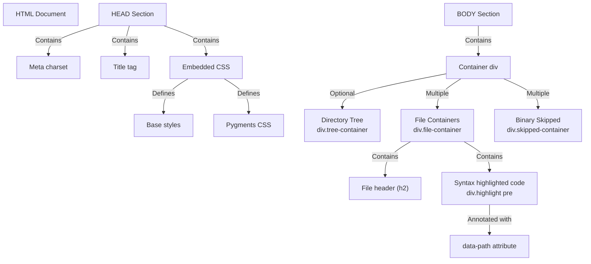

Loading...

![svg image](data:image/svg+xml;base64,PHN2ZyBjbGFzcz0ic2l6ZS0zIFsmYW1wO19wYXRoXTpzdHJva2UtMCBbJmFtcDtfcGF0aF06YW5pbWF0ZS1bY3VzdG9tLXB1bHNlXzEuOHNfaW5maW5pdGVfdmFyKC0tZGVsYXksMHMpXSIgdmlld2JveD0iMTEwIDExMCA0NjAgNTAwIiB4bWxucz0iaHR0cDovL3d3dy53My5vcmcvMjAwMC9zdmciPjxwYXRoIGNsYXNzPSJbLS1kZWxheTowLjZzXSIgZD0iTTQxOC43MywzMzIuMzdjOS44NC01LjY4LDIyLjA3LTUuNjgsMzEuOTEsMGwyNS40OSwxNC43MWMuODIuNDgsMS42OS44LDIuNTgsMS4wNi4xOS4wNi4zNy4xMS41NS4xNi44Ny4yMSwxLjc2LjM0LDIuNjUuMzUuMDQsMCwuMDguMDIuMTMuMDIuMSwwLC4xOS0uMDMuMjktLjA0LjgzLS4wMiwxLjY0LS4xMywyLjQ1LS4zMi4xNC0uMDMuMjgtLjA1LjQyLS4wOS44Ny0uMjQsMS43LS41OSwyLjUtMS4wMy4wOC0uMDQuMTctLjA2LjI1LS4xbDUwLjk3LTI5LjQzYzMuNjUtMi4xMSw1LjktNi4wMSw1LjktMTAuMjJ2LTU4Ljg2YzAtNC4yMi0yLjI1LTguMTEtNS45LTEwLjIybC01MC45Ny0yOS40M2MtMy42NS0yLjExLTguMTUtMi4xMS0xMS44MSwwbC01MC45NywyOS40M2MtLjA4LjA0LS4xMy4xMS0uMi4xNi0uNzguNDgtMS41MSwxLjAyLTIuMTUsMS42Ni0uMS4xLS4xOC4yMS0uMjguMzEtLjU3LjYtMS4wOCwxLjI2LTEuNTEsMS45Ny0uMDcuMTItLjE1LjIyLS4yMi4zNC0uNDQuNzctLjc3LDEuNi0xLjAzLDIuNDctLjA1LjE5LS4xLjM3LS4xNC41Ni0uMjIuODktLjM3LDEuODEtLjM3LDIuNzZ2MjkuNDNjMCwxMS4zNi02LjExLDIxLjk1LTE1Ljk1LDI3LjYzLTkuODQsNS42OC0yMi4wNiw1LjY4LTMxLjkxLDBsLTI1LjQ5LTE0LjcxYy0uODItLjQ4LTEuNjktLjgtMi41Ny0xLjA2LS4xOS0uMDYtLjM3LS4xMS0uNTYtLjE2LS44OC0uMjEtMS43Ni0uMzQtMi42NS0uMzQtLjEzLDAtLjI2LjAyLS40LjAyLS44NC4wMi0xLjY2LjEzLTIuNDcuMzItLjEzLjAzLS4yNy4wNS0uNC4wOS0uODcuMjQtMS43MS42LTIuNTEsMS4wNC0uMDguMDQtLjE2LjA2LS4yNC4xbC01MC45NywyOS40M2MtMy42NSwyLjExLTUuOSw2LjAxLTUuOSwxMC4yMnY1OC44NmMwLDQuMjIsMi4yNSw4LjExLDUuOSwxMC4yMmw1MC45NywyOS40M2MuMDguMDQuMTcuMDYuMjQuMS44LjQ0LDEuNjQuNzksMi41LDEuMDMuMTQuMDQuMjguMDYuNDIuMDkuODEuMTksMS42Mi4zLDIuNDUuMzIuMSwwLC4xOS4wNC4yOS4wNC4wNCwwLC4wOC0uMDIuMTMtLjAyLjg5LDAsMS43Ny0uMTMsMi42NS0uMzUuMTktLjA0LjM3LS4xLjU2LS4xNi44OC0uMjYsMS43NS0uNTksMi41OC0xLjA2bDI1LjQ5LTE0LjcxYzkuODQtNS42OCwyMi4wNi01LjY4LDMxLjkxLDAsOS44NCw1LjY4LDE1Ljk1LDE2LjI3LDE1Ljk1LDI3LjYzdjI5LjQzYzAsLjk1LjE1LDEuODcuMzcsMi43Ni4wNS4xOS4wOS4zNy4xNC41Ni4yNS44Ni41OSwxLjY5LDEuMDMsMi40Ny4wNy4xMi4xNS4yMi4yMi4zNC40My43MS45NCwxLjM3LDEuNTEsMS45Ny4xLjEuMTguMjEuMjguMzEuNjUuNjMsMS4zNywxLjE4LDIuMTUsMS42Ni4wNy4wNC4xMy4xMS4yLjE2bDUwLjk3LDI5LjQzYzEuODMsMS4wNSwzLjg2LDEuNTgsNS45LDEuNThzNC4wOC0uNTMsNS45LTEuNThsNTAuOTctMjkuNDNjMy42NS0yLjExLDUuOS02LjAxLDUuOS0xMC4yMnYtNTguODZjMC00LjIyLTIuMjUtOC4xMS01LjktMTAuMjJsLTUwLjk3LTI5LjQzYy0uMDgtLjA0LS4xNi0uMDYtLjI0LS4xLS44LS40NC0xLjY0LS44LTIuNTEtMS4wNC0uMTMtLjA0LS4yNi0uMDUtLjM5LS4wOS0uODItLjItMS42NS0uMzEtMi40OS0uMzMtLjEzLDAtLjI1LS4wMi0uMzgtLjAyLS44OSwwLTEuNzguMTMtMi42Ni4zNS0uMTguMDQtLjM2LjEtLjU0LjE1LS44OC4yNi0xLjc1LjU5LTIuNTgsMS4wN2wtMjUuNDksMTQuNzJjLTkuODQsNS42OC0yMi4wNyw1LjY4LTMxLjksMC05Ljg0LTUuNjgtMTUuOTUtMTYuMjctMTUuOTUtMjcuNjNzNi4xMS0yMS45NSwxNS45NS0yNy42M1oiIHN0eWxlPSJmaWxsOiMyMWMxOWEiPjwvcGF0aD48cGF0aCBkPSJNMTQxLjA5LDMxNy42NWw1MC45NywyOS40M2MxLjgzLDEuMDUsMy44NiwxLjU4LDUuOSwxLjU4czQuMDgtLjUzLDUuOS0xLjU4bDUwLjk3LTI5LjQzYy4wOC0uMDQuMTMtLjExLjItLjE2Ljc4LS40OCwxLjUxLTEuMDIsMi4xNS0xLjY2LjEtLjEuMTgtLjIxLjI4LS4zMS41Ny0uNiwxLjA4LTEuMjYsMS41MS0xLjk3LjA3LS4xMi4xNS0uMjIuMjItLjM0LjQ0LS43Ny43Ny0xLjYsMS4wMy0yLjQ3LjA1LS4xOS4xLS4zNy4xNC0uNTYuMjItLjg5LjM3LTEuODEuMzctMi43NnYtMjkuNDNjMC0xMS4zNiw2LjExLTIxLjk1LDE1Ljk2LTI3LjYzczIyLjA2LTUuNjgsMzEuOTEsMGwyNS40OSwxNC43MWMuODIuNDgsMS42OS44LDIuNTcsMS4wNi4xOS4wNi4zNy4xMS41Ni4xNi44Ny4yMSwxLjc2LjM0LDIuNjQuMzUuMDQsMCwuMDkuMDIuMTMuMDIuMSwwLC4xOS0uMDQuMjktLjA0LjgzLS4wMiwxLjY1LS4xMywyLjQ1LS4zMi4xNC0uMDMuMjgtLjA1LjQxLS4wOS44Ny0uMjQsMS43MS0uNiwyLjUxLTEuMDQuMDgtLjA0LjE2LS4wNi4yNC0uMWw1MC45Ny0yOS40M2MzLjY1LTIuMTEsNS45LTYuMDEsNS45LTEwLjIydi01OC44NmMwLTQuMjItMi4yNS04LjExLTUuOS0xMC4yMmwtNTAuOTctMjkuNDNjLTMuNjUtMi4xMS04LjE1LTIuMTEtMTEuODEsMGwtNTAuOTcsMjkuNDNjLS4wOC4wNC0uMTMuMTEtLjIuMTYtLjc4LjQ4LTEuNTEsMS4wMi0yLjE1LDEuNjYtLjEuMS0uMTguMjEtLjI4LjMxLS41Ny42LTEuMDgsMS4yNi0xLjUxLDEuOTctLjA3LjEyLS4xNS4yMi0uMjIuMzQtLjQ0Ljc3LS43NywxLjYtMS4wMywyLjQ3LS4wNS4xOS0uMS4zNy0uMTQuNTYtLjIyLjg5LS4zNywxLjgxLS4zNywyLjc2djI5LjQzYzAsMTEuMzYtNi4xMSwyMS45NS0xNS45NSwyNy42My05Ljg0LDUuNjgtMjIuMDcsNS42OC0zMS45MSwwbC0yNS40OS0xNC43MWMtLjgyLS40OC0xLjY5LS44LTIuNTgtMS4wNi0uMTktLjA2LS4zNy0uMTEtLjU1LS4xNi0uODgtLjIxLTEuNzYtLjM0LTIuNjUtLjM1LS4xMywwLS4yNi4wMi0uNC4wMi0uODMuMDItMS42Ni4xMy0yLjQ3LjMyLS4xMy4wMy0uMjcuMDUtLjQuMDktLjg3LjI0LTEuNzEuNi0yLjUxLDEuMDQtLjA4LjA0LS4xNi4wNi0uMjQuMWwtNTAuOTcsMjkuNDNjLTMuNjUsMi4xMS01LjksNi4wMS01LjksMTAuMjJ2NTguODZjMCw0LjIyLDIuMjUsOC4xMSw1LjksMTAuMjJaIiBzdHlsZT0iZmlsbDojMzk2OWNhIj48L3BhdGg+PHBhdGggY2xhc3M9IlstLWRlbGF5OjEuMnNdIiBkPSJNMzk2Ljg4LDQ4NC4zNWwtNTAuOTctMjkuNDNjLS4wOC0uMDQtLjE3LS4wNi0uMjQtLjEtLjgtLjQ0LTEuNjQtLjc5LTIuNTEtMS4wMy0uMTQtLjA0LS4yNy0uMDYtLjQxLS4wOS0uODEtLjE5LTEuNjQtLjMtMi40Ny0uMzItLjEzLDAtLjI2LS4wMi0uMzktLjAyLS44OSwwLTEuNzguMTMtMi42Ni4zNS0uMTguMDQtLjM2LjEtLjU0LjE1LS44OC4yNi0xLjc2LjU5LTIuNTgsMS4wN2wtMjUuNDksMTQuNzJjLTkuODQsNS42OC0yMi4wNiw1LjY4LTMxLjksMC05Ljg0LTUuNjgtMTUuOTYtMTYuMjctMTUuOTYtMjcuNjN2LTI5LjQzYzAtLjk1LS4xNS0xLjg3LS4zNy0yLjc2LS4wNS0uMTktLjA5LS4zNy0uMTQtLjU2LS4yNS0uODYtLjU5LTEuNjktMS4wMy0yLjQ3LS4wNy0uMTItLjE1LS4yMi0uMjItLjM0LS40My0uNzEtLjk0LTEuMzctMS41MS0xLjk3LS4xLS4xLS4xOC0uMjEtLjI4LS4zMS0uNjUtLjYzLTEuMzctMS4xOC0yLjE1LTEuNjYtLjA3LS4wNC0uMTMtLjExLS4yLS4xNmwtNTAuOTctMjkuNDNjLTMuNjUtMi4xMS04LjE1LTIuMTEtMTEuODEsMGwtNTAuOTcsMjkuNDNjLTMuNjUsMi4xMS01LjksNi4wMS01LjksMTAuMjJ2NTguODZjMCw0LjIyLDIuMjUsOC4xMSw1LjksMTAuMjJsNTAuOTcsMjkuNDNjLjA4LjA0LjE3LjA2LjI1LjEuOC40NCwxLjYzLjc5LDIuNSwxLjAzLjE0LjA0LjI5LjA2LjQzLjA5LjguMTksMS42MS4zLDIuNDMuMzIuMSwwLC4yLjA0LjMuMDQuMDQsMCwuMDktLjAyLjEzLS4wMi44OCwwLDEuNzctLjEzLDIuNjQtLjM0LjE5LS4wNC4zNy0uMS41Ni0uMTYuODgtLjI2LDEuNzUtLjU5LDIuNTctMS4wNmwyNS40OS0xNC43MWM5Ljg0LTUuNjgsMjIuMDYtNS42OCwzMS45MSwwLDkuODQsNS42OCwxNS45NSwxNi4yNywxNS45NSwyNy42M3YyOS40M2MwLC45NS4xNSwxLjg3LjM3LDIuNzYuMDUuMTkuMDkuMzcuMTQuNTYuMjUuODYuNTksMS42OSwxLjAzLDIuNDcuMDcuMTIuMTUuMjIuMjIuMzQuNDMuNzEuOTQsMS4zNywxLjUxLDEuOTcuMS4xLjE4LjIxLjI4LjMxLjY1LjYzLDEuMzcsMS4xOCwyLjE1LDEuNjYuMDcuMDQuMTMuMTEuMi4xNmw1MC45NywyOS40M2MxLjgzLDEuMDUsMy44NiwxLjU4LDUuOSwxLjU4czQuMDgtLjUzLDUuOS0xLjU4bDUwLjk3LTI5LjQzYzMuNjUtMi4xMSw1LjktNi4wMSw1LjktMTAuMjJ2LTU4Ljg2YzAtNC4yMi0yLjI1LTguMTEtNS45LTEwLjIyWiIgc3R5bGU9ImZpbGw6IzAyOTRkZSI+PC9wYXRoPjwvc3ZnPg==)Index your code with Devin

[DeepWiki](/)

[DeepWiki](/)

[ray0404/Contexter ](https://github.com/ray0404/Contexter "Open repository")

Index your code with

![svg image](data:image/svg+xml;base64,PHN2ZyBjbGFzcz0ic2l6ZS00IHRyYW5zZm9ybSB0cmFuc2l0aW9uLXRyYW5zZm9ybSBkdXJhdGlvbi03MDAgZ3JvdXAtaG92ZXI6cm90YXRlLTE4MCBbJmFtcDtfcGF0aF06c3Ryb2tlLTAiIHZpZXdib3g9IjExMCAxMTAgNDYwIDUwMCIgeG1sbnM9Imh0dHA6Ly93d3cudzMub3JnLzIwMDAvc3ZnIj48cGF0aCBjbGFzcz0iIiBkPSJNNDE4LjczLDMzMi4zN2M5Ljg0LTUuNjgsMjIuMDctNS42OCwzMS45MSwwbDI1LjQ5LDE0LjcxYy44Mi40OCwxLjY5LjgsMi41OCwxLjA2LjE5LjA2LjM3LjExLjU1LjE2Ljg3LjIxLDEuNzYuMzQsMi42NS4zNS4wNCwwLC4wOC4wMi4xMy4wMi4xLDAsLjE5LS4wMy4yOS0uMDQuODMtLjAyLDEuNjQtLjEzLDIuNDUtLjMyLjE0LS4wMy4yOC0uMDUuNDItLjA5Ljg3LS4yNCwxLjctLjU5LDIuNS0xLjAzLjA4LS4wNC4xNy0uMDYuMjUtLjFsNTAuOTctMjkuNDNjMy42NS0yLjExLDUuOS02LjAxLDUuOS0xMC4yMnYtNTguODZjMC00LjIyLTIuMjUtOC4xMS01LjktMTAuMjJsLTUwLjk3LTI5LjQzYy0zLjY1LTIuMTEtOC4xNS0yLjExLTExLjgxLDBsLTUwLjk3LDI5LjQzYy0uMDguMDQtLjEzLjExLS4yLjE2LS43OC40OC0xLjUxLDEuMDItMi4xNSwxLjY2LS4xLjEtLjE4LjIxLS4yOC4zMS0uNTcuNi0xLjA4LDEuMjYtMS41MSwxLjk3LS4wNy4xMi0uMTUuMjItLjIyLjM0LS40NC43Ny0uNzcsMS42LTEuMDMsMi40Ny0uMDUuMTktLjEuMzctLjE0LjU2LS4yMi44OS0uMzcsMS44MS0uMzcsMi43NnYyOS40M2MwLDExLjM2LTYuMTEsMjEuOTUtMTUuOTUsMjcuNjMtOS44NCw1LjY4LTIyLjA2LDUuNjgtMzEuOTEsMGwtMjUuNDktMTQuNzFjLS44Mi0uNDgtMS42OS0uOC0yLjU3LTEuMDYtLjE5LS4wNi0uMzctLjExLS41Ni0uMTYtLjg4LS4yMS0xLjc2LS4zNC0yLjY1LS4zNC0uMTMsMC0uMjYuMDItLjQuMDItLjg0LjAyLTEuNjYuMTMtMi40Ny4zMi0uMTMuMDMtLjI3LjA1LS40LjA5LS44Ny4yNC0xLjcxLjYtMi41MSwxLjA0LS4wOC4wNC0uMTYuMDYtLjI0LjFsLTUwLjk3LDI5LjQzYy0zLjY1LDIuMTEtNS45LDYuMDEtNS45LDEwLjIydjU4Ljg2YzAsNC4yMiwyLjI1LDguMTEsNS45LDEwLjIybDUwLjk3LDI5LjQzYy4wOC4wNC4xNy4wNi4yNC4xLjguNDQsMS42NC43OSwyLjUsMS4wMy4xNC4wNC4yOC4wNi40Mi4wOS44MS4xOSwxLjYyLjMsMi40NS4zMi4xLDAsLjE5LjA0LjI5LjA0LjA0LDAsLjA4LS4wMi4xMy0uMDIuODksMCwxLjc3LS4xMywyLjY1LS4zNS4xOS0uMDQuMzctLjEuNTYtLjE2Ljg4LS4yNiwxLjc1LS41OSwyLjU4LTEuMDZsMjUuNDktMTQuNzFjOS44NC01LjY4LDIyLjA2LTUuNjgsMzEuOTEsMCw5Ljg0LDUuNjgsMTUuOTUsMTYuMjcsMTUuOTUsMjcuNjN2MjkuNDNjMCwuOTUuMTUsMS44Ny4zNywyLjc2LjA1LjE5LjA5LjM3LjE0LjU2LjI1Ljg2LjU5LDEuNjksMS4wMywyLjQ3LjA3LjEyLjE1LjIyLjIyLjM0LjQzLjcxLjk0LDEuMzcsMS41MSwxLjk3LjEuMS4xOC4yMS4yOC4zMS42NS42MywxLjM3LDEuMTgsMi4xNSwxLjY2LjA3LjA0LjEzLjExLjIuMTZsNTAuOTcsMjkuNDNjMS44MywxLjA1LDMuODYsMS41OCw1LjksMS41OHM0LjA4LS41Myw1LjktMS41OGw1MC45Ny0yOS40M2MzLjY1LTIuMTEsNS45LTYuMDEsNS45LTEwLjIydi01OC44NmMwLTQuMjItMi4yNS04LjExLTUuOS0xMC4yMmwtNTAuOTctMjkuNDNjLS4wOC0uMDQtLjE2LS4wNi0uMjQtLjEtLjgtLjQ0LTEuNjQtLjgtMi41MS0xLjA0LS4xMy0uMDQtLjI2LS4wNS0uMzktLjA5LS44Mi0uMi0xLjY1LS4zMS0yLjQ5LS4zMy0uMTMsMC0uMjUtLjAyLS4zOC0uMDItLjg5LDAtMS43OC4xMy0yLjY2LjM1LS4xOC4wNC0uMzYuMS0uNTQuMTUtLjg4LjI2LTEuNzUuNTktMi41OCwxLjA3bC0yNS40OSwxNC43MmMtOS44NCw1LjY4LTIyLjA3LDUuNjgtMzEuOSwwLTkuODQtNS42OC0xNS45NS0xNi4yNy0xNS45NS0yNy42M3M2LjExLTIxLjk1LDE1Ljk1LTI3LjYzWiIgc3R5bGU9ImZpbGw6IzIxYzE5YSI+PC9wYXRoPjxwYXRoIGQ9Ik0xNDEuMDksMzE3LjY1bDUwLjk3LDI5LjQzYzEuODMsMS4wNSwzLjg2LDEuNTgsNS45LDEuNThzNC4wOC0uNTMsNS45LTEuNThsNTAuOTctMjkuNDNjLjA4LS4wNC4xMy0uMTEuMi0uMTYuNzgtLjQ4LDEuNTEtMS4wMiwyLjE1LTEuNjYuMS0uMS4xOC0uMjEuMjgtLjMxLjU3LS42LDEuMDgtMS4yNiwxLjUxLTEuOTcuMDctLjEyLjE1LS4yMi4yMi0uMzQuNDQtLjc3Ljc3LTEuNiwxLjAzLTIuNDcuMDUtLjE5LjEtLjM3LjE0LS41Ni4yMi0uODkuMzctMS44MS4zNy0yLjc2di0yOS40M2MwLTExLjM2LDYuMTEtMjEuOTUsMTUuOTYtMjcuNjNzMjIuMDYtNS42OCwzMS45MSwwbDI1LjQ5LDE0LjcxYy44Mi40OCwxLjY5LjgsMi41NywxLjA2LjE5LjA2LjM3LjExLjU2LjE2Ljg3LjIxLDEuNzYuMzQsMi42NC4zNS4wNCwwLC4wOS4wMi4xMy4wMi4xLDAsLjE5LS4wNC4yOS0uMDQuODMtLjAyLDEuNjUtLjEzLDIuNDUtLjMyLjE0LS4wMy4yOC0uMDUuNDEtLjA5Ljg3LS4yNCwxLjcxLS42LDIuNTEtMS4wNC4wOC0uMDQuMTYtLjA2LjI0LS4xbDUwLjk3LTI5LjQzYzMuNjUtMi4xMSw1LjktNi4wMSw1LjktMTAuMjJ2LTU4Ljg2YzAtNC4yMi0yLjI1LTguMTEtNS45LTEwLjIybC01MC45Ny0yOS40M2MtMy42NS0yLjExLTguMTUtMi4xMS0xMS44MSwwbC01MC45NywyOS40M2MtLjA4LjA0LS4xMy4xMS0uMi4xNi0uNzguNDgtMS41MSwxLjAyLTIuMTUsMS42Ni0uMS4xLS4xOC4yMS0uMjguMzEtLjU3LjYtMS4wOCwxLjI2LTEuNTEsMS45Ny0uMDcuMTItLjE1LjIyLS4yMi4zNC0uNDQuNzctLjc3LDEuNi0xLjAzLDIuNDctLjA1LjE5LS4xLjM3LS4xNC41Ni0uMjIuODktLjM3LDEuODEtLjM3LDIuNzZ2MjkuNDNjMCwxMS4zNi02LjExLDIxLjk1LTE1Ljk1LDI3LjYzLTkuODQsNS42OC0yMi4wNyw1LjY4LTMxLjkxLDBsLTI1LjQ5LTE0LjcxYy0uODItLjQ4LTEuNjktLjgtMi41OC0xLjA2LS4xOS0uMDYtLjM3LS4xMS0uNTUtLjE2LS44OC0uMjEtMS43Ni0uMzQtMi42NS0uMzUtLjEzLDAtLjI2LjAyLS40LjAyLS44My4wMi0xLjY2LjEzLTIuNDcuMzItLjEzLjAzLS4yNy4wNS0uNC4wOS0uODcuMjQtMS43MS42LTIuNTEsMS4wNC0uMDguMDQtLjE2LjA2LS4yNC4xbC01MC45NywyOS40M2MtMy42NSwyLjExLTUuOSw2LjAxLTUuOSwxMC4yMnY1OC44NmMwLDQuMjIsMi4yNSw4LjExLDUuOSwxMC4yMloiIHN0eWxlPSJmaWxsOiMzOTY5Y2EiPjwvcGF0aD48cGF0aCBjbGFzcz0iIiBkPSJNMzk2Ljg4LDQ4NC4zNWwtNTAuOTctMjkuNDNjLS4wOC0uMDQtLjE3LS4wNi0uMjQtLjEtLjgtLjQ0LTEuNjQtLjc5LTIuNTEtMS4wMy0uMTQtLjA0LS4yNy0uMDYtLjQxLS4wOS0uODEtLjE5LTEuNjQtLjMtMi40Ny0uMzItLjEzLDAtLjI2LS4wMi0uMzktLjAyLS44OSwwLTEuNzguMTMtMi42Ni4zNS0uMTguMDQtLjM2LjEtLjU0LjE1LS44OC4yNi0xLjc2LjU5LTIuNTgsMS4wN2wtMjUuNDksMTQuNzJjLTkuODQsNS42OC0yMi4wNiw1LjY4LTMxLjksMC05Ljg0LTUuNjgtMTUuOTYtMTYuMjctMTUuOTYtMjcuNjN2LTI5LjQzYzAtLjk1LS4xNS0xLjg3LS4zNy0yLjc2LS4wNS0uMTktLjA5LS4zNy0uMTQtLjU2LS4yNS0uODYtLjU5LTEuNjktMS4wMy0yLjQ3LS4wNy0uMTItLjE1LS4yMi0uMjItLjM0LS40My0uNzEtLjk0LTEuMzctMS41MS0xLjk3LS4xLS4xLS4xOC0uMjEtLjI4LS4zMS0uNjUtLjYzLTEuMzctMS4xOC0yLjE1LTEuNjYtLjA3LS4wNC0uMTMtLjExLS4yLS4xNmwtNTAuOTctMjkuNDNjLTMuNjUtMi4xMS04LjE1LTIuMTEtMTEuODEsMGwtNTAuOTcsMjkuNDNjLTMuNjUsMi4xMS01LjksNi4wMS01LjksMTAuMjJ2NTguODZjMCw0LjIyLDIuMjUsOC4xMSw1LjksMTAuMjJsNTAuOTcsMjkuNDNjLjA4LjA0LjE3LjA2LjI1LjEuOC40NCwxLjYzLjc5LDIuNSwxLjAzLjE0LjA0LjI5LjA2LjQzLjA5LjguMTksMS42MS4zLDIuNDMuMzIuMSwwLC4yLjA0LjMuMDQuMDQsMCwuMDktLjAyLjEzLS4wMi44OCwwLDEuNzctLjEzLDIuNjQtLjM0LjE5LS4wNC4zNy0uMS41Ni0uMTYuODgtLjI2LDEuNzUtLjU5LDIuNTctMS4wNmwyNS40OS0xNC43MWM5Ljg0LTUuNjgsMjIuMDYtNS42OCwzMS45MSwwLDkuODQsNS42OCwxNS45NSwxNi4yNywxNS45NSwyNy42M3YyOS40M2MwLC45NS4xNSwxLjg3LjM3LDIuNzYuMDUuMTkuMDkuMzcuMTQuNTYuMjUuODYuNTksMS42OSwxLjAzLDIuNDcuMDcuMTIuMTUuMjIuMjIuMzQuNDMuNzEuOTQsMS4zNywxLjUxLDEuOTcuMS4xLjE4LjIxLjI4LjMxLjY1LjYzLDEuMzcsMS4xOCwyLjE1LDEuNjYuMDcuMDQuMTMuMTEuMi4xNmw1MC45NywyOS40M2MxLjgzLDEuMDUsMy44NiwxLjU4LDUuOSwxLjU4czQuMDgtLjUzLDUuOS0xLjU4bDUwLjk3LTI5LjQzYzMuNjUtMi4xMSw1LjktNi4wMSw1LjktMTAuMjJ2LTU4Ljg2YzAtNC4yMi0yLjI1LTguMTEtNS45LTEwLjIyWiIgc3R5bGU9ImZpbGw6IzAyOTRkZSI+PC9wYXRoPjwvc3ZnPg==)Devin

Edit WikiShare

Loading...

Last indexed: 2 November 2025 ([79ebf7](https://github.com/ray0404/Contexter/commits/79ebf745))

- [Overview](/ray0404/Contexter/1-overview)
- [Getting Started](/ray0404/Contexter/2-getting-started)
- [Installation](/ray0404/Contexter/2.1-installation)
- [Quick Start Guide](/ray0404/Contexter/2.2-quick-start-guide)
- [Command Overview](/ray0404/Contexter/2.3-command-overview)
- [Core Concepts](/ray0404/Contexter/3-core-concepts)
- [Context Files](/ray0404/Contexter/3.1-context-files)
- [Packaging and Reconstruction](/ray0404/Contexter/3.2-packaging-and-reconstruction)
- [Update Management](/ray0404/Contexter/3.3-update-management)
- [Exclusion Patterns](/ray0404/Contexter/3.4-exclusion-patterns)
- [Workflows](/ray0404/Contexter/4-workflows)
- [Basic Packaging Workflow](/ray0404/Contexter/4.1-basic-packaging-workflow)
- [AI Integration Workflow](/ray0404/Contexter/4.2-ai-integration-workflow)
- [Version Control with Patches](/ray0404/Contexter/4.3-version-control-with-patches)
- [Format Conversion Workflow](/ray0404/Contexter/4.4-format-conversion-workflow)
- [Command Reference](/ray0404/Contexter/5-command-reference)
- [Building Commands](/ray0404/Contexter/5.1-building-commands)
- [buildcontext](/ray0404/Contexter/5.1.1-buildcontext)
- [buildcontexthtml](/ray0404/Contexter/5.1.2-buildcontexthtml)
- [Reconstruction Commands](/ray0404/Contexter/5.2-reconstruction-commands)
- [reconstructor](/ray0404/Contexter/5.2.1-reconstructor)
- [reconstructorhtml](/ray0404/Contexter/5.2.2-reconstructorhtml)
- [Update Commands](/ray0404/Contexter/5.3-update-commands)
- [updatecontext](/ray0404/Contexter/5.3.1-updatecontext)
- [updater](/ray0404/Contexter/5.3.2-updater)
- [smartupdate](/ray0404/Contexter/5.3.3-smartupdate)
- [updatecontexthtml](/ray0404/Contexter/5.3.4-updatecontexthtml)
- [updaterhtml](/ray0404/Contexter/5.3.5-updaterhtml)
- [Utility Commands](/ray0404/Contexter/5.4-utility-commands)
- [sanitizecontext](/ray0404/Contexter/5.4.1-sanitizecontext)
- [md2html](/ray0404/Contexter/5.4.2-md2html)
- [html2md](/ray0404/Contexter/5.4.3-html2md)
- [Architecture](/ray0404/Contexter/6-architecture)
- [System Architecture](/ray0404/Contexter/6.1-system-architecture)
- [Module Organization](/ray0404/Contexter/6.2-module-organization)
- [Utility Layer (contexter\_utils)](/ray0404/Contexter/6.3-utility-layer-(contexter_utils))
- [Dependencies](/ray0404/Contexter/6.4-dependencies)
- [Technical Details](/ray0404/Contexter/7-technical-details)
- [Markdown Context Format](/ray0404/Contexter/7.1-markdown-context-format)
- [HTML Context Format](/ray0404/Contexter/7.2-html-context-format)
- [Patch File Format](/ray0404/Contexter/7.3-patch-file-format)
- [Binary File Handling](/ray0404/Contexter/7.4-binary-file-handling)

Menu

# md2htmlsvg image

Relevant source files

- [![svg image](data:image/svg+xml;base64,PHN2ZyBjbGFzcz0ibXItMS41IGhpZGRlbiBoLTMuNSB3LTMuNSBmbGV4LXNocmluay0wIG9wYWNpdHktNDAgbWQ6YmxvY2siIGZpbGw9ImN1cnJlbnRDb2xvciIgdmlld2JveD0iMCAwIDI0IDI0Ij48cGF0aCBkPSJNMTIgMGMtNi42MjYgMC0xMiA1LjM3My0xMiAxMiAwIDUuMzAyIDMuNDM4IDkuOCA4LjIwNyAxMS4zODcuNTk5LjExMS43OTMtLjI2MS43OTMtLjU3N3YtMi4yMzRjLTMuMzM4LjcyNi00LjAzMy0xLjQxNi00LjAzMy0xLjQxNi0uNTQ2LTEuMzg3LTEuMzMzLTEuNzU2LTEuMzMzLTEuNzU2LTEuMDg5LS43NDUuMDgzLS43MjkuMDgzLS43MjkgMS4yMDUuMDg0IDEuODM5IDEuMjM3IDEuODM5IDEuMjM3IDEuMDcgMS44MzQgMi44MDcgMS4zMDQgMy40OTIuOTk3LjEwNy0uNzc1LjQxOC0xLjMwNS43NjItMS42MDQtMi42NjUtLjMwNS01LjQ2Ny0xLjMzNC01LjQ2Ny01LjkzMSAwLTEuMzExLjQ2OS0yLjM4MSAxLjIzNi0zLjIyMS0uMTI0LS4zMDMtLjUzNS0xLjUyNC4xMTctMy4xNzYgMCAwIDEuMDA4LS4zMjIgMy4zMDEgMS4yMy45NTctLjI2NiAxLjk4My0uMzk5IDMuMDAzLS40MDQgMS4wMi4wMDUgMi4wNDcuMTM4IDMuMDA2LjQwNCAyLjI5MS0xLjU1MiAzLjI5Ny0xLjIzIDMuMjk3LTEuMjMuNjUzIDEuNjUzLjI0MiAyLjg3NC4xMTggMy4xNzYuNzcuODQgMS4yMzUgMS45MTEgMS4yMzUgMy4yMjEgMCA0LjYwOS0yLjgwNyA1LjYyNC01LjQ3OSA1LjkyMS40My4zNzIuODIzIDEuMTAyLjgyMyAyLjIyMnYzLjI5M2MwIC4zMTkuMTkyLjY5NC44MDEuNTc2IDQuNzY1LTEuNTg5IDguMTk5LTYuMDg2IDguMTk5LTExLjM4NiAwLTYuNjI3LTUuMzczLTEyLTEyLTEyeiI+PC9wYXRoPjwvc3ZnPg==)README.md](https://github.com/ray0404/Contexter/blob/79ebf745/README.md)
- [![svg image](data:image/svg+xml;base64,PHN2ZyBjbGFzcz0ibXItMS41IGhpZGRlbiBoLTMuNSB3LTMuNSBmbGV4LXNocmluay0wIG9wYWNpdHktNDAgbWQ6YmxvY2siIGZpbGw9ImN1cnJlbnRDb2xvciIgdmlld2JveD0iMCAwIDI0IDI0Ij48cGF0aCBkPSJNMTIgMGMtNi42MjYgMC0xMiA1LjM3My0xMiAxMiAwIDUuMzAyIDMuNDM4IDkuOCA4LjIwNyAxMS4zODcuNTk5LjExMS43OTMtLjI2MS43OTMtLjU3N3YtMi4yMzRjLTMuMzM4LjcyNi00LjAzMy0xLjQxNi00LjAzMy0xLjQxNi0uNTQ2LTEuMzg3LTEuMzMzLTEuNzU2LTEuMzMzLTEuNzU2LTEuMDg5LS43NDUuMDgzLS43MjkuMDgzLS43MjkgMS4yMDUuMDg0IDEuODM5IDEuMjM3IDEuODM5IDEuMjM3IDEuMDcgMS44MzQgMi44MDcgMS4zMDQgMy40OTIuOTk3LjEwNy0uNzc1LjQxOC0xLjMwNS43NjItMS42MDQtMi42NjUtLjMwNS01LjQ2Ny0xLjMzNC01LjQ2Ny01LjkzMSAwLTEuMzExLjQ2OS0yLjM4MSAxLjIzNi0zLjIyMS0uMTI0LS4zMDMtLjUzNS0xLjUyNC4xMTctMy4xNzYgMCAwIDEuMDA4LS4zMjIgMy4zMDEgMS4yMy45NTctLjI2NiAxLjk4My0uMzk5IDMuMDAzLS40MDQgMS4wMi4wMDUgMi4wNDcuMTM4IDMuMDA2LjQwNCAyLjI5MS0xLjU1MiAzLjI5Ny0xLjIzIDMuMjk3LTEuMjMuNjUzIDEuNjUzLjI0MiAyLjg3NC4xMTggMy4xNzYuNzcuODQgMS4yMzUgMS45MTEgMS4yMzUgMy4yMjEgMCA0LjYwOS0yLjgwNyA1LjYyNC01LjQ3OSA1LjkyMS40My4zNzIuODIzIDEuMTAyLjgyMyAyLjIyMnYzLjI5M2MwIC4zMTkuMTkyLjY5NC44MDEuNTc2IDQuNzY1LTEuNTg5IDguMTk5LTYuMDg2IDguMTk5LTExLjM4NiAwLTYuNjI3LTUuMzczLTEyLTEyLTEyeiI+PC9wYXRoPjwvc3ZnPg==)contexter\_utils.py](https://github.com/ray0404/Contexter/blob/79ebf745/contexter_utils.py)
- [![svg image](data:image/svg+xml;base64,PHN2ZyBjbGFzcz0ibXItMS41IGhpZGRlbiBoLTMuNSB3LTMuNSBmbGV4LXNocmluay0wIG9wYWNpdHktNDAgbWQ6YmxvY2siIGZpbGw9ImN1cnJlbnRDb2xvciIgdmlld2JveD0iMCAwIDI0IDI0Ij48cGF0aCBkPSJNMTIgMGMtNi42MjYgMC0xMiA1LjM3My0xMiAxMiAwIDUuMzAyIDMuNDM4IDkuOCA4LjIwNyAxMS4zODcuNTk5LjExMS43OTMtLjI2MS43OTMtLjU3N3YtMi4yMzRjLTMuMzM4LjcyNi00LjAzMy0xLjQxNi00LjAzMy0xLjQxNi0uNTQ2LTEuMzg3LTEuMzMzLTEuNzU2LTEuMzMzLTEuNzU2LTEuMDg5LS43NDUuMDgzLS43MjkuMDgzLS43MjkgMS4yMDUuMDg0IDEuODM5IDEuMjM3IDEuODM5IDEuMjM3IDEuMDcgMS44MzQgMi44MDcgMS4zMDQgMy40OTIuOTk3LjEwNy0uNzc1LjQxOC0xLjMwNS43NjItMS42MDQtMi42NjUtLjMwNS01LjQ2Ny0xLjMzNC01LjQ2Ny01LjkzMSAwLTEuMzExLjQ2OS0yLjM4MSAxLjIzNi0zLjIyMS0uMTI0LS4zMDMtLjUzNS0xLjUyNC4xMTctMy4xNzYgMCAwIDEuMDA4LS4zMjIgMy4zMDEgMS4yMy45NTctLjI2NiAxLjk4My0uMzk5IDMuMDAzLS40MDQgMS4wMi4wMDUgMi4wNDcuMTM4IDMuMDA2LjQwNCAyLjI5MS0xLjU1MiAzLjI5Ny0xLjIzIDMuMjk3LTEuMjMuNjUzIDEuNjUzLjI0MiAyLjg3NC4xMTggMy4xNzYuNzcuODQgMS4yMzUgMS45MTEgMS4yMzUgMy4yMjEgMCA0LjYwOS0yLjgwNyA1LjYyNC01LjQ3OSA1LjkyMS40My4zNzIuODIzIDEuMTAyLjgyMyAyLjIyMnYzLjI5M2MwIC4zMTkuMTkyLjY5NC44MDEuNTc2IDQuNzY1LTEuNTg5IDguMTk5LTYuMDg2IDguMTk5LTExLjM4NiAwLTYuNjI3LTUuMzczLTEyLTEyLTEyeiI+PC9wYXRoPjwvc3ZnPg==)pyproject.toml](https://github.com/ray0404/Contexter/blob/79ebf745/pyproject.toml)
- [![svg image](data:image/svg+xml;base64,PHN2ZyBjbGFzcz0ibXItMS41IGhpZGRlbiBoLTMuNSB3LTMuNSBmbGV4LXNocmluay0wIG9wYWNpdHktNDAgbWQ6YmxvY2siIGZpbGw9ImN1cnJlbnRDb2xvciIgdmlld2JveD0iMCAwIDI0IDI0Ij48cGF0aCBkPSJNMTIgMGMtNi42MjYgMC0xMiA1LjM3My0xMiAxMiAwIDUuMzAyIDMuNDM4IDkuOCA4LjIwNyAxMS4zODcuNTk5LjExMS43OTMtLjI2MS43OTMtLjU3N3YtMi4yMzRjLTMuMzM4LjcyNi00LjAzMy0xLjQxNi00LjAzMy0xLjQxNi0uNTQ2LTEuMzg3LTEuMzMzLTEuNzU2LTEuMzMzLTEuNzU2LTEuMDg5LS43NDUuMDgzLS43MjkuMDgzLS43MjkgMS4yMDUuMDg0IDEuODM5IDEuMjM3IDEuODM5IDEuMjM3IDEuMDcgMS44MzQgMi44MDcgMS4zMDQgMy40OTIuOTk3LjEwNy0uNzc1LjQxOC0xLjMwNS43NjItMS42MDQtMi42NjUtLjMwNS01LjQ2Ny0xLjMzNC01LjQ2Ny01LjkzMSAwLTEuMzExLjQ2OS0yLjM4MSAxLjIzNi0zLjIyMS0uMTI0LS4zMDMtLjUzNS0xLjUyNC4xMTctMy4xNzYgMCAwIDEuMDA4LS4zMjIgMy4zMDEgMS4yMy45NTctLjI2NiAxLjk4My0uMzk5IDMuMDAzLS40MDQgMS4wMi4wMDUgMi4wNDcuMTM4IDMuMDA2LjQwNCAyLjI5MS0xLjU1MiAzLjI5Ny0xLjIzIDMuMjk3LTEuMjMuNjUzIDEuNjUzLjI0MiAyLjg3NC4xMTggMy4xNzYuNzcuODQgMS4yMzUgMS45MTEgMS4yMzUgMy4yMjEgMCA0LjYwOS0yLjgwNyA1LjYyNC01LjQ3OSA1LjkyMS40My4zNzIuODIzIDEuMTAyLjgyMyAyLjIyMnYzLjI5M2MwIC4zMTkuMTkyLjY5NC44MDEuNTc2IDQuNzY1LTEuNTg5IDguMTk5LTYuMDg2IDguMTk5LTExLjM4NiAwLTYuNjI3LTUuMzczLTEyLTEyLTEyeiI+PC9wYXRoPjwvc3ZnPg==)setup.py](https://github.com/ray0404/Contexter/blob/79ebf745/setup.py)

## Purpose and Scopesvg image

The `md2html` command is a format conversion utility that transforms Markdown files into HTML format. While primarily designed for converting Markdown context files (created by `buildcontext`) into HTML context files, it functions as a general-purpose Markdown-to-HTML converter that can process any Markdown file.

For converting in the opposite direction (HTML to Markdown), see [html2md](/ray0404/Contexter/5.4.3-html2md). For information about building context files in Markdown or HTML format, see [buildcontext](/ray0404/Contexter/5.1.1-buildcontext) and [buildcontexthtml](/ray0404/Contexter/5.1.2-buildcontexthtml).

**Sources:** [![svg image](data:image/svg+xml;base64,PHN2ZyBjbGFzcz0ibXItMS41IGhpZGRlbiBoLTMuNSB3LTMuNSBmbGV4LXNocmluay0wIG9wYWNpdHktNDAgbWQ6YmxvY2siIGZpbGw9ImN1cnJlbnRDb2xvciIgdmlld2JveD0iMCAwIDI0IDI0Ij48cGF0aCBkPSJNMTIgMGMtNi42MjYgMC0xMiA1LjM3My0xMiAxMiAwIDUuMzAyIDMuNDM4IDkuOCA4LjIwNyAxMS4zODcuNTk5LjExMS43OTMtLjI2MS43OTMtLjU3N3YtMi4yMzRjLTMuMzM4LjcyNi00LjAzMy0xLjQxNi00LjAzMy0xLjQxNi0uNTQ2LTEuMzg3LTEuMzMzLTEuNzU2LTEuMzMzLTEuNzU2LTEuMDg5LS43NDUuMDgzLS43MjkuMDgzLS43MjkgMS4yMDUuMDg0IDEuODM5IDEuMjM3IDEuODM5IDEuMjM3IDEuMDcgMS44MzQgMi44MDcgMS4zMDQgMy40OTIuOTk3LjEwNy0uNzc1LjQxOC0xLjMwNS43NjItMS42MDQtMi42NjUtLjMwNS01LjQ2Ny0xLjMzNC01LjQ2Ny01LjkzMSAwLTEuMzExLjQ2OS0yLjM4MSAxLjIzNi0zLjIyMS0uMTI0LS4zMDMtLjUzNS0xLjUyNC4xMTctMy4xNzYgMCAwIDEuMDA4LS4zMjIgMy4zMDEgMS4yMy45NTctLjI2NiAxLjk4My0uMzk5IDMuMDAzLS40MDQgMS4wMi4wMDUgMi4wNDcuMTM4IDMuMDA2LjQwNCAyLjI5MS0xLjU1MiAzLjI5Ny0xLjIzIDMuMjk3LTEuMjMuNjUzIDEuNjUzLjI0MiAyLjg3NC4xMTggMy4xNzYuNzcuODQgMS4yMzUgMS45MTEgMS4yMzUgMy4yMjEgMCA0LjYwOS0yLjgwNyA1LjYyNC01LjQ3OSA1LjkyMS40My4zNzIuODIzIDEuMTAyLjgyMyAyLjIyMnYzLjI5M2MwIC4zMTkuMTkyLjY5NC44MDEuNTc2IDQuNzY1LTEuNTg5IDguMTk5LTYuMDg2IDguMTk5LTExLjM4NiAwLTYuNjI3LTUuMzczLTEyLTEyLTEyeiI+PC9wYXRoPjwvc3ZnPg==)README.md34](https://github.com/ray0404/Contexter/blob/79ebf745/README.md#L34-L34) [![svg image](data:image/svg+xml;base64,PHN2ZyBjbGFzcz0ibXItMS41IGhpZGRlbiBoLTMuNSB3LTMuNSBmbGV4LXNocmluay0wIG9wYWNpdHktNDAgbWQ6YmxvY2siIGZpbGw9ImN1cnJlbnRDb2xvciIgdmlld2JveD0iMCAwIDI0IDI0Ij48cGF0aCBkPSJNMTIgMGMtNi42MjYgMC0xMiA1LjM3My0xMiAxMiAwIDUuMzAyIDMuNDM4IDkuOCA4LjIwNyAxMS4zODcuNTk5LjExMS43OTMtLjI2MS43OTMtLjU3N3YtMi4yMzRjLTMuMzM4LjcyNi00LjAzMy0xLjQxNi00LjAzMy0xLjQxNi0uNTQ2LTEuMzg3LTEuMzMzLTEuNzU2LTEuMzMzLTEuNzU2LTEuMDg5LS43NDUuMDgzLS43MjkuMDgzLS43MjkgMS4yMDUuMDg0IDEuODM5IDEuMjM3IDEuODM5IDEuMjM3IDEuMDcgMS44MzQgMi44MDcgMS4zMDQgMy40OTIuOTk3LjEwNy0uNzc1LjQxOC0xLjMwNS43NjItMS42MDQtMi42NjUtLjMwNS01LjQ2Ny0xLjMzNC01LjQ2Ny01LjkzMSAwLTEuMzExLjQ2OS0yLjM4MSAxLjIzNi0zLjIyMS0uMTI0LS4zMDMtLjUzNS0xLjUyNC4xMTctMy4xNzYgMCAwIDEuMDA4LS4zMjIgMy4zMDEgMS4yMy45NTctLjI2NiAxLjk4My0uMzk5IDMuMDAzLS40MDQgMS4wMi4wMDUgMi4wNDcuMTM4IDMuMDA2LjQwNCAyLjI5MS0xLjU1MiAzLjI5Ny0xLjIzIDMuMjk3LTEuMjMuNjUzIDEuNjUzLjI0MiAyLjg3NC4xMTggMy4xNzYuNzcuODQgMS4yMzUgMS45MTEgMS4yMzUgMy4yMjEgMCA0LjYwOS0yLjgwNyA1LjYyNC01LjQ3OSA1LjkyMS40My4zNzIuODIzIDEuMTAyLjgyMyAyLjIyMnYzLjI5M2MwIC4zMTkuMTkyLjY5NC44MDEuNTc2IDQuNzY1LTEuNTg5IDguMTk5LTYuMDg2IDguMTk5LTExLjM4NiAwLTYuNjI3LTUuMzczLTEyLTEyLTEyeiI+PC9wYXRoPjwvc3ZnPg==)setup.py47](https://github.com/ray0404/Contexter/blob/79ebf745/setup.py#L47-L47)

---

## Command-Line Interfacesvg image

### Basic Syntaxsvg image

### Argumentssvg image

| Argument | Type | Required | Description |
| --- | --- | --- | --- |
| `input_markdown_file` | Path | Yes | Path to the input Markdown file (`.md` extension) |
| `output_html_file` | Path | Yes | Path for the output HTML file (`.html` extension) |

### Optionssvg image

The command supports the standard `-h` or `--help` flag for usage information:

**Sources:** [![svg image](data:image/svg+xml;base64,PHN2ZyBjbGFzcz0ibXItMS41IGhpZGRlbiBoLTMuNSB3LTMuNSBmbGV4LXNocmluay0wIG9wYWNpdHktNDAgbWQ6YmxvY2siIGZpbGw9ImN1cnJlbnRDb2xvciIgdmlld2JveD0iMCAwIDI0IDI0Ij48cGF0aCBkPSJNMTIgMGMtNi42MjYgMC0xMiA1LjM3My0xMiAxMiAwIDUuMzAyIDMuNDM4IDkuOCA4LjIwNyAxMS4zODcuNTk5LjExMS43OTMtLjI2MS43OTMtLjU3N3YtMi4yMzRjLTMuMzM4LjcyNi00LjAzMy0xLjQxNi00LjAzMy0xLjQxNi0uNTQ2LTEuMzg3LTEuMzMzLTEuNzU2LTEuMzMzLTEuNzU2LTEuMDg5LS43NDUuMDgzLS43MjkuMDgzLS43MjkgMS4yMDUuMDg0IDEuODM5IDEuMjM3IDEuODM5IDEuMjM3IDEuMDcgMS44MzQgMi44MDcgMS4zMDQgMy40OTIuOTk3LjEwNy0uNzc1LjQxOC0xLjMwNS43NjItMS42MDQtMi42NjUtLjMwNS01LjQ2Ny0xLjMzNC01LjQ2Ny01LjkzMSAwLTEuMzExLjQ2OS0yLjM4MSAxLjIzNi0zLjIyMS0uMTI0LS4zMDMtLjUzNS0xLjUyNC4xMTctMy4xNzYgMCAwIDEuMDA4LS4zMjIgMy4zMDEgMS4yMy45NTctLjI2NiAxLjk4My0uMzk5IDMuMDAzLS40MDQgMS4wMi4wMDUgMi4wNDcuMTM4IDMuMDA2LjQwNCAyLjI5MS0xLjU1MiAzLjI5Ny0xLjIzIDMuMjk3LTEuMjMuNjUzIDEuNjUzLjI0MiAyLjg3NC4xMTggMy4xNzYuNzcuODQgMS4yMzUgMS45MTEgMS4yMzUgMy4yMjEgMCA0LjYwOS0yLjgwNyA1LjYyNC01LjQ3OSA1LjkyMS40My4zNzIuODIzIDEuMTAyLjgyMyAyLjIyMnYzLjI5M2MwIC4zMTkuMTkyLjY5NC44MDEuNTc2IDQuNzY1LTEuNTg5IDguMTk5LTYuMDg2IDguMTk5LTExLjM4NiAwLTYuNjI3LTUuMzczLTEyLTEyLTEyeiI+PC9wYXRoPjwvc3ZnPg==)README.md34-37](https://github.com/ray0404/Contexter/blob/79ebf745/README.md#L34-L37) [![svg image](data:image/svg+xml;base64,PHN2ZyBjbGFzcz0ibXItMS41IGhpZGRlbiBoLTMuNSB3LTMuNSBmbGV4LXNocmluay0wIG9wYWNpdHktNDAgbWQ6YmxvY2siIGZpbGw9ImN1cnJlbnRDb2xvciIgdmlld2JveD0iMCAwIDI0IDI0Ij48cGF0aCBkPSJNMTIgMGMtNi42MjYgMC0xMiA1LjM3My0xMiAxMiAwIDUuMzAyIDMuNDM4IDkuOCA4LjIwNyAxMS4zODcuNTk5LjExMS43OTMtLjI2MS43OTMtLjU3N3YtMi4yMzRjLTMuMzM4LjcyNi00LjAzMy0xLjQxNi00LjAzMy0xLjQxNi0uNTQ2LTEuMzg3LTEuMzMzLTEuNzU2LTEuMzMzLTEuNzU2LTEuMDg5LS43NDUuMDgzLS43MjkuMDgzLS43MjkgMS4yMDUuMDg0IDEuODM5IDEuMjM3IDEuODM5IDEuMjM3IDEuMDcgMS44MzQgMi44MDcgMS4zMDQgMy40OTIuOTk3LjEwNy0uNzc1LjQxOC0xLjMwNS43NjItMS42MDQtMi42NjUtLjMwNS01LjQ2Ny0xLjMzNC01LjQ2Ny01LjkzMSAwLTEuMzExLjQ2OS0yLjM4MSAxLjIzNi0zLjIyMS0uMTI0LS4zMDMtLjUzNS0xLjUyNC4xMTctMy4xNzYgMCAwIDEuMDA4LS4zMjIgMy4zMDEgMS4yMy45NTctLjI2NiAxLjk4My0uMzk5IDMuMDAzLS40MDQgMS4wMi4wMDUgMi4wNDcuMTM4IDMuMDA2LjQwNCAyLjI5MS0xLjU1MiAzLjI5Ny0xLjIzIDMuMjk3LTEuMjMuNjUzIDEuNjUzLjI0MiAyLjg3NC4xMTggMy4xNzYuNzcuODQgMS4yMzUgMS45MTEgMS4yMzUgMy4yMjEgMCA0LjYwOS0yLjgwNyA1LjYyNC01LjQ3OSA1LjkyMS40My4zNzIuODIzIDEuMTAyLjgyMyAyLjIyMnYzLjI5M2MwIC4zMTkuMTkyLjY5NC44MDEuNTc2IDQuNzY1LTEuNTg5IDguMTk5LTYuMDg2IDguMTk5LTExLjM4NiAwLTYuNjI3LTUuMzczLTEyLTEyLTEyeiI+PC9wYXRoPjwvc3ZnPg==)setup.py47](https://github.com/ray0404/Contexter/blob/79ebf745/setup.py#L47-L47)

---

## Command Entry Pointsvg image

### Module Mappingsvg image

The `md2html` CLI command is registered as a console script entry point that maps directly to the `md2html` module:

```px-2
CLI Command: md2html
    ↓
Entry Point: md2html:main
    ↓
Implementation: md2html.py module
```

**Entry Point Definition:**

Located at [![svg image](data:image/svg+xml;base64,PHN2ZyBjbGFzcz0ibXItMS41IGhpZGRlbiBoLTMuNSB3LTMuNSBmbGV4LXNocmluay0wIG9wYWNpdHktNDAgbWQ6YmxvY2siIGZpbGw9ImN1cnJlbnRDb2xvciIgdmlld2JveD0iMCAwIDI0IDI0Ij48cGF0aCBkPSJNMTIgMGMtNi42MjYgMC0xMiA1LjM3My0xMiAxMiAwIDUuMzAyIDMuNDM4IDkuOCA4LjIwNyAxMS4zODcuNTk5LjExMS43OTMtLjI2MS43OTMtLjU3N3YtMi4yMzRjLTMuMzM4LjcyNi00LjAzMy0xLjQxNi00LjAzMy0xLjQxNi0uNTQ2LTEuMzg3LTEuMzMzLTEuNzU2LTEuMzMzLTEuNzU2LTEuMDg5LS43NDUuMDgzLS43MjkuMDgzLS43MjkgMS4yMDUuMDg0IDEuODM5IDEuMjM3IDEuODM5IDEuMjM3IDEuMDcgMS44MzQgMi44MDcgMS4zMDQgMy40OTIuOTk3LjEwNy0uNzc1LjQxOC0xLjMwNS43NjItMS42MDQtMi42NjUtLjMwNS01LjQ2Ny0xLjMzNC01LjQ2Ny01LjkzMSAwLTEuMzExLjQ2OS0yLjM4MSAxLjIzNi0zLjIyMS0uMTI0LS4zMDMtLjUzNS0xLjUyNC4xMTctMy4xNzYgMCAwIDEuMDA4LS4zMjIgMy4zMDEgMS4yMy45NTctLjI2NiAxLjk4My0uMzk5IDMuMDAzLS40MDQgMS4wMi4wMDUgMi4wNDcuMTM4IDMuMDA2LjQwNCAyLjI5MS0xLjU1MiAzLjI5Ny0xLjIzIDMuMjk3LTEuMjMuNjUzIDEuNjUzLjI0MiAyLjg3NC4xMTggMy4xNzYuNzcuODQgMS4yMzUgMS45MTEgMS4yMzUgMy4yMjEgMCA0LjYwOS0yLjgwNyA1LjYyNC01LjQ3OSA1LjkyMS40My4zNzIuODIzIDEuMTAyLjgyMyAyLjIyMnYzLjI5M2MwIC4zMTkuMTkyLjY5NC44MDEuNTc2IDQuNzY1LTEuNTg5IDguMTk5LTYuMDg2IDguMTk5LTExLjM4NiAwLTYuNjI3LTUuMzczLTEyLTEyLTEyeiI+PC9wYXRoPjwvc3ZnPg==)setup.py47](https://github.com/ray0404/Contexter/blob/79ebf745/setup.py#L47-L47)

### Module Registrationsvg image

The `md2html` module is explicitly listed in the `py_modules` configuration:

Located at [![svg image](data:image/svg+xml;base64,PHN2ZyBjbGFzcz0ibXItMS41IGhpZGRlbiBoLTMuNSB3LTMuNSBmbGV4LXNocmluay0wIG9wYWNpdHktNDAgbWQ6YmxvY2siIGZpbGw9ImN1cnJlbnRDb2xvciIgdmlld2JveD0iMCAwIDI0IDI0Ij48cGF0aCBkPSJNMTIgMGMtNi42MjYgMC0xMiA1LjM3My0xMiAxMiAwIDUuMzAyIDMuNDM4IDkuOCA4LjIwNyAxMS4zODcuNTk5LjExMS43OTMtLjI2MS43OTMtLjU3N3YtMi4yMzRjLTMuMzM4LjcyNi00LjAzMy0xLjQxNi00LjAzMy0xLjQxNi0uNTQ2LTEuMzg3LTEuMzMzLTEuNzU2LTEuMzMzLTEuNzU2LTEuMDg5LS43NDUuMDgzLS43MjkuMDgzLS43MjkgMS4yMDUuMDg0IDEuODM5IDEuMjM3IDEuODM5IDEuMjM3IDEuMDcgMS44MzQgMi44MDcgMS4zMDQgMy40OTIuOTk3LjEwNy0uNzc1LjQxOC0xLjMwNS43NjItMS42MDQtMi42NjUtLjMwNS01LjQ2Ny0xLjMzNC01LjQ2Ny01LjkzMSAwLTEuMzExLjQ2OS0yLjM4MSAxLjIzNi0zLjIyMS0uMTI0LS4zMDMtLjUzNS0xLjUyNC4xMTctMy4xNzYgMCAwIDEuMDA4LS4zMjIgMy4zMDEgMS4yMy45NTctLjI2NiAxLjk4My0uMzk5IDMuMDAzLS40MDQgMS4wMi4wMDUgMi4wNDcuMTM4IDMuMDA2LjQwNCAyLjI5MS0xLjU1MiAzLjI5Ny0xLjIzIDMuMjk3LTEuMjMuNjUzIDEuNjUzLjI0MiAyLjg3NC4xMTggMy4xNzYuNzcuODQgMS4yMzUgMS45MTEgMS4yMzUgMy4yMjEgMCA0LjYwOS0yLjgwNyA1LjYyNC01LjQ3OSA1LjkyMS40My4zNzIuODIzIDEuMTAyLjgyMyAyLjIyMnYzLjI5M2MwIC4zMTkuMTkyLjY5NC44MDEuNTc2IDQuNzY1LTEuNTg5IDguMTk5LTYuMDg2IDguMTk5LTExLjM4NiAwLTYuNjI3LTUuMzczLTEyLTEyLTEyeiI+PC9wYXRoPjwvc3ZnPg==)setup.py23-36](https://github.com/ray0404/Contexter/blob/79ebf745/setup.py#L23-L36)

**Sources:** [![svg image](data:image/svg+xml;base64,PHN2ZyBjbGFzcz0ibXItMS41IGhpZGRlbiBoLTMuNSB3LTMuNSBmbGV4LXNocmluay0wIG9wYWNpdHktNDAgbWQ6YmxvY2siIGZpbGw9ImN1cnJlbnRDb2xvciIgdmlld2JveD0iMCAwIDI0IDI0Ij48cGF0aCBkPSJNMTIgMGMtNi42MjYgMC0xMiA1LjM3My0xMiAxMiAwIDUuMzAyIDMuNDM4IDkuOCA4LjIwNyAxMS4zODcuNTk5LjExMS43OTMtLjI2MS43OTMtLjU3N3YtMi4yMzRjLTMuMzM4LjcyNi00LjAzMy0xLjQxNi00LjAzMy0xLjQxNi0uNTQ2LTEuMzg3LTEuMzMzLTEuNzU2LTEuMzMzLTEuNzU2LTEuMDg5LS43NDUuMDgzLS43MjkuMDgzLS43MjkgMS4yMDUuMDg0IDEuODM5IDEuMjM3IDEuODM5IDEuMjM3IDEuMDcgMS44MzQgMi44MDcgMS4zMDQgMy40OTIuOTk3LjEwNy0uNzc1LjQxOC0xLjMwNS43NjItMS42MDQtMi42NjUtLjMwNS01LjQ2Ny0xLjMzNC01LjQ2Ny01LjkzMSAwLTEuMzExLjQ2OS0yLjM4MSAxLjIzNi0zLjIyMS0uMTI0LS4zMDMtLjUzNS0xLjUyNC4xMTctMy4xNzYgMCAwIDEuMDA4LS4zMjIgMy4zMDEgMS4yMy45NTctLjI2NiAxLjk4My0uMzk5IDMuMDAzLS40MDQgMS4wMi4wMDUgMi4wNDcuMTM4IDMuMDA2LjQwNCAyLjI5MS0xLjU1MiAzLjI5Ny0xLjIzIDMuMjk3LTEuMjMuNjUzIDEuNjUzLjI0MiAyLjg3NC4xMTggMy4xNzYuNzcuODQgMS4yMzUgMS45MTEgMS4yMzUgMy4yMjEgMCA0LjYwOS0yLjgwNyA1LjYyNC01LjQ3OSA1LjkyMS40My4zNzIuODIzIDEuMTAyLjgyMyAyLjIyMnYzLjI5M2MwIC4zMTkuMTkyLjY5NC44MDEuNTc2IDQuNzY1LTEuNTg5IDguMTk5LTYuMDg2IDguMTk5LTExLjM4NiAwLTYuNjI3LTUuMzczLTEyLTEyLTEyeiI+PC9wYXRoPjwvc3ZnPg==)setup.py23-47](https://github.com/ray0404/Contexter/blob/79ebf745/setup.py#L23-L47)

---

## Data Flow Architecturesvg image

### Conversion Pipeline Diagramsvg image

**Sources:** [![svg image](data:image/svg+xml;base64,PHN2ZyBjbGFzcz0ibXItMS41IGhpZGRlbiBoLTMuNSB3LTMuNSBmbGV4LXNocmluay0wIG9wYWNpdHktNDAgbWQ6YmxvY2siIGZpbGw9ImN1cnJlbnRDb2xvciIgdmlld2JveD0iMCAwIDI0IDI0Ij48cGF0aCBkPSJNMTIgMGMtNi42MjYgMC0xMiA1LjM3My0xMiAxMiAwIDUuMzAyIDMuNDM4IDkuOCA4LjIwNyAxMS4zODcuNTk5LjExMS43OTMtLjI2MS43OTMtLjU3N3YtMi4yMzRjLTMuMzM4LjcyNi00LjAzMy0xLjQxNi00LjAzMy0xLjQxNi0uNTQ2LTEuMzg3LTEuMzMzLTEuNzU2LTEuMzMzLTEuNzU2LTEuMDg5LS43NDUuMDgzLS43MjkuMDgzLS43MjkgMS4yMDUuMDg0IDEuODM5IDEuMjM3IDEuODM5IDEuMjM3IDEuMDcgMS44MzQgMi44MDcgMS4zMDQgMy40OTIuOTk3LjEwNy0uNzc1LjQxOC0xLjMwNS43NjItMS42MDQtMi42NjUtLjMwNS01LjQ2Ny0xLjMzNC01LjQ2Ny01LjkzMSAwLTEuMzExLjQ2OS0yLjM4MSAxLjIzNi0zLjIyMS0uMTI0LS4zMDMtLjUzNS0xLjUyNC4xMTctMy4xNzYgMCAwIDEuMDA4LS4zMjIgMy4zMDEgMS4yMy45NTctLjI2NiAxLjk4My0uMzk5IDMuMDAzLS40MDQgMS4wMi4wMDUgMi4wNDcuMTM4IDMuMDA2LjQwNCAyLjI5MS0xLjU1MiAzLjI5Ny0xLjIzIDMuMjk3LTEuMjMuNjUzIDEuNjUzLjI0MiAyLjg3NC4xMTggMy4xNzYuNzcuODQgMS4yMzUgMS45MTEgMS4yMzUgMy4yMjEgMCA0LjYwOS0yLjgwNyA1LjYyNC01LjQ3OSA1LjkyMS40My4zNzIuODIzIDEuMTAyLjgyMyAyLjIyMnYzLjI5M2MwIC4zMTkuMTkyLjY5NC44MDEuNTc2IDQuNzY1LTEuNTg5IDguMTk5LTYuMDg2IDguMTk5LTExLjM4NiAwLTYuNjI3LTUuMzczLTEyLTEyLTEyeiI+PC9wYXRoPjwvc3ZnPg==)contexter\_utils.py70-108](https://github.com/ray0404/Contexter/blob/79ebf745/contexter_utils.py#L70-L108) [![svg image](data:image/svg+xml;base64,PHN2ZyBjbGFzcz0ibXItMS41IGhpZGRlbiBoLTMuNSB3LTMuNSBmbGV4LXNocmluay0wIG9wYWNpdHktNDAgbWQ6YmxvY2siIGZpbGw9ImN1cnJlbnRDb2xvciIgdmlld2JveD0iMCAwIDI0IDI0Ij48cGF0aCBkPSJNMTIgMGMtNi42MjYgMC0xMiA1LjM3My0xMiAxMiAwIDUuMzAyIDMuNDM4IDkuOCA4LjIwNyAxMS4zODcuNTk5LjExMS43OTMtLjI2MS43OTMtLjU3N3YtMi4yMzRjLTMuMzM4LjcyNi00LjAzMy0xLjQxNi00LjAzMy0xLjQxNi0uNTQ2LTEuMzg3LTEuMzMzLTEuNzU2LTEuMzMzLTEuNzU2LTEuMDg5LS43NDUuMDgzLS43MjkuMDgzLS43MjkgMS4yMDUuMDg0IDEuODM5IDEuMjM3IDEuODM5IDEuMjM3IDEuMDcgMS44MzQgMi44MDcgMS4zMDQgMy40OTIuOTk3LjEwNy0uNzc1LjQxOC0xLjMwNS43NjItMS42MDQtMi42NjUtLjMwNS01LjQ2Ny0xLjMzNC01LjQ2Ny01LjkzMSAwLTEuMzExLjQ2OS0yLjM4MSAxLjIzNi0zLjIyMS0uMTI0LS4zMDMtLjUzNS0xLjUyNC4xMTctMy4xNzYgMCAwIDEuMDA4LS4zMjIgMy4zMDEgMS4yMy45NTctLjI2NiAxLjk4My0uMzk5IDMuMDAzLS40MDQgMS4wMi4wMDUgMi4wNDcuMTM4IDMuMDA2LjQwNCAyLjI5MS0xLjU1MiAzLjI5Ny0xLjIzIDMuMjk3LTEuMjMuNjUzIDEuNjUzLjI0MiAyLjg3NC4xMTggMy4xNzYuNzcuODQgMS4yMzUgMS45MTEgMS4yMzUgMy4yMjEgMCA0LjYwOS0yLjgwNyA1LjYyNC01LjQ3OSA1LjkyMS40My4zNzIuODIzIDEuMTAyLjgyMyAyLjIyMnYzLjI5M2MwIC4zMTkuMTkyLjY5NC44MDEuNTc2IDQuNzY1LTEuNTg5IDguMTk5LTYuMDg2IDguMTk5LTExLjM4NiAwLTYuNjI3LTUuMzczLTEyLTEyLTEyeiI+PC9wYXRoPjwvc3ZnPg==)contexter\_utils.py180-216](https://github.com/ray0404/Contexter/blob/79ebf745/contexter_utils.py#L180-L216)

---

## Integration with Contexter Ecosystemsvg image

### Position in Command Hierarchysvg image

The `md2html` command serves as a format bridge within the Contexter ecosystem, enabling interoperability between the Markdown and HTML workflows. It allows users to:

1. **Migrate formats:** Convert existing Markdown context files to HTML for distribution
2. **Enable HTML workflows:** Process Markdown contexts through HTML-specific tools
3. **Format flexibility:** Choose the most appropriate format for specific use cases

**Sources:** [![svg image](data:image/svg+xml;base64,PHN2ZyBjbGFzcz0ibXItMS41IGhpZGRlbiBoLTMuNSB3LTMuNSBmbGV4LXNocmluay0wIG9wYWNpdHktNDAgbWQ6YmxvY2siIGZpbGw9ImN1cnJlbnRDb2xvciIgdmlld2JveD0iMCAwIDI0IDI0Ij48cGF0aCBkPSJNMTIgMGMtNi42MjYgMC0xMiA1LjM3My0xMiAxMiAwIDUuMzAyIDMuNDM4IDkuOCA4LjIwNyAxMS4zODcuNTk5LjExMS43OTMtLjI2MS43OTMtLjU3N3YtMi4yMzRjLTMuMzM4LjcyNi00LjAzMy0xLjQxNi00LjAzMy0xLjQxNi0uNTQ2LTEuMzg3LTEuMzMzLTEuNzU2LTEuMzMzLTEuNzU2LTEuMDg5LS43NDUuMDgzLS43MjkuMDgzLS43MjkgMS4yMDUuMDg0IDEuODM5IDEuMjM3IDEuODM5IDEuMjM3IDEuMDcgMS44MzQgMi44MDcgMS4zMDQgMy40OTIuOTk3LjEwNy0uNzc1LjQxOC0xLjMwNS43NjItMS42MDQtMi42NjUtLjMwNS01LjQ2Ny0xLjMzNC01LjQ2Ny01LjkzMSAwLTEuMzExLjQ2OS0yLjM4MSAxLjIzNi0zLjIyMS0uMTI0LS4zMDMtLjUzNS0xLjUyNC4xMTctMy4xNzYgMCAwIDEuMDA4LS4zMjIgMy4zMDEgMS4yMy45NTctLjI2NiAxLjk4My0uMzk5IDMuMDAzLS40MDQgMS4wMi4wMDUgMi4wNDcuMTM4IDMuMDA2LjQwNCAyLjI5MS0xLjU1MiAzLjI5Ny0xLjIzIDMuMjk3LTEuMjMuNjUzIDEuNjUzLjI0MiAyLjg3NC4xMTggMy4xNzYuNzcuODQgMS4yMzUgMS45MTEgMS4yMzUgMy4yMjEgMCA0LjYwOS0yLjgwNyA1LjYyNC01LjQ3OSA1LjkyMS40My4zNzIuODIzIDEuMTAyLjgyMyAyLjIyMnYzLjI5M2MwIC4zMTkuMTkyLjY5NC44MDEuNTc2IDQuNzY1LTEuNTg5IDguMTk5LTYuMDg2IDguMTk5LTExLjM4NiAwLTYuNjI3LTUuMzczLTEyLTEyLTEyeiI+PC9wYXRoPjwvc3ZnPg==)README.md22-35](https://github.com/ray0404/Contexter/blob/79ebf745/README.md#L22-L35)

---

## Implementation Architecturesvg image

### Core Utility Functionssvg image

The `md2html` command relies on shared utility functions from the `contexter_utils` module for parsing and rebuilding operations:

**Sources:** [![svg image](data:image/svg+xml;base64,PHN2ZyBjbGFzcz0ibXItMS41IGhpZGRlbiBoLTMuNSB3LTMuNSBmbGV4LXNocmluay0wIG9wYWNpdHktNDAgbWQ6YmxvY2siIGZpbGw9ImN1cnJlbnRDb2xvciIgdmlld2JveD0iMCAwIDI0IDI0Ij48cGF0aCBkPSJNMTIgMGMtNi42MjYgMC0xMiA1LjM3My0xMiAxMiAwIDUuMzAyIDMuNDM4IDkuOCA4LjIwNyAxMS4zODcuNTk5LjExMS43OTMtLjI2MS43OTMtLjU3N3YtMi4yMzRjLTMuMzM4LjcyNi00LjAzMy0xLjQxNi00LjAzMy0xLjQxNi0uNTQ2LTEuMzg3LTEuMzMzLTEuNzU2LTEuMzMzLTEuNzU2LTEuMDg5LS43NDUuMDgzLS43MjkuMDgzLS43MjkgMS4yMDUuMDg0IDEuODM5IDEuMjM3IDEuODM5IDEuMjM3IDEuMDcgMS44MzQgMi44MDcgMS4zMDQgMy40OTIuOTk3LjEwNy0uNzc1LjQxOC0xLjMwNS43NjItMS42MDQtMi42NjUtLjMwNS01LjQ2Ny0xLjMzNC01LjQ2Ny01LjkzMSAwLTEuMzExLjQ2OS0yLjM4MSAxLjIzNi0zLjIyMS0uMTI0LS4zMDMtLjUzNS0xLjUyNC4xMTctMy4xNzYgMCAwIDEuMDA4LS4zMjIgMy4zMDEgMS4yMy45NTctLjI2NiAxLjk4My0uMzk5IDMuMDAzLS40MDQgMS4wMi4wMDUgMi4wNDcuMTM4IDMuMDA2LjQwNCAyLjI5MS0xLjU1MiAzLjI5Ny0xLjIzIDMuMjk3LTEuMjMuNjUzIDEuNjUzLjI0MiAyLjg3NC4xMTggMy4xNzYuNzcuODQgMS4yMzUgMS45MTEgMS4yMzUgMy4yMjEgMCA0LjYwOS0yLjgwNyA1LjYyNC01LjQ3OSA1LjkyMS40My4zNzIuODIzIDEuMTAyLjgyMyAyLjIyMnYzLjI5M2MwIC4zMTkuMTkyLjY5NC44MDEuNTc2IDQuNzY1LTEuNTg5IDguMTk5LTYuMDg2IDguMTk5LTExLjM4NiAwLTYuNjI3LTUuMzczLTEyLTEyLTEyeiI+PC9wYXRoPjwvc3ZnPg==)contexter\_utils.py70-108](https://github.com/ray0404/Contexter/blob/79ebf745/contexter_utils.py#L70-L108) [![svg image](data:image/svg+xml;base64,PHN2ZyBjbGFzcz0ibXItMS41IGhpZGRlbiBoLTMuNSB3LTMuNSBmbGV4LXNocmluay0wIG9wYWNpdHktNDAgbWQ6YmxvY2siIGZpbGw9ImN1cnJlbnRDb2xvciIgdmlld2JveD0iMCAwIDI0IDI0Ij48cGF0aCBkPSJNMTIgMGMtNi42MjYgMC0xMiA1LjM3My0xMiAxMiAwIDUuMzAyIDMuNDM4IDkuOCA4LjIwNyAxMS4zODcuNTk5LjExMS43OTMtLjI2MS43OTMtLjU3N3YtMi4yMzRjLTMuMzM4LjcyNi00LjAzMy0xLjQxNi00LjAzMy0xLjQxNi0uNTQ2LTEuMzg3LTEuMzMzLTEuNzU2LTEuMzMzLTEuNzU2LTEuMDg5LS43NDUuMDgzLS43MjkuMDgzLS43MjkgMS4yMDUuMDg0IDEuODM5IDEuMjM3IDEuODM5IDEuMjM3IDEuMDcgMS44MzQgMi44MDcgMS4zMDQgMy40OTIuOTk3LjEwNy0uNzc1LjQxOC0xLjMwNS43NjItMS42MDQtMi42NjUtLjMwNS01LjQ2Ny0xLjMzNC01LjQ2Ny01LjkzMSAwLTEuMzExLjQ2OS0yLjM4MSAxLjIzNi0zLjIyMS0uMTI0LS4zMDMtLjUzNS0xLjUyNC4xMTctMy4xNzYgMCAwIDEuMDA4LS4zMjIgMy4zMDEgMS4yMy45NTctLjI2NiAxLjk4My0uMzk5IDMuMDAzLS40MDQgMS4wMi4wMDUgMi4wNDcuMTM4IDMuMDA2LjQwNCAyLjI5MS0xLjU1MiAzLjI5Ny0xLjIzIDMuMjk3LTEuMjMuNjUzIDEuNjUzLjI0MiAyLjg3NC4xMTggMy4xNzYuNzcuODQgMS4yMzUgMS45MTEgMS4yMzUgMy4yMjEgMCA0LjYwOS0yLjgwNyA1LjYyNC01LjQ3OSA1LjkyMS40My4zNzIuODIzIDEuMTAyLjgyMyAyLjIyMnYzLjI5M2MwIC4zMTkuMTkyLjY5NC44MDEuNTc2IDQuNzY1LTEuNTg5IDguMTk5LTYuMDg2IDguMTk5LTExLjM4NiAwLTYuNjI3LTUuMzczLTEyLTEyLTEyeiI+PC9wYXRoPjwvc3ZnPg==)contexter\_utils.py180-216](https://github.com/ray0404/Contexter/blob/79ebf745/contexter_utils.py#L180-L216) [![svg image](data:image/svg+xml;base64,PHN2ZyBjbGFzcz0ibXItMS41IGhpZGRlbiBoLTMuNSB3LTMuNSBmbGV4LXNocmluay0wIG9wYWNpdHktNDAgbWQ6YmxvY2siIGZpbGw9ImN1cnJlbnRDb2xvciIgdmlld2JveD0iMCAwIDI0IDI0Ij48cGF0aCBkPSJNMTIgMGMtNi42MjYgMC0xMiA1LjM3My0xMiAxMiAwIDUuMzAyIDMuNDM4IDkuOCA4LjIwNyAxMS4zODcuNTk5LjExMS43OTMtLjI2MS43OTMtLjU3N3YtMi4yMzRjLTMuMzM4LjcyNi00LjAzMy0xLjQxNi00LjAzMy0xLjQxNi0uNTQ2LTEuMzg3LTEuMzMzLTEuNzU2LTEuMzMzLTEuNzU2LTEuMDg5LS43NDUuMDgzLS43MjkuMDgzLS43MjkgMS4yMDUuMDg0IDEuODM5IDEuMjM3IDEuODM5IDEuMjM3IDEuMDcgMS44MzQgMi44MDcgMS4zMDQgMy40OTIuOTk3LjEwNy0uNzc1LjQxOC0xLjMwNS43NjItMS42MDQtMi42NjUtLjMwNS01LjQ2Ny0xLjMzNC01LjQ2Ny01LjkzMSAwLTEuMzExLjQ2OS0yLjM4MSAxLjIzNi0zLjIyMS0uMTI0LS4zMDMtLjUzNS0xLjUyNC4xMTctMy4xNzYgMCAwIDEuMDA4LS4zMjIgMy4zMDEgMS4yMy45NTctLjI2NiAxLjk4My0uMzk5IDMuMDAzLS40MDQgMS4wMi4wMDUgMi4wNDcuMTM4IDMuMDA2LjQwNCAyLjI5MS0xLjU1MiAzLjI5Ny0xLjIzIDMuMjk3LTEuMjMuNjUzIDEuNjUzLjI0MiAyLjg3NC4xMTggMy4xNzYuNzcuODQgMS4yMzUgMS45MTEgMS4yMzUgMy4yMjEgMCA0LjYwOS0yLjgwNyA1LjYyNC01LjQ3OSA1LjkyMS40My4zNzIuODIzIDEuMTAyLjgyMyAyLjIyMnYzLjI5M2MwIC4zMTkuMTkyLjY5NC44MDEuNTc2IDQuNzY1LTEuNTg5IDguMTk5LTYuMDg2IDguMTk5LTExLjM4NiAwLTYuNjI3LTUuMzczLTEyLTEyLTEyeiI+PC9wYXRoPjwvc3ZnPg==)contexter\_utils.py218-236](https://github.com/ray0404/Contexter/blob/79ebf745/contexter_utils.py#L218-L236)

---

## Parsing Logicsvg image

### Markdown Context File Structuresvg image

The `parse_md_constructor()` function extracts file entries from Markdown context files by identifying special header patterns:

**File Header Pattern:**

```px-2
--- FILE: path/to/file.py ---
````python
<file content>
```

```px-2
**Binary File Pattern:**
```

--- SKIPPED (BINARY): path/to/binary.png ---

```px-2
**Parsing Algorithm:**

1. **Pattern Matching:** Regex pattern `^--- (FILE|SKIPPED \(BINARY\)): (.*) ---$` identifies file boundaries
2. **State Tracking:** Maintains `in_code_block` flag and `current_file` path
3. **Content Extraction:** Captures lines between code fences (````) for text files
4. **Binary Handling:** Records `None` value for binary files

**Key Function Reference:**
- `parse_md_constructor(file_path)` at <FileRef file-url="https://github.com/ray0404/Contexter/blob/79ebf745/contexter_utils.py#L70-L108" min=70 max=108 file-path="contexter_utils.py">Hii</FileRef>
- Returns dictionary: `{filepath: content_string}` or `{filepath: None}` for binary

**Sources:** <FileRef file-url="https://github.com/ray0404/Contexter/blob/79ebf745/contexter_utils.py#L70-L108" min=70 max=108 file-path="contexter_utils.py">Hii</FileRef>

---

## HTML Generation

### Output Format Structure

The `rebuild_html_constructor()` function generates a complete HTML document with embedded styling and syntax highlighting:

**HTML Document Structure:**



**Key Components:**

1. **Pygments CSS:** Generated via `HtmlFormatter(style='default').get_style_defs('.highlight')`
2. **File Containers:** Each file wrapped in `<div class="file-container" data-path="...">`
3. **Syntax Highlighting:** Uses Pygments lexers determined by `get_language_from_path()`
4. **Line Numbers:** Enabled via `HtmlFormatter(linenos=True, cssclass="highlight")`

**Function Reference:**

- `rebuild_html_constructor(output_path, files_dict, tree_content)` at [![svg image](data:image/svg+xml;base64,PHN2ZyBjbGFzcz0ibXItMS41IGhpZGRlbiBoLTMuNSB3LTMuNSBmbGV4LXNocmluay0wIG9wYWNpdHktNDAgbWQ6YmxvY2siIGZpbGw9ImN1cnJlbnRDb2xvciIgdmlld2JveD0iMCAwIDI0IDI0Ij48cGF0aCBkPSJNMTIgMGMtNi42MjYgMC0xMiA1LjM3My0xMiAxMiAwIDUuMzAyIDMuNDM4IDkuOCA4LjIwNyAxMS4zODcuNTk5LjExMS43OTMtLjI2MS43OTMtLjU3N3YtMi4yMzRjLTMuMzM4LjcyNi00LjAzMy0xLjQxNi00LjAzMy0xLjQxNi0uNTQ2LTEuMzg3LTEuMzMzLTEuNzU2LTEuMzMzLTEuNzU2LTEuMDg5LS43NDUuMDgzLS43MjkuMDgzLS43MjkgMS4yMDUuMDg0IDEuODM5IDEuMjM3IDEuODM5IDEuMjM3IDEuMDcgMS44MzQgMi44MDcgMS4zMDQgMy40OTIuOTk3LjEwNy0uNzc1LjQxOC0xLjMwNS43NjItMS42MDQtMi42NjUtLjMwNS01LjQ2Ny0xLjMzNC01LjQ2Ny01LjkzMSAwLTEuMzExLjQ2OS0yLjM4MSAxLjIzNi0zLjIyMS0uMTI0LS4zMDMtLjUzNS0xLjUyNC4xMTctMy4xNzYgMCAwIDEuMDA4LS4zMjIgMy4zMDEgMS4yMy45NTctLjI2NiAxLjk4My0uMzk5IDMuMDAzLS40MDQgMS4wMi4wMDUgMi4wNDcuMTM4IDMuMDA2LjQwNCAyLjI5MS0xLjU1MiAzLjI5Ny0xLjIzIDMuMjk3LTEuMjMuNjUzIDEuNjUzLjI0MiAyLjg3NC4xMTggMy4xNzYuNzcuODQgMS4yMzUgMS45MTEgMS4yMzUgMy4yMjEgMCA0LjYwOS0yLjgwNyA1LjYyNC01LjQ3OSA1LjkyMS40My4zNzIuODIzIDEuMTAyLjgyMyAyLjIyMnYzLjI5M2MwIC4zMTkuMTkyLjY5NC44MDEuNTc2IDQuNzY1LTEuNTg5IDguMTk5LTYuMDg2IDguMTk5LTExLjM4NiAwLTYuNjI3LTUuMzczLTEyLTEyLTEyeiI+PC9wYXRoPjwvc3ZnPg==)contexter\_utils.py180-216](https://github.com/ray0404/Contexter/blob/79ebf745/contexter_utils.py#L180-L216)
- `get_language_from_path(file_path)` at [![svg image](data:image/svg+xml;base64,PHN2ZyBjbGFzcz0ibXItMS41IGhpZGRlbiBoLTMuNSB3LTMuNSBmbGV4LXNocmluay0wIG9wYWNpdHktNDAgbWQ6YmxvY2siIGZpbGw9ImN1cnJlbnRDb2xvciIgdmlld2JveD0iMCAwIDI0IDI0Ij48cGF0aCBkPSJNMTIgMGMtNi42MjYgMC0xMiA1LjM3My0xMiAxMiAwIDUuMzAyIDMuNDM4IDkuOCA4LjIwNyAxMS4zODcuNTk5LjExMS43OTMtLjI2MS43OTMtLjU3N3YtMi4yMzRjLTMuMzM4LjcyNi00LjAzMy0xLjQxNi00LjAzMy0xLjQxNi0uNTQ2LTEuMzg3LTEuMzMzLTEuNzU2LTEuMzMzLTEuNzU2LTEuMDg5LS43NDUuMDgzLS43MjkuMDgzLS43MjkgMS4yMDUuMDg0IDEuODM5IDEuMjM3IDEuODM5IDEuMjM3IDEuMDcgMS44MzQgMi44MDcgMS4zMDQgMy40OTIuOTk3LjEwNy0uNzc1LjQxOC0xLjMwNS43NjItMS42MDQtMi42NjUtLjMwNS01LjQ2Ny0xLjMzNC01LjQ2Ny01LjkzMSAwLTEuMzExLjQ2OS0yLjM4MSAxLjIzNi0zLjIyMS0uMTI0LS4zMDMtLjUzNS0xLjUyNC4xMTctMy4xNzYgMCAwIDEuMDA4LS4zMjIgMy4zMDEgMS4yMy45NTctLjI2NiAxLjk4My0uMzk5IDMuMDAzLS40MDQgMS4wMi4wMDUgMi4wNDcuMTM4IDMuMDA2LjQwNCAyLjI5MS0xLjU1MiAzLjI5Ny0xLjIzIDMuMjk3LTEuMjMuNjUzIDEuNjUzLjI0MiAyLjg3NC4xMTggMy4xNzYuNzcuODQgMS4yMzUgMS45MTEgMS4yMzUgMy4yMjEgMCA0LjYwOS0yLjgwNyA1LjYyNC01LjQ3OSA1LjkyMS40My4zNzIuODIzIDEuMTAyLjgyMyAyLjIyMnYzLjI5M2MwIC4zMTkuMTkyLjY5NC44MDEuNTc2IDQuNzY1LTEuNTg5IDguMTk5LTYuMDg2IDguMTk5LTExLjM4NiAwLTYuNjI3LTUuMzczLTEyLTEyLTEyeiI+PC9wYXRoPjwvc3ZnPg==)contexter\_utils.py218-236](https://github.com/ray0404/Contexter/blob/79ebf745/contexter_utils.py#L218-L236)

**Sources:** [![svg image](data:image/svg+xml;base64,PHN2ZyBjbGFzcz0ibXItMS41IGhpZGRlbiBoLTMuNSB3LTMuNSBmbGV4LXNocmluay0wIG9wYWNpdHktNDAgbWQ6YmxvY2siIGZpbGw9ImN1cnJlbnRDb2xvciIgdmlld2JveD0iMCAwIDI0IDI0Ij48cGF0aCBkPSJNMTIgMGMtNi42MjYgMC0xMiA1LjM3My0xMiAxMiAwIDUuMzAyIDMuNDM4IDkuOCA4LjIwNyAxMS4zODcuNTk5LjExMS43OTMtLjI2MS43OTMtLjU3N3YtMi4yMzRjLTMuMzM4LjcyNi00LjAzMy0xLjQxNi00LjAzMy0xLjQxNi0uNTQ2LTEuMzg3LTEuMzMzLTEuNzU2LTEuMzMzLTEuNzU2LTEuMDg5LS43NDUuMDgzLS43MjkuMDgzLS43MjkgMS4yMDUuMDg0IDEuODM5IDEuMjM3IDEuODM5IDEuMjM3IDEuMDcgMS44MzQgMi44MDcgMS4zMDQgMy40OTIuOTk3LjEwNy0uNzc1LjQxOC0xLjMwNS43NjItMS42MDQtMi42NjUtLjMwNS01LjQ2Ny0xLjMzNC01LjQ2Ny01LjkzMSAwLTEuMzExLjQ2OS0yLjM4MSAxLjIzNi0zLjIyMS0uMTI0LS4zMDMtLjUzNS0xLjUyNC4xMTctMy4xNzYgMCAwIDEuMDA4LS4zMjIgMy4zMDEgMS4yMy45NTctLjI2NiAxLjk4My0uMzk5IDMuMDAzLS40MDQgMS4wMi4wMDUgMi4wNDcuMTM4IDMuMDA2LjQwNCAyLjI5MS0xLjU1MiAzLjI5Ny0xLjIzIDMuMjk3LTEuMjMuNjUzIDEuNjUzLjI0MiAyLjg3NC4xMTggMy4xNzYuNzcuODQgMS4yMzUgMS45MTEgMS4yMzUgMy4yMjEgMCA0LjYwOS0yLjgwNyA1LjYyNC01LjQ3OSA1LjkyMS40My4zNzIuODIzIDEuMTAyLjgyMyAyLjIyMnYzLjI5M2MwIC4zMTkuMTkyLjY5NC44MDEuNTc2IDQuNzY1LTEuNTg5IDguMTk5LTYuMDg2IDguMTk5LTExLjM4NiAwLTYuNjI3LTUuMzczLTEyLTEyLTEyeiI+PC9wYXRoPjwvc3ZnPg==)contexter\_utils.py180-216](https://github.com/ray0404/Contexter/blob/79ebf745/contexter_utils.py#L180-L216) [![svg image](data:image/svg+xml;base64,PHN2ZyBjbGFzcz0ibXItMS41IGhpZGRlbiBoLTMuNSB3LTMuNSBmbGV4LXNocmluay0wIG9wYWNpdHktNDAgbWQ6YmxvY2siIGZpbGw9ImN1cnJlbnRDb2xvciIgdmlld2JveD0iMCAwIDI0IDI0Ij48cGF0aCBkPSJNMTIgMGMtNi42MjYgMC0xMiA1LjM3My0xMiAxMiAwIDUuMzAyIDMuNDM4IDkuOCA4LjIwNyAxMS4zODcuNTk5LjExMS43OTMtLjI2MS43OTMtLjU3N3YtMi4yMzRjLTMuMzM4LjcyNi00LjAzMy0xLjQxNi00LjAzMy0xLjQxNi0uNTQ2LTEuMzg3LTEuMzMzLTEuNzU2LTEuMzMzLTEuNzU2LTEuMDg5LS43NDUuMDgzLS43MjkuMDgzLS43MjkgMS4yMDUuMDg0IDEuODM5IDEuMjM3IDEuODM5IDEuMjM3IDEuMDcgMS44MzQgMi44MDcgMS4zMDQgMy40OTIuOTk3LjEwNy0uNzc1LjQxOC0xLjMwNS43NjItMS42MDQtMi42NjUtLjMwNS01LjQ2Ny0xLjMzNC01LjQ2Ny01LjkzMSAwLTEuMzExLjQ2OS0yLjM4MSAxLjIzNi0zLjIyMS0uMTI0LS4zMDMtLjUzNS0xLjUyNC4xMTctMy4xNzYgMCAwIDEuMDA4LS4zMjIgMy4zMDEgMS4yMy45NTctLjI2NiAxLjk4My0uMzk5IDMuMDAzLS40MDQgMS4wMi4wMDUgMi4wNDcuMTM4IDMuMDA2LjQwNCAyLjI5MS0xLjU1MiAzLjI5Ny0xLjIzIDMuMjk3LTEuMjMuNjUzIDEuNjUzLjI0MiAyLjg3NC4xMTggMy4xNzYuNzcuODQgMS4yMzUgMS45MTEgMS4yMzUgMy4yMjEgMCA0LjYwOS0yLjgwNyA1LjYyNC01LjQ3OSA1LjkyMS40My4zNzIuODIzIDEuMTAyLjgyMyAyLjIyMnYzLjI5M2MwIC4zMTkuMTkyLjY5NC44MDEuNTc2IDQuNzY1LTEuNTg5IDguMTk5LTYuMDg2IDguMTk5LTExLjM4NiAwLTYuNjI3LTUuMzczLTEyLTEyLTEyeiI+PC9wYXRoPjwvc3ZnPg==)contexter\_utils.py218-236](https://github.com/ray0404/Contexter/blob/79ebf745/contexter_utils.py#L218-L236)

---

## Language Detection and Syntax Highlightingsvg image

### Language Inference Algorithmsvg image

The `get_language_from_path()` function determines the appropriate syntax highlighting language:

**Detection Priority:**

1. **Special Files:** Check for exact filename matches (`Dockerfile`, `Makefile`)
2. **Extension Mapping:** Look up extension in predefined language map
3. **Fallback:** Use extension without dot, or `'text'` if no extension

**Language Map (Partial):**

| Extension | Language | Extension | Language |
| --- | --- | --- | --- |
| `.py` | `python` | `.js` | `javascript` |
| `.ts` | `typescript` | `.java` | `java` |
| `.cpp` | `cpp` | `.go` | `go` |
| `.html` | `html` | `.css` | `css` |
| `.json` | `json` | `.yaml` | `yaml` |
| `.sh` | `bash` | `.sql` | `sql` |

**Pygments Integration:**

Located at [![svg image](data:image/svg+xml;base64,PHN2ZyBjbGFzcz0ibXItMS41IGhpZGRlbiBoLTMuNSB3LTMuNSBmbGV4LXNocmluay0wIG9wYWNpdHktNDAgbWQ6YmxvY2siIGZpbGw9ImN1cnJlbnRDb2xvciIgdmlld2JveD0iMCAwIDI0IDI0Ij48cGF0aCBkPSJNMTIgMGMtNi42MjYgMC0xMiA1LjM3My0xMiAxMiAwIDUuMzAyIDMuNDM4IDkuOCA4LjIwNyAxMS4zODcuNTk5LjExMS43OTMtLjI2MS43OTMtLjU3N3YtMi4yMzRjLTMuMzM4LjcyNi00LjAzMy0xLjQxNi00LjAzMy0xLjQxNi0uNTQ2LTEuMzg3LTEuMzMzLTEuNzU2LTEuMzMzLTEuNzU2LTEuMDg5LS43NDUuMDgzLS43MjkuMDgzLS43MjkgMS4yMDUuMDg0IDEuODM5IDEuMjM3IDEuODM5IDEuMjM3IDEuMDcgMS44MzQgMi44MDcgMS4zMDQgMy40OTIuOTk3LjEwNy0uNzc1LjQxOC0xLjMwNS43NjItMS42MDQtMi42NjUtLjMwNS01LjQ2Ny0xLjMzNC01LjQ2Ny01LjkzMSAwLTEuMzExLjQ2OS0yLjM4MSAxLjIzNi0zLjIyMS0uMTI0LS4zMDMtLjUzNS0xLjUyNC4xMTctMy4xNzYgMCAwIDEuMDA4LS4zMjIgMy4zMDEgMS4yMy45NTctLjI2NiAxLjk4My0uMzk5IDMuMDAzLS40MDQgMS4wMi4wMDUgMi4wNDcuMTM4IDMuMDA2LjQwNCAyLjI5MS0xLjU1MiAzLjI5Ny0xLjIzIDMuMjk3LTEuMjMuNjUzIDEuNjUzLjI0MiAyLjg3NC4xMTggMy4xNzYuNzcuODQgMS4yMzUgMS45MTEgMS4yMzUgMy4yMjEgMCA0LjYwOS0yLjgwNyA1LjYyNC01LjQ3OSA1LjkyMS40My4zNzIuODIzIDEuMTAyLjgyMyAyLjIyMnYzLjI5M2MwIC4zMTkuMTkyLjY5NC44MDEuNTc2IDQuNzY1LTEuNTg5IDguMTk5LTYuMDg2IDguMTk5LTExLjM4NiAwLTYuNjI3LTUuMzczLTEyLTEyLTEyeiI+PC9wYXRoPjwvc3ZnPg==)contexter\_utils.py205-211](https://github.com/ray0404/Contexter/blob/79ebf745/contexter_utils.py#L205-L211)

**Sources:** [![svg image](data:image/svg+xml;base64,PHN2ZyBjbGFzcz0ibXItMS41IGhpZGRlbiBoLTMuNSB3LTMuNSBmbGV4LXNocmluay0wIG9wYWNpdHktNDAgbWQ6YmxvY2siIGZpbGw9ImN1cnJlbnRDb2xvciIgdmlld2JveD0iMCAwIDI0IDI0Ij48cGF0aCBkPSJNMTIgMGMtNi42MjYgMC0xMiA1LjM3My0xMiAxMiAwIDUuMzAyIDMuNDM4IDkuOCA4LjIwNyAxMS4zODcuNTk5LjExMS43OTMtLjI2MS43OTMtLjU3N3YtMi4yMzRjLTMuMzM4LjcyNi00LjAzMy0xLjQxNi00LjAzMy0xLjQxNi0uNTQ2LTEuMzg3LTEuMzMzLTEuNzU2LTEuMzMzLTEuNzU2LTEuMDg5LS43NDUuMDgzLS43MjkuMDgzLS43MjkgMS4yMDUuMDg0IDEuODM5IDEuMjM3IDEuODM5IDEuMjM3IDEuMDcgMS44MzQgMi44MDcgMS4zMDQgMy40OTIuOTk3LjEwNy0uNzc1LjQxOC0xLjMwNS43NjItMS42MDQtMi42NjUtLjMwNS01LjQ2Ny0xLjMzNC01LjQ2Ny01LjkzMSAwLTEuMzExLjQ2OS0yLjM4MSAxLjIzNi0zLjIyMS0uMTI0LS4zMDMtLjUzNS0xLjUyNC4xMTctMy4xNzYgMCAwIDEuMDA4LS4zMjIgMy4zMDEgMS4yMy45NTctLjI2NiAxLjk4My0uMzk5IDMuMDAzLS40MDQgMS4wMi4wMDUgMi4wNDcuMTM4IDMuMDA2LjQwNCAyLjI5MS0xLjU1MiAzLjI5Ny0xLjIzIDMuMjk3LTEuMjMuNjUzIDEuNjUzLjI0MiAyLjg3NC4xMTggMy4xNzYuNzcuODQgMS4yMzUgMS45MTEgMS4yMzUgMy4yMjEgMCA0LjYwOS0yLjgwNyA1LjYyNC01LjQ3OSA1LjkyMS40My4zNzIuODIzIDEuMTAyLjgyMyAyLjIyMnYzLjI5M2MwIC4zMTkuMTkyLjY5NC44MDEuNTc2IDQuNzY1LTEuNTg5IDguMTk5LTYuMDg2IDguMTk5LTExLjM4NiAwLTYuNjI3LTUuMzczLTEyLTEyLTEyeiI+PC9wYXRoPjwvc3ZnPg==)contexter\_utils.py205-211](https://github.com/ray0404/Contexter/blob/79ebf745/contexter_utils.py#L205-L211) [![svg image](data:image/svg+xml;base64,PHN2ZyBjbGFzcz0ibXItMS41IGhpZGRlbiBoLTMuNSB3LTMuNSBmbGV4LXNocmluay0wIG9wYWNpdHktNDAgbWQ6YmxvY2siIGZpbGw9ImN1cnJlbnRDb2xvciIgdmlld2JveD0iMCAwIDI0IDI0Ij48cGF0aCBkPSJNMTIgMGMtNi42MjYgMC0xMiA1LjM3My0xMiAxMiAwIDUuMzAyIDMuNDM4IDkuOCA4LjIwNyAxMS4zODcuNTk5LjExMS43OTMtLjI2MS43OTMtLjU3N3YtMi4yMzRjLTMuMzM4LjcyNi00LjAzMy0xLjQxNi00LjAzMy0xLjQxNi0uNTQ2LTEuMzg3LTEuMzMzLTEuNzU2LTEuMzMzLTEuNzU2LTEuMDg5LS43NDUuMDgzLS43MjkuMDgzLS43MjkgMS4yMDUuMDg0IDEuODM5IDEuMjM3IDEuODM5IDEuMjM3IDEuMDcgMS44MzQgMi44MDcgMS4zMDQgMy40OTIuOTk3LjEwNy0uNzc1LjQxOC0xLjMwNS43NjItMS42MDQtMi42NjUtLjMwNS01LjQ2Ny0xLjMzNC01LjQ2Ny01LjkzMSAwLTEuMzExLjQ2OS0yLjM4MSAxLjIzNi0zLjIyMS0uMTI0LS4zMDMtLjUzNS0xLjUyNC4xMTctMy4xNzYgMCAwIDEuMDA4LS4zMjIgMy4zMDEgMS4yMy45NTctLjI2NiAxLjk4My0uMzk5IDMuMDAzLS40MDQgMS4wMi4wMDUgMi4wNDcuMTM4IDMuMDA2LjQwNCAyLjI5MS0xLjU1MiAzLjI5Ny0xLjIzIDMuMjk3LTEuMjMuNjUzIDEuNjUzLjI0MiAyLjg3NC4xMTggMy4xNzYuNzcuODQgMS4yMzUgMS45MTEgMS4yMzUgMy4yMjEgMCA0LjYwOS0yLjgwNyA1LjYyNC01LjQ3OSA1LjkyMS40My4zNzIuODIzIDEuMTAyLjgyMyAyLjIyMnYzLjI5M2MwIC4zMTkuMTkyLjY5NC44MDEuNTc2IDQuNzY1LTEuNTg5IDguMTk5LTYuMDg2IDguMTk5LTExLjM4NiAwLTYuNjI3LTUuMzczLTEyLTEyLTEyeiI+PC9wYXRoPjwvc3ZnPg==)contexter\_utils.py218-236](https://github.com/ray0404/Contexter/blob/79ebf745/contexter_utils.py#L218-L236)

---

## Use Cases and Workflowssvg image

### Common Conversion Scenariossvg image

#### 1. **Format Migration for Distribution**svg image

Convert Markdown context files to HTML for web-based viewing or sharing:

#### 2. **Enable HTML-Specific Processing**svg image

Use HTML context files with HTML-specific update commands:

#### 3. **General Markdown Processing**svg image

Convert any Markdown file (not just context files) to styled HTML:

#### 4. **AI Workflow Integration**svg image

Process sanitized AI output through HTML pipeline:

**Sources:** [![svg image](data:image/svg+xml;base64,PHN2ZyBjbGFzcz0ibXItMS41IGhpZGRlbiBoLTMuNSB3LTMuNSBmbGV4LXNocmluay0wIG9wYWNpdHktNDAgbWQ6YmxvY2siIGZpbGw9ImN1cnJlbnRDb2xvciIgdmlld2JveD0iMCAwIDI0IDI0Ij48cGF0aCBkPSJNMTIgMGMtNi42MjYgMC0xMiA1LjM3My0xMiAxMiAwIDUuMzAyIDMuNDM4IDkuOCA4LjIwNyAxMS4zODcuNTk5LjExMS43OTMtLjI2MS43OTMtLjU3N3YtMi4yMzRjLTMuMzM4LjcyNi00LjAzMy0xLjQxNi00LjAzMy0xLjQxNi0uNTQ2LTEuMzg3LTEuMzMzLTEuNzU2LTEuMzMzLTEuNzU2LTEuMDg5LS43NDUuMDgzLS43MjkuMDgzLS43MjkgMS4yMDUuMDg0IDEuODM5IDEuMjM3IDEuODM5IDEuMjM3IDEuMDcgMS44MzQgMi44MDcgMS4zMDQgMy40OTIuOTk3LjEwNy0uNzc1LjQxOC0xLjMwNS43NjItMS42MDQtMi42NjUtLjMwNS01LjQ2Ny0xLjMzNC01LjQ2Ny01LjkzMSAwLTEuMzExLjQ2OS0yLjM4MSAxLjIzNi0zLjIyMS0uMTI0LS4zMDMtLjUzNS0xLjUyNC4xMTctMy4xNzYgMCAwIDEuMDA4LS4zMjIgMy4zMDEgMS4yMy45NTctLjI2NiAxLjk4My0uMzk5IDMuMDAzLS40MDQgMS4wMi4wMDUgMi4wNDcuMTM4IDMuMDA2LjQwNCAyLjI5MS0xLjU1MiAzLjI5Ny0xLjIzIDMuMjk3LTEuMjMuNjUzIDEuNjUzLjI0MiAyLjg3NC4xMTggMy4xNzYuNzcuODQgMS4yMzUgMS45MTEgMS4yMzUgMy4yMjEgMCA0LjYwOS0yLjgwNyA1LjYyNC01LjQ3OSA1LjkyMS40My4zNzIuODIzIDEuMTAyLjgyMyAyLjIyMnYzLjI5M2MwIC4zMTkuMTkyLjY5NC44MDEuNTc2IDQuNzY1LTEuNTg5IDguMTk5LTYuMDg2IDguMTk5LTExLjM4NiAwLTYuNjI3LTUuMzczLTEyLTEyLTEyeiI+PC9wYXRoPjwvc3ZnPg==)README.md10-19](https://github.com/ray0404/Contexter/blob/79ebf745/README.md#L10-L19) [![svg image](data:image/svg+xml;base64,PHN2ZyBjbGFzcz0ibXItMS41IGhpZGRlbiBoLTMuNSB3LTMuNSBmbGV4LXNocmluay0wIG9wYWNpdHktNDAgbWQ6YmxvY2siIGZpbGw9ImN1cnJlbnRDb2xvciIgdmlld2JveD0iMCAwIDI0IDI0Ij48cGF0aCBkPSJNMTIgMGMtNi42MjYgMC0xMiA1LjM3My0xMiAxMiAwIDUuMzAyIDMuNDM4IDkuOCA4LjIwNyAxMS4zODcuNTk5LjExMS43OTMtLjI2MS43OTMtLjU3N3YtMi4yMzRjLTMuMzM4LjcyNi00LjAzMy0xLjQxNi00LjAzMy0xLjQxNi0uNTQ2LTEuMzg3LTEuMzMzLTEuNzU2LTEuMzMzLTEuNzU2LTEuMDg5LS43NDUuMDgzLS43MjkuMDgzLS43MjkgMS4yMDUuMDg0IDEuODM5IDEuMjM3IDEuODM5IDEuMjM3IDEuMDcgMS44MzQgMi44MDcgMS4zMDQgMy40OTIuOTk3LjEwNy0uNzc1LjQxOC0xLjMwNS43NjItMS42MDQtMi42NjUtLjMwNS01LjQ2Ny0xLjMzNC01LjQ2Ny01LjkzMSAwLTEuMzExLjQ2OS0yLjM4MSAxLjIzNi0zLjIyMS0uMTI0LS4zMDMtLjUzNS0xLjUyNC4xMTctMy4xNzYgMCAwIDEuMDA4LS4zMjIgMy4zMDEgMS4yMy45NTctLjI2NiAxLjk4My0uMzk5IDMuMDAzLS40MDQgMS4wMi4wMDUgMi4wNDcuMTM4IDMuMDA2LjQwNCAyLjI5MS0xLjU1MiAzLjI5Ny0xLjIzIDMuMjk3LTEuMjMuNjUzIDEuNjUzLjI0MiAyLjg3NC4xMTggMy4xNzYuNzcuODQgMS4yMzUgMS45MTEgMS4yMzUgMy4yMjEgMCA0LjYwOS0yLjgwNyA1LjYyNC01LjQ3OSA1LjkyMS40My4zNzIuODIzIDEuMTAyLjgyMyAyLjIyMnYzLjI5M2MwIC4zMTkuMTkyLjY5NC44MDEuNTc2IDQuNzY1LTEuNTg5IDguMTk5LTYuMDg2IDguMTk5LTExLjM4NiAwLTYuNjI3LTUuMzczLTEyLTEyLTEyeiI+PC9wYXRoPjwvc3ZnPg==)README.md22-35](https://github.com/ray0404/Contexter/blob/79ebf745/README.md#L22-L35)

---

## Binary File Handlingsvg image

### Binary Detection and Representationsvg image

When converting context files that contain binary file references, `md2html` preserves the binary file markers:

**Input (Markdown):**

**Output (HTML):**

The conversion maintains the information that certain files are binary and were skipped during the original context file creation. This ensures that reconstruction from the HTML context file will correctly handle these entries.

**Binary Detection Function Reference:**

- `is_binary(file_path)` at [![svg image](data:image/svg+xml;base64,PHN2ZyBjbGFzcz0ibXItMS41IGhpZGRlbiBoLTMuNSB3LTMuNSBmbGV4LXNocmluay0wIG9wYWNpdHktNDAgbWQ6YmxvY2siIGZpbGw9ImN1cnJlbnRDb2xvciIgdmlld2JveD0iMCAwIDI0IDI0Ij48cGF0aCBkPSJNMTIgMGMtNi42MjYgMC0xMiA1LjM3My0xMiAxMiAwIDUuMzAyIDMuNDM4IDkuOCA4LjIwNyAxMS4zODcuNTk5LjExMS43OTMtLjI2MS43OTMtLjU3N3YtMi4yMzRjLTMuMzM4LjcyNi00LjAzMy0xLjQxNi00LjAzMy0xLjQxNi0uNTQ2LTEuMzg3LTEuMzMzLTEuNzU2LTEuMzMzLTEuNzU2LTEuMDg5LS43NDUuMDgzLS43MjkuMDgzLS43MjkgMS4yMDUuMDg0IDEuODM5IDEuMjM3IDEuODM5IDEuMjM3IDEuMDcgMS44MzQgMi44MDcgMS4zMDQgMy40OTIuOTk3LjEwNy0uNzc1LjQxOC0xLjMwNS43NjItMS42MDQtMi42NjUtLjMwNS01LjQ2Ny0xLjMzNC01LjQ2Ny01LjkzMSAwLTEuMzExLjQ2OS0yLjM4MSAxLjIzNi0zLjIyMS0uMTI0LS4zMDMtLjUzNS0xLjUyNC4xMTctMy4xNzYgMCAwIDEuMDA4LS4zMjIgMy4zMDEgMS4yMy45NTctLjI2NiAxLjk4My0uMzk5IDMuMDAzLS40MDQgMS4wMi4wMDUgMi4wNDcuMTM4IDMuMDA2LjQwNCAyLjI5MS0xLjU1MiAzLjI5Ny0xLjIzIDMuMjk3LTEuMjMuNjUzIDEuNjUzLjI0MiAyLjg3NC4xMTggMy4xNzYuNzcuODQgMS4yMzUgMS45MTEgMS4yMzUgMy4yMjEgMCA0LjYwOS0yLjgwNyA1LjYyNC01LjQ3OSA1LjkyMS40My4zNzIuODIzIDEuMTAyLjgyMyAyLjIyMnYzLjI5M2MwIC4zMTkuMTkyLjY5NC44MDEuNTc2IDQuNzY1LTEuNTg5IDguMTk5LTYuMDg2IDguMTk5LTExLjM4NiAwLTYuNjI3LTUuMzczLTEyLTEyLTEyeiI+PC9wYXRoPjwvc3ZnPg==)contexter\_utils.py27-39](https://github.com/ray0404/Contexter/blob/79ebf745/contexter_utils.py#L27-L39)

**Sources:** [![svg image](data:image/svg+xml;base64,PHN2ZyBjbGFzcz0ibXItMS41IGhpZGRlbiBoLTMuNSB3LTMuNSBmbGV4LXNocmluay0wIG9wYWNpdHktNDAgbWQ6YmxvY2siIGZpbGw9ImN1cnJlbnRDb2xvciIgdmlld2JveD0iMCAwIDI0IDI0Ij48cGF0aCBkPSJNMTIgMGMtNi42MjYgMC0xMiA1LjM3My0xMiAxMiAwIDUuMzAyIDMuNDM4IDkuOCA4LjIwNyAxMS4zODcuNTk5LjExMS43OTMtLjI2MS43OTMtLjU3N3YtMi4yMzRjLTMuMzM4LjcyNi00LjAzMy0xLjQxNi00LjAzMy0xLjQxNi0uNTQ2LTEuMzg3LTEuMzMzLTEuNzU2LTEuMzMzLTEuNzU2LTEuMDg5LS43NDUuMDgzLS43MjkuMDgzLS43MjkgMS4yMDUuMDg0IDEuODM5IDEuMjM3IDEuODM5IDEuMjM3IDEuMDcgMS44MzQgMi44MDcgMS4zMDQgMy40OTIuOTk3LjEwNy0uNzc1LjQxOC0xLjMwNS43NjItMS42MDQtMi42NjUtLjMwNS01LjQ2Ny0xLjMzNC01LjQ2Ny01LjkzMSAwLTEuMzExLjQ2OS0yLjM4MSAxLjIzNi0zLjIyMS0uMTI0LS4zMDMtLjUzNS0xLjUyNC4xMTctMy4xNzYgMCAwIDEuMDA4LS4zMjIgMy4zMDEgMS4yMy45NTctLjI2NiAxLjk4My0uMzk5IDMuMDAzLS40MDQgMS4wMi4wMDUgMi4wNDcuMTM4IDMuMDA2LjQwNCAyLjI5MS0xLjU1MiAzLjI5Ny0xLjIzIDMuMjk3LTEuMjMuNjUzIDEuNjUzLjI0MiAyLjg3NC4xMTggMy4xNzYuNzcuODQgMS4yMzUgMS45MTEgMS4yMzUgMy4yMjEgMCA0LjYwOS0yLjgwNyA1LjYyNC01LjQ3OSA1LjkyMS40My4zNzIuODIzIDEuMTAyLjgyMyAyLjIyMnYzLjI5M2MwIC4zMTkuMTkyLjY5NC44MDEuNTc2IDQuNzY1LTEuNTg5IDguMTk5LTYuMDg2IDguMTk5LTExLjM4NiAwLTYuNjI3LTUuMzczLTEyLTEyLTEyeiI+PC9wYXRoPjwvc3ZnPg==)contexter\_utils.py27-39](https://github.com/ray0404/Contexter/blob/79ebf745/contexter_utils.py#L27-L39) [![svg image](data:image/svg+xml;base64,PHN2ZyBjbGFzcz0ibXItMS41IGhpZGRlbiBoLTMuNSB3LTMuNSBmbGV4LXNocmluay0wIG9wYWNpdHktNDAgbWQ6YmxvY2siIGZpbGw9ImN1cnJlbnRDb2xvciIgdmlld2JveD0iMCAwIDI0IDI0Ij48cGF0aCBkPSJNMTIgMGMtNi42MjYgMC0xMiA1LjM3My0xMiAxMiAwIDUuMzAyIDMuNDM4IDkuOCA4LjIwNyAxMS4zODcuNTk5LjExMS43OTMtLjI2MS43OTMtLjU3N3YtMi4yMzRjLTMuMzM4LjcyNi00LjAzMy0xLjQxNi00LjAzMy0xLjQxNi0uNTQ2LTEuMzg3LTEuMzMzLTEuNzU2LTEuMzMzLTEuNzU2LTEuMDg5LS43NDUuMDgzLS43MjkuMDgzLS43MjkgMS4yMDUuMDg0IDEuODM5IDEuMjM3IDEuODM5IDEuMjM3IDEuMDcgMS44MzQgMi44MDcgMS4zMDQgMy40OTIuOTk3LjEwNy0uNzc1LjQxOC0xLjMwNS43NjItMS42MDQtMi42NjUtLjMwNS01LjQ2Ny0xLjMzNC01LjQ2Ny01LjkzMSAwLTEuMzExLjQ2OS0yLjM4MSAxLjIzNi0zLjIyMS0uMTI0LS4zMDMtLjUzNS0xLjUyNC4xMTctMy4xNzYgMCAwIDEuMDA4LS4zMjIgMy4zMDEgMS4yMy45NTctLjI2NiAxLjk4My0uMzk5IDMuMDAzLS40MDQgMS4wMi4wMDUgMi4wNDcuMTM4IDMuMDA2LjQwNCAyLjI5MS0xLjU1MiAzLjI5Ny0xLjIzIDMuMjk3LTEuMjMuNjUzIDEuNjUzLjI0MiAyLjg3NC4xMTggMy4xNzYuNzcuODQgMS4yMzUgMS45MTEgMS4yMzUgMy4yMjEgMCA0LjYwOS0yLjgwNyA1LjYyNC01LjQ3OSA1LjkyMS40My4zNzIuODIzIDEuMTAyLjgyMyAyLjIyMnYzLjI5M2MwIC4zMTkuMTkyLjY5NC44MDEuNTc2IDQuNzY1LTEuNTg5IDguMTk5LTYuMDg2IDguMTk5LTExLjM4NiAwLTYuNjI3LTUuMzczLTEyLTEyLTEyeiI+PC9wYXRoPjwvc3ZnPg==)contexter\_utils.py203](https://github.com/ray0404/Contexter/blob/79ebf745/contexter_utils.py#L203-L203)

---

## Dependenciessvg image

### Required Python Librariessvg image

The `md2html` command relies on the following external dependencies specified in [![svg image](data:image/svg+xml;base64,PHN2ZyBjbGFzcz0ibXItMS41IGhpZGRlbiBoLTMuNSB3LTMuNSBmbGV4LXNocmluay0wIG9wYWNpdHktNDAgbWQ6YmxvY2siIGZpbGw9ImN1cnJlbnRDb2xvciIgdmlld2JveD0iMCAwIDI0IDI0Ij48cGF0aCBkPSJNMTIgMGMtNi42MjYgMC0xMiA1LjM3My0xMiAxMiAwIDUuMzAyIDMuNDM4IDkuOCA4LjIwNyAxMS4zODcuNTk5LjExMS43OTMtLjI2MS43OTMtLjU3N3YtMi4yMzRjLTMuMzM4LjcyNi00LjAzMy0xLjQxNi00LjAzMy0xLjQxNi0uNTQ2LTEuMzg3LTEuMzMzLTEuNzU2LTEuMzMzLTEuNzU2LTEuMDg5LS43NDUuMDgzLS43MjkuMDgzLS43MjkgMS4yMDUuMDg0IDEuODM5IDEuMjM3IDEuODM5IDEuMjM3IDEuMDcgMS44MzQgMi44MDcgMS4zMDQgMy40OTIuOTk3LjEwNy0uNzc1LjQxOC0xLjMwNS43NjItMS42MDQtMi42NjUtLjMwNS01LjQ2Ny0xLjMzNC01LjQ2Ny01LjkzMSAwLTEuMzExLjQ2OS0yLjM4MSAxLjIzNi0zLjIyMS0uMTI0LS4zMDMtLjUzNS0xLjUyNC4xMTctMy4xNzYgMCAwIDEuMDA4LS4zMjIgMy4zMDEgMS4yMy45NTctLjI2NiAxLjk4My0uMzk5IDMuMDAzLS40MDQgMS4wMi4wMDUgMi4wNDcuMTM4IDMuMDA2LjQwNCAyLjI5MS0xLjU1MiAzLjI5Ny0xLjIzIDMuMjk3LTEuMjMuNjUzIDEuNjUzLjI0MiAyLjg3NC4xMTggMy4xNzYuNzcuODQgMS4yMzUgMS45MTEgMS4yMzUgMy4yMjEgMCA0LjYwOS0yLjgwNyA1LjYyNC01LjQ3OSA1LjkyMS40My4zNzIuODIzIDEuMTAyLjgyMyAyLjIyMnYzLjI5M2MwIC4zMTkuMTkyLjY5NC44MDEuNTc2IDQuNzY1LTEuNTg5IDguMTk5LTYuMDg2IDguMTk5LTExLjM4NiAwLTYuNjI3LTUuMzczLTEyLTEyLTEyeiI+PC9wYXRoPjwvc3ZnPg==)pyproject.toml23-29](https://github.com/ray0404/Contexter/blob/79ebf745/pyproject.toml#L23-L29):

| Library | Purpose |
| --- | --- |
| `markdown` | Core Markdown parsing and processing |
| `Pygments` | Syntax highlighting for code blocks |
| `beautifulsoup4` | HTML parsing and manipulation (indirect use) |

**Import References in contexter\_utils:**

- Pygments imports at [![svg image](data:image/svg+xml;base64,PHN2ZyBjbGFzcz0ibXItMS41IGhpZGRlbiBoLTMuNSB3LTMuNSBmbGV4LXNocmluay0wIG9wYWNpdHktNDAgbWQ6YmxvY2siIGZpbGw9ImN1cnJlbnRDb2xvciIgdmlld2JveD0iMCAwIDI0IDI0Ij48cGF0aCBkPSJNMTIgMGMtNi42MjYgMC0xMiA1LjM3My0xMiAxMiAwIDUuMzAyIDMuNDM4IDkuOCA4LjIwNyAxMS4zODcuNTk5LjExMS43OTMtLjI2MS43OTMtLjU3N3YtMi4yMzRjLTMuMzM4LjcyNi00LjAzMy0xLjQxNi00LjAzMy0xLjQxNi0uNTQ2LTEuMzg3LTEuMzMzLTEuNzU2LTEuMzMzLTEuNzU2LTEuMDg5LS43NDUuMDgzLS43MjkuMDgzLS43MjkgMS4yMDUuMDg0IDEuODM5IDEuMjM3IDEuODM5IDEuMjM3IDEuMDcgMS44MzQgMi44MDcgMS4zMDQgMy40OTIuOTk3LjEwNy0uNzc1LjQxOC0xLjMwNS43NjItMS42MDQtMi42NjUtLjMwNS01LjQ2Ny0xLjMzNC01LjQ2Ny01LjkzMSAwLTEuMzExLjQ2OS0yLjM4MSAxLjIzNi0zLjIyMS0uMTI0LS4zMDMtLjUzNS0xLjUyNC4xMTctMy4xNzYgMCAwIDEuMDA4LS4zMjIgMy4zMDEgMS4yMy45NTctLjI2NiAxLjk4My0uMzk5IDMuMDAzLS40MDQgMS4wMi4wMDUgMi4wNDcuMTM4IDMuMDA2LjQwNCAyLjI5MS0xLjU1MiAzLjI5Ny0xLjIzIDMuMjk3LTEuMjMuNjUzIDEuNjUzLjI0MiAyLjg3NC4xMTggMy4xNzYuNzcuODQgMS4yMzUgMS45MTEgMS4yMzUgMy4yMjEgMCA0LjYwOS0yLjgwNyA1LjYyNC01LjQ3OSA1LjkyMS40My4zNzIuODIzIDEuMTAyLjgyMyAyLjIyMnYzLjI5M2MwIC4zMTkuMTkyLjY5NC44MDEuNTc2IDQuNzY1LTEuNTg5IDguMTk5LTYuMDg2IDguMTk5LTExLjM4NiAwLTYuNjI3LTUuMzczLTEyLTEyLTEyeiI+PC9wYXRoPjwvc3ZnPg==)contexter\_utils.py13-15](https://github.com/ray0404/Contexter/blob/79ebf745/contexter_utils.py#L13-L15)
- BeautifulSoup import at [![svg image](data:image/svg+xml;base64,PHN2ZyBjbGFzcz0ibXItMS41IGhpZGRlbiBoLTMuNSB3LTMuNSBmbGV4LXNocmluay0wIG9wYWNpdHktNDAgbWQ6YmxvY2siIGZpbGw9ImN1cnJlbnRDb2xvciIgdmlld2JveD0iMCAwIDI0IDI0Ij48cGF0aCBkPSJNMTIgMGMtNi42MjYgMC0xMiA1LjM3My0xMiAxMiAwIDUuMzAyIDMuNDM4IDkuOCA4LjIwNyAxMS4zODcuNTk5LjExMS43OTMtLjI2MS43OTMtLjU3N3YtMi4yMzRjLTMuMzM4LjcyNi00LjAzMy0xLjQxNi00LjAzMy0xLjQxNi0uNTQ2LTEuMzg3LTEuMzMzLTEuNzU2LTEuMzMzLTEuNzU2LTEuMDg5LS43NDUuMDgzLS43MjkuMDgzLS43MjkgMS4yMDUuMDg0IDEuODM5IDEuMjM3IDEuODM5IDEuMjM3IDEuMDcgMS44MzQgMi44MDcgMS4zMDQgMy40OTIuOTk3LjEwNy0uNzc1LjQxOC0xLjMwNS43NjItMS42MDQtMi42NjUtLjMwNS01LjQ2Ny0xLjMzNC01LjQ2Ny01LjkzMSAwLTEuMzExLjQ2OS0yLjM4MSAxLjIzNi0zLjIyMS0uMTI0LS4zMDMtLjUzNS0xLjUyNC4xMTctMy4xNzYgMCAwIDEuMDA4LS4zMjIgMy4zMDEgMS4yMy45NTctLjI2NiAxLjk4My0uMzk5IDMuMDAzLS40MDQgMS4wMi4wMDUgMi4wNDcuMTM4IDMuMDA2LjQwNCAyLjI5MS0xLjU1MiAzLjI5Ny0xLjIzIDMuMjk3LTEuMjMuNjUzIDEuNjUzLjI0MiAyLjg3NC4xMTggMy4xNzYuNzcuODQgMS4yMzUgMS45MTEgMS4yMzUgMy4yMjEgMCA0LjYwOS0yLjgwNyA1LjYyNC01LjQ3OSA1LjkyMS40My4zNzIuODIzIDEuMTAyLjgyMyAyLjIyMnYzLjI5M2MwIC4zMTkuMTkyLjY5NC44MDEuNTc2IDQuNzY1LTEuNTg5IDguMTk5LTYuMDg2IDguMTk5LTExLjM4NiAwLTYuNjI3LTUuMzczLTEyLTEyLTEyeiI+PC9wYXRoPjwvc3ZnPg==)contexter\_utils.py12](https://github.com/ray0404/Contexter/blob/79ebf745/contexter_utils.py#L12-L12)

**Sources:** [![svg image](data:image/svg+xml;base64,PHN2ZyBjbGFzcz0ibXItMS41IGhpZGRlbiBoLTMuNSB3LTMuNSBmbGV4LXNocmluay0wIG9wYWNpdHktNDAgbWQ6YmxvY2siIGZpbGw9ImN1cnJlbnRDb2xvciIgdmlld2JveD0iMCAwIDI0IDI0Ij48cGF0aCBkPSJNMTIgMGMtNi42MjYgMC0xMiA1LjM3My0xMiAxMiAwIDUuMzAyIDMuNDM4IDkuOCA4LjIwNyAxMS4zODcuNTk5LjExMS43OTMtLjI2MS43OTMtLjU3N3YtMi4yMzRjLTMuMzM4LjcyNi00LjAzMy0xLjQxNi00LjAzMy0xLjQxNi0uNTQ2LTEuMzg3LTEuMzMzLTEuNzU2LTEuMzMzLTEuNzU2LTEuMDg5LS43NDUuMDgzLS43MjkuMDgzLS43MjkgMS4yMDUuMDg0IDEuODM5IDEuMjM3IDEuODM5IDEuMjM3IDEuMDcgMS44MzQgMi44MDcgMS4zMDQgMy40OTIuOTk3LjEwNy0uNzc1LjQxOC0xLjMwNS43NjItMS42MDQtMi42NjUtLjMwNS01LjQ2Ny0xLjMzNC01LjQ2Ny01LjkzMSAwLTEuMzExLjQ2OS0yLjM4MSAxLjIzNi0zLjIyMS0uMTI0LS4zMDMtLjUzNS0xLjUyNC4xMTctMy4xNzYgMCAwIDEuMDA4LS4zMjIgMy4zMDEgMS4yMy45NTctLjI2NiAxLjk4My0uMzk5IDMuMDAzLS40MDQgMS4wMi4wMDUgMi4wNDcuMTM4IDMuMDA2LjQwNCAyLjI5MS0xLjU1MiAzLjI5Ny0xLjIzIDMuMjk3LTEuMjMuNjUzIDEuNjUzLjI0MiAyLjg3NC4xMTggMy4xNzYuNzcuODQgMS4yMzUgMS45MTEgMS4yMzUgMy4yMjEgMCA0LjYwOS0yLjgwNyA1LjYyNC01LjQ3OSA1LjkyMS40My4zNzIuODIzIDEuMTAyLjgyMyAyLjIyMnYzLjI5M2MwIC4zMTkuMTkyLjY5NC44MDEuNTc2IDQuNzY1LTEuNTg5IDguMTk5LTYuMDg2IDguMTk5LTExLjM4NiAwLTYuNjI3LTUuMzczLTEyLTEyLTEyeiI+PC9wYXRoPjwvc3ZnPg==)pyproject.toml23-29](https://github.com/ray0404/Contexter/blob/79ebf745/pyproject.toml#L23-L29) [![svg image](data:image/svg+xml;base64,PHN2ZyBjbGFzcz0ibXItMS41IGhpZGRlbiBoLTMuNSB3LTMuNSBmbGV4LXNocmluay0wIG9wYWNpdHktNDAgbWQ6YmxvY2siIGZpbGw9ImN1cnJlbnRDb2xvciIgdmlld2JveD0iMCAwIDI0IDI0Ij48cGF0aCBkPSJNMTIgMGMtNi42MjYgMC0xMiA1LjM3My0xMiAxMiAwIDUuMzAyIDMuNDM4IDkuOCA4LjIwNyAxMS4zODcuNTk5LjExMS43OTMtLjI2MS43OTMtLjU3N3YtMi4yMzRjLTMuMzM4LjcyNi00LjAzMy0xLjQxNi00LjAzMy0xLjQxNi0uNTQ2LTEuMzg3LTEuMzMzLTEuNzU2LTEuMzMzLTEuNzU2LTEuMDg5LS43NDUuMDgzLS43MjkuMDgzLS43MjkgMS4yMDUuMDg0IDEuODM5IDEuMjM3IDEuODM5IDEuMjM3IDEuMDcgMS44MzQgMi44MDcgMS4zMDQgMy40OTIuOTk3LjEwNy0uNzc1LjQxOC0xLjMwNS43NjItMS42MDQtMi42NjUtLjMwNS01LjQ2Ny0xLjMzNC01LjQ2Ny01LjkzMSAwLTEuMzExLjQ2OS0yLjM4MSAxLjIzNi0zLjIyMS0uMTI0LS4zMDMtLjUzNS0xLjUyNC4xMTctMy4xNzYgMCAwIDEuMDA4LS4zMjIgMy4zMDEgMS4yMy45NTctLjI2NiAxLjk4My0uMzk5IDMuMDAzLS40MDQgMS4wMi4wMDUgMi4wNDcuMTM4IDMuMDA2LjQwNCAyLjI5MS0xLjU1MiAzLjI5Ny0xLjIzIDMuMjk3LTEuMjMuNjUzIDEuNjUzLjI0MiAyLjg3NC4xMTggMy4xNzYuNzcuODQgMS4yMzUgMS45MTEgMS4yMzUgMy4yMjEgMCA0LjYwOS0yLjgwNyA1LjYyNC01LjQ3OSA1LjkyMS40My4zNzIuODIzIDEuMTAyLjgyMyAyLjIyMnYzLjI5M2MwIC4zMTkuMTkyLjY5NC44MDEuNTc2IDQuNzY1LTEuNTg5IDguMTk5LTYuMDg2IDguMTk5LTExLjM4NiAwLTYuNjI3LTUuMzczLTEyLTEyLTEyeiI+PC9wYXRoPjwvc3ZnPg==)contexter\_utils.py12-15](https://github.com/ray0404/Contexter/blob/79ebf745/contexter_utils.py#L12-L15)

---

## Cross-Format Compatibilitysvg image

### Bidirectional Conversion Supportsvg image

The `md2html` and `html2md` commands enable complete format interoperability:

**Round-Trip Conversion:**

Format conversions are designed to be as lossless as possible, preserving:

- File paths and directory structure information
- File content (with appropriate encoding)
- Binary file markers
- Language/syntax information (through extension-based inference)

**Limitations:**

While conversions preserve core information, some format-specific features may differ:

- **HTML:** Includes embedded CSS styling and Pygments syntax classes
- **Markdown:** Uses code fences with language tags
- **Styling:** HTML version has visual presentation; Markdown is plain text

**Sources:** [![svg image](data:image/svg+xml;base64,PHN2ZyBjbGFzcz0ibXItMS41IGhpZGRlbiBoLTMuNSB3LTMuNSBmbGV4LXNocmluay0wIG9wYWNpdHktNDAgbWQ6YmxvY2siIGZpbGw9ImN1cnJlbnRDb2xvciIgdmlld2JveD0iMCAwIDI0IDI0Ij48cGF0aCBkPSJNMTIgMGMtNi42MjYgMC0xMiA1LjM3My0xMiAxMiAwIDUuMzAyIDMuNDM4IDkuOCA4LjIwNyAxMS4zODcuNTk5LjExMS43OTMtLjI2MS43OTMtLjU3N3YtMi4yMzRjLTMuMzM4LjcyNi00LjAzMy0xLjQxNi00LjAzMy0xLjQxNi0uNTQ2LTEuMzg3LTEuMzMzLTEuNzU2LTEuMzMzLTEuNzU2LTEuMDg5LS43NDUuMDgzLS43MjkuMDgzLS43MjkgMS4yMDUuMDg0IDEuODM5IDEuMjM3IDEuODM5IDEuMjM3IDEuMDcgMS44MzQgMi44MDcgMS4zMDQgMy40OTIuOTk3LjEwNy0uNzc1LjQxOC0xLjMwNS43NjItMS42MDQtMi42NjUtLjMwNS01LjQ2Ny0xLjMzNC01LjQ2Ny01LjkzMSAwLTEuMzExLjQ2OS0yLjM4MSAxLjIzNi0zLjIyMS0uMTI0LS4zMDMtLjUzNS0xLjUyNC4xMTctMy4xNzYgMCAwIDEuMDA4LS4zMjIgMy4zMDEgMS4yMy45NTctLjI2NiAxLjk4My0uMzk5IDMuMDAzLS40MDQgMS4wMi4wMDUgMi4wNDcuMTM4IDMuMDA2LjQwNCAyLjI5MS0xLjU1MiAzLjI5Ny0xLjIzIDMuMjk3LTEuMjMuNjUzIDEuNjUzLjI0MiAyLjg3NC4xMTggMy4xNzYuNzcuODQgMS4yMzUgMS45MTEgMS4yMzUgMy4yMjEgMCA0LjYwOS0yLjgwNyA1LjYyNC01LjQ3OSA1LjkyMS40My4zNzIuODIzIDEuMTAyLjgyMyAyLjIyMnYzLjI5M2MwIC4zMTkuMTkyLjY5NC44MDEuNTc2IDQuNzY1LTEuNTg5IDguMTk5LTYuMDg2IDguMTk5LTExLjM4NiAwLTYuNjI3LTUuMzczLTEyLTEyLTEyeiI+PC9wYXRoPjwvc3ZnPg==)contexter\_utils.py70-108](https://github.com/ray0404/Contexter/blob/79ebf745/contexter_utils.py#L70-L108) [![svg image](data:image/svg+xml;base64,PHN2ZyBjbGFzcz0ibXItMS41IGhpZGRlbiBoLTMuNSB3LTMuNSBmbGV4LXNocmluay0wIG9wYWNpdHktNDAgbWQ6YmxvY2siIGZpbGw9ImN1cnJlbnRDb2xvciIgdmlld2JveD0iMCAwIDI0IDI0Ij48cGF0aCBkPSJNMTIgMGMtNi42MjYgMC0xMiA1LjM3My0xMiAxMiAwIDUuMzAyIDMuNDM4IDkuOCA4LjIwNyAxMS4zODcuNTk5LjExMS43OTMtLjI2MS43OTMtLjU3N3YtMi4yMzRjLTMuMzM4LjcyNi00LjAzMy0xLjQxNi00LjAzMy0xLjQxNi0uNTQ2LTEuMzg3LTEuMzMzLTEuNzU2LTEuMzMzLTEuNzU2LTEuMDg5LS43NDUuMDgzLS43MjkuMDgzLS43MjkgMS4yMDUuMDg0IDEuODM5IDEuMjM3IDEuODM5IDEuMjM3IDEuMDcgMS44MzQgMi44MDcgMS4zMDQgMy40OTIuOTk3LjEwNy0uNzc1LjQxOC0xLjMwNS43NjItMS42MDQtMi42NjUtLjMwNS01LjQ2Ny0xLjMzNC01LjQ2Ny01LjkzMSAwLTEuMzExLjQ2OS0yLjM4MSAxLjIzNi0zLjIyMS0uMTI0LS4zMDMtLjUzNS0xLjUyNC4xMTctMy4xNzYgMCAwIDEuMDA4LS4zMjIgMy4zMDEgMS4yMy45NTctLjI2NiAxLjk4My0uMzk5IDMuMDAzLS40MDQgMS4wMi4wMDUgMi4wNDcuMTM4IDMuMDA2LjQwNCAyLjI5MS0xLjU1MiAzLjI5Ny0xLjIzIDMuMjk3LTEuMjMuNjUzIDEuNjUzLjI0MiAyLjg3NC4xMTggMy4xNzYuNzcuODQgMS4yMzUgMS45MTEgMS4yMzUgMy4yMjEgMCA0LjYwOS0yLjgwNyA1LjYyNC01LjQ3OSA1LjkyMS40My4zNzIuODIzIDEuMTAyLjgyMyAyLjIyMnYzLjI5M2MwIC4zMTkuMTkyLjY5NC44MDEuNTc2IDQuNzY1LTEuNTg5IDguMTk5LTYuMDg2IDguMTk5LTExLjM4NiAwLTYuNjI3LTUuMzczLTEyLTEyLTEyeiI+PC9wYXRoPjwvc3ZnPg==)contexter\_utils.py111-129](https://github.com/ray0404/Contexter/blob/79ebf745/contexter_utils.py#L111-L129) [![svg image](data:image/svg+xml;base64,PHN2ZyBjbGFzcz0ibXItMS41IGhpZGRlbiBoLTMuNSB3LTMuNSBmbGV4LXNocmluay0wIG9wYWNpdHktNDAgbWQ6YmxvY2siIGZpbGw9ImN1cnJlbnRDb2xvciIgdmlld2JveD0iMCAwIDI0IDI0Ij48cGF0aCBkPSJNMTIgMGMtNi42MjYgMC0xMiA1LjM3My0xMiAxMiAwIDUuMzAyIDMuNDM4IDkuOCA4LjIwNyAxMS4zODcuNTk5LjExMS43OTMtLjI2MS43OTMtLjU3N3YtMi4yMzRjLTMuMzM4LjcyNi00LjAzMy0xLjQxNi00LjAzMy0xLjQxNi0uNTQ2LTEuMzg3LTEuMzMzLTEuNzU2LTEuMzMzLTEuNzU2LTEuMDg5LS43NDUuMDgzLS43MjkuMDgzLS43MjkgMS4yMDUuMDg0IDEuODM5IDEuMjM3IDEuODM5IDEuMjM3IDEuMDcgMS44MzQgMi44MDcgMS4zMDQgMy40OTIuOTk3LjEwNy0uNzc1LjQxOC0xLjMwNS43NjItMS42MDQtMi42NjUtLjMwNS01LjQ2Ny0xLjMzNC01LjQ2Ny01LjkzMSAwLTEuMzExLjQ2OS0yLjM4MSAxLjIzNi0zLjIyMS0uMTI0LS4zMDMtLjUzNS0xLjUyNC4xMTctMy4xNzYgMCAwIDEuMDA4LS4zMjIgMy4zMDEgMS4yMy45NTctLjI2NiAxLjk4My0uMzk5IDMuMDAzLS40MDQgMS4wMi4wMDUgMi4wNDcuMTM4IDMuMDA2LjQwNCAyLjI5MS0xLjU1MiAzLjI5Ny0xLjIzIDMuMjk3LTEuMjMuNjUzIDEuNjUzLjI0MiAyLjg3NC4xMTggMy4xNzYuNzcuODQgMS4yMzUgMS45MTEgMS4yMzUgMy4yMjEgMCA0LjYwOS0yLjgwNyA1LjYyNC01LjQ3OSA1LjkyMS40My4zNzIuODIzIDEuMTAyLjgyMyAyLjIyMnYzLjI5M2MwIC4zMTkuMTkyLjY5NC44MDEuNTc2IDQuNzY1LTEuNTg5IDguMTk5LTYuMDg2IDguMTk5LTExLjM4NiAwLTYuNjI3LTUuMzczLTEyLTEyLTEyeiI+PC9wYXRoPjwvc3ZnPg==)contexter\_utils.py180-216](https://github.com/ray0404/Contexter/blob/79ebf745/contexter_utils.py#L180-L216)

---

## Error Handlingsvg image

### Common Issues and Resolutionsvg image

| Issue | Cause | Resolution |
| --- | --- | --- |
| **Invalid input file** | File doesn't exist or unreadable | Verify file path; check permissions |
| **Parse failure** | Malformed Markdown context | Use `sanitizecontext` to fix formatting |
| **Missing code fences** | Incomplete context file | Use `sanitizecontext` before conversion |
| **Output write error** | Target directory doesn't exist | Create output directory before running |
| **Encoding issues** | Non-UTF-8 content | Ensure input file uses UTF-8 encoding |

### FileNotFoundError Handlingsvg image

The parsing utilities return `None` when input files cannot be found:

At [![svg image](data:image/svg+xml;base64,PHN2ZyBjbGFzcz0ibXItMS41IGhpZGRlbiBoLTMuNSB3LTMuNSBmbGV4LXNocmluay0wIG9wYWNpdHktNDAgbWQ6YmxvY2siIGZpbGw9ImN1cnJlbnRDb2xvciIgdmlld2JveD0iMCAwIDI0IDI0Ij48cGF0aCBkPSJNMTIgMGMtNi42MjYgMC0xMiA1LjM3My0xMiAxMiAwIDUuMzAyIDMuNDM4IDkuOCA4LjIwNyAxMS4zODcuNTk5LjExMS43OTMtLjI2MS43OTMtLjU3N3YtMi4yMzRjLTMuMzM4LjcyNi00LjAzMy0xLjQxNi00LjAzMy0xLjQxNi0uNTQ2LTEuMzg3LTEuMzMzLTEuNzU2LTEuMzMzLTEuNzU2LTEuMDg5LS43NDUuMDgzLS43MjkuMDgzLS43MjkgMS4yMDUuMDg0IDEuODM5IDEuMjM3IDEuODM5IDEuMjM3IDEuMDcgMS44MzQgMi44MDcgMS4zMDQgMy40OTIuOTk3LjEwNy0uNzc1LjQxOC0xLjMwNS43NjItMS42MDQtMi42NjUtLjMwNS01LjQ2Ny0xLjMzNC01LjQ2Ny01LjkzMSAwLTEuMzExLjQ2OS0yLjM4MSAxLjIzNi0zLjIyMS0uMTI0LS4zMDMtLjUzNS0xLjUyNC4xMTctMy4xNzYgMCAwIDEuMDA4LS4zMjIgMy4zMDEgMS4yMy45NTctLjI2NiAxLjk4My0uMzk5IDMuMDAzLS40MDQgMS4wMi4wMDUgMi4wNDcuMTM4IDMuMDA2LjQwNCAyLjI5MS0xLjU1MiAzLjI5Ny0xLjIzIDMuMjk3LTEuMjMuNjUzIDEuNjUzLjI0MiAyLjg3NC4xMTggMy4xNzYuNzcuODQgMS4yMzUgMS45MTEgMS4yMzUgMy4yMjEgMCA0LjYwOS0yLjgwNyA1LjYyNC01LjQ3OSA1LjkyMS40My4zNzIuODIzIDEuMTAyLjgyMyAyLjIyMnYzLjI5M2MwIC4zMTkuMTkyLjY5NC44MDEuNTc2IDQuNzY1LTEuNTg5IDguMTk5LTYuMDg2IDguMTk5LTExLjM4NiAwLTYuNjI3LTUuMzczLTEyLTEyLTEyeiI+PC9wYXRoPjwvc3ZnPg==)contexter\_utils.py107](https://github.com/ray0404/Contexter/blob/79ebf745/contexter_utils.py#L107-L107)

**Sources:** [![svg image](data:image/svg+xml;base64,PHN2ZyBjbGFzcz0ibXItMS41IGhpZGRlbiBoLTMuNSB3LTMuNSBmbGV4LXNocmluay0wIG9wYWNpdHktNDAgbWQ6YmxvY2siIGZpbGw9ImN1cnJlbnRDb2xvciIgdmlld2JveD0iMCAwIDI0IDI0Ij48cGF0aCBkPSJNMTIgMGMtNi42MjYgMC0xMiA1LjM3My0xMiAxMiAwIDUuMzAyIDMuNDM4IDkuOCA4LjIwNyAxMS4zODcuNTk5LjExMS43OTMtLjI2MS43OTMtLjU3N3YtMi4yMzRjLTMuMzM4LjcyNi00LjAzMy0xLjQxNi00LjAzMy0xLjQxNi0uNTQ2LTEuMzg3LTEuMzMzLTEuNzU2LTEuMzMzLTEuNzU2LTEuMDg5LS43NDUuMDgzLS43MjkuMDgzLS43MjkgMS4yMDUuMDg0IDEuODM5IDEuMjM3IDEuODM5IDEuMjM3IDEuMDcgMS44MzQgMi44MDcgMS4zMDQgMy40OTIuOTk3LjEwNy0uNzc1LjQxOC0xLjMwNS43NjItMS42MDQtMi42NjUtLjMwNS01LjQ2Ny0xLjMzNC01LjQ2Ny01LjkzMSAwLTEuMzExLjQ2OS0yLjM4MSAxLjIzNi0zLjIyMS0uMTI0LS4zMDMtLjUzNS0xLjUyNC4xMTctMy4xNzYgMCAwIDEuMDA4LS4zMjIgMy4zMDEgMS4yMy45NTctLjI2NiAxLjk4My0uMzk5IDMuMDAzLS40MDQgMS4wMi4wMDUgMi4wNDcuMTM4IDMuMDA2LjQwNCAyLjI5MS0xLjU1MiAzLjI5Ny0xLjIzIDMuMjk3LTEuMjMuNjUzIDEuNjUzLjI0MiAyLjg3NC4xMTggMy4xNzYuNzcuODQgMS4yMzUgMS45MTEgMS4yMzUgMy4yMjEgMCA0LjYwOS0yLjgwNyA1LjYyNC01LjQ3OSA1LjkyMS40My4zNzIuODIzIDEuMTAyLjgyMyAyLjIyMnYzLjI5M2MwIC4zMTkuMTkyLjY5NC44MDEuNTc2IDQuNzY1LTEuNTg5IDguMTk5LTYuMDg2IDguMTk5LTExLjM4NiAwLTYuNjI3LTUuMzczLTEyLTEyLTEyeiI+PC9wYXRoPjwvc3ZnPg==)contexter\_utils.py107](https://github.com/ray0404/Contexter/blob/79ebf745/contexter_utils.py#L107-L107) [![svg image](data:image/svg+xml;base64,PHN2ZyBjbGFzcz0ibXItMS41IGhpZGRlbiBoLTMuNSB3LTMuNSBmbGV4LXNocmluay0wIG9wYWNpdHktNDAgbWQ6YmxvY2siIGZpbGw9ImN1cnJlbnRDb2xvciIgdmlld2JveD0iMCAwIDI0IDI0Ij48cGF0aCBkPSJNMTIgMGMtNi42MjYgMC0xMiA1LjM3My0xMiAxMiAwIDUuMzAyIDMuNDM4IDkuOCA4LjIwNyAxMS4zODcuNTk5LjExMS43OTMtLjI2MS43OTMtLjU3N3YtMi4yMzRjLTMuMzM4LjcyNi00LjAzMy0xLjQxNi00LjAzMy0xLjQxNi0uNTQ2LTEuMzg3LTEuMzMzLTEuNzU2LTEuMzMzLTEuNzU2LTEuMDg5LS43NDUuMDgzLS43MjkuMDgzLS43MjkgMS4yMDUuMDg0IDEuODM5IDEuMjM3IDEuODM5IDEuMjM3IDEuMDcgMS44MzQgMi44MDcgMS4zMDQgMy40OTIuOTk3LjEwNy0uNzc1LjQxOC0xLjMwNS43NjItMS42MDQtMi42NjUtLjMwNS01LjQ2Ny0xLjMzNC01LjQ2Ny01LjkzMSAwLTEuMzExLjQ2OS0yLjM4MSAxLjIzNi0zLjIyMS0uMTI0LS4zMDMtLjUzNS0xLjUyNC4xMTctMy4xNzYgMCAwIDEuMDA4LS4zMjIgMy4zMDEgMS4yMy45NTctLjI2NiAxLjk4My0uMzk5IDMuMDAzLS40MDQgMS4wMi4wMDUgMi4wNDcuMTM4IDMuMDA2LjQwNCAyLjI5MS0xLjU1MiAzLjI5Ny0xLjIzIDMuMjk3LTEuMjMuNjUzIDEuNjUzLjI0MiAyLjg3NC4xMTggMy4xNzYuNzcuODQgMS4yMzUgMS45MTEgMS4yMzUgMy4yMjEgMCA0LjYwOS0yLjgwNyA1LjYyNC01LjQ3OSA1LjkyMS40My4zNzIuODIzIDEuMTAyLjgyMyAyLjIyMnYzLjI5M2MwIC4zMTkuMTkyLjY5NC44MDEuNTc2IDQuNzY1LTEuNTg5IDguMTk5LTYuMDg2IDguMTk5LTExLjM4NiAwLTYuNjI3LTUuMzczLTEyLTEyLTEyeiI+PC9wYXRoPjwvc3ZnPg==)contexter\_utils.py117](https://github.com/ray0404/Contexter/blob/79ebf745/contexter_utils.py#L117-L117)

---

## Performance Considerationssvg image

### Processing Characteristicssvg image

**Factors Affecting Conversion Speed:**

1. **File Size:** Linear relationship between input size and processing time
2. **Number of Files:** Each file entry requires separate highlighting
3. **Syntax Complexity:** Complex syntax patterns take longer to highlight
4. **Language Detection:** Lexer guessing (fallback) is slower than direct lookup

**Optimization Strategies:**

- **Pre-sorting:** Files are sorted during HTML generation for consistent output
- **CSS Generation:** Pygments CSS is generated once per conversion
- **Direct Lexer Access:** Extension mapping avoids expensive lexer guessing

**Memory Usage:**

The entire files dictionary is held in memory during conversion:

For very large projects (thousands of files, gigabytes of content), memory usage may be significant.

**Sources:** [![svg image](data:image/svg+xml;base64,PHN2ZyBjbGFzcz0ibXItMS41IGhpZGRlbiBoLTMuNSB3LTMuNSBmbGV4LXNocmluay0wIG9wYWNpdHktNDAgbWQ6YmxvY2siIGZpbGw9ImN1cnJlbnRDb2xvciIgdmlld2JveD0iMCAwIDI0IDI0Ij48cGF0aCBkPSJNMTIgMGMtNi42MjYgMC0xMiA1LjM3My0xMiAxMiAwIDUuMzAyIDMuNDM4IDkuOCA4LjIwNyAxMS4zODcuNTk5LjExMS43OTMtLjI2MS43OTMtLjU3N3YtMi4yMzRjLTMuMzM4LjcyNi00LjAzMy0xLjQxNi00LjAzMy0xLjQxNi0uNTQ2LTEuMzg3LTEuMzMzLTEuNzU2LTEuMzMzLTEuNzU2LTEuMDg5LS43NDUuMDgzLS43MjkuMDgzLS43MjkgMS4yMDUuMDg0IDEuODM5IDEuMjM3IDEuODM5IDEuMjM3IDEuMDcgMS44MzQgMi44MDcgMS4zMDQgMy40OTIuOTk3LjEwNy0uNzc1LjQxOC0xLjMwNS43NjItMS42MDQtMi42NjUtLjMwNS01LjQ2Ny0xLjMzNC01LjQ2Ny01LjkzMSAwLTEuMzExLjQ2OS0yLjM4MSAxLjIzNi0zLjIyMS0uMTI0LS4zMDMtLjUzNS0xLjUyNC4xMTctMy4xNzYgMCAwIDEuMDA4LS4zMjIgMy4zMDEgMS4yMy45NTctLjI2NiAxLjk4My0uMzk5IDMuMDAzLS40MDQgMS4wMi4wMDUgMi4wNDcuMTM4IDMuMDA2LjQwNCAyLjI5MS0xLjU1MiAzLjI5Ny0xLjIzIDMuMjk3LTEuMjMuNjUzIDEuNjUzLjI0MiAyLjg3NC4xMTggMy4xNzYuNzcuODQgMS4yMzUgMS45MTEgMS4yMzUgMy4yMjEgMCA0LjYwOS0yLjgwNyA1LjYyNC01LjQ3OSA1LjkyMS40My4zNzIuODIzIDEuMTAyLjgyMyAyLjIyMnYzLjI5M2MwIC4zMTkuMTkyLjY5NC44MDEuNTc2IDQuNzY1LTEuNTg5IDguMTk5LTYuMDg2IDguMTk5LTExLjM4NiAwLTYuNjI3LTUuMzczLTEyLTEyLTEyeiI+PC9wYXRoPjwvc3ZnPg==)contexter\_utils.py180-216](https://github.com/ray0404/Contexter/blob/79ebf745/contexter_utils.py#L180-L216) [![svg image](data:image/svg+xml;base64,PHN2ZyBjbGFzcz0ibXItMS41IGhpZGRlbiBoLTMuNSB3LTMuNSBmbGV4LXNocmluay0wIG9wYWNpdHktNDAgbWQ6YmxvY2siIGZpbGw9ImN1cnJlbnRDb2xvciIgdmlld2JveD0iMCAwIDI0IDI0Ij48cGF0aCBkPSJNMTIgMGMtNi42MjYgMC0xMiA1LjM3My0xMiAxMiAwIDUuMzAyIDMuNDM4IDkuOCA4LjIwNyAxMS4zODcuNTk5LjExMS43OTMtLjI2MS43OTMtLjU3N3YtMi4yMzRjLTMuMzM4LjcyNi00LjAzMy0xLjQxNi00LjAzMy0xLjQxNi0uNTQ2LTEuMzg3LTEuMzMzLTEuNzU2LTEuMzMzLTEuNzU2LTEuMDg5LS43NDUuMDgzLS43MjkuMDgzLS43MjkgMS4yMDUuMDg0IDEuODM5IDEuMjM3IDEuODM5IDEuMjM3IDEuMDcgMS44MzQgMi44MDcgMS4zMDQgMy40OTIuOTk3LjEwNy0uNzc1LjQxOC0xLjMwNS43NjItMS42MDQtMi42NjUtLjMwNS01LjQ2Ny0xLjMzNC01LjQ2Ny01LjkzMSAwLTEuMzExLjQ2OS0yLjM4MSAxLjIzNi0zLjIyMS0uMTI0LS4zMDMtLjUzNS0xLjUyNC4xMTctMy4xNzYgMCAwIDEuMDA4LS4zMjIgMy4zMDEgMS4yMy45NTctLjI2NiAxLjk4My0uMzk5IDMuMDAzLS40MDQgMS4wMi4wMDUgMi4wNDcuMTM4IDMuMDA2LjQwNCAyLjI5MS0xLjU1MiAzLjI5Ny0xLjIzIDMuMjk3LTEuMjMuNjUzIDEuNjUzLjI0MiAyLjg3NC4xMTggMy4xNzYuNzcuODQgMS4yMzUgMS45MTEgMS4yMzUgMy4yMjEgMCA0LjYwOS0yLjgwNyA1LjYyNC01LjQ3OSA1LjkyMS40My4zNzIuODIzIDEuMTAyLjgyMyAyLjIyMnYzLjI5M2MwIC4zMTkuMTkyLjY5NC44MDEuNTc2IDQuNzY1LTEuNTg5IDguMTk5LTYuMDg2IDguMTk5LTExLjM4NiAwLTYuNjI3LTUuMzczLTEyLTEyLTEyeiI+PC9wYXRoPjwvc3ZnPg==)contexter\_utils.py205-211](https://github.com/ray0404/Contexter/blob/79ebf745/contexter_utils.py#L205-L211)

---

## Module Architecture Summarysvg image

### Component Interaction Diagramsvg image

**Key Module Responsibilities:**

| Module/Function | Responsibility | Location |
| --- | --- | --- |
| `md2html:main` | CLI argument parsing, orchestration | `md2html.py` |
| `parse_md_constructor` | Extract files from Markdown context | [svg imagecontexter\_utils.py70-108](https://github.com/ray0404/Contexter/blob/79ebf745/contexter_utils.py#L70-L108) |
| `rebuild_html_constructor` | Generate HTML output with styling | [svg imagecontexter\_utils.py180-216](https://github.com/ray0404/Contexter/blob/79ebf745/contexter_utils.py#L180-L216) |
| `get_language_from_path` | Infer language from file extension | [svg imagecontexter\_utils.py218-236](https://github.com/ray0404/Contexter/blob/79ebf745/contexter_utils.py#L218-L236) |

**Sources:** [![svg image](data:image/svg+xml;base64,PHN2ZyBjbGFzcz0ibXItMS41IGhpZGRlbiBoLTMuNSB3LTMuNSBmbGV4LXNocmluay0wIG9wYWNpdHktNDAgbWQ6YmxvY2siIGZpbGw9ImN1cnJlbnRDb2xvciIgdmlld2JveD0iMCAwIDI0IDI0Ij48cGF0aCBkPSJNMTIgMGMtNi42MjYgMC0xMiA1LjM3My0xMiAxMiAwIDUuMzAyIDMuNDM4IDkuOCA4LjIwNyAxMS4zODcuNTk5LjExMS43OTMtLjI2MS43OTMtLjU3N3YtMi4yMzRjLTMuMzM4LjcyNi00LjAzMy0xLjQxNi00LjAzMy0xLjQxNi0uNTQ2LTEuMzg3LTEuMzMzLTEuNzU2LTEuMzMzLTEuNzU2LTEuMDg5LS43NDUuMDgzLS43MjkuMDgzLS43MjkgMS4yMDUuMDg0IDEuODM5IDEuMjM3IDEuODM5IDEuMjM3IDEuMDcgMS44MzQgMi44MDcgMS4zMDQgMy40OTIuOTk3LjEwNy0uNzc1LjQxOC0xLjMwNS43NjItMS42MDQtMi42NjUtLjMwNS01LjQ2Ny0xLjMzNC01LjQ2Ny01LjkzMSAwLTEuMzExLjQ2OS0yLjM4MSAxLjIzNi0zLjIyMS0uMTI0LS4zMDMtLjUzNS0xLjUyNC4xMTctMy4xNzYgMCAwIDEuMDA4LS4zMjIgMy4zMDEgMS4yMy45NTctLjI2NiAxLjk4My0uMzk5IDMuMDAzLS40MDQgMS4wMi4wMDUgMi4wNDcuMTM4IDMuMDA2LjQwNCAyLjI5MS0xLjU1MiAzLjI5Ny0xLjIzIDMuMjk3LTEuMjMuNjUzIDEuNjUzLjI0MiAyLjg3NC4xMTggMy4xNzYuNzcuODQgMS4yMzUgMS45MTEgMS4yMzUgMy4yMjEgMCA0LjYwOS0yLjgwNyA1LjYyNC01LjQ3OSA1LjkyMS40My4zNzIuODIzIDEuMTAyLjgyMyAyLjIyMnYzLjI5M2MwIC4zMTkuMTkyLjY5NC44MDEuNTc2IDQuNzY1LTEuNTg5IDguMTk5LTYuMDg2IDguMTk5LTExLjM4NiAwLTYuNjI3LTUuMzczLTEyLTEyLTEyeiI+PC9wYXRoPjwvc3ZnPg==)setup.py47](https://github.com/ray0404/Contexter/blob/79ebf745/setup.py#L47-L47) [![svg image](data:image/svg+xml;base64,PHN2ZyBjbGFzcz0ibXItMS41IGhpZGRlbiBoLTMuNSB3LTMuNSBmbGV4LXNocmluay0wIG9wYWNpdHktNDAgbWQ6YmxvY2siIGZpbGw9ImN1cnJlbnRDb2xvciIgdmlld2JveD0iMCAwIDI0IDI0Ij48cGF0aCBkPSJNMTIgMGMtNi42MjYgMC0xMiA1LjM3My0xMiAxMiAwIDUuMzAyIDMuNDM4IDkuOCA4LjIwNyAxMS4zODcuNTk5LjExMS43OTMtLjI2MS43OTMtLjU3N3YtMi4yMzRjLTMuMzM4LjcyNi00LjAzMy0xLjQxNi00LjAzMy0xLjQxNi0uNTQ2LTEuMzg3LTEuMzMzLTEuNzU2LTEuMzMzLTEuNzU2LTEuMDg5LS43NDUuMDgzLS43MjkuMDgzLS43MjkgMS4yMDUuMDg0IDEuODM5IDEuMjM3IDEuODM5IDEuMjM3IDEuMDcgMS44MzQgMi44MDcgMS4zMDQgMy40OTIuOTk3LjEwNy0uNzc1LjQxOC0xLjMwNS43NjItMS42MDQtMi42NjUtLjMwNS01LjQ2Ny0xLjMzNC01LjQ2Ny01LjkzMSAwLTEuMzExLjQ2OS0yLjM4MSAxLjIzNi0zLjIyMS0uMTI0LS4zMDMtLjUzNS0xLjUyNC4xMTctMy4xNzYgMCAwIDEuMDA4LS4zMjIgMy4zMDEgMS4yMy45NTctLjI2NiAxLjk4My0uMzk5IDMuMDAzLS40MDQgMS4wMi4wMDUgMi4wNDcuMTM4IDMuMDA2LjQwNCAyLjI5MS0xLjU1MiAzLjI5Ny0xLjIzIDMuMjk3LTEuMjMuNjUzIDEuNjUzLjI0MiAyLjg3NC4xMTggMy4xNzYuNzcuODQgMS4yMzUgMS45MTEgMS4yMzUgMy4yMjEgMCA0LjYwOS0yLjgwNyA1LjYyNC01LjQ3OSA1LjkyMS40My4zNzIuODIzIDEuMTAyLjgyMyAyLjIyMnYzLjI5M2MwIC4zMTkuMTkyLjY5NC44MDEuNTc2IDQuNzY1LTEuNTg5IDguMTk5LTYuMDg2IDguMTk5LTExLjM4NiAwLTYuNjI3LTUuMzczLTEyLTEyLTEyeiI+PC9wYXRoPjwvc3ZnPg==)contexter\_utils.py70-108](https://github.com/ray0404/Contexter/blob/79ebf745/contexter_utils.py#L70-L108) [![svg image](data:image/svg+xml;base64,PHN2ZyBjbGFzcz0ibXItMS41IGhpZGRlbiBoLTMuNSB3LTMuNSBmbGV4LXNocmluay0wIG9wYWNpdHktNDAgbWQ6YmxvY2siIGZpbGw9ImN1cnJlbnRDb2xvciIgdmlld2JveD0iMCAwIDI0IDI0Ij48cGF0aCBkPSJNMTIgMGMtNi42MjYgMC0xMiA1LjM3My0xMiAxMiAwIDUuMzAyIDMuNDM4IDkuOCA4LjIwNyAxMS4zODcuNTk5LjExMS43OTMtLjI2MS43OTMtLjU3N3YtMi4yMzRjLTMuMzM4LjcyNi00LjAzMy0xLjQxNi00LjAzMy0xLjQxNi0uNTQ2LTEuMzg3LTEuMzMzLTEuNzU2LTEuMzMzLTEuNzU2LTEuMDg5LS43NDUuMDgzLS43MjkuMDgzLS43MjkgMS4yMDUuMDg0IDEuODM5IDEuMjM3IDEuODM5IDEuMjM3IDEuMDcgMS44MzQgMi44MDcgMS4zMDQgMy40OTIuOTk3LjEwNy0uNzc1LjQxOC0xLjMwNS43NjItMS42MDQtMi42NjUtLjMwNS01LjQ2Ny0xLjMzNC01LjQ2Ny01LjkzMSAwLTEuMzExLjQ2OS0yLjM4MSAxLjIzNi0zLjIyMS0uMTI0LS4zMDMtLjUzNS0xLjUyNC4xMTctMy4xNzYgMCAwIDEuMDA4LS4zMjIgMy4zMDEgMS4yMy45NTctLjI2NiAxLjk4My0uMzk5IDMuMDAzLS40MDQgMS4wMi4wMDUgMi4wNDcuMTM4IDMuMDA2LjQwNCAyLjI5MS0xLjU1MiAzLjI5Ny0xLjIzIDMuMjk3LTEuMjMuNjUzIDEuNjUzLjI0MiAyLjg3NC4xMTggMy4xNzYuNzcuODQgMS4yMzUgMS45MTEgMS4yMzUgMy4yMjEgMCA0LjYwOS0yLjgwNyA1LjYyNC01LjQ3OSA1LjkyMS40My4zNzIuODIzIDEuMTAyLjgyMyAyLjIyMnYzLjI5M2MwIC4zMTkuMTkyLjY5NC44MDEuNTc2IDQuNzY1LTEuNTg5IDguMTk5LTYuMDg2IDguMTk5LTExLjM4NiAwLTYuNjI3LTUuMzczLTEyLTEyLTEyeiI+PC9wYXRoPjwvc3ZnPg==)contexter\_utils.py180-216](https://github.com/ray0404/Contexter/blob/79ebf745/contexter_utils.py#L180-L216) [![svg image](data:image/svg+xml;base64,PHN2ZyBjbGFzcz0ibXItMS41IGhpZGRlbiBoLTMuNSB3LTMuNSBmbGV4LXNocmluay0wIG9wYWNpdHktNDAgbWQ6YmxvY2siIGZpbGw9ImN1cnJlbnRDb2xvciIgdmlld2JveD0iMCAwIDI0IDI0Ij48cGF0aCBkPSJNMTIgMGMtNi42MjYgMC0xMiA1LjM3My0xMiAxMiAwIDUuMzAyIDMuNDM4IDkuOCA4LjIwNyAxMS4zODcuNTk5LjExMS43OTMtLjI2MS43OTMtLjU3N3YtMi4yMzRjLTMuMzM4LjcyNi00LjAzMy0xLjQxNi00LjAzMy0xLjQxNi0uNTQ2LTEuMzg3LTEuMzMzLTEuNzU2LTEuMzMzLTEuNzU2LTEuMDg5LS43NDUuMDgzLS43MjkuMDgzLS43MjkgMS4yMDUuMDg0IDEuODM5IDEuMjM3IDEuODM5IDEuMjM3IDEuMDcgMS44MzQgMi44MDcgMS4zMDQgMy40OTIuOTk3LjEwNy0uNzc1LjQxOC0xLjMwNS43NjItMS42MDQtMi42NjUtLjMwNS01LjQ2Ny0xLjMzNC01LjQ2Ny01LjkzMSAwLTEuMzExLjQ2OS0yLjM4MSAxLjIzNi0zLjIyMS0uMTI0LS4zMDMtLjUzNS0xLjUyNC4xMTctMy4xNzYgMCAwIDEuMDA4LS4zMjIgMy4zMDEgMS4yMy45NTctLjI2NiAxLjk4My0uMzk5IDMuMDAzLS40MDQgMS4wMi4wMDUgMi4wNDcuMTM4IDMuMDA2LjQwNCAyLjI5MS0xLjU1MiAzLjI5Ny0xLjIzIDMuMjk3LTEuMjMuNjUzIDEuNjUzLjI0MiAyLjg3NC4xMTggMy4xNzYuNzcuODQgMS4yMzUgMS45MTEgMS4yMzUgMy4yMjEgMCA0LjYwOS0yLjgwNyA1LjYyNC01LjQ3OSA1LjkyMS40My4zNzIuODIzIDEuMTAyLjgyMyAyLjIyMnYzLjI5M2MwIC4zMTkuMTkyLjY5NC44MDEuNTc2IDQuNzY1LTEuNTg5IDguMTk5LTYuMDg2IDguMTk5LTExLjM4NiAwLTYuNjI3LTUuMzczLTEyLTEyLTEyeiI+PC9wYXRoPjwvc3ZnPg==)contexter\_utils.py218-236](https://github.com/ray0404/Contexter/blob/79ebf745/contexter_utils.py#L218-L236)

Dismiss

Refresh this wiki

Enter email to refresh

### On this page

- [md2html](#md2html)
- [Purpose and Scope](#purpose-and-scope)
- [Command-Line Interface](#command-line-interface)
- [Basic Syntax](#basic-syntax)
- [Arguments](#arguments)
- [Options](#options)
- [Command Entry Point](#command-entry-point)
- [Module Mapping](#module-mapping)
- [Module Registration](#module-registration)
- [Data Flow Architecture](#data-flow-architecture)
- [Conversion Pipeline Diagram](#conversion-pipeline-diagram)
- [Integration with Contexter Ecosystem](#integration-with-contexter-ecosystem)
- [Position in Command Hierarchy](#position-in-command-hierarchy)
- [Implementation Architecture](#implementation-architecture)
- [Core Utility Functions](#core-utility-functions)
- [Parsing Logic](#parsing-logic)
- [Markdown Context File Structure](#markdown-context-file-structure)
- [Language Detection and Syntax Highlighting](#language-detection-and-syntax-highlighting)
- [Language Inference Algorithm](#language-inference-algorithm)
- [Use Cases and Workflows](#use-cases-and-workflows)
- [Common Conversion Scenarios](#common-conversion-scenarios)
- [1. \*\*Format Migration for Distribution\*\*](#1-format-migration-for-distribution)
- [2. \*\*Enable HTML-Specific Processing\*\*](#2-enable-html-specific-processing)
- [3. \*\*General Markdown Processing\*\*](#3-general-markdown-processing)
- [4. \*\*AI Workflow Integration\*\*](#4-ai-workflow-integration)
- [Binary File Handling](#binary-file-handling)
- [Binary Detection and Representation](#binary-detection-and-representation)
- [Dependencies](#dependencies)
- [Required Python Libraries](#required-python-libraries)
- [Cross-Format Compatibility](#cross-format-compatibility)
- [Bidirectional Conversion Support](#bidirectional-conversion-support)
- [Error Handling](#error-handling)
- [Common Issues and Resolution](#common-issues-and-resolution)
- [FileNotFoundError Handling](#filenotfounderror-handling)
- [Performance Considerations](#performance-considerations)
- [Processing Characteristics](#processing-characteristics)
- [Module Architecture Summary](#module-architecture-summary)
- [Component Interaction Diagram](#component-interaction-diagram)
