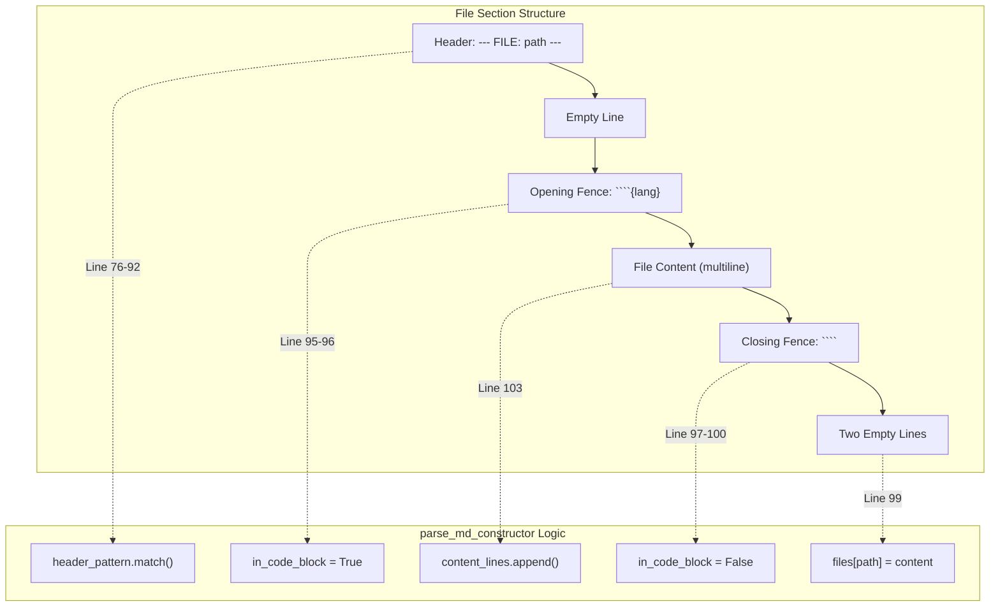
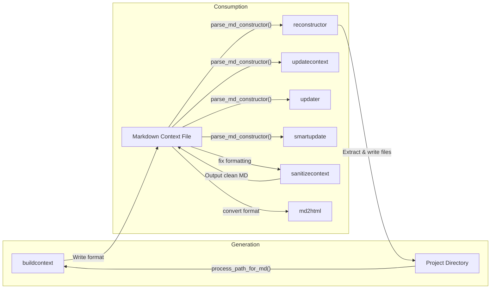

Loading...

![svg image](data:image/svg+xml;base64,PHN2ZyBjbGFzcz0ic2l6ZS0zIFsmYW1wO19wYXRoXTpzdHJva2UtMCBbJmFtcDtfcGF0aF06YW5pbWF0ZS1bY3VzdG9tLXB1bHNlXzEuOHNfaW5maW5pdGVfdmFyKC0tZGVsYXksMHMpXSIgdmlld2JveD0iMTEwIDExMCA0NjAgNTAwIiB4bWxucz0iaHR0cDovL3d3dy53My5vcmcvMjAwMC9zdmciPjxwYXRoIGNsYXNzPSJbLS1kZWxheTowLjZzXSIgZD0iTTQxOC43MywzMzIuMzdjOS44NC01LjY4LDIyLjA3LTUuNjgsMzEuOTEsMGwyNS40OSwxNC43MWMuODIuNDgsMS42OS44LDIuNTgsMS4wNi4xOS4wNi4zNy4xMS41NS4xNi44Ny4yMSwxLjc2LjM0LDIuNjUuMzUuMDQsMCwuMDguMDIuMTMuMDIuMSwwLC4xOS0uMDMuMjktLjA0LjgzLS4wMiwxLjY0LS4xMywyLjQ1LS4zMi4xNC0uMDMuMjgtLjA1LjQyLS4wOS44Ny0uMjQsMS43LS41OSwyLjUtMS4wMy4wOC0uMDQuMTctLjA2LjI1LS4xbDUwLjk3LTI5LjQzYzMuNjUtMi4xMSw1LjktNi4wMSw1LjktMTAuMjJ2LTU4Ljg2YzAtNC4yMi0yLjI1LTguMTEtNS45LTEwLjIybC01MC45Ny0yOS40M2MtMy42NS0yLjExLTguMTUtMi4xMS0xMS44MSwwbC01MC45NywyOS40M2MtLjA4LjA0LS4xMy4xMS0uMi4xNi0uNzguNDgtMS41MSwxLjAyLTIuMTUsMS42Ni0uMS4xLS4xOC4yMS0uMjguMzEtLjU3LjYtMS4wOCwxLjI2LTEuNTEsMS45Ny0uMDcuMTItLjE1LjIyLS4yMi4zNC0uNDQuNzctLjc3LDEuNi0xLjAzLDIuNDctLjA1LjE5LS4xLjM3LS4xNC41Ni0uMjIuODktLjM3LDEuODEtLjM3LDIuNzZ2MjkuNDNjMCwxMS4zNi02LjExLDIxLjk1LTE1Ljk1LDI3LjYzLTkuODQsNS42OC0yMi4wNiw1LjY4LTMxLjkxLDBsLTI1LjQ5LTE0LjcxYy0uODItLjQ4LTEuNjktLjgtMi41Ny0xLjA2LS4xOS0uMDYtLjM3LS4xMS0uNTYtLjE2LS44OC0uMjEtMS43Ni0uMzQtMi42NS0uMzQtLjEzLDAtLjI2LjAyLS40LjAyLS44NC4wMi0xLjY2LjEzLTIuNDcuMzItLjEzLjAzLS4yNy4wNS0uNC4wOS0uODcuMjQtMS43MS42LTIuNTEsMS4wNC0uMDguMDQtLjE2LjA2LS4yNC4xbC01MC45NywyOS40M2MtMy42NSwyLjExLTUuOSw2LjAxLTUuOSwxMC4yMnY1OC44NmMwLDQuMjIsMi4yNSw4LjExLDUuOSwxMC4yMmw1MC45NywyOS40M2MuMDguMDQuMTcuMDYuMjQuMS44LjQ0LDEuNjQuNzksMi41LDEuMDMuMTQuMDQuMjguMDYuNDIuMDkuODEuMTksMS42Mi4zLDIuNDUuMzIuMSwwLC4xOS4wNC4yOS4wNC4wNCwwLC4wOC0uMDIuMTMtLjAyLjg5LDAsMS43Ny0uMTMsMi42NS0uMzUuMTktLjA0LjM3LS4xLjU2LS4xNi44OC0uMjYsMS43NS0uNTksMi41OC0xLjA2bDI1LjQ5LTE0LjcxYzkuODQtNS42OCwyMi4wNi01LjY4LDMxLjkxLDAsOS44NCw1LjY4LDE1Ljk1LDE2LjI3LDE1Ljk1LDI3LjYzdjI5LjQzYzAsLjk1LjE1LDEuODcuMzcsMi43Ni4wNS4xOS4wOS4zNy4xNC41Ni4yNS44Ni41OSwxLjY5LDEuMDMsMi40Ny4wNy4xMi4xNS4yMi4yMi4zNC40My43MS45NCwxLjM3LDEuNTEsMS45Ny4xLjEuMTguMjEuMjguMzEuNjUuNjMsMS4zNywxLjE4LDIuMTUsMS42Ni4wNy4wNC4xMy4xMS4yLjE2bDUwLjk3LDI5LjQzYzEuODMsMS4wNSwzLjg2LDEuNTgsNS45LDEuNThzNC4wOC0uNTMsNS45LTEuNThsNTAuOTctMjkuNDNjMy42NS0yLjExLDUuOS02LjAxLDUuOS0xMC4yMnYtNTguODZjMC00LjIyLTIuMjUtOC4xMS01LjktMTAuMjJsLTUwLjk3LTI5LjQzYy0uMDgtLjA0LS4xNi0uMDYtLjI0LS4xLS44LS40NC0xLjY0LS44LTIuNTEtMS4wNC0uMTMtLjA0LS4yNi0uMDUtLjM5LS4wOS0uODItLjItMS42NS0uMzEtMi40OS0uMzMtLjEzLDAtLjI1LS4wMi0uMzgtLjAyLS44OSwwLTEuNzguMTMtMi42Ni4zNS0uMTguMDQtLjM2LjEtLjU0LjE1LS44OC4yNi0xLjc1LjU5LTIuNTgsMS4wN2wtMjUuNDksMTQuNzJjLTkuODQsNS42OC0yMi4wNyw1LjY4LTMxLjksMC05Ljg0LTUuNjgtMTUuOTUtMTYuMjctMTUuOTUtMjcuNjNzNi4xMS0yMS45NSwxNS45NS0yNy42M1oiIHN0eWxlPSJmaWxsOiMyMWMxOWEiPjwvcGF0aD48cGF0aCBkPSJNMTQxLjA5LDMxNy42NWw1MC45NywyOS40M2MxLjgzLDEuMDUsMy44NiwxLjU4LDUuOSwxLjU4czQuMDgtLjUzLDUuOS0xLjU4bDUwLjk3LTI5LjQzYy4wOC0uMDQuMTMtLjExLjItLjE2Ljc4LS40OCwxLjUxLTEuMDIsMi4xNS0xLjY2LjEtLjEuMTgtLjIxLjI4LS4zMS41Ny0uNiwxLjA4LTEuMjYsMS41MS0xLjk3LjA3LS4xMi4xNS0uMjIuMjItLjM0LjQ0LS43Ny43Ny0xLjYsMS4wMy0yLjQ3LjA1LS4xOS4xLS4zNy4xNC0uNTYuMjItLjg5LjM3LTEuODEuMzctMi43NnYtMjkuNDNjMC0xMS4zNiw2LjExLTIxLjk1LDE1Ljk2LTI3LjYzczIyLjA2LTUuNjgsMzEuOTEsMGwyNS40OSwxNC43MWMuODIuNDgsMS42OS44LDIuNTcsMS4wNi4xOS4wNi4zNy4xMS41Ni4xNi44Ny4yMSwxLjc2LjM0LDIuNjQuMzUuMDQsMCwuMDkuMDIuMTMuMDIuMSwwLC4xOS0uMDQuMjktLjA0LjgzLS4wMiwxLjY1LS4xMywyLjQ1LS4zMi4xNC0uMDMuMjgtLjA1LjQxLS4wOS44Ny0uMjQsMS43MS0uNiwyLjUxLTEuMDQuMDgtLjA0LjE2LS4wNi4yNC0uMWw1MC45Ny0yOS40M2MzLjY1LTIuMTEsNS45LTYuMDEsNS45LTEwLjIydi01OC44NmMwLTQuMjItMi4yNS04LjExLTUuOS0xMC4yMmwtNTAuOTctMjkuNDNjLTMuNjUtMi4xMS04LjE1LTIuMTEtMTEuODEsMGwtNTAuOTcsMjkuNDNjLS4wOC4wNC0uMTMuMTEtLjIuMTYtLjc4LjQ4LTEuNTEsMS4wMi0yLjE1LDEuNjYtLjEuMS0uMTguMjEtLjI4LjMxLS41Ny42LTEuMDgsMS4yNi0xLjUxLDEuOTctLjA3LjEyLS4xNS4yMi0uMjIuMzQtLjQ0Ljc3LS43NywxLjYtMS4wMywyLjQ3LS4wNS4xOS0uMS4zNy0uMTQuNTYtLjIyLjg5LS4zNywxLjgxLS4zNywyLjc2djI5LjQzYzAsMTEuMzYtNi4xMSwyMS45NS0xNS45NSwyNy42My05Ljg0LDUuNjgtMjIuMDcsNS42OC0zMS45MSwwbC0yNS40OS0xNC43MWMtLjgyLS40OC0xLjY5LS44LTIuNTgtMS4wNi0uMTktLjA2LS4zNy0uMTEtLjU1LS4xNi0uODgtLjIxLTEuNzYtLjM0LTIuNjUtLjM1LS4xMywwLS4yNi4wMi0uNC4wMi0uODMuMDItMS42Ni4xMy0yLjQ3LjMyLS4xMy4wMy0uMjcuMDUtLjQuMDktLjg3LjI0LTEuNzEuNi0yLjUxLDEuMDQtLjA4LjA0LS4xNi4wNi0uMjQuMWwtNTAuOTcsMjkuNDNjLTMuNjUsMi4xMS01LjksNi4wMS01LjksMTAuMjJ2NTguODZjMCw0LjIyLDIuMjUsOC4xMSw1LjksMTAuMjJaIiBzdHlsZT0iZmlsbDojMzk2OWNhIj48L3BhdGg+PHBhdGggY2xhc3M9IlstLWRlbGF5OjEuMnNdIiBkPSJNMzk2Ljg4LDQ4NC4zNWwtNTAuOTctMjkuNDNjLS4wOC0uMDQtLjE3LS4wNi0uMjQtLjEtLjgtLjQ0LTEuNjQtLjc5LTIuNTEtMS4wMy0uMTQtLjA0LS4yNy0uMDYtLjQxLS4wOS0uODEtLjE5LTEuNjQtLjMtMi40Ny0uMzItLjEzLDAtLjI2LS4wMi0uMzktLjAyLS44OSwwLTEuNzguMTMtMi42Ni4zNS0uMTguMDQtLjM2LjEtLjU0LjE1LS44OC4yNi0xLjc2LjU5LTIuNTgsMS4wN2wtMjUuNDksMTQuNzJjLTkuODQsNS42OC0yMi4wNiw1LjY4LTMxLjksMC05Ljg0LTUuNjgtMTUuOTYtMTYuMjctMTUuOTYtMjcuNjN2LTI5LjQzYzAtLjk1LS4xNS0xLjg3LS4zNy0yLjc2LS4wNS0uMTktLjA5LS4zNy0uMTQtLjU2LS4yNS0uODYtLjU5LTEuNjktMS4wMy0yLjQ3LS4wNy0uMTItLjE1LS4yMi0uMjItLjM0LS40My0uNzEtLjk0LTEuMzctMS41MS0xLjk3LS4xLS4xLS4xOC0uMjEtLjI4LS4zMS0uNjUtLjYzLTEuMzctMS4xOC0yLjE1LTEuNjYtLjA3LS4wNC0uMTMtLjExLS4yLS4xNmwtNTAuOTctMjkuNDNjLTMuNjUtMi4xMS04LjE1LTIuMTEtMTEuODEsMGwtNTAuOTcsMjkuNDNjLTMuNjUsMi4xMS01LjksNi4wMS01LjksMTAuMjJ2NTguODZjMCw0LjIyLDIuMjUsOC4xMSw1LjksMTAuMjJsNTAuOTcsMjkuNDNjLjA4LjA0LjE3LjA2LjI1LjEuOC40NCwxLjYzLjc5LDIuNSwxLjAzLjE0LjA0LjI5LjA2LjQzLjA5LjguMTksMS42MS4zLDIuNDMuMzIuMSwwLC4yLjA0LjMuMDQuMDQsMCwuMDktLjAyLjEzLS4wMi44OCwwLDEuNzctLjEzLDIuNjQtLjM0LjE5LS4wNC4zNy0uMS41Ni0uMTYuODgtLjI2LDEuNzUtLjU5LDIuNTctMS4wNmwyNS40OS0xNC43MWM5Ljg0LTUuNjgsMjIuMDYtNS42OCwzMS45MSwwLDkuODQsNS42OCwxNS45NSwxNi4yNywxNS45NSwyNy42M3YyOS40M2MwLC45NS4xNSwxLjg3LjM3LDIuNzYuMDUuMTkuMDkuMzcuMTQuNTYuMjUuODYuNTksMS42OSwxLjAzLDIuNDcuMDcuMTIuMTUuMjIuMjIuMzQuNDMuNzEuOTQsMS4zNywxLjUxLDEuOTcuMS4xLjE4LjIxLjI4LjMxLjY1LjYzLDEuMzcsMS4xOCwyLjE1LDEuNjYuMDcuMDQuMTMuMTEuMi4xNmw1MC45NywyOS40M2MxLjgzLDEuMDUsMy44NiwxLjU4LDUuOSwxLjU4czQuMDgtLjUzLDUuOS0xLjU4bDUwLjk3LTI5LjQzYzMuNjUtMi4xMSw1LjktNi4wMSw1LjktMTAuMjJ2LTU4Ljg2YzAtNC4yMi0yLjI1LTguMTEtNS45LTEwLjIyWiIgc3R5bGU9ImZpbGw6IzAyOTRkZSI+PC9wYXRoPjwvc3ZnPg==)Index your code with Devin

[DeepWiki](/)

[DeepWiki](/)

[ray0404/Contexter ](https://github.com/ray0404/Contexter "Open repository")

Index your code with

![svg image](data:image/svg+xml;base64,PHN2ZyBjbGFzcz0ic2l6ZS00IHRyYW5zZm9ybSB0cmFuc2l0aW9uLXRyYW5zZm9ybSBkdXJhdGlvbi03MDAgZ3JvdXAtaG92ZXI6cm90YXRlLTE4MCBbJmFtcDtfcGF0aF06c3Ryb2tlLTAiIHZpZXdib3g9IjExMCAxMTAgNDYwIDUwMCIgeG1sbnM9Imh0dHA6Ly93d3cudzMub3JnLzIwMDAvc3ZnIj48cGF0aCBjbGFzcz0iIiBkPSJNNDE4LjczLDMzMi4zN2M5Ljg0LTUuNjgsMjIuMDctNS42OCwzMS45MSwwbDI1LjQ5LDE0LjcxYy44Mi40OCwxLjY5LjgsMi41OCwxLjA2LjE5LjA2LjM3LjExLjU1LjE2Ljg3LjIxLDEuNzYuMzQsMi42NS4zNS4wNCwwLC4wOC4wMi4xMy4wMi4xLDAsLjE5LS4wMy4yOS0uMDQuODMtLjAyLDEuNjQtLjEzLDIuNDUtLjMyLjE0LS4wMy4yOC0uMDUuNDItLjA5Ljg3LS4yNCwxLjctLjU5LDIuNS0xLjAzLjA4LS4wNC4xNy0uMDYuMjUtLjFsNTAuOTctMjkuNDNjMy42NS0yLjExLDUuOS02LjAxLDUuOS0xMC4yMnYtNTguODZjMC00LjIyLTIuMjUtOC4xMS01LjktMTAuMjJsLTUwLjk3LTI5LjQzYy0zLjY1LTIuMTEtOC4xNS0yLjExLTExLjgxLDBsLTUwLjk3LDI5LjQzYy0uMDguMDQtLjEzLjExLS4yLjE2LS43OC40OC0xLjUxLDEuMDItMi4xNSwxLjY2LS4xLjEtLjE4LjIxLS4yOC4zMS0uNTcuNi0xLjA4LDEuMjYtMS41MSwxLjk3LS4wNy4xMi0uMTUuMjItLjIyLjM0LS40NC43Ny0uNzcsMS42LTEuMDMsMi40Ny0uMDUuMTktLjEuMzctLjE0LjU2LS4yMi44OS0uMzcsMS44MS0uMzcsMi43NnYyOS40M2MwLDExLjM2LTYuMTEsMjEuOTUtMTUuOTUsMjcuNjMtOS44NCw1LjY4LTIyLjA2LDUuNjgtMzEuOTEsMGwtMjUuNDktMTQuNzFjLS44Mi0uNDgtMS42OS0uOC0yLjU3LTEuMDYtLjE5LS4wNi0uMzctLjExLS41Ni0uMTYtLjg4LS4yMS0xLjc2LS4zNC0yLjY1LS4zNC0uMTMsMC0uMjYuMDItLjQuMDItLjg0LjAyLTEuNjYuMTMtMi40Ny4zMi0uMTMuMDMtLjI3LjA1LS40LjA5LS44Ny4yNC0xLjcxLjYtMi41MSwxLjA0LS4wOC4wNC0uMTYuMDYtLjI0LjFsLTUwLjk3LDI5LjQzYy0zLjY1LDIuMTEtNS45LDYuMDEtNS45LDEwLjIydjU4Ljg2YzAsNC4yMiwyLjI1LDguMTEsNS45LDEwLjIybDUwLjk3LDI5LjQzYy4wOC4wNC4xNy4wNi4yNC4xLjguNDQsMS42NC43OSwyLjUsMS4wMy4xNC4wNC4yOC4wNi40Mi4wOS44MS4xOSwxLjYyLjMsMi40NS4zMi4xLDAsLjE5LjA0LjI5LjA0LjA0LDAsLjA4LS4wMi4xMy0uMDIuODksMCwxLjc3LS4xMywyLjY1LS4zNS4xOS0uMDQuMzctLjEuNTYtLjE2Ljg4LS4yNiwxLjc1LS41OSwyLjU4LTEuMDZsMjUuNDktMTQuNzFjOS44NC01LjY4LDIyLjA2LTUuNjgsMzEuOTEsMCw5Ljg0LDUuNjgsMTUuOTUsMTYuMjcsMTUuOTUsMjcuNjN2MjkuNDNjMCwuOTUuMTUsMS44Ny4zNywyLjc2LjA1LjE5LjA5LjM3LjE0LjU2LjI1Ljg2LjU5LDEuNjksMS4wMywyLjQ3LjA3LjEyLjE1LjIyLjIyLjM0LjQzLjcxLjk0LDEuMzcsMS41MSwxLjk3LjEuMS4xOC4yMS4yOC4zMS42NS42MywxLjM3LDEuMTgsMi4xNSwxLjY2LjA3LjA0LjEzLjExLjIuMTZsNTAuOTcsMjkuNDNjMS44MywxLjA1LDMuODYsMS41OCw1LjksMS41OHM0LjA4LS41Myw1LjktMS41OGw1MC45Ny0yOS40M2MzLjY1LTIuMTEsNS45LTYuMDEsNS45LTEwLjIydi01OC44NmMwLTQuMjItMi4yNS04LjExLTUuOS0xMC4yMmwtNTAuOTctMjkuNDNjLS4wOC0uMDQtLjE2LS4wNi0uMjQtLjEtLjgtLjQ0LTEuNjQtLjgtMi41MS0xLjA0LS4xMy0uMDQtLjI2LS4wNS0uMzktLjA5LS44Mi0uMi0xLjY1LS4zMS0yLjQ5LS4zMy0uMTMsMC0uMjUtLjAyLS4zOC0uMDItLjg5LDAtMS43OC4xMy0yLjY2LjM1LS4xOC4wNC0uMzYuMS0uNTQuMTUtLjg4LjI2LTEuNzUuNTktMi41OCwxLjA3bC0yNS40OSwxNC43MmMtOS44NCw1LjY4LTIyLjA3LDUuNjgtMzEuOSwwLTkuODQtNS42OC0xNS45NS0xNi4yNy0xNS45NS0yNy42M3M2LjExLTIxLjk1LDE1Ljk1LTI3LjYzWiIgc3R5bGU9ImZpbGw6IzIxYzE5YSI+PC9wYXRoPjxwYXRoIGQ9Ik0xNDEuMDksMzE3LjY1bDUwLjk3LDI5LjQzYzEuODMsMS4wNSwzLjg2LDEuNTgsNS45LDEuNThzNC4wOC0uNTMsNS45LTEuNThsNTAuOTctMjkuNDNjLjA4LS4wNC4xMy0uMTEuMi0uMTYuNzgtLjQ4LDEuNTEtMS4wMiwyLjE1LTEuNjYuMS0uMS4xOC0uMjEuMjgtLjMxLjU3LS42LDEuMDgtMS4yNiwxLjUxLTEuOTcuMDctLjEyLjE1LS4yMi4yMi0uMzQuNDQtLjc3Ljc3LTEuNiwxLjAzLTIuNDcuMDUtLjE5LjEtLjM3LjE0LS41Ni4yMi0uODkuMzctMS44MS4zNy0yLjc2di0yOS40M2MwLTExLjM2LDYuMTEtMjEuOTUsMTUuOTYtMjcuNjNzMjIuMDYtNS42OCwzMS45MSwwbDI1LjQ5LDE0LjcxYy44Mi40OCwxLjY5LjgsMi41NywxLjA2LjE5LjA2LjM3LjExLjU2LjE2Ljg3LjIxLDEuNzYuMzQsMi42NC4zNS4wNCwwLC4wOS4wMi4xMy4wMi4xLDAsLjE5LS4wNC4yOS0uMDQuODMtLjAyLDEuNjUtLjEzLDIuNDUtLjMyLjE0LS4wMy4yOC0uMDUuNDEtLjA5Ljg3LS4yNCwxLjcxLS42LDIuNTEtMS4wNC4wOC0uMDQuMTYtLjA2LjI0LS4xbDUwLjk3LTI5LjQzYzMuNjUtMi4xMSw1LjktNi4wMSw1LjktMTAuMjJ2LTU4Ljg2YzAtNC4yMi0yLjI1LTguMTEtNS45LTEwLjIybC01MC45Ny0yOS40M2MtMy42NS0yLjExLTguMTUtMi4xMS0xMS44MSwwbC01MC45NywyOS40M2MtLjA4LjA0LS4xMy4xMS0uMi4xNi0uNzguNDgtMS41MSwxLjAyLTIuMTUsMS42Ni0uMS4xLS4xOC4yMS0uMjguMzEtLjU3LjYtMS4wOCwxLjI2LTEuNTEsMS45Ny0uMDcuMTItLjE1LjIyLS4yMi4zNC0uNDQuNzctLjc3LDEuNi0xLjAzLDIuNDctLjA1LjE5LS4xLjM3LS4xNC41Ni0uMjIuODktLjM3LDEuODEtLjM3LDIuNzZ2MjkuNDNjMCwxMS4zNi02LjExLDIxLjk1LTE1Ljk1LDI3LjYzLTkuODQsNS42OC0yMi4wNyw1LjY4LTMxLjkxLDBsLTI1LjQ5LTE0LjcxYy0uODItLjQ4LTEuNjktLjgtMi41OC0xLjA2LS4xOS0uMDYtLjM3LS4xMS0uNTUtLjE2LS44OC0uMjEtMS43Ni0uMzQtMi42NS0uMzUtLjEzLDAtLjI2LjAyLS40LjAyLS44My4wMi0xLjY2LjEzLTIuNDcuMzItLjEzLjAzLS4yNy4wNS0uNC4wOS0uODcuMjQtMS43MS42LTIuNTEsMS4wNC0uMDguMDQtLjE2LjA2LS4yNC4xbC01MC45NywyOS40M2MtMy42NSwyLjExLTUuOSw2LjAxLTUuOSwxMC4yMnY1OC44NmMwLDQuMjIsMi4yNSw4LjExLDUuOSwxMC4yMloiIHN0eWxlPSJmaWxsOiMzOTY5Y2EiPjwvcGF0aD48cGF0aCBjbGFzcz0iIiBkPSJNMzk2Ljg4LDQ4NC4zNWwtNTAuOTctMjkuNDNjLS4wOC0uMDQtLjE3LS4wNi0uMjQtLjEtLjgtLjQ0LTEuNjQtLjc5LTIuNTEtMS4wMy0uMTQtLjA0LS4yNy0uMDYtLjQxLS4wOS0uODEtLjE5LTEuNjQtLjMtMi40Ny0uMzItLjEzLDAtLjI2LS4wMi0uMzktLjAyLS44OSwwLTEuNzguMTMtMi42Ni4zNS0uMTguMDQtLjM2LjEtLjU0LjE1LS44OC4yNi0xLjc2LjU5LTIuNTgsMS4wN2wtMjUuNDksMTQuNzJjLTkuODQsNS42OC0yMi4wNiw1LjY4LTMxLjksMC05Ljg0LTUuNjgtMTUuOTYtMTYuMjctMTUuOTYtMjcuNjN2LTI5LjQzYzAtLjk1LS4xNS0xLjg3LS4zNy0yLjc2LS4wNS0uMTktLjA5LS4zNy0uMTQtLjU2LS4yNS0uODYtLjU5LTEuNjktMS4wMy0yLjQ3LS4wNy0uMTItLjE1LS4yMi0uMjItLjM0LS40My0uNzEtLjk0LTEuMzctMS41MS0xLjk3LS4xLS4xLS4xOC0uMjEtLjI4LS4zMS0uNjUtLjYzLTEuMzctMS4xOC0yLjE1LTEuNjYtLjA3LS4wNC0uMTMtLjExLS4yLS4xNmwtNTAuOTctMjkuNDNjLTMuNjUtMi4xMS04LjE1LTIuMTEtMTEuODEsMGwtNTAuOTcsMjkuNDNjLTMuNjUsMi4xMS01LjksNi4wMS01LjksMTAuMjJ2NTguODZjMCw0LjIyLDIuMjUsOC4xMSw1LjksMTAuMjJsNTAuOTcsMjkuNDNjLjA4LjA0LjE3LjA2LjI1LjEuOC40NCwxLjYzLjc5LDIuNSwxLjAzLjE0LjA0LjI5LjA2LjQzLjA5LjguMTksMS42MS4zLDIuNDMuMzIuMSwwLC4yLjA0LjMuMDQuMDQsMCwuMDktLjAyLjEzLS4wMi44OCwwLDEuNzctLjEzLDIuNjQtLjM0LjE5LS4wNC4zNy0uMS41Ni0uMTYuODgtLjI2LDEuNzUtLjU5LDIuNTctMS4wNmwyNS40OS0xNC43MWM5Ljg0LTUuNjgsMjIuMDYtNS42OCwzMS45MSwwLDkuODQsNS42OCwxNS45NSwxNi4yNywxNS45NSwyNy42M3YyOS40M2MwLC45NS4xNSwxLjg3LjM3LDIuNzYuMDUuMTkuMDkuMzcuMTQuNTYuMjUuODYuNTksMS42OSwxLjAzLDIuNDcuMDcuMTIuMTUuMjIuMjIuMzQuNDMuNzEuOTQsMS4zNywxLjUxLDEuOTcuMS4xLjE4LjIxLjI4LjMxLjY1LjYzLDEuMzcsMS4xOCwyLjE1LDEuNjYuMDcuMDQuMTMuMTEuMi4xNmw1MC45NywyOS40M2MxLjgzLDEuMDUsMy44NiwxLjU4LDUuOSwxLjU4czQuMDgtLjUzLDUuOS0xLjU4bDUwLjk3LTI5LjQzYzMuNjUtMi4xMSw1LjktNi4wMSw1LjktMTAuMjJ2LTU4Ljg2YzAtNC4yMi0yLjI1LTguMTEtNS45LTEwLjIyWiIgc3R5bGU9ImZpbGw6IzAyOTRkZSI+PC9wYXRoPjwvc3ZnPg==)Devin

Edit WikiShare

Loading...

Last indexed: 2 November 2025 ([79ebf7](https://github.com/ray0404/Contexter/commits/79ebf745))

- [Overview](/ray0404/Contexter/1-overview)
- [Getting Started](/ray0404/Contexter/2-getting-started)
- [Installation](/ray0404/Contexter/2.1-installation)
- [Quick Start Guide](/ray0404/Contexter/2.2-quick-start-guide)
- [Command Overview](/ray0404/Contexter/2.3-command-overview)
- [Core Concepts](/ray0404/Contexter/3-core-concepts)
- [Context Files](/ray0404/Contexter/3.1-context-files)
- [Packaging and Reconstruction](/ray0404/Contexter/3.2-packaging-and-reconstruction)
- [Update Management](/ray0404/Contexter/3.3-update-management)
- [Exclusion Patterns](/ray0404/Contexter/3.4-exclusion-patterns)
- [Workflows](/ray0404/Contexter/4-workflows)
- [Basic Packaging Workflow](/ray0404/Contexter/4.1-basic-packaging-workflow)
- [AI Integration Workflow](/ray0404/Contexter/4.2-ai-integration-workflow)
- [Version Control with Patches](/ray0404/Contexter/4.3-version-control-with-patches)
- [Format Conversion Workflow](/ray0404/Contexter/4.4-format-conversion-workflow)
- [Command Reference](/ray0404/Contexter/5-command-reference)
- [Building Commands](/ray0404/Contexter/5.1-building-commands)
- [buildcontext](/ray0404/Contexter/5.1.1-buildcontext)
- [buildcontexthtml](/ray0404/Contexter/5.1.2-buildcontexthtml)
- [Reconstruction Commands](/ray0404/Contexter/5.2-reconstruction-commands)
- [reconstructor](/ray0404/Contexter/5.2.1-reconstructor)
- [reconstructorhtml](/ray0404/Contexter/5.2.2-reconstructorhtml)
- [Update Commands](/ray0404/Contexter/5.3-update-commands)
- [updatecontext](/ray0404/Contexter/5.3.1-updatecontext)
- [updater](/ray0404/Contexter/5.3.2-updater)
- [smartupdate](/ray0404/Contexter/5.3.3-smartupdate)
- [updatecontexthtml](/ray0404/Contexter/5.3.4-updatecontexthtml)
- [updaterhtml](/ray0404/Contexter/5.3.5-updaterhtml)
- [Utility Commands](/ray0404/Contexter/5.4-utility-commands)
- [sanitizecontext](/ray0404/Contexter/5.4.1-sanitizecontext)
- [md2html](/ray0404/Contexter/5.4.2-md2html)
- [html2md](/ray0404/Contexter/5.4.3-html2md)
- [Architecture](/ray0404/Contexter/6-architecture)
- [System Architecture](/ray0404/Contexter/6.1-system-architecture)
- [Module Organization](/ray0404/Contexter/6.2-module-organization)
- [Utility Layer (contexter\_utils)](/ray0404/Contexter/6.3-utility-layer-(contexter_utils))
- [Dependencies](/ray0404/Contexter/6.4-dependencies)
- [Technical Details](/ray0404/Contexter/7-technical-details)
- [Markdown Context Format](/ray0404/Contexter/7.1-markdown-context-format)
- [HTML Context Format](/ray0404/Contexter/7.2-html-context-format)
- [Patch File Format](/ray0404/Contexter/7.3-patch-file-format)
- [Binary File Handling](/ray0404/Contexter/7.4-binary-file-handling)

Menu

# Markdown Context Formatsvg image

Relevant source files

- [![svg image](data:image/svg+xml;base64,PHN2ZyBjbGFzcz0ibXItMS41IGhpZGRlbiBoLTMuNSB3LTMuNSBmbGV4LXNocmluay0wIG9wYWNpdHktNDAgbWQ6YmxvY2siIGZpbGw9ImN1cnJlbnRDb2xvciIgdmlld2JveD0iMCAwIDI0IDI0Ij48cGF0aCBkPSJNMTIgMGMtNi42MjYgMC0xMiA1LjM3My0xMiAxMiAwIDUuMzAyIDMuNDM4IDkuOCA4LjIwNyAxMS4zODcuNTk5LjExMS43OTMtLjI2MS43OTMtLjU3N3YtMi4yMzRjLTMuMzM4LjcyNi00LjAzMy0xLjQxNi00LjAzMy0xLjQxNi0uNTQ2LTEuMzg3LTEuMzMzLTEuNzU2LTEuMzMzLTEuNzU2LTEuMDg5LS43NDUuMDgzLS43MjkuMDgzLS43MjkgMS4yMDUuMDg0IDEuODM5IDEuMjM3IDEuODM5IDEuMjM3IDEuMDcgMS44MzQgMi44MDcgMS4zMDQgMy40OTIuOTk3LjEwNy0uNzc1LjQxOC0xLjMwNS43NjItMS42MDQtMi42NjUtLjMwNS01LjQ2Ny0xLjMzNC01LjQ2Ny01LjkzMSAwLTEuMzExLjQ2OS0yLjM4MSAxLjIzNi0zLjIyMS0uMTI0LS4zMDMtLjUzNS0xLjUyNC4xMTctMy4xNzYgMCAwIDEuMDA4LS4zMjIgMy4zMDEgMS4yMy45NTctLjI2NiAxLjk4My0uMzk5IDMuMDAzLS40MDQgMS4wMi4wMDUgMi4wNDcuMTM4IDMuMDA2LjQwNCAyLjI5MS0xLjU1MiAzLjI5Ny0xLjIzIDMuMjk3LTEuMjMuNjUzIDEuNjUzLjI0MiAyLjg3NC4xMTggMy4xNzYuNzcuODQgMS4yMzUgMS45MTEgMS4yMzUgMy4yMjEgMCA0LjYwOS0yLjgwNyA1LjYyNC01LjQ3OSA1LjkyMS40My4zNzIuODIzIDEuMTAyLjgyMyAyLjIyMnYzLjI5M2MwIC4zMTkuMTkyLjY5NC44MDEuNTc2IDQuNzY1LTEuNTg5IDguMTk5LTYuMDg2IDguMTk5LTExLjM4NiAwLTYuNjI3LTUuMzczLTEyLTEyLTEyeiI+PC9wYXRoPjwvc3ZnPg==)README.md](https://github.com/ray0404/Contexter/blob/79ebf745/README.md)
- [![svg image](data:image/svg+xml;base64,PHN2ZyBjbGFzcz0ibXItMS41IGhpZGRlbiBoLTMuNSB3LTMuNSBmbGV4LXNocmluay0wIG9wYWNpdHktNDAgbWQ6YmxvY2siIGZpbGw9ImN1cnJlbnRDb2xvciIgdmlld2JveD0iMCAwIDI0IDI0Ij48cGF0aCBkPSJNMTIgMGMtNi42MjYgMC0xMiA1LjM3My0xMiAxMiAwIDUuMzAyIDMuNDM4IDkuOCA4LjIwNyAxMS4zODcuNTk5LjExMS43OTMtLjI2MS43OTMtLjU3N3YtMi4yMzRjLTMuMzM4LjcyNi00LjAzMy0xLjQxNi00LjAzMy0xLjQxNi0uNTQ2LTEuMzg3LTEuMzMzLTEuNzU2LTEuMzMzLTEuNzU2LTEuMDg5LS43NDUuMDgzLS43MjkuMDgzLS43MjkgMS4yMDUuMDg0IDEuODM5IDEuMjM3IDEuODM5IDEuMjM3IDEuMDcgMS44MzQgMi44MDcgMS4zMDQgMy40OTIuOTk3LjEwNy0uNzc1LjQxOC0xLjMwNS43NjItMS42MDQtMi42NjUtLjMwNS01LjQ2Ny0xLjMzNC01LjQ2Ny01LjkzMSAwLTEuMzExLjQ2OS0yLjM4MSAxLjIzNi0zLjIyMS0uMTI0LS4zMDMtLjUzNS0xLjUyNC4xMTctMy4xNzYgMCAwIDEuMDA4LS4zMjIgMy4zMDEgMS4yMy45NTctLjI2NiAxLjk4My0uMzk5IDMuMDAzLS40MDQgMS4wMi4wMDUgMi4wNDcuMTM4IDMuMDA2LjQwNCAyLjI5MS0xLjU1MiAzLjI5Ny0xLjIzIDMuMjk3LTEuMjMuNjUzIDEuNjUzLjI0MiAyLjg3NC4xMTggMy4xNzYuNzcuODQgMS4yMzUgMS45MTEgMS4yMzUgMy4yMjEgMCA0LjYwOS0yLjgwNyA1LjYyNC01LjQ3OSA1LjkyMS40My4zNzIuODIzIDEuMTAyLjgyMyAyLjIyMnYzLjI5M2MwIC4zMTkuMTkyLjY5NC44MDEuNTc2IDQuNzY1LTEuNTg5IDguMTk5LTYuMDg2IDguMTk5LTExLjM4NiAwLTYuNjI3LTUuMzczLTEyLTEyLTEyeiI+PC9wYXRoPjwvc3ZnPg==)context\_builder.py](https://github.com/ray0404/Contexter/blob/79ebf745/context_builder.py)
- [![svg image](data:image/svg+xml;base64,PHN2ZyBjbGFzcz0ibXItMS41IGhpZGRlbiBoLTMuNSB3LTMuNSBmbGV4LXNocmluay0wIG9wYWNpdHktNDAgbWQ6YmxvY2siIGZpbGw9ImN1cnJlbnRDb2xvciIgdmlld2JveD0iMCAwIDI0IDI0Ij48cGF0aCBkPSJNMTIgMGMtNi42MjYgMC0xMiA1LjM3My0xMiAxMiAwIDUuMzAyIDMuNDM4IDkuOCA4LjIwNyAxMS4zODcuNTk5LjExMS43OTMtLjI2MS43OTMtLjU3N3YtMi4yMzRjLTMuMzM4LjcyNi00LjAzMy0xLjQxNi00LjAzMy0xLjQxNi0uNTQ2LTEuMzg3LTEuMzMzLTEuNzU2LTEuMzMzLTEuNzU2LTEuMDg5LS43NDUuMDgzLS43MjkuMDgzLS43MjkgMS4yMDUuMDg0IDEuODM5IDEuMjM3IDEuODM5IDEuMjM3IDEuMDcgMS44MzQgMi44MDcgMS4zMDQgMy40OTIuOTk3LjEwNy0uNzc1LjQxOC0xLjMwNS43NjItMS42MDQtMi42NjUtLjMwNS01LjQ2Ny0xLjMzNC01LjQ2Ny01LjkzMSAwLTEuMzExLjQ2OS0yLjM4MSAxLjIzNi0zLjIyMS0uMTI0LS4zMDMtLjUzNS0xLjUyNC4xMTctMy4xNzYgMCAwIDEuMDA4LS4zMjIgMy4zMDEgMS4yMy45NTctLjI2NiAxLjk4My0uMzk5IDMuMDAzLS40MDQgMS4wMi4wMDUgMi4wNDcuMTM4IDMuMDA2LjQwNCAyLjI5MS0xLjU1MiAzLjI5Ny0xLjIzIDMuMjk3LTEuMjMuNjUzIDEuNjUzLjI0MiAyLjg3NC4xMTggMy4xNzYuNzcuODQgMS4yMzUgMS45MTEgMS4yMzUgMy4yMjEgMCA0LjYwOS0yLjgwNyA1LjYyNC01LjQ3OSA1LjkyMS40My4zNzIuODIzIDEuMTAyLjgyMyAyLjIyMnYzLjI5M2MwIC4zMTkuMTkyLjY5NC44MDEuNTc2IDQuNzY1LTEuNTg5IDguMTk5LTYuMDg2IDguMTk5LTExLjM4NiAwLTYuNjI3LTUuMzczLTEyLTEyLTEyeiI+PC9wYXRoPjwvc3ZnPg==)contexter\_utils.py](https://github.com/ray0404/Contexter/blob/79ebf745/contexter_utils.py)
- [![svg image](data:image/svg+xml;base64,PHN2ZyBjbGFzcz0ibXItMS41IGhpZGRlbiBoLTMuNSB3LTMuNSBmbGV4LXNocmluay0wIG9wYWNpdHktNDAgbWQ6YmxvY2siIGZpbGw9ImN1cnJlbnRDb2xvciIgdmlld2JveD0iMCAwIDI0IDI0Ij48cGF0aCBkPSJNMTIgMGMtNi42MjYgMC0xMiA1LjM3My0xMiAxMiAwIDUuMzAyIDMuNDM4IDkuOCA4LjIwNyAxMS4zODcuNTk5LjExMS43OTMtLjI2MS43OTMtLjU3N3YtMi4yMzRjLTMuMzM4LjcyNi00LjAzMy0xLjQxNi00LjAzMy0xLjQxNi0uNTQ2LTEuMzg3LTEuMzMzLTEuNzU2LTEuMzMzLTEuNzU2LTEuMDg5LS43NDUuMDgzLS43MjkuMDgzLS43MjkgMS4yMDUuMDg0IDEuODM5IDEuMjM3IDEuODM5IDEuMjM3IDEuMDcgMS44MzQgMi44MDcgMS4zMDQgMy40OTIuOTk3LjEwNy0uNzc1LjQxOC0xLjMwNS43NjItMS42MDQtMi42NjUtLjMwNS01LjQ2Ny0xLjMzNC01LjQ2Ny01LjkzMSAwLTEuMzExLjQ2OS0yLjM4MSAxLjIzNi0zLjIyMS0uMTI0LS4zMDMtLjUzNS0xLjUyNC4xMTctMy4xNzYgMCAwIDEuMDA4LS4zMjIgMy4zMDEgMS4yMy45NTctLjI2NiAxLjk4My0uMzk5IDMuMDAzLS40MDQgMS4wMi4wMDUgMi4wNDcuMTM4IDMuMDA2LjQwNCAyLjI5MS0xLjU1MiAzLjI5Ny0xLjIzIDMuMjk3LTEuMjMuNjUzIDEuNjUzLjI0MiAyLjg3NC4xMTggMy4xNzYuNzcuODQgMS4yMzUgMS45MTEgMS4yMzUgMy4yMjEgMCA0LjYwOS0yLjgwNyA1LjYyNC01LjQ3OSA1LjkyMS40My4zNzIuODIzIDEuMTAyLjgyMyAyLjIyMnYzLjI5M2MwIC4zMTkuMTkyLjY5NC44MDEuNTc2IDQuNzY1LTEuNTg5IDguMTk5LTYuMDg2IDguMTk5LTExLjM4NiAwLTYuNjI3LTUuMzczLTEyLTEyLTEyeiI+PC9wYXRoPjwvc3ZnPg==)pyproject.toml](https://github.com/ray0404/Contexter/blob/79ebf745/pyproject.toml)

This document specifies the structure and syntax of Markdown context files (`.md`) used by Contexter to represent entire software projects as single text files. These files are generated by [`buildcontext`](/ray0404/Contexter/5.1.1-buildcontext) and consumed by [`reconstructor`](/ray0404/Contexter/5.2.1-reconstructor), [`updatecontext`](/ray0404/Contexter/5.3.1-updatecontext), [`updater`](/ray0404/Contexter/5.3.2-updater), and [`smartupdate`](/ray0404/Contexter/5.3.3-smartupdate).

For the HTML context file format, see [HTML Context Format](/ray0404/Contexter/7.2-html-context-format). For patch file formats, see [Patch File Format](/ray0404/Contexter/7.3-patch-file-format).

---

## Purpose and Design Goalssvg image

The Markdown context format is a human-readable, plain-text representation of a project directory structure that:

- **Aggregates** all project files into a single portable document
- **Preserves** file paths, content, and language information
- **Distinguishes** between text and binary files
- **Supports** version control and diff operations
- **Enables** AI model interaction and manual editing
- **Maintains** compatibility with standard Markdown viewers

The format uses delimiter lines and code fences to create parseable sections while remaining readable without specialized tooling.

**Sources:** [![svg image](data:image/svg+xml;base64,PHN2ZyBjbGFzcz0ibXItMS41IGhpZGRlbiBoLTMuNSB3LTMuNSBmbGV4LXNocmluay0wIG9wYWNpdHktNDAgbWQ6YmxvY2siIGZpbGw9ImN1cnJlbnRDb2xvciIgdmlld2JveD0iMCAwIDI0IDI0Ij48cGF0aCBkPSJNMTIgMGMtNi42MjYgMC0xMiA1LjM3My0xMiAxMiAwIDUuMzAyIDMuNDM4IDkuOCA4LjIwNyAxMS4zODcuNTk5LjExMS43OTMtLjI2MS43OTMtLjU3N3YtMi4yMzRjLTMuMzM4LjcyNi00LjAzMy0xLjQxNi00LjAzMy0xLjQxNi0uNTQ2LTEuMzg3LTEuMzMzLTEuNzU2LTEuMzMzLTEuNzU2LTEuMDg5LS43NDUuMDgzLS43MjkuMDgzLS43MjkgMS4yMDUuMDg0IDEuODM5IDEuMjM3IDEuODM5IDEuMjM3IDEuMDcgMS44MzQgMi44MDcgMS4zMDQgMy40OTIuOTk3LjEwNy0uNzc1LjQxOC0xLjMwNS43NjItMS42MDQtMi42NjUtLjMwNS01LjQ2Ny0xLjMzNC01LjQ2Ny01LjkzMSAwLTEuMzExLjQ2OS0yLjM4MSAxLjIzNi0zLjIyMS0uMTI0LS4zMDMtLjUzNS0xLjUyNC4xMTctMy4xNzYgMCAwIDEuMDA4LS4zMjIgMy4zMDEgMS4yMy45NTctLjI2NiAxLjk4My0uMzk5IDMuMDAzLS40MDQgMS4wMi4wMDUgMi4wNDcuMTM4IDMuMDA2LjQwNCAyLjI5MS0xLjU1MiAzLjI5Ny0xLjIzIDMuMjk3LTEuMjMuNjUzIDEuNjUzLjI0MiAyLjg3NC4xMTggMy4xNzYuNzcuODQgMS4yMzUgMS45MTEgMS4yMzUgMy4yMjEgMCA0LjYwOS0yLjgwNyA1LjYyNC01LjQ3OSA1LjkyMS40My4zNzIuODIzIDEuMTAyLjgyMyAyLjIyMnYzLjI5M2MwIC4zMTkuMTkyLjY5NC44MDEuNTc2IDQuNzY1LTEuNTg5IDguMTk5LTYuMDg2IDguMTk5LTExLjM4NiAwLTYuNjI3LTUuMzczLTEyLTEyLTEyeiI+PC9wYXRoPjwvc3ZnPg==)README.md1-61](https://github.com/ray0404/Contexter/blob/79ebf745/README.md#L1-L61) [![svg image](data:image/svg+xml;base64,PHN2ZyBjbGFzcz0ibXItMS41IGhpZGRlbiBoLTMuNSB3LTMuNSBmbGV4LXNocmluay0wIG9wYWNpdHktNDAgbWQ6YmxvY2siIGZpbGw9ImN1cnJlbnRDb2xvciIgdmlld2JveD0iMCAwIDI0IDI0Ij48cGF0aCBkPSJNMTIgMGMtNi42MjYgMC0xMiA1LjM3My0xMiAxMiAwIDUuMzAyIDMuNDM4IDkuOCA4LjIwNyAxMS4zODcuNTk5LjExMS43OTMtLjI2MS43OTMtLjU3N3YtMi4yMzRjLTMuMzM4LjcyNi00LjAzMy0xLjQxNi00LjAzMy0xLjQxNi0uNTQ2LTEuMzg3LTEuMzMzLTEuNzU2LTEuMzMzLTEuNzU2LTEuMDg5LS43NDUuMDgzLS43MjkuMDgzLS43MjkgMS4yMDUuMDg0IDEuODM5IDEuMjM3IDEuODM5IDEuMjM3IDEuMDcgMS44MzQgMi44MDcgMS4zMDQgMy40OTIuOTk3LjEwNy0uNzc1LjQxOC0xLjMwNS43NjItMS42MDQtMi42NjUtLjMwNS01LjQ2Ny0xLjMzNC01LjQ2Ny01LjkzMSAwLTEuMzExLjQ2OS0yLjM4MSAxLjIzNi0zLjIyMS0uMTI0LS4zMDMtLjUzNS0xLjUyNC4xMTctMy4xNzYgMCAwIDEuMDA4LS4zMjIgMy4zMDEgMS4yMy45NTctLjI2NiAxLjk4My0uMzk5IDMuMDAzLS40MDQgMS4wMi4wMDUgMi4wNDcuMTM4IDMuMDA2LjQwNCAyLjI5MS0xLjU1MiAzLjI5Ny0xLjIzIDMuMjk3LTEuMjMuNjUzIDEuNjUzLjI0MiAyLjg3NC4xMTggMy4xNzYuNzcuODQgMS4yMzUgMS45MTEgMS4yMzUgMy4yMjEgMCA0LjYwOS0yLjgwNyA1LjYyNC01LjQ3OSA1LjkyMS40My4zNzIuODIzIDEuMTAyLjgyMyAyLjIyMnYzLjI5M2MwIC4zMTkuMTkyLjY5NC44MDEuNTc2IDQuNzY1LTEuNTg5IDguMTk5LTYuMDg2IDguMTk5LTExLjM4NiAwLTYuNjI3LTUuMzczLTEyLTEyLTEyeiI+PC9wYXRoPjwvc3ZnPg==)pyproject.toml1-33](https://github.com/ray0404/Contexter/blob/79ebf745/pyproject.toml#L1-L33)

---

## Overall Structuresvg image

A Markdown context file consists of three types of sections in sequential order:

1. **Directory Structure Section** (optional, appears first)
2. **File Sections** (one per text file, in processing order)
3. **Binary File Markers** (one per binary file, in processing order)

### Structure Diagramsvg image

**Sources:** [![svg image](data:image/svg+xml;base64,PHN2ZyBjbGFzcz0ibXItMS41IGhpZGRlbiBoLTMuNSB3LTMuNSBmbGV4LXNocmluay0wIG9wYWNpdHktNDAgbWQ6YmxvY2siIGZpbGw9ImN1cnJlbnRDb2xvciIgdmlld2JveD0iMCAwIDI0IDI0Ij48cGF0aCBkPSJNMTIgMGMtNi42MjYgMC0xMiA1LjM3My0xMiAxMiAwIDUuMzAyIDMuNDM4IDkuOCA4LjIwNyAxMS4zODcuNTk5LjExMS43OTMtLjI2MS43OTMtLjU3N3YtMi4yMzRjLTMuMzM4LjcyNi00LjAzMy0xLjQxNi00LjAzMy0xLjQxNi0uNTQ2LTEuMzg3LTEuMzMzLTEuNzU2LTEuMzMzLTEuNzU2LTEuMDg5LS43NDUuMDgzLS43MjkuMDgzLS43MjkgMS4yMDUuMDg0IDEuODM5IDEuMjM3IDEuODM5IDEuMjM3IDEuMDcgMS44MzQgMi44MDcgMS4zMDQgMy40OTIuOTk3LjEwNy0uNzc1LjQxOC0xLjMwNS43NjItMS42MDQtMi42NjUtLjMwNS01LjQ2Ny0xLjMzNC01LjQ2Ny01LjkzMSAwLTEuMzExLjQ2OS0yLjM4MSAxLjIzNi0zLjIyMS0uMTI0LS4zMDMtLjUzNS0xLjUyNC4xMTctMy4xNzYgMCAwIDEuMDA4LS4zMjIgMy4zMDEgMS4yMy45NTctLjI2NiAxLjk4My0uMzk5IDMuMDAzLS40MDQgMS4wMi4wMDUgMi4wNDcuMTM4IDMuMDA2LjQwNCAyLjI5MS0xLjU1MiAzLjI5Ny0xLjIzIDMuMjk3LTEuMjMuNjUzIDEuNjUzLjI0MiAyLjg3NC4xMTggMy4xNzYuNzcuODQgMS4yMzUgMS45MTEgMS4yMzUgMy4yMjEgMCA0LjYwOS0yLjgwNyA1LjYyNC01LjQ3OSA1LjkyMS40My4zNzIuODIzIDEuMTAyLjgyMyAyLjIyMnYzLjI5M2MwIC4zMTkuMTkyLjY5NC44MDEuNTc2IDQuNzY1LTEuNTg5IDguMTk5LTYuMDg2IDguMTk5LTExLjM4NiAwLTYuNjI3LTUuMzczLTEyLTEyLTEyeiI+PC9wYXRoPjwvc3ZnPg==)context\_builder.py11-49](https://github.com/ray0404/Contexter/blob/79ebf745/context_builder.py#L11-L49) [![svg image](data:image/svg+xml;base64,PHN2ZyBjbGFzcz0ibXItMS41IGhpZGRlbiBoLTMuNSB3LTMuNSBmbGV4LXNocmluay0wIG9wYWNpdHktNDAgbWQ6YmxvY2siIGZpbGw9ImN1cnJlbnRDb2xvciIgdmlld2JveD0iMCAwIDI0IDI0Ij48cGF0aCBkPSJNMTIgMGMtNi42MjYgMC0xMiA1LjM3My0xMiAxMiAwIDUuMzAyIDMuNDM4IDkuOCA4LjIwNyAxMS4zODcuNTk5LjExMS43OTMtLjI2MS43OTMtLjU3N3YtMi4yMzRjLTMuMzM4LjcyNi00LjAzMy0xLjQxNi00LjAzMy0xLjQxNi0uNTQ2LTEuMzg3LTEuMzMzLTEuNzU2LTEuMzMzLTEuNzU2LTEuMDg5LS43NDUuMDgzLS43MjkuMDgzLS43MjkgMS4yMDUuMDg0IDEuODM5IDEuMjM3IDEuODM5IDEuMjM3IDEuMDcgMS44MzQgMi44MDcgMS4zMDQgMy40OTIuOTk3LjEwNy0uNzc1LjQxOC0xLjMwNS43NjItMS42MDQtMi42NjUtLjMwNS01LjQ2Ny0xLjMzNC01LjQ2Ny01LjkzMSAwLTEuMzExLjQ2OS0yLjM4MSAxLjIzNi0zLjIyMS0uMTI0LS4zMDMtLjUzNS0xLjUyNC4xMTctMy4xNzYgMCAwIDEuMDA4LS4zMjIgMy4zMDEgMS4yMy45NTctLjI2NiAxLjk4My0uMzk5IDMuMDAzLS40MDQgMS4wMi4wMDUgMi4wNDcuMTM4IDMuMDA2LjQwNCAyLjI5MS0xLjU1MiAzLjI5Ny0xLjIzIDMuMjk3LTEuMjMuNjUzIDEuNjUzLjI0MiAyLjg3NC4xMTggMy4xNzYuNzcuODQgMS4yMzUgMS45MTEgMS4yMzUgMy4yMjEgMCA0LjYwOS0yLjgwNyA1LjYyNC01LjQ3OSA1LjkyMS40My4zNzIuODIzIDEuMTAyLjgyMyAyLjIyMnYzLjI5M2MwIC4zMTkuMTkyLjY5NC44MDEuNTc2IDQuNzY1LTEuNTg5IDguMTk5LTYuMDg2IDguMTk5LTExLjM4NiAwLTYuNjI3LTUuMzczLTEyLTEyLTEyeiI+PC9wYXRoPjwvc3ZnPg==)contexter\_utils.py70-108](https://github.com/ray0404/Contexter/blob/79ebf745/contexter_utils.py#L70-L108)

---

## Section Format Specificationssvg image

### Directory Structure Sectionsvg image

The directory structure section appears once at the beginning of the file (if included). It provides a visual tree representation of the project hierarchy.

**Format:**

```px-2
--- DIRECTORY STRUCTURE: {directory_name} ---
```

{tree\_content}

```px-2
```

**Components:**
- **Header line**: `--- DIRECTORY STRUCTURE: {directory_name} ---`
  - `{directory_name}`: Base name of the root directory being packaged
- **Empty line**: Single newline after header
- **Opening fence**: Four backticks (````) with no language tag
- **Tree content**: ASCII tree structure using box-drawing characters
- **Closing fence**: Four backticks (````)
- **Trailing lines**: Two newlines after closing fence

**Example:**
```
--- DIRECTORY STRUCTURE: myproject ---
```

myproject/
│ ├── src/
│ │ ├── main.py
│ │ ├── utils.py
│ ├── tests/
│ │ ├── test\_main.py
│ ├── README.md

```px-2
```

**Sources:** <FileRef file-url="https://github.com/ray0404/Contexter/blob/79ebf745/context_builder.py#L24-L25" min=24 max=25 file-path="context_builder.py">Hii</FileRef> <FileRef file-url="https://github.com/ray0404/Contexter/blob/79ebf745/contexter_utils.py#L41-L65" min=41 max=65 file-path="contexter_utils.py">Hii</FileRef>

---

### File Section Format

Each text file in the project is represented by a file section containing the file path and its complete content within a language-tagged code block.

**Format:**
```
--- FILE: {file_path} ---

````{language}
{file_content}
```

```px-2
**Components:**
- **Header line**: `--- FILE: {file_path} ---`
  - `{file_path}`: Relative or absolute path to the file
  - Must match regex pattern: `^--- FILE: (.*) ---$` <FileRef file-url="https://github.com/ray0404/Contexter/blob/79ebf745/contexter_utils.py#L76-L76" min=76  file-path="contexter_utils.py">Hii</FileRef>
- **Empty line**: Single newline after header
- **Opening fence**: Four backticks (````) followed immediately by language identifier
  - `{language}`: Language tag for syntax highlighting (e.g., `python`, `javascript`, `markdown`)
  - Language determined by `get_language_from_path()` <FileRef file-url="https://github.com/ray0404/Contexter/blob/79ebf745/contexter_utils.py#L218-L236" min=218 max=236 file-path="contexter_utils.py">Hii</FileRef>
- **File content**: Complete file content with original line endings preserved
  - Trailing whitespace stripped via `.strip()` <FileRef file-url="https://github.com/ray0404/Contexter/blob/79ebf745/context_builder.py#L45-L45" min=45  file-path="context_builder.py">Hii</FileRef>
- **Closing fence**: Four backticks (````)
- **Trailing lines**: Two newlines after closing fence

**Example:**
```

--- FILE: src/main.py ---

```px-2
**Sources:** <FileRef file-url="https://github.com/ray0404/Contexter/blob/79ebf745/context_builder.py#L44-L46" min=44 max=46 file-path="context_builder.py">Hii</FileRef> <FileRef file-url="https://github.com/ray0404/Contexter/blob/79ebf745/contexter_utils.py#L218-L236" min=218 max=236 file-path="contexter_utils.py">Hii</FileRef>

---

### File Section Anatomy Diagram



**Sources:** [![svg image](data:image/svg+xml;base64,PHN2ZyBjbGFzcz0ibXItMS41IGhpZGRlbiBoLTMuNSB3LTMuNSBmbGV4LXNocmluay0wIG9wYWNpdHktNDAgbWQ6YmxvY2siIGZpbGw9ImN1cnJlbnRDb2xvciIgdmlld2JveD0iMCAwIDI0IDI0Ij48cGF0aCBkPSJNMTIgMGMtNi42MjYgMC0xMiA1LjM3My0xMiAxMiAwIDUuMzAyIDMuNDM4IDkuOCA4LjIwNyAxMS4zODcuNTk5LjExMS43OTMtLjI2MS43OTMtLjU3N3YtMi4yMzRjLTMuMzM4LjcyNi00LjAzMy0xLjQxNi00LjAzMy0xLjQxNi0uNTQ2LTEuMzg3LTEuMzMzLTEuNzU2LTEuMzMzLTEuNzU2LTEuMDg5LS43NDUuMDgzLS43MjkuMDgzLS43MjkgMS4yMDUuMDg0IDEuODM5IDEuMjM3IDEuODM5IDEuMjM3IDEuMDcgMS44MzQgMi44MDcgMS4zMDQgMy40OTIuOTk3LjEwNy0uNzc1LjQxOC0xLjMwNS43NjItMS42MDQtMi42NjUtLjMwNS01LjQ2Ny0xLjMzNC01LjQ2Ny01LjkzMSAwLTEuMzExLjQ2OS0yLjM4MSAxLjIzNi0zLjIyMS0uMTI0LS4zMDMtLjUzNS0xLjUyNC4xMTctMy4xNzYgMCAwIDEuMDA4LS4zMjIgMy4zMDEgMS4yMy45NTctLjI2NiAxLjk4My0uMzk5IDMuMDAzLS40MDQgMS4wMi4wMDUgMi4wNDcuMTM4IDMuMDA2LjQwNCAyLjI5MS0xLjU1MiAzLjI5Ny0xLjIzIDMuMjk3LTEuMjMuNjUzIDEuNjUzLjI0MiAyLjg3NC4xMTggMy4xNzYuNzcuODQgMS4yMzUgMS45MTEgMS4yMzUgMy4yMjEgMCA0LjYwOS0yLjgwNyA1LjYyNC01LjQ3OSA1LjkyMS40My4zNzIuODIzIDEuMTAyLjgyMyAyLjIyMnYzLjI5M2MwIC4zMTkuMTkyLjY5NC44MDEuNTc2IDQuNzY1LTEuNTg5IDguMTk5LTYuMDg2IDguMTk5LTExLjM4NiAwLTYuNjI3LTUuMzczLTEyLTEyLTEyeiI+PC9wYXRoPjwvc3ZnPg==)context\_builder.py44-46](https://github.com/ray0404/Contexter/blob/79ebf745/context_builder.py#L44-L46) [![svg image](data:image/svg+xml;base64,PHN2ZyBjbGFzcz0ibXItMS41IGhpZGRlbiBoLTMuNSB3LTMuNSBmbGV4LXNocmluay0wIG9wYWNpdHktNDAgbWQ6YmxvY2siIGZpbGw9ImN1cnJlbnRDb2xvciIgdmlld2JveD0iMCAwIDI0IDI0Ij48cGF0aCBkPSJNMTIgMGMtNi42MjYgMC0xMiA1LjM3My0xMiAxMiAwIDUuMzAyIDMuNDM4IDkuOCA4LjIwNyAxMS4zODcuNTk5LjExMS43OTMtLjI2MS43OTMtLjU3N3YtMi4yMzRjLTMuMzM4LjcyNi00LjAzMy0xLjQxNi00LjAzMy0xLjQxNi0uNTQ2LTEuMzg3LTEuMzMzLTEuNzU2LTEuMzMzLTEuNzU2LTEuMDg5LS43NDUuMDgzLS43MjkuMDgzLS43MjkgMS4yMDUuMDg0IDEuODM5IDEuMjM3IDEuODM5IDEuMjM3IDEuMDcgMS44MzQgMi44MDcgMS4zMDQgMy40OTIuOTk3LjEwNy0uNzc1LjQxOC0xLjMwNS43NjItMS42MDQtMi42NjUtLjMwNS01LjQ2Ny0xLjMzNC01LjQ2Ny01LjkzMSAwLTEuMzExLjQ2OS0yLjM4MSAxLjIzNi0zLjIyMS0uMTI0LS4zMDMtLjUzNS0xLjUyNC4xMTctMy4xNzYgMCAwIDEuMDA4LS4zMjIgMy4zMDEgMS4yMy45NTctLjI2NiAxLjk4My0uMzk5IDMuMDAzLS40MDQgMS4wMi4wMDUgMi4wNDcuMTM4IDMuMDA2LjQwNCAyLjI5MS0xLjU1MiAzLjI5Ny0xLjIzIDMuMjk3LTEuMjMuNjUzIDEuNjUzLjI0MiAyLjg3NC4xMTggMy4xNzYuNzcuODQgMS4yMzUgMS45MTEgMS4yMzUgMy4yMjEgMCA0LjYwOS0yLjgwNyA1LjYyNC01LjQ3OSA1LjkyMS40My4zNzIuODIzIDEuMTAyLjgyMyAyLjIyMnYzLjI5M2MwIC4zMTkuMTkyLjY5NC44MDEuNTc2IDQuNzY1LTEuNTg5IDguMTk5LTYuMDg2IDguMTk5LTExLjM4NiAwLTYuNjI3LTUuMzczLTEyLTEyLTEyeiI+PC9wYXRoPjwvc3ZnPg==)contexter\_utils.py70-108](https://github.com/ray0404/Contexter/blob/79ebf745/contexter_utils.py#L70-L108)

---

### Binary File Markerssvg image

Binary files that cannot be represented as text are marked with a special header but contain no content. This preserves the file's existence in the project structure without attempting to encode binary data.

**Format:**

```px-2
--- SKIPPED (BINARY): {file_path} ---
```

**Components:**

- **Header line**: `--- SKIPPED (BINARY): {file_path} ---`
  - `{file_path}`: Path to the binary file
  - Must match regex pattern: `^--- SKIPPED \(BINARY\): (.*) ---$` [![svg image](data:image/svg+xml;base64,PHN2ZyBjbGFzcz0ibXItMS41IGhpZGRlbiBoLTMuNSB3LTMuNSBmbGV4LXNocmluay0wIG9wYWNpdHktNDAgbWQ6YmxvY2siIGZpbGw9ImN1cnJlbnRDb2xvciIgdmlld2JveD0iMCAwIDI0IDI0Ij48cGF0aCBkPSJNMTIgMGMtNi42MjYgMC0xMiA1LjM3My0xMiAxMiAwIDUuMzAyIDMuNDM4IDkuOCA4LjIwNyAxMS4zODcuNTk5LjExMS43OTMtLjI2MS43OTMtLjU3N3YtMi4yMzRjLTMuMzM4LjcyNi00LjAzMy0xLjQxNi00LjAzMy0xLjQxNi0uNTQ2LTEuMzg3LTEuMzMzLTEuNzU2LTEuMzMzLTEuNzU2LTEuMDg5LS43NDUuMDgzLS43MjkuMDgzLS43MjkgMS4yMDUuMDg0IDEuODM5IDEuMjM3IDEuODM5IDEuMjM3IDEuMDcgMS44MzQgMi44MDcgMS4zMDQgMy40OTIuOTk3LjEwNy0uNzc1LjQxOC0xLjMwNS43NjItMS42MDQtMi42NjUtLjMwNS01LjQ2Ny0xLjMzNC01LjQ2Ny01LjkzMSAwLTEuMzExLjQ2OS0yLjM4MSAxLjIzNi0zLjIyMS0uMTI0LS4zMDMtLjUzNS0xLjUyNC4xMTctMy4xNzYgMCAwIDEuMDA4LS4zMjIgMy4zMDEgMS4yMy45NTctLjI2NiAxLjk4My0uMzk5IDMuMDAzLS40MDQgMS4wMi4wMDUgMi4wNDcuMTM4IDMuMDA2LjQwNCAyLjI5MS0xLjU1MiAzLjI5Ny0xLjIzIDMuMjk3LTEuMjMuNjUzIDEuNjUzLjI0MiAyLjg3NC4xMTggMy4xNzYuNzcuODQgMS4yMzUgMS45MTEgMS4yMzUgMy4yMjEgMCA0LjYwOS0yLjgwNyA1LjYyNC01LjQ3OSA1LjkyMS40My4zNzIuODIzIDEuMTAyLjgyMyAyLjIyMnYzLjI5M2MwIC4zMTkuMTkyLjY5NC44MDEuNTc2IDQuNzY1LTEuNTg5IDguMTk5LTYuMDg2IDguMTk5LTExLjM4NiAwLTYuNjI3LTUuMzczLTEyLTEyLTEyeiI+PC9wYXRoPjwvc3ZnPg==)contexter\_utils.py76](https://github.com/ray0404/Contexter/blob/79ebf745/contexter_utils.py#L76-L76)
- **Trailing lines**: Two newlines after header
- **No content block**: Binary markers have no code fence or content

**Example:**

```px-2
--- SKIPPED (BINARY): assets/logo.png ---

--- SKIPPED (BINARY): lib/compiled.so ---
```

**Binary Detection:**
Binary files are identified by `is_binary()` which checks:

1. MIME type (non-text types except JavaScript, JSON, XML, SQL, TOML, YAML)
2. Null byte presence in first 1024 bytes

**Sources:** [![svg image](data:image/svg+xml;base64,PHN2ZyBjbGFzcz0ibXItMS41IGhpZGRlbiBoLTMuNSB3LTMuNSBmbGV4LXNocmluay0wIG9wYWNpdHktNDAgbWQ6YmxvY2siIGZpbGw9ImN1cnJlbnRDb2xvciIgdmlld2JveD0iMCAwIDI0IDI0Ij48cGF0aCBkPSJNMTIgMGMtNi42MjYgMC0xMiA1LjM3My0xMiAxMiAwIDUuMzAyIDMuNDM4IDkuOCA4LjIwNyAxMS4zODcuNTk5LjExMS43OTMtLjI2MS43OTMtLjU3N3YtMi4yMzRjLTMuMzM4LjcyNi00LjAzMy0xLjQxNi00LjAzMy0xLjQxNi0uNTQ2LTEuMzg3LTEuMzMzLTEuNzU2LTEuMzMzLTEuNzU2LTEuMDg5LS43NDUuMDgzLS43MjkuMDgzLS43MjkgMS4yMDUuMDg0IDEuODM5IDEuMjM3IDEuODM5IDEuMjM3IDEuMDcgMS44MzQgMi44MDcgMS4zMDQgMy40OTIuOTk3LjEwNy0uNzc1LjQxOC0xLjMwNS43NjItMS42MDQtMi42NjUtLjMwNS01LjQ2Ny0xLjMzNC01LjQ2Ny01LjkzMSAwLTEuMzExLjQ2OS0yLjM4MSAxLjIzNi0zLjIyMS0uMTI0LS4zMDMtLjUzNS0xLjUyNC4xMTctMy4xNzYgMCAwIDEuMDA4LS4zMjIgMy4zMDEgMS4yMy45NTctLjI2NiAxLjk4My0uMzk5IDMuMDAzLS40MDQgMS4wMi4wMDUgMi4wNDcuMTM4IDMuMDA2LjQwNCAyLjI5MS0xLjU1MiAzLjI5Ny0xLjIzIDMuMjk3LTEuMjMuNjUzIDEuNjUzLjI0MiAyLjg3NC4xMTggMy4xNzYuNzcuODQgMS4yMzUgMS45MTEgMS4yMzUgMy4yMjEgMCA0LjYwOS0yLjgwNyA1LjYyNC01LjQ3OSA1LjkyMS40My4zNzIuODIzIDEuMTAyLjgyMyAyLjIyMnYzLjI5M2MwIC4zMTkuMTkyLjY5NC44MDEuNTc2IDQuNzY1LTEuNTg5IDguMTk5LTYuMDg2IDguMTk5LTExLjM4NiAwLTYuNjI3LTUuMzczLTEyLTEyLTEyeiI+PC9wYXRoPjwvc3ZnPg==)context\_builder.py36-39](https://github.com/ray0404/Contexter/blob/79ebf745/context_builder.py#L36-L39) [![svg image](data:image/svg+xml;base64,PHN2ZyBjbGFzcz0ibXItMS41IGhpZGRlbiBoLTMuNSB3LTMuNSBmbGV4LXNocmluay0wIG9wYWNpdHktNDAgbWQ6YmxvY2siIGZpbGw9ImN1cnJlbnRDb2xvciIgdmlld2JveD0iMCAwIDI0IDI0Ij48cGF0aCBkPSJNMTIgMGMtNi42MjYgMC0xMiA1LjM3My0xMiAxMiAwIDUuMzAyIDMuNDM4IDkuOCA4LjIwNyAxMS4zODcuNTk5LjExMS43OTMtLjI2MS43OTMtLjU3N3YtMi4yMzRjLTMuMzM4LjcyNi00LjAzMy0xLjQxNi00LjAzMy0xLjQxNi0uNTQ2LTEuMzg3LTEuMzMzLTEuNzU2LTEuMzMzLTEuNzU2LTEuMDg5LS43NDUuMDgzLS43MjkuMDgzLS43MjkgMS4yMDUuMDg0IDEuODM5IDEuMjM3IDEuODM5IDEuMjM3IDEuMDcgMS44MzQgMi44MDcgMS4zMDQgMy40OTIuOTk3LjEwNy0uNzc1LjQxOC0xLjMwNS43NjItMS42MDQtMi42NjUtLjMwNS01LjQ2Ny0xLjMzNC01LjQ2Ny01LjkzMSAwLTEuMzExLjQ2OS0yLjM4MSAxLjIzNi0zLjIyMS0uMTI0LS4zMDMtLjUzNS0xLjUyNC4xMTctMy4xNzYgMCAwIDEuMDA4LS4zMjIgMy4zMDEgMS4yMy45NTctLjI2NiAxLjk4My0uMzk5IDMuMDAzLS40MDQgMS4wMi4wMDUgMi4wNDcuMTM4IDMuMDA2LjQwNCAyLjI5MS0xLjU1MiAzLjI5Ny0xLjIzIDMuMjk3LTEuMjMuNjUzIDEuNjUzLjI0MiAyLjg3NC4xMTggMy4xNzYuNzcuODQgMS4yMzUgMS45MTEgMS4yMzUgMy4yMjEgMCA0LjYwOS0yLjgwNyA1LjYyNC01LjQ3OSA1LjkyMS40My4zNzIuODIzIDEuMTAyLjgyMyAyLjIyMnYzLjI5M2MwIC4zMTkuMTkyLjY5NC44MDEuNTc2IDQuNzY1LTEuNTg5IDguMTk5LTYuMDg2IDguMTk5LTExLjM4NiAwLTYuNjI3LTUuMzczLTEyLTEyLTEyeiI+PC9wYXRoPjwvc3ZnPg==)contexter\_utils.py27-39](https://github.com/ray0404/Contexter/blob/79ebf745/contexter_utils.py#L27-L39) [![svg image](data:image/svg+xml;base64,PHN2ZyBjbGFzcz0ibXItMS41IGhpZGRlbiBoLTMuNSB3LTMuNSBmbGV4LXNocmluay0wIG9wYWNpdHktNDAgbWQ6YmxvY2siIGZpbGw9ImN1cnJlbnRDb2xvciIgdmlld2JveD0iMCAwIDI0IDI0Ij48cGF0aCBkPSJNMTIgMGMtNi42MjYgMC0xMiA1LjM3My0xMiAxMiAwIDUuMzAyIDMuNDM4IDkuOCA4LjIwNyAxMS4zODcuNTk5LjExMS43OTMtLjI2MS43OTMtLjU3N3YtMi4yMzRjLTMuMzM4LjcyNi00LjAzMy0xLjQxNi00LjAzMy0xLjQxNi0uNTQ2LTEuMzg3LTEuMzMzLTEuNzU2LTEuMzMzLTEuNzU2LTEuMDg5LS43NDUuMDgzLS43MjkuMDgzLS43MjkgMS4yMDUuMDg0IDEuODM5IDEuMjM3IDEuODM5IDEuMjM3IDEuMDcgMS44MzQgMi44MDcgMS4zMDQgMy40OTIuOTk3LjEwNy0uNzc1LjQxOC0xLjMwNS43NjItMS42MDQtMi42NjUtLjMwNS01LjQ2Ny0xLjMzNC01LjQ2Ny01LjkzMSAwLTEuMzExLjQ2OS0yLjM4MSAxLjIzNi0zLjIyMS0uMTI0LS4zMDMtLjUzNS0xLjUyNC4xMTctMy4xNzYgMCAwIDEuMDA4LS4zMjIgMy4zMDEgMS4yMy45NTctLjI2NiAxLjk4My0uMzk5IDMuMDAzLS40MDQgMS4wMi4wMDUgMi4wNDcuMTM4IDMuMDA2LjQwNCAyLjI5MS0xLjU1MiAzLjI5Ny0xLjIzIDMuMjk3LTEuMjMuNjUzIDEuNjUzLjI0MiAyLjg3NC4xMTggMy4xNzYuNzcuODQgMS4yMzUgMS45MTEgMS4yMzUgMy4yMjEgMCA0LjYwOS0yLjgwNyA1LjYyNC01LjQ3OSA1LjkyMS40My4zNzIuODIzIDEuMTAyLjgyMyAyLjIyMnYzLjI5M2MwIC4zMTkuMTkyLjY5NC44MDEuNTc2IDQuNzY1LTEuNTg5IDguMTk5LTYuMDg2IDguMTk5LTExLjM4NiAwLTYuNjI3LTUuMzczLTEyLTEyLTEyeiI+PC9wYXRoPjwvc3ZnPg==)contexter\_utils.py90-92](https://github.com/ray0404/Contexter/blob/79ebf745/contexter_utils.py#L90-L92)

---

## Language Identificationsvg image

The language tag in file sections is determined by `get_language_from_path()`, which applies the following logic:

### Language Resolution Algorithmsvg image

### Language Mapping Tablesvg image

| Extension | Language Tag | Extension | Language Tag | Extension | Language Tag |
| --- | --- | --- | --- | --- | --- |
| `.py` | `python` | `.js` | `javascript` | `.ts` | `typescript` |
| `.java` | `java` | `.c` | `c` | `.cpp` | `cpp` |
| `.cs` | `csharp` | `.go` | `go` | `.rs` | `rust` |
| `.rb` | `ruby` | `.php` | `php` | `.html` | `html` |
| `.css` | `css` | `.scss` | `scss` | `.md` | `markdown` |
| `.json` | `json` | `.xml` | `xml` | `.yaml` | `yaml` |
| `.toml` | `toml` | `.sh` | `bash` | `.ps1` | `powershell` |
| `.sql` | `sql` |  |  |  |  |

**Fallback behavior:**

- Unknown extensions return the extension without the dot (e.g., `.xyz` → `xyz`)
- Files without extensions return `text`
- Special filenames (`Dockerfile`, `Makefile`) have dedicated handling

**Sources:** [![svg image](data:image/svg+xml;base64,PHN2ZyBjbGFzcz0ibXItMS41IGhpZGRlbiBoLTMuNSB3LTMuNSBmbGV4LXNocmluay0wIG9wYWNpdHktNDAgbWQ6YmxvY2siIGZpbGw9ImN1cnJlbnRDb2xvciIgdmlld2JveD0iMCAwIDI0IDI0Ij48cGF0aCBkPSJNMTIgMGMtNi42MjYgMC0xMiA1LjM3My0xMiAxMiAwIDUuMzAyIDMuNDM4IDkuOCA4LjIwNyAxMS4zODcuNTk5LjExMS43OTMtLjI2MS43OTMtLjU3N3YtMi4yMzRjLTMuMzM4LjcyNi00LjAzMy0xLjQxNi00LjAzMy0xLjQxNi0uNTQ2LTEuMzg3LTEuMzMzLTEuNzU2LTEuMzMzLTEuNzU2LTEuMDg5LS43NDUuMDgzLS43MjkuMDgzLS43MjkgMS4yMDUuMDg0IDEuODM5IDEuMjM3IDEuODM5IDEuMjM3IDEuMDcgMS44MzQgMi44MDcgMS4zMDQgMy40OTIuOTk3LjEwNy0uNzc1LjQxOC0xLjMwNS43NjItMS42MDQtMi42NjUtLjMwNS01LjQ2Ny0xLjMzNC01LjQ2Ny01LjkzMSAwLTEuMzExLjQ2OS0yLjM4MSAxLjIzNi0zLjIyMS0uMTI0LS4zMDMtLjUzNS0xLjUyNC4xMTctMy4xNzYgMCAwIDEuMDA4LS4zMjIgMy4zMDEgMS4yMy45NTctLjI2NiAxLjk4My0uMzk5IDMuMDAzLS40MDQgMS4wMi4wMDUgMi4wNDcuMTM4IDMuMDA2LjQwNCAyLjI5MS0xLjU1MiAzLjI5Ny0xLjIzIDMuMjk3LTEuMjMuNjUzIDEuNjUzLjI0MiAyLjg3NC4xMTggMy4xNzYuNzcuODQgMS4yMzUgMS45MTEgMS4yMzUgMy4yMjEgMCA0LjYwOS0yLjgwNyA1LjYyNC01LjQ3OSA1LjkyMS40My4zNzIuODIzIDEuMTAyLjgyMyAyLjIyMnYzLjI5M2MwIC4zMTkuMTkyLjY5NC44MDEuNTc2IDQuNzY1LTEuNTg5IDguMTk5LTYuMDg2IDguMTk5LTExLjM4NiAwLTYuNjI3LTUuMzczLTEyLTEyLTEyeiI+PC9wYXRoPjwvc3ZnPg==)contexter\_utils.py218-236](https://github.com/ray0404/Contexter/blob/79ebf745/contexter_utils.py#L218-L236) [![svg image](data:image/svg+xml;base64,PHN2ZyBjbGFzcz0ibXItMS41IGhpZGRlbiBoLTMuNSB3LTMuNSBmbGV4LXNocmluay0wIG9wYWNpdHktNDAgbWQ6YmxvY2siIGZpbGw9ImN1cnJlbnRDb2xvciIgdmlld2JveD0iMCAwIDI0IDI0Ij48cGF0aCBkPSJNMTIgMGMtNi42MjYgMC0xMiA1LjM3My0xMiAxMiAwIDUuMzAyIDMuNDM4IDkuOCA4LjIwNyAxMS4zODcuNTk5LjExMS43OTMtLjI2MS43OTMtLjU3N3YtMi4yMzRjLTMuMzM4LjcyNi00LjAzMy0xLjQxNi00LjAzMy0xLjQxNi0uNTQ2LTEuMzg3LTEuMzMzLTEuNzU2LTEuMzMzLTEuNzU2LTEuMDg5LS43NDUuMDgzLS43MjkuMDgzLS43MjkgMS4yMDUuMDg0IDEuODM5IDEuMjM3IDEuODM5IDEuMjM3IDEuMDcgMS44MzQgMi44MDcgMS4zMDQgMy40OTIuOTk3LjEwNy0uNzc1LjQxOC0xLjMwNS43NjItMS42MDQtMi42NjUtLjMwNS01LjQ2Ny0xLjMzNC01LjQ2Ny01LjkzMSAwLTEuMzExLjQ2OS0yLjM4MSAxLjIzNi0zLjIyMS0uMTI0LS4zMDMtLjUzNS0xLjUyNC4xMTctMy4xNzYgMCAwIDEuMDA4LS4zMjIgMy4zMDEgMS4yMy45NTctLjI2NiAxLjk4My0uMzk5IDMuMDAzLS40MDQgMS4wMi4wMDUgMi4wNDcuMTM4IDMuMDA2LjQwNCAyLjI5MS0xLjU1MiAzLjI5Ny0xLjIzIDMuMjk3LTEuMjMuNjUzIDEuNjUzLjI0MiAyLjg3NC4xMTggMy4xNzYuNzcuODQgMS4yMzUgMS45MTEgMS4yMzUgMy4yMjEgMCA0LjYwOS0yLjgwNyA1LjYyNC01LjQ3OSA1LjkyMS40My4zNzIuODIzIDEuMTAyLjgyMyAyLjIyMnYzLjI5M2MwIC4zMTkuMTkyLjY5NC44MDEuNTc2IDQuNzY1LTEuNTg5IDguMTk5LTYuMDg2IDguMTk5LTExLjM4NiAwLTYuNjI3LTUuMzczLTEyLTEyLTEyeiI+PC9wYXRoPjwvc3ZnPg==)context\_builder.py43](https://github.com/ray0404/Contexter/blob/79ebf745/context_builder.py#L43-L43)

---

## Parsing State Machinesvg image

The `parse_md_constructor()` function implements a state machine to extract file contents from the Markdown format. Understanding this parsing logic is essential for format compliance.

### Parser State Diagramsvg image

### Parser Implementation Detailssvg image

**Key Variables:**

- `current_file` (`str | None`): Path of file currently being processed
- `in_code_block` (`bool`): Whether parser is inside code fence
- `content_lines` (`list[str]`): Accumulated lines for current file
- `files` (`dict[str, str | None]`): Output dictionary mapping paths to content

**Critical Parser Logic:**

| Line Range | Function | Description |
| --- | --- | --- |
| [svg imagecontexter\_utils.py76](https://github.com/ray0404/Contexter/blob/79ebf745/contexter_utils.py#L76-L76) | `header_pattern` | Regex to match file/binary headers |
| [svg imagecontexter\_utils.py80-92](https://github.com/ray0404/Contexter/blob/79ebf745/contexter_utils.py#L80-L92) | Header processing | Saves previous file, identifies new file type |
| [svg imagecontexter\_utils.py95-96](https://github.com/ray0404/Contexter/blob/79ebf745/contexter_utils.py#L95-L96) | Code block start | Detects opening fence (`````), sets state |
| [svg imagecontexter\_utils.py97-100](https://github.com/ray0404/Contexter/blob/79ebf745/contexter_utils.py#L97-L100) | Code block end | Detects closing fence, saves content |
| [svg imagecontexter\_utils.py103](https://github.com/ray0404/Contexter/blob/79ebf745/contexter_utils.py#L103-L103) | Content accumulation | Adds lines to buffer, strips trailing newline |
| [svg imagecontexter\_utils.py105-106](https://github.com/ray0404/Contexter/blob/79ebf745/contexter_utils.py#L105-L106) | EOF handling | Saves last file if loop ends mid-block |

**Edge Cases Handled:**

- EOF while in code block: Content is saved [![svg image](data:image/svg+xml;base64,PHN2ZyBjbGFzcz0ibXItMS41IGhpZGRlbiBoLTMuNSB3LTMuNSBmbGV4LXNocmluay0wIG9wYWNpdHktNDAgbWQ6YmxvY2siIGZpbGw9ImN1cnJlbnRDb2xvciIgdmlld2JveD0iMCAwIDI0IDI0Ij48cGF0aCBkPSJNMTIgMGMtNi42MjYgMC0xMiA1LjM3My0xMiAxMiAwIDUuMzAyIDMuNDM4IDkuOCA4LjIwNyAxMS4zODcuNTk5LjExMS43OTMtLjI2MS43OTMtLjU3N3YtMi4yMzRjLTMuMzM4LjcyNi00LjAzMy0xLjQxNi00LjAzMy0xLjQxNi0uNTQ2LTEuMzg3LTEuMzMzLTEuNzU2LTEuMzMzLTEuNzU2LTEuMDg5LS43NDUuMDgzLS43MjkuMDgzLS43MjkgMS4yMDUuMDg0IDEuODM5IDEuMjM3IDEuODM5IDEuMjM3IDEuMDcgMS44MzQgMi44MDcgMS4zMDQgMy40OTIuOTk3LjEwNy0uNzc1LjQxOC0xLjMwNS43NjItMS42MDQtMi42NjUtLjMwNS01LjQ2Ny0xLjMzNC01LjQ2Ny01LjkzMSAwLTEuMzExLjQ2OS0yLjM4MSAxLjIzNi0zLjIyMS0uMTI0LS4zMDMtLjUzNS0xLjUyNC4xMTctMy4xNzYgMCAwIDEuMDA4LS4zMjIgMy4zMDEgMS4yMy45NTctLjI2NiAxLjk4My0uMzk5IDMuMDAzLS40MDQgMS4wMi4wMDUgMi4wNDcuMTM4IDMuMDA2LjQwNCAyLjI5MS0xLjU1MiAzLjI5Ny0xLjIzIDMuMjk3LTEuMjMuNjUzIDEuNjUzLjI0MiAyLjg3NC4xMTggMy4xNzYuNzcuODQgMS4yMzUgMS45MTEgMS4yMzUgMy4yMjEgMCA0LjYwOS0yLjgwNyA1LjYyNC01LjQ3OSA1LjkyMS40My4zNzIuODIzIDEuMTAyLjgyMyAyLjIyMnYzLjI5M2MwIC4zMTkuMTkyLjY5NC44MDEuNTc2IDQuNzY1LTEuNTg5IDguMTk5LTYuMDg2IDguMTk5LTExLjM4NiAwLTYuNjI3LTUuMzczLTEyLTEyLTEyeiI+PC9wYXRoPjwvc3ZnPg==)contexter\_utils.py105-106](https://github.com/ray0404/Contexter/blob/79ebf745/contexter_utils.py#L105-L106)
- Missing closing fence: Parser continues to EOF
- Empty files: Results in empty string (`""`)
- Binary files: Stored as `None` value [![svg image](data:image/svg+xml;base64,PHN2ZyBjbGFzcz0ibXItMS41IGhpZGRlbiBoLTMuNSB3LTMuNSBmbGV4LXNocmluay0wIG9wYWNpdHktNDAgbWQ6YmxvY2siIGZpbGw9ImN1cnJlbnRDb2xvciIgdmlld2JveD0iMCAwIDI0IDI0Ij48cGF0aCBkPSJNMTIgMGMtNi42MjYgMC0xMiA1LjM3My0xMiAxMiAwIDUuMzAyIDMuNDM4IDkuOCA4LjIwNyAxMS4zODcuNTk5LjExMS43OTMtLjI2MS43OTMtLjU3N3YtMi4yMzRjLTMuMzM4LjcyNi00LjAzMy0xLjQxNi00LjAzMy0xLjQxNi0uNTQ2LTEuMzg3LTEuMzMzLTEuNzU2LTEuMzMzLTEuNzU2LTEuMDg5LS43NDUuMDgzLS43MjkuMDgzLS43MjkgMS4yMDUuMDg0IDEuODM5IDEuMjM3IDEuODM5IDEuMjM3IDEuMDcgMS44MzQgMi44MDcgMS4zMDQgMy40OTIuOTk3LjEwNy0uNzc1LjQxOC0xLjMwNS43NjItMS42MDQtMi42NjUtLjMwNS01LjQ2Ny0xLjMzNC01LjQ2Ny01LjkzMSAwLTEuMzExLjQ2OS0yLjM4MSAxLjIzNi0zLjIyMS0uMTI0LS4zMDMtLjUzNS0xLjUyNC4xMTctMy4xNzYgMCAwIDEuMDA4LS4zMjIgMy4zMDEgMS4yMy45NTctLjI2NiAxLjk4My0uMzk5IDMuMDAzLS40MDQgMS4wMi4wMDUgMi4wNDcuMTM4IDMuMDA2LjQwNCAyLjI5MS0xLjU1MiAzLjI5Ny0xLjIzIDMuMjk3LTEuMjMuNjUzIDEuNjUzLjI0MiAyLjg3NC4xMTggMy4xNzYuNzcuODQgMS4yMzUgMS45MTEgMS4yMzUgMy4yMjEgMCA0LjYwOS0yLjgwNyA1LjYyNC01LjQ3OSA1LjkyMS40My4zNzIuODIzIDEuMTAyLjgyMyAyLjIyMnYzLjI5M2MwIC4zMTkuMTkyLjY5NC44MDEuNTc2IDQuNzY1LTEuNTg5IDguMTk5LTYuMDg2IDguMTk5LTExLjM4NiAwLTYuNjI3LTUuMzczLTEyLTEyLTEyeiI+PC9wYXRoPjwvc3ZnPg==)contexter\_utils.py91-92](https://github.com/ray0404/Contexter/blob/79ebf745/contexter_utils.py#L91-L92)

**Sources:** [![svg image](data:image/svg+xml;base64,PHN2ZyBjbGFzcz0ibXItMS41IGhpZGRlbiBoLTMuNSB3LTMuNSBmbGV4LXNocmluay0wIG9wYWNpdHktNDAgbWQ6YmxvY2siIGZpbGw9ImN1cnJlbnRDb2xvciIgdmlld2JveD0iMCAwIDI0IDI0Ij48cGF0aCBkPSJNMTIgMGMtNi42MjYgMC0xMiA1LjM3My0xMiAxMiAwIDUuMzAyIDMuNDM4IDkuOCA4LjIwNyAxMS4zODcuNTk5LjExMS43OTMtLjI2MS43OTMtLjU3N3YtMi4yMzRjLTMuMzM4LjcyNi00LjAzMy0xLjQxNi00LjAzMy0xLjQxNi0uNTQ2LTEuMzg3LTEuMzMzLTEuNzU2LTEuMzMzLTEuNzU2LTEuMDg5LS43NDUuMDgzLS43MjkuMDgzLS43MjkgMS4yMDUuMDg0IDEuODM5IDEuMjM3IDEuODM5IDEuMjM3IDEuMDcgMS44MzQgMi44MDcgMS4zMDQgMy40OTIuOTk3LjEwNy0uNzc1LjQxOC0xLjMwNS43NjItMS42MDQtMi42NjUtLjMwNS01LjQ2Ny0xLjMzNC01LjQ2Ny01LjkzMSAwLTEuMzExLjQ2OS0yLjM4MSAxLjIzNi0zLjIyMS0uMTI0LS4zMDMtLjUzNS0xLjUyNC4xMTctMy4xNzYgMCAwIDEuMDA4LS4zMjIgMy4zMDEgMS4yMy45NTctLjI2NiAxLjk4My0uMzk5IDMuMDAzLS40MDQgMS4wMi4wMDUgMi4wNDcuMTM4IDMuMDA2LjQwNCAyLjI5MS0xLjU1MiAzLjI5Ny0xLjIzIDMuMjk3LTEuMjMuNjUzIDEuNjUzLjI0MiAyLjg3NC4xMTggMy4xNzYuNzcuODQgMS4yMzUgMS45MTEgMS4yMzUgMy4yMjEgMCA0LjYwOS0yLjgwNyA1LjYyNC01LjQ3OSA1LjkyMS40My4zNzIuODIzIDEuMTAyLjgyMyAyLjIyMnYzLjI5M2MwIC4zMTkuMTkyLjY5NC44MDEuNTc2IDQuNzY1LTEuNTg5IDguMTk5LTYuMDg2IDguMTk5LTExLjM4NiAwLTYuNjI3LTUuMzczLTEyLTEyLTEyeiI+PC9wYXRoPjwvc3ZnPg==)contexter\_utils.py70-108](https://github.com/ray0404/Contexter/blob/79ebf745/contexter_utils.py#L70-L108)

---

## Context File Generation Processsvg image

The `buildcontext` command generates Markdown context files through the following process:

### Generation Flow Diagramsvg image

**Key Functions:**

| Function | File | Purpose |
| --- | --- | --- |
| `main()` | [svg imagecontext\_builder.py50-71](https://github.com/ray0404/Contexter/blob/79ebf745/context_builder.py#L50-L71) | Entry point, argument parsing, orchestration |
| `process_path_for_md()` | [svg imagecontext\_builder.py11-49](https://github.com/ray0404/Contexter/blob/79ebf745/context_builder.py#L11-L49) | Recursive path processing with deduplication |
| `generate_file_tree()` | [svg imagecontexter\_utils.py41-65](https://github.com/ray0404/Contexter/blob/79ebf745/contexter_utils.py#L41-L65) | Creates ASCII tree representation |
| `is_binary()` | [svg imagecontexter\_utils.py27-39](https://github.com/ray0404/Contexter/blob/79ebf745/contexter_utils.py#L27-L39) | Binary file detection |
| `get_language_from_path()` | [svg imagecontexter\_utils.py218-236](https://github.com/ray0404/Contexter/blob/79ebf745/contexter_utils.py#L218-L236) | Language tag resolution |

**Sources:** [![svg image](data:image/svg+xml;base64,PHN2ZyBjbGFzcz0ibXItMS41IGhpZGRlbiBoLTMuNSB3LTMuNSBmbGV4LXNocmluay0wIG9wYWNpdHktNDAgbWQ6YmxvY2siIGZpbGw9ImN1cnJlbnRDb2xvciIgdmlld2JveD0iMCAwIDI0IDI0Ij48cGF0aCBkPSJNMTIgMGMtNi42MjYgMC0xMiA1LjM3My0xMiAxMiAwIDUuMzAyIDMuNDM4IDkuOCA4LjIwNyAxMS4zODcuNTk5LjExMS43OTMtLjI2MS43OTMtLjU3N3YtMi4yMzRjLTMuMzM4LjcyNi00LjAzMy0xLjQxNi00LjAzMy0xLjQxNi0uNTQ2LTEuMzg3LTEuMzMzLTEuNzU2LTEuMzMzLTEuNzU2LTEuMDg5LS43NDUuMDgzLS43MjkuMDgzLS43MjkgMS4yMDUuMDg0IDEuODM5IDEuMjM3IDEuODM5IDEuMjM3IDEuMDcgMS44MzQgMi44MDcgMS4zMDQgMy40OTIuOTk3LjEwNy0uNzc1LjQxOC0xLjMwNS43NjItMS42MDQtMi42NjUtLjMwNS01LjQ2Ny0xLjMzNC01LjQ2Ny01LjkzMSAwLTEuMzExLjQ2OS0yLjM4MSAxLjIzNi0zLjIyMS0uMTI0LS4zMDMtLjUzNS0xLjUyNC4xMTctMy4xNzYgMCAwIDEuMDA4LS4zMjIgMy4zMDEgMS4yMy45NTctLjI2NiAxLjk4My0uMzk5IDMuMDAzLS40MDQgMS4wMi4wMDUgMi4wNDcuMTM4IDMuMDA2LjQwNCAyLjI5MS0xLjU1MiAzLjI5Ny0xLjIzIDMuMjk3LTEuMjMuNjUzIDEuNjUzLjI0MiAyLjg3NC4xMTggMy4xNzYuNzcuODQgMS4yMzUgMS45MTEgMS4yMzUgMy4yMjEgMCA0LjYwOS0yLjgwNyA1LjYyNC01LjQ3OSA1LjkyMS40My4zNzIuODIzIDEuMTAyLjgyMyAyLjIyMnYzLjI5M2MwIC4zMTkuMTkyLjY5NC44MDEuNTc2IDQuNzY1LTEuNTg5IDguMTk5LTYuMDg2IDguMTk5LTExLjM4NiAwLTYuNjI3LTUuMzczLTEyLTEyLTEyeiI+PC9wYXRoPjwvc3ZnPg==)context\_builder.py1-74](https://github.com/ray0404/Contexter/blob/79ebf745/context_builder.py#L1-L74) [![svg image](data:image/svg+xml;base64,PHN2ZyBjbGFzcz0ibXItMS41IGhpZGRlbiBoLTMuNSB3LTMuNSBmbGV4LXNocmluay0wIG9wYWNpdHktNDAgbWQ6YmxvY2siIGZpbGw9ImN1cnJlbnRDb2xvciIgdmlld2JveD0iMCAwIDI0IDI0Ij48cGF0aCBkPSJNMTIgMGMtNi42MjYgMC0xMiA1LjM3My0xMiAxMiAwIDUuMzAyIDMuNDM4IDkuOCA4LjIwNyAxMS4zODcuNTk5LjExMS43OTMtLjI2MS43OTMtLjU3N3YtMi4yMzRjLTMuMzM4LjcyNi00LjAzMy0xLjQxNi00LjAzMy0xLjQxNi0uNTQ2LTEuMzg3LTEuMzMzLTEuNzU2LTEuMzMzLTEuNzU2LTEuMDg5LS43NDUuMDgzLS43MjkuMDgzLS43MjkgMS4yMDUuMDg0IDEuODM5IDEuMjM3IDEuODM5IDEuMjM3IDEuMDcgMS44MzQgMi44MDcgMS4zMDQgMy40OTIuOTk3LjEwNy0uNzc1LjQxOC0xLjMwNS43NjItMS42MDQtMi42NjUtLjMwNS01LjQ2Ny0xLjMzNC01LjQ2Ny01LjkzMSAwLTEuMzExLjQ2OS0yLjM4MSAxLjIzNi0zLjIyMS0uMTI0LS4zMDMtLjUzNS0xLjUyNC4xMTctMy4xNzYgMCAwIDEuMDA4LS4zMjIgMy4zMDEgMS4yMy45NTctLjI2NiAxLjk4My0uMzk5IDMuMDAzLS40MDQgMS4wMi4wMDUgMi4wNDcuMTM4IDMuMDA2LjQwNCAyLjI5MS0xLjU1MiAzLjI5Ny0xLjIzIDMuMjk3LTEuMjMuNjUzIDEuNjUzLjI0MiAyLjg3NC4xMTggMy4xNzYuNzcuODQgMS4yMzUgMS45MTEgMS4yMzUgMy4yMjEgMCA0LjYwOS0yLjgwNyA1LjYyNC01LjQ3OSA1LjkyMS40My4zNzIuODIzIDEuMTAyLjgyMyAyLjIyMnYzLjI5M2MwIC4zMTkuMTkyLjY5NC44MDEuNTc2IDQuNzY1LTEuNTg5IDguMTk5LTYuMDg2IDguMTk5LTExLjM4NiAwLTYuNjI3LTUuMzczLTEyLTEyLTEyeiI+PC9wYXRoPjwvc3ZnPg==)contexter\_utils.py20-23](https://github.com/ray0404/Contexter/blob/79ebf745/contexter_utils.py#L20-L23)

---

## Format Validation Rulessvg image

For a Markdown file to be valid as a context file, it must satisfy:

### Structural Requirementssvg image

1. **Header Format**: All section headers must match the exact patterns:

   - Directory: `^--- DIRECTORY STRUCTURE: .* ---$`
   - File: `^--- FILE: .* ---$`
   - Binary: `^--- SKIPPED \(BINARY\): .* ---$`
2. **Code Fence Consistency**:

   - Use exactly four backticks (````)
   - Opening fence must include language tag for file sections
   - No language tag for directory structure sections
   - Closing fence must be on its own line
3. **Path Integrity**:

   - File paths should be relative to project root or absolute
   - Paths must be valid for target filesystem
   - Duplicate paths are allowed (last occurrence wins during parsing)
4. **Section Ordering**:

   - Directory structure section (if present) must appear first
   - File and binary sections can appear in any order after directory structure

### Content Requirementssvg image

5. **Content Encoding**:

   - All content must be UTF-8 encoded
   - Binary files must use markers, not embedded content
   - Content within code fences should not contain unescaped closing fences
6. **Whitespace Handling**:

   - Trailing whitespace in file content is preserved during generation but stripped during parsing
   - Line endings are normalized to `\n` during parsing [![svg image](data:image/svg+xml;base64,PHN2ZyBjbGFzcz0ibXItMS41IGhpZGRlbiBoLTMuNSB3LTMuNSBmbGV4LXNocmluay0wIG9wYWNpdHktNDAgbWQ6YmxvY2siIGZpbGw9ImN1cnJlbnRDb2xvciIgdmlld2JveD0iMCAwIDI0IDI0Ij48cGF0aCBkPSJNMTIgMGMtNi42MjYgMC0xMiA1LjM3My0xMiAxMiAwIDUuMzAyIDMuNDM4IDkuOCA4LjIwNyAxMS4zODcuNTk5LjExMS43OTMtLjI2MS43OTMtLjU3N3YtMi4yMzRjLTMuMzM4LjcyNi00LjAzMy0xLjQxNi00LjAzMy0xLjQxNi0uNTQ2LTEuMzg3LTEuMzMzLTEuNzU2LTEuMzMzLTEuNzU2LTEuMDg5LS43NDUuMDgzLS43MjkuMDgzLS43MjkgMS4yMDUuMDg0IDEuODM5IDEuMjM3IDEuODM5IDEuMjM3IDEuMDcgMS44MzQgMi44MDcgMS4zMDQgMy40OTIuOTk3LjEwNy0uNzc1LjQxOC0xLjMwNS43NjItMS42MDQtMi42NjUtLjMwNS01LjQ2Ny0xLjMzNC01LjQ2Ny01LjkzMSAwLTEuMzExLjQ2OS0yLjM4MSAxLjIzNi0zLjIyMS0uMTI0LS4zMDMtLjUzNS0xLjUyNC4xMTctMy4xNzYgMCAwIDEuMDA4LS4zMjIgMy4zMDEgMS4yMy45NTctLjI2NiAxLjk4My0uMzk5IDMuMDAzLS40MDQgMS4wMi4wMDUgMi4wNDcuMTM4IDMuMDA2LjQwNCAyLjI5MS0xLjU1MiAzLjI5Ny0xLjIzIDMuMjk3LTEuMjMuNjUzIDEuNjUzLjI0MiAyLjg3NC4xMTggMy4xNzYuNzcuODQgMS4yMzUgMS45MTEgMS4yMzUgMy4yMjEgMCA0LjYwOS0yLjgwNyA1LjYyNC01LjQ3OSA1LjkyMS40My4zNzIuODIzIDEuMTAyLjgyMyAyLjIyMnYzLjI5M2MwIC4zMTkuMTkyLjY5NC44MDEuNTc2IDQuNzY1LTEuNTg5IDguMTk5LTYuMDg2IDguMTk5LTExLjM4NiAwLTYuNjI3LTUuMzczLTEyLTEyLTEyeiI+PC9wYXRoPjwvc3ZnPg==)contexter\_utils.py103](https://github.com/ray0404/Contexter/blob/79ebf745/contexter_utils.py#L103-L103)
7. **Empty Files**:

   - Valid: Empty code block (fence pair with no content)
   - Results in empty string content during parsing

### Validation Examplessvg image

**Valid Format:**

```px-2
**Invalid Format (missing empty line after header):**
```markdown
--- FILE: config.json ---
````json
{
  "version": "1.0.0"
}
```

```px-2
**Invalid Format (wrong number of backticks):**
```markdown
--- FILE: script.sh ---

```bash
echo "hello"
```

```px-2
**Sources:** <FileRef file-url="https://github.com/ray0404/Contexter/blob/79ebf745/contexter_utils.py#L70-L108" min=70 max=108 file-path="contexter_utils.py">Hii</FileRef> <FileRef file-url="https://github.com/ray0404/Contexter/blob/79ebf745/context_builder.py#L44-L46" min=44 max=46 file-path="context_builder.py">Hii</FileRef>

---

## Integration with Other Tools

The Markdown context format integrates with other Contexter commands:

### Tool Integration Map



**Command Interactions:**

| Command | Role | Parse Function | Format Operation |
| --- | --- | --- | --- |
| [`buildcontext`](/ray0404/Contexter/5.1.1-buildcontext) | Producer | N/A | Writes format via [svg imagecontext\_builder.py44-46](https://github.com/ray0404/Contexter/blob/79ebf745/context_builder.py#L44-L46) |
| [`reconstructor`](/ray0404/Contexter/5.2.1-reconstructor) | Consumer | `parse_md_constructor()` | Reads files dictionary |
| [`sanitizecontext`](/ray0404/Contexter/5.4.1-sanitizecontext) | Transformer | Custom parsing | Fixes missing code fences |
| [`updatecontext`](/ray0404/Contexter/5.3.1-updatecontext) | Consumer | `parse_md_constructor()` | Compares two contexts |
| [`updater`](/ray0404/Contexter/5.3.2-updater) | Consumer | `parse_md_constructor()` | Applies patches to context |
| [`smartupdate`](/ray0404/Contexter/5.3.3-smartupdate) | Consumer | `parse_md_constructor()` | rsync-based comparison |
| [`md2html`](/ray0404/Contexter/5.4.2-md2html) | Converter | `parse_md_constructor()` | Converts to HTML format |

**Sources:** [![svg image](data:image/svg+xml;base64,PHN2ZyBjbGFzcz0ibXItMS41IGhpZGRlbiBoLTMuNSB3LTMuNSBmbGV4LXNocmluay0wIG9wYWNpdHktNDAgbWQ6YmxvY2siIGZpbGw9ImN1cnJlbnRDb2xvciIgdmlld2JveD0iMCAwIDI0IDI0Ij48cGF0aCBkPSJNMTIgMGMtNi42MjYgMC0xMiA1LjM3My0xMiAxMiAwIDUuMzAyIDMuNDM4IDkuOCA4LjIwNyAxMS4zODcuNTk5LjExMS43OTMtLjI2MS43OTMtLjU3N3YtMi4yMzRjLTMuMzM4LjcyNi00LjAzMy0xLjQxNi00LjAzMy0xLjQxNi0uNTQ2LTEuMzg3LTEuMzMzLTEuNzU2LTEuMzMzLTEuNzU2LTEuMDg5LS43NDUuMDgzLS43MjkuMDgzLS43MjkgMS4yMDUuMDg0IDEuODM5IDEuMjM3IDEuODM5IDEuMjM3IDEuMDcgMS44MzQgMi44MDcgMS4zMDQgMy40OTIuOTk3LjEwNy0uNzc1LjQxOC0xLjMwNS43NjItMS42MDQtMi42NjUtLjMwNS01LjQ2Ny0xLjMzNC01LjQ2Ny01LjkzMSAwLTEuMzExLjQ2OS0yLjM4MSAxLjIzNi0zLjIyMS0uMTI0LS4zMDMtLjUzNS0xLjUyNC4xMTctMy4xNzYgMCAwIDEuMDA4LS4zMjIgMy4zMDEgMS4yMy45NTctLjI2NiAxLjk4My0uMzk5IDMuMDAzLS40MDQgMS4wMi4wMDUgMi4wNDcuMTM4IDMuMDA2LjQwNCAyLjI5MS0xLjU1MiAzLjI5Ny0xLjIzIDMuMjk3LTEuMjMuNjUzIDEuNjUzLjI0MiAyLjg3NC4xMTggMy4xNzYuNzcuODQgMS4yMzUgMS45MTEgMS4yMzUgMy4yMjEgMCA0LjYwOS0yLjgwNyA1LjYyNC01LjQ3OSA1LjkyMS40My4zNzIuODIzIDEuMTAyLjgyMyAyLjIyMnYzLjI5M2MwIC4zMTkuMTkyLjY5NC44MDEuNTc2IDQuNzY1LTEuNTg5IDguMTk5LTYuMDg2IDguMTk5LTExLjM4NiAwLTYuNjI3LTUuMzczLTEyLTEyLTEyeiI+PC9wYXRoPjwvc3ZnPg==)contexter\_utils.py70-108](https://github.com/ray0404/Contexter/blob/79ebf745/contexter_utils.py#L70-L108) [![svg image](data:image/svg+xml;base64,PHN2ZyBjbGFzcz0ibXItMS41IGhpZGRlbiBoLTMuNSB3LTMuNSBmbGV4LXNocmluay0wIG9wYWNpdHktNDAgbWQ6YmxvY2siIGZpbGw9ImN1cnJlbnRDb2xvciIgdmlld2JveD0iMCAwIDI0IDI0Ij48cGF0aCBkPSJNMTIgMGMtNi42MjYgMC0xMiA1LjM3My0xMiAxMiAwIDUuMzAyIDMuNDM4IDkuOCA4LjIwNyAxMS4zODcuNTk5LjExMS43OTMtLjI2MS43OTMtLjU3N3YtMi4yMzRjLTMuMzM4LjcyNi00LjAzMy0xLjQxNi00LjAzMy0xLjQxNi0uNTQ2LTEuMzg3LTEuMzMzLTEuNzU2LTEuMzMzLTEuNzU2LTEuMDg5LS43NDUuMDgzLS43MjkuMDgzLS43MjkgMS4yMDUuMDg0IDEuODM5IDEuMjM3IDEuODM5IDEuMjM3IDEuMDcgMS44MzQgMi44MDcgMS4zMDQgMy40OTIuOTk3LjEwNy0uNzc1LjQxOC0xLjMwNS43NjItMS42MDQtMi42NjUtLjMwNS01LjQ2Ny0xLjMzNC01LjQ2Ny01LjkzMSAwLTEuMzExLjQ2OS0yLjM4MSAxLjIzNi0zLjIyMS0uMTI0LS4zMDMtLjUzNS0xLjUyNC4xMTctMy4xNzYgMCAwIDEuMDA4LS4zMjIgMy4zMDEgMS4yMy45NTctLjI2NiAxLjk4My0uMzk5IDMuMDAzLS40MDQgMS4wMi4wMDUgMi4wNDcuMTM4IDMuMDA2LjQwNCAyLjI5MS0xLjU1MiAzLjI5Ny0xLjIzIDMuMjk3LTEuMjMuNjUzIDEuNjUzLjI0MiAyLjg3NC4xMTggMy4xNzYuNzcuODQgMS4yMzUgMS45MTEgMS4yMzUgMy4yMjEgMCA0LjYwOS0yLjgwNyA1LjYyNC01LjQ3OSA1LjkyMS40My4zNzIuODIzIDEuMTAyLjgyMyAyLjIyMnYzLjI5M2MwIC4zMTkuMTkyLjY5NC44MDEuNTc2IDQuNzY1LTEuNTg5IDguMTk5LTYuMDg2IDguMTk5LTExLjM4NiAwLTYuNjI3LTUuMzczLTEyLTEyLTEyeiI+PC9wYXRoPjwvc3ZnPg==)context\_builder.py11-49](https://github.com/ray0404/Contexter/blob/79ebf745/context_builder.py#L11-L49) [![svg image](data:image/svg+xml;base64,PHN2ZyBjbGFzcz0ibXItMS41IGhpZGRlbiBoLTMuNSB3LTMuNSBmbGV4LXNocmluay0wIG9wYWNpdHktNDAgbWQ6YmxvY2siIGZpbGw9ImN1cnJlbnRDb2xvciIgdmlld2JveD0iMCAwIDI0IDI0Ij48cGF0aCBkPSJNMTIgMGMtNi42MjYgMC0xMiA1LjM3My0xMiAxMiAwIDUuMzAyIDMuNDM4IDkuOCA4LjIwNyAxMS4zODcuNTk5LjExMS43OTMtLjI2MS43OTMtLjU3N3YtMi4yMzRjLTMuMzM4LjcyNi00LjAzMy0xLjQxNi00LjAzMy0xLjQxNi0uNTQ2LTEuMzg3LTEuMzMzLTEuNzU2LTEuMzMzLTEuNzU2LTEuMDg5LS43NDUuMDgzLS43MjkuMDgzLS43MjkgMS4yMDUuMDg0IDEuODM5IDEuMjM3IDEuODM5IDEuMjM3IDEuMDcgMS44MzQgMi44MDcgMS4zMDQgMy40OTIuOTk3LjEwNy0uNzc1LjQxOC0xLjMwNS43NjItMS42MDQtMi42NjUtLjMwNS01LjQ2Ny0xLjMzNC01LjQ2Ny01LjkzMSAwLTEuMzExLjQ2OS0yLjM4MSAxLjIzNi0zLjIyMS0uMTI0LS4zMDMtLjUzNS0xLjUyNC4xMTctMy4xNzYgMCAwIDEuMDA4LS4zMjIgMy4zMDEgMS4yMy45NTctLjI2NiAxLjk4My0uMzk5IDMuMDAzLS40MDQgMS4wMi4wMDUgMi4wNDcuMTM4IDMuMDA2LjQwNCAyLjI5MS0xLjU1MiAzLjI5Ny0xLjIzIDMuMjk3LTEuMjMuNjUzIDEuNjUzLjI0MiAyLjg3NC4xMTggMy4xNzYuNzcuODQgMS4yMzUgMS45MTEgMS4yMzUgMy4yMjEgMCA0LjYwOS0yLjgwNyA1LjYyNC01LjQ3OSA1LjkyMS40My4zNzIuODIzIDEuMTAyLjgyMyAyLjIyMnYzLjI5M2MwIC4zMTkuMTkyLjY5NC44MDEuNTc2IDQuNzY1LTEuNTg5IDguMTk5LTYuMDg2IDguMTk5LTExLjM4NiAwLTYuNjI3LTUuMzczLTEyLTEyLTEyeiI+PC9wYXRoPjwvc3ZnPg==)README.md20-36](https://github.com/ray0404/Contexter/blob/79ebf745/README.md#L20-L36)

---

## Complete Examplesvg image

Below is a complete, minimal Markdown context file demonstrating all section types:

sample/
│ ├── src/
│ │ ├── main.py
│ ├── assets/
│ │ ├── logo.png
│ ├── README.md

```px-2
--- FILE: src/main.py ---

````python
#!/usr/bin/env python3

def main():
    print("Hello from sample project!")

if __name__ == "__main__":
    main()
```

--- FILE: README.md ---

--- SKIPPED (BINARY): assets/logo.png ---

```px-2
**Parsing Result:**
```python
{
    'src/main.py': '#!/usr/bin/env python3\n\ndef main():\n    print("Hello from sample project!")\n\nif __name__ == "__main__":\n    main()',
    'README.md': '# Sample Project\n\nThis is a minimal example project.',
    'assets/logo.png': None
}
```

**Sources:** [![svg image](data:image/svg+xml;base64,PHN2ZyBjbGFzcz0ibXItMS41IGhpZGRlbiBoLTMuNSB3LTMuNSBmbGV4LXNocmluay0wIG9wYWNpdHktNDAgbWQ6YmxvY2siIGZpbGw9ImN1cnJlbnRDb2xvciIgdmlld2JveD0iMCAwIDI0IDI0Ij48cGF0aCBkPSJNMTIgMGMtNi42MjYgMC0xMiA1LjM3My0xMiAxMiAwIDUuMzAyIDMuNDM4IDkuOCA4LjIwNyAxMS4zODcuNTk5LjExMS43OTMtLjI2MS43OTMtLjU3N3YtMi4yMzRjLTMuMzM4LjcyNi00LjAzMy0xLjQxNi00LjAzMy0xLjQxNi0uNTQ2LTEuMzg3LTEuMzMzLTEuNzU2LTEuMzMzLTEuNzU2LTEuMDg5LS43NDUuMDgzLS43MjkuMDgzLS43MjkgMS4yMDUuMDg0IDEuODM5IDEuMjM3IDEuODM5IDEuMjM3IDEuMDcgMS44MzQgMi44MDcgMS4zMDQgMy40OTIuOTk3LjEwNy0uNzc1LjQxOC0xLjMwNS43NjItMS42MDQtMi42NjUtLjMwNS01LjQ2Ny0xLjMzNC01LjQ2Ny01LjkzMSAwLTEuMzExLjQ2OS0yLjM4MSAxLjIzNi0zLjIyMS0uMTI0LS4zMDMtLjUzNS0xLjUyNC4xMTctMy4xNzYgMCAwIDEuMDA4LS4zMjIgMy4zMDEgMS4yMy45NTctLjI2NiAxLjk4My0uMzk5IDMuMDAzLS40MDQgMS4wMi4wMDUgMi4wNDcuMTM4IDMuMDA2LjQwNCAyLjI5MS0xLjU1MiAzLjI5Ny0xLjIzIDMuMjk3LTEuMjMuNjUzIDEuNjUzLjI0MiAyLjg3NC4xMTggMy4xNzYuNzcuODQgMS4yMzUgMS45MTEgMS4yMzUgMy4yMjEgMCA0LjYwOS0yLjgwNyA1LjYyNC01LjQ3OSA1LjkyMS40My4zNzIuODIzIDEuMTAyLjgyMyAyLjIyMnYzLjI5M2MwIC4zMTkuMTkyLjY5NC44MDEuNTc2IDQuNzY1LTEuNTg5IDguMTk5LTYuMDg2IDguMTk5LTExLjM4NiAwLTYuNjI3LTUuMzczLTEyLTEyLTEyeiI+PC9wYXRoPjwvc3ZnPg==)context\_builder.py24-46](https://github.com/ray0404/Contexter/blob/79ebf745/context_builder.py#L24-L46) [![svg image](data:image/svg+xml;base64,PHN2ZyBjbGFzcz0ibXItMS41IGhpZGRlbiBoLTMuNSB3LTMuNSBmbGV4LXNocmluay0wIG9wYWNpdHktNDAgbWQ6YmxvY2siIGZpbGw9ImN1cnJlbnRDb2xvciIgdmlld2JveD0iMCAwIDI0IDI0Ij48cGF0aCBkPSJNMTIgMGMtNi42MjYgMC0xMiA1LjM3My0xMiAxMiAwIDUuMzAyIDMuNDM4IDkuOCA4LjIwNyAxMS4zODcuNTk5LjExMS43OTMtLjI2MS43OTMtLjU3N3YtMi4yMzRjLTMuMzM4LjcyNi00LjAzMy0xLjQxNi00LjAzMy0xLjQxNi0uNTQ2LTEuMzg3LTEuMzMzLTEuNzU2LTEuMzMzLTEuNzU2LTEuMDg5LS43NDUuMDgzLS43MjkuMDgzLS43MjkgMS4yMDUuMDg0IDEuODM5IDEuMjM3IDEuODM5IDEuMjM3IDEuMDcgMS44MzQgMi44MDcgMS4zMDQgMy40OTIuOTk3LjEwNy0uNzc1LjQxOC0xLjMwNS43NjItMS42MDQtMi42NjUtLjMwNS01LjQ2Ny0xLjMzNC01LjQ2Ny01LjkzMSAwLTEuMzExLjQ2OS0yLjM4MSAxLjIzNi0zLjIyMS0uMTI0LS4zMDMtLjUzNS0xLjUyNC4xMTctMy4xNzYgMCAwIDEuMDA4LS4zMjIgMy4zMDEgMS4yMy45NTctLjI2NiAxLjk4My0uMzk5IDMuMDAzLS40MDQgMS4wMi4wMDUgMi4wNDcuMTM4IDMuMDA2LjQwNCAyLjI5MS0xLjU1MiAzLjI5Ny0xLjIzIDMuMjk3LTEuMjMuNjUzIDEuNjUzLjI0MiAyLjg3NC4xMTggMy4xNzYuNzcuODQgMS4yMzUgMS45MTEgMS4yMzUgMy4yMjEgMCA0LjYwOS0yLjgwNyA1LjYyNC01LjQ3OSA1LjkyMS40My4zNzIuODIzIDEuMTAyLjgyMyAyLjIyMnYzLjI5M2MwIC4zMTkuMTkyLjY5NC44MDEuNTc2IDQuNzY1LTEuNTg5IDguMTk5LTYuMDg2IDguMTk5LTExLjM4NiAwLTYuNjI3LTUuMzczLTEyLTEyLTEyeiI+PC9wYXRoPjwvc3ZnPg==)contexter\_utils.py70-108](https://github.com/ray0404/Contexter/blob/79ebf745/contexter_utils.py#L70-L108)

---

## Format Extensions and Special Casessvg image

### AI-Generated Contentsvg image

The [`sanitizecontext`](/ray0404/Contexter/5.4.1-sanitizecontext) command was introduced in v2.0.0 to handle malformed Markdown context files produced by AI models that may omit code fences or use incorrect formatting. This tool automatically:

- Detects missing code fences around file content
- Infers language tags from file extensions
- Normalizes header formatting
- Outputs a valid Markdown context file

**Usage Pattern:**

### Patch Context Filessvg image

When context files are compared by `updatecontext` or `smartupdate`, the resulting patch files use a similar but distinct format:

This format is documented in [Patch File Format](/ray0404/Contexter/7.3-patch-file-format).

**Sources:** [![svg image](data:image/svg+xml;base64,PHN2ZyBjbGFzcz0ibXItMS41IGhpZGRlbiBoLTMuNSB3LTMuNSBmbGV4LXNocmluay0wIG9wYWNpdHktNDAgbWQ6YmxvY2siIGZpbGw9ImN1cnJlbnRDb2xvciIgdmlld2JveD0iMCAwIDI0IDI0Ij48cGF0aCBkPSJNMTIgMGMtNi42MjYgMC0xMiA1LjM3My0xMiAxMiAwIDUuMzAyIDMuNDM4IDkuOCA4LjIwNyAxMS4zODcuNTk5LjExMS43OTMtLjI2MS43OTMtLjU3N3YtMi4yMzRjLTMuMzM4LjcyNi00LjAzMy0xLjQxNi00LjAzMy0xLjQxNi0uNTQ2LTEuMzg3LTEuMzMzLTEuNzU2LTEuMzMzLTEuNzU2LTEuMDg5LS43NDUuMDgzLS43MjkuMDgzLS43MjkgMS4yMDUuMDg0IDEuODM5IDEuMjM3IDEuODM5IDEuMjM3IDEuMDcgMS44MzQgMi44MDcgMS4zMDQgMy40OTIuOTk3LjEwNy0uNzc1LjQxOC0xLjMwNS43NjItMS42MDQtMi42NjUtLjMwNS01LjQ2Ny0xLjMzNC01LjQ2Ny01LjkzMSAwLTEuMzExLjQ2OS0yLjM4MSAxLjIzNi0zLjIyMS0uMTI0LS4zMDMtLjUzNS0xLjUyNC4xMTctMy4xNzYgMCAwIDEuMDA4LS4zMjIgMy4zMDEgMS4yMy45NTctLjI2NiAxLjk4My0uMzk5IDMuMDAzLS40MDQgMS4wMi4wMDUgMi4wNDcuMTM4IDMuMDA2LjQwNCAyLjI5MS0xLjU1MiAzLjI5Ny0xLjIzIDMuMjk3LTEuMjMuNjUzIDEuNjUzLjI0MiAyLjg3NC4xMTggMy4xNzYuNzcuODQgMS4yMzUgMS45MTEgMS4yMzUgMy4yMjEgMCA0LjYwOS0yLjgwNyA1LjYyNC01LjQ3OSA1LjkyMS40My4zNzIuODIzIDEuMTAyLjgyMyAyLjIyMnYzLjI5M2MwIC4zMTkuMTkyLjY5NC44MDEuNTc2IDQuNzY1LTEuNTg5IDguMTk5LTYuMDg2IDguMTk5LTExLjM4NiAwLTYuNjI3LTUuMzczLTEyLTEyLTEyeiI+PC9wYXRoPjwvc3ZnPg==)README.md9-19](https://github.com/ray0404/Contexter/blob/79ebf745/README.md#L9-L19) [![svg image](data:image/svg+xml;base64,PHN2ZyBjbGFzcz0ibXItMS41IGhpZGRlbiBoLTMuNSB3LTMuNSBmbGV4LXNocmluay0wIG9wYWNpdHktNDAgbWQ6YmxvY2siIGZpbGw9ImN1cnJlbnRDb2xvciIgdmlld2JveD0iMCAwIDI0IDI0Ij48cGF0aCBkPSJNMTIgMGMtNi42MjYgMC0xMiA1LjM3My0xMiAxMiAwIDUuMzAyIDMuNDM4IDkuOCA4LjIwNyAxMS4zODcuNTk5LjExMS43OTMtLjI2MS43OTMtLjU3N3YtMi4yMzRjLTMuMzM4LjcyNi00LjAzMy0xLjQxNi00LjAzMy0xLjQxNi0uNTQ2LTEuMzg3LTEuMzMzLTEuNzU2LTEuMzMzLTEuNzU2LTEuMDg5LS43NDUuMDgzLS43MjkuMDgzLS43MjkgMS4yMDUuMDg0IDEuODM5IDEuMjM3IDEuODM5IDEuMjM3IDEuMDcgMS44MzQgMi44MDcgMS4zMDQgMy40OTIuOTk3LjEwNy0uNzc1LjQxOC0xLjMwNS43NjItMS42MDQtMi42NjUtLjMwNS01LjQ2Ny0xLjMzNC01LjQ2Ny01LjkzMSAwLTEuMzExLjQ2OS0yLjM4MSAxLjIzNi0zLjIyMS0uMTI0LS4zMDMtLjUzNS0xLjUyNC4xMTctMy4xNzYgMCAwIDEuMDA4LS4zMjIgMy4zMDEgMS4yMy45NTctLjI2NiAxLjk4My0uMzk5IDMuMDAzLS40MDQgMS4wMi4wMDUgMi4wNDcuMTM4IDMuMDA2LjQwNCAyLjI5MS0xLjU1MiAzLjI5Ny0xLjIzIDMuMjk3LTEuMjMuNjUzIDEuNjUzLjI0MiAyLjg3NC4xMTggMy4xNzYuNzcuODQgMS4yMzUgMS45MTEgMS4yMzUgMy4yMjEgMCA0LjYwOS0yLjgwNyA1LjYyNC01LjQ3OSA1LjkyMS40My4zNzIuODIzIDEuMTAyLjgyMyAyLjIyMnYzLjI5M2MwIC4zMTkuMTkyLjY5NC44MDEuNTc2IDQuNzY1LTEuNTg5IDguMTk5LTYuMDg2IDguMTk5LTExLjM4NiAwLTYuNjI3LTUuMzczLTEyLTEyLTEyeiI+PC9wYXRoPjwvc3ZnPg==)contexter\_utils.py139-161](https://github.com/ray0404/Contexter/blob/79ebf745/contexter_utils.py#L139-L161)

---

## Summarysvg image

The Markdown context format is a carefully designed text-based serialization of project structures that balances:

- **Human readability**: Standard Markdown conventions
- **Machine parseability**: Regex-based, deterministic parsing
- **Format flexibility**: Supports text and binary file markers
- **Tool integration**: Consumed by multiple Contexter commands
- **AI compatibility**: Works with and can be corrected for LLM output

The format's reliance on delimiter lines (`--- ... ---`) and code fences (````) creates a robust structure that degrades gracefully when viewed without specialized tooling while maintaining strict parseability for automated workflows.

**Sources:** [![svg image](data:image/svg+xml;base64,PHN2ZyBjbGFzcz0ibXItMS41IGhpZGRlbiBoLTMuNSB3LTMuNSBmbGV4LXNocmluay0wIG9wYWNpdHktNDAgbWQ6YmxvY2siIGZpbGw9ImN1cnJlbnRDb2xvciIgdmlld2JveD0iMCAwIDI0IDI0Ij48cGF0aCBkPSJNMTIgMGMtNi42MjYgMC0xMiA1LjM3My0xMiAxMiAwIDUuMzAyIDMuNDM4IDkuOCA4LjIwNyAxMS4zODcuNTk5LjExMS43OTMtLjI2MS43OTMtLjU3N3YtMi4yMzRjLTMuMzM4LjcyNi00LjAzMy0xLjQxNi00LjAzMy0xLjQxNi0uNTQ2LTEuMzg3LTEuMzMzLTEuNzU2LTEuMzMzLTEuNzU2LTEuMDg5LS43NDUuMDgzLS43MjkuMDgzLS43MjkgMS4yMDUuMDg0IDEuODM5IDEuMjM3IDEuODM5IDEuMjM3IDEuMDcgMS44MzQgMi44MDcgMS4zMDQgMy40OTIuOTk3LjEwNy0uNzc1LjQxOC0xLjMwNS43NjItMS42MDQtMi42NjUtLjMwNS01LjQ2Ny0xLjMzNC01LjQ2Ny01LjkzMSAwLTEuMzExLjQ2OS0yLjM4MSAxLjIzNi0zLjIyMS0uMTI0LS4zMDMtLjUzNS0xLjUyNC4xMTctMy4xNzYgMCAwIDEuMDA4LS4zMjIgMy4zMDEgMS4yMy45NTctLjI2NiAxLjk4My0uMzk5IDMuMDAzLS40MDQgMS4wMi4wMDUgMi4wNDcuMTM4IDMuMDA2LjQwNCAyLjI5MS0xLjU1MiAzLjI5Ny0xLjIzIDMuMjk3LTEuMjMuNjUzIDEuNjUzLjI0MiAyLjg3NC4xMTggMy4xNzYuNzcuODQgMS4yMzUgMS45MTEgMS4yMzUgMy4yMjEgMCA0LjYwOS0yLjgwNyA1LjYyNC01LjQ3OSA1LjkyMS40My4zNzIuODIzIDEuMTAyLjgyMyAyLjIyMnYzLjI5M2MwIC4zMTkuMTkyLjY5NC44MDEuNTc2IDQuNzY1LTEuNTg5IDguMTk5LTYuMDg2IDguMTk5LTExLjM4NiAwLTYuNjI3LTUuMzczLTEyLTEyLTEyeiI+PC9wYXRoPjwvc3ZnPg==)context\_builder.py1-74](https://github.com/ray0404/Contexter/blob/79ebf745/context_builder.py#L1-L74) [![svg image](data:image/svg+xml;base64,PHN2ZyBjbGFzcz0ibXItMS41IGhpZGRlbiBoLTMuNSB3LTMuNSBmbGV4LXNocmluay0wIG9wYWNpdHktNDAgbWQ6YmxvY2siIGZpbGw9ImN1cnJlbnRDb2xvciIgdmlld2JveD0iMCAwIDI0IDI0Ij48cGF0aCBkPSJNMTIgMGMtNi42MjYgMC0xMiA1LjM3My0xMiAxMiAwIDUuMzAyIDMuNDM4IDkuOCA4LjIwNyAxMS4zODcuNTk5LjExMS43OTMtLjI2MS43OTMtLjU3N3YtMi4yMzRjLTMuMzM4LjcyNi00LjAzMy0xLjQxNi00LjAzMy0xLjQxNi0uNTQ2LTEuMzg3LTEuMzMzLTEuNzU2LTEuMzMzLTEuNzU2LTEuMDg5LS43NDUuMDgzLS43MjkuMDgzLS43MjkgMS4yMDUuMDg0IDEuODM5IDEuMjM3IDEuODM5IDEuMjM3IDEuMDcgMS44MzQgMi44MDcgMS4zMDQgMy40OTIuOTk3LjEwNy0uNzc1LjQxOC0xLjMwNS43NjItMS42MDQtMi42NjUtLjMwNS01LjQ2Ny0xLjMzNC01LjQ2Ny01LjkzMSAwLTEuMzExLjQ2OS0yLjM4MSAxLjIzNi0zLjIyMS0uMTI0LS4zMDMtLjUzNS0xLjUyNC4xMTctMy4xNzYgMCAwIDEuMDA4LS4zMjIgMy4zMDEgMS4yMy45NTctLjI2NiAxLjk4My0uMzk5IDMuMDAzLS40MDQgMS4wMi4wMDUgMi4wNDcuMTM4IDMuMDA2LjQwNCAyLjI5MS0xLjU1MiAzLjI5Ny0xLjIzIDMuMjk3LTEuMjMuNjUzIDEuNjUzLjI0MiAyLjg3NC4xMTggMy4xNzYuNzcuODQgMS4yMzUgMS45MTEgMS4yMzUgMy4yMjEgMCA0LjYwOS0yLjgwNyA1LjYyNC01LjQ3OSA1LjkyMS40My4zNzIuODIzIDEuMTAyLjgyMyAyLjIyMnYzLjI5M2MwIC4zMTkuMTkyLjY5NC44MDEuNTc2IDQuNzY1LTEuNTg5IDguMTk5LTYuMDg2IDguMTk5LTExLjM4NiAwLTYuNjI3LTUuMzczLTEyLTEyLTEyeiI+PC9wYXRoPjwvc3ZnPg==)contexter\_utils.py70-236](https://github.com/ray0404/Contexter/blob/79ebf745/contexter_utils.py#L70-L236) [![svg image](data:image/svg+xml;base64,PHN2ZyBjbGFzcz0ibXItMS41IGhpZGRlbiBoLTMuNSB3LTMuNSBmbGV4LXNocmluay0wIG9wYWNpdHktNDAgbWQ6YmxvY2siIGZpbGw9ImN1cnJlbnRDb2xvciIgdmlld2JveD0iMCAwIDI0IDI0Ij48cGF0aCBkPSJNMTIgMGMtNi42MjYgMC0xMiA1LjM3My0xMiAxMiAwIDUuMzAyIDMuNDM4IDkuOCA4LjIwNyAxMS4zODcuNTk5LjExMS43OTMtLjI2MS43OTMtLjU3N3YtMi4yMzRjLTMuMzM4LjcyNi00LjAzMy0xLjQxNi00LjAzMy0xLjQxNi0uNTQ2LTEuMzg3LTEuMzMzLTEuNzU2LTEuMzMzLTEuNzU2LTEuMDg5LS43NDUuMDgzLS43MjkuMDgzLS43MjkgMS4yMDUuMDg0IDEuODM5IDEuMjM3IDEuODM5IDEuMjM3IDEuMDcgMS44MzQgMi44MDcgMS4zMDQgMy40OTIuOTk3LjEwNy0uNzc1LjQxOC0xLjMwNS43NjItMS42MDQtMi42NjUtLjMwNS01LjQ2Ny0xLjMzNC01LjQ2Ny01LjkzMSAwLTEuMzExLjQ2OS0yLjM4MSAxLjIzNi0zLjIyMS0uMTI0LS4zMDMtLjUzNS0xLjUyNC4xMTctMy4xNzYgMCAwIDEuMDA4LS4zMjIgMy4zMDEgMS4yMy45NTctLjI2NiAxLjk4My0uMzk5IDMuMDAzLS40MDQgMS4wMi4wMDUgMi4wNDcuMTM4IDMuMDA2LjQwNCAyLjI5MS0xLjU1MiAzLjI5Ny0xLjIzIDMuMjk3LTEuMjMuNjUzIDEuNjUzLjI0MiAyLjg3NC4xMTggMy4xNzYuNzcuODQgMS4yMzUgMS45MTEgMS4yMzUgMy4yMjEgMCA0LjYwOS0yLjgwNyA1LjYyNC01LjQ3OSA1LjkyMS40My4zNzIuODIzIDEuMTAyLjgyMyAyLjIyMnYzLjI5M2MwIC4zMTkuMTkyLjY5NC44MDEuNTc2IDQuNzY1LTEuNTg5IDguMTk5LTYuMDg2IDguMTk5LTExLjM4NiAwLTYuNjI3LTUuMzczLTEyLTEyLTEyeiI+PC9wYXRoPjwvc3ZnPg==)README.md1-61](https://github.com/ray0404/Contexter/blob/79ebf745/README.md#L1-L61)

Dismiss

Refresh this wiki

Enter email to refresh

### On this page

- [Markdown Context Format](#markdown-context-format)
- [Purpose and Design Goals](#purpose-and-design-goals)
- [Overall Structure](#overall-structure)
- [Structure Diagram](#structure-diagram)
- [Section Format Specifications](#section-format-specifications)
- [Directory Structure Section](#directory-structure-section)
- [Binary File Markers](#binary-file-markers)
- [Language Identification](#language-identification)
- [Language Resolution Algorithm](#language-resolution-algorithm)
- [Language Mapping Table](#language-mapping-table)
- [Parsing State Machine](#parsing-state-machine)
- [Parser State Diagram](#parser-state-diagram)
- [Parser Implementation Details](#parser-implementation-details)
- [Context File Generation Process](#context-file-generation-process)
- [Generation Flow Diagram](#generation-flow-diagram)
- [Format Validation Rules](#format-validation-rules)
- [Structural Requirements](#structural-requirements)
- [Content Requirements](#content-requirements)
- [Validation Examples](#validation-examples)
- [Complete Example](#complete-example)
- [Format Extensions and Special Cases](#format-extensions-and-special-cases)
- [AI-Generated Content](#ai-generated-content)
- [Patch Context Files](#patch-context-files)
- [Summary](#summary)
